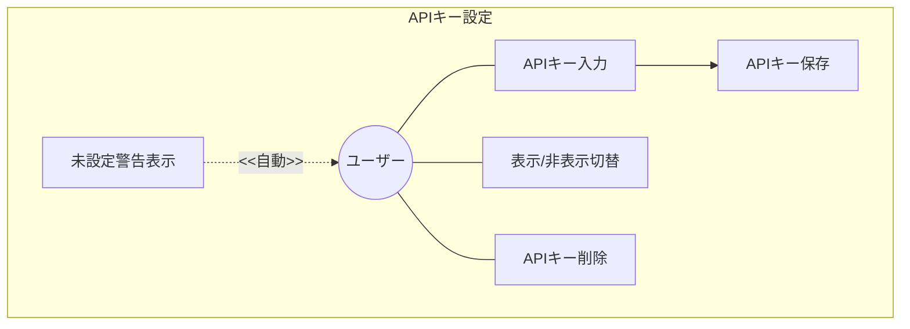
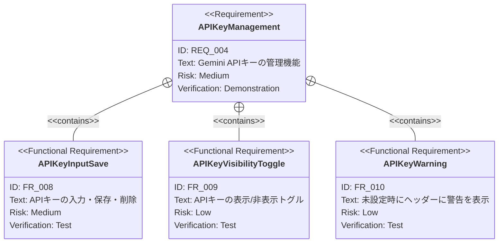

# APIキー設定 要求仕様書

**親要求:** [index.md](../index.md) - REQ_004

> **UI配置:** 本PRDの機能は設定画面（FRAME5）のAPIキーセクションとして表示される。画面構成の詳細は [settings/index.md](../settings/index.md) を参照。

## 概要

Gemini APIキーの管理機能。BYOKモデル（DC_002）に基づき、ユーザーが自身のAPIキーをブラウザに保存して利用する。

**セキュリティ制約（B-001準拠）:** APIキーはGemini APIエンドポイントへの通信にのみ使用し、中間サーバーや第三者サービスに送信しない。保存はブラウザのlocalStorageのみに限定する。

---

## 1. ユースケース図

---

## 2. 要求図（SysML Requirements Diagram）

---

## 3. 機能要求の詳細

### FR_008: APIキーの入力・保存・削除

Gemini APIキーの入力フォームを提供し、ブラウザにローカル保存する。保存済みキーの削除も可能。

**検証方法:** テストによる検証

### FR_009: APIキーの表示/非表示トグル

保存済みAPIキーの表示をマスク（●●●●）し、トグルボタンで表示/非表示を切り替えられる。

**検証方法:** テストによる検証

### FR_010: APIキー未設定時の警告

APIキーが未設定の場合、全画面の歯車アイコンに赤いバッジ（ドット）を表示して設定画面への導線を示す。

> **変更（2026-04-06）:** 旧仕様の「ヘッダー警告バナー」から「歯車アイコン赤バッジ」に変更。バナーは廃止。バッジの詳細は [settings/index.md](../settings/index.md) FR_022 を参照。

**検証方法:** テストによる検証
