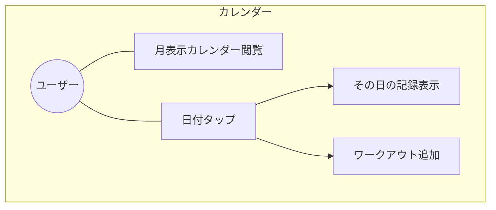
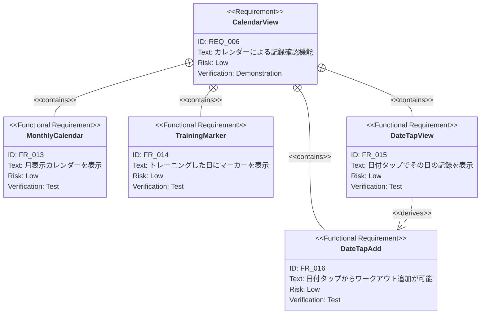

# カレンダー表示 要求仕様書

**親要求:** [index.md](../index.md) - REQ_006

> **統合済み:** 本PRDの機能要求（FR_013〜FR_016）は [navigation.md](../navigation.md) の FR_018（履歴ページ）に統合されました。本ドキュメントは個別要求の詳細定義として引き続き参照されます。

## 概要

月表示カレンダーによるワークアウト記録の確認機能。トレーニングした日を視覚的に把握し、日付からワークアウト記録の閲覧・追加ができる。

---

## 1. ユースケース図

---

## 2. 要求図（SysML Requirements Diagram）

---

## 3. 機能要求の詳細

### FR_013: 月表示カレンダー

月単位のカレンダーUIを表示する。前月・次月への遷移が可能。

**検証方法:** テストによる検証

### FR_014: トレーニング日マーカー

カレンダー上で、ワークアウト記録が存在する日付にマーカー（ドットやハイライト）を表示する。

**検証方法:** テストによる検証

### FR_015: 日付タップで記録表示

カレンダーの日付をタップすると、その日のワークアウト記録を表示する。

**検証方法:** テストによる検証

### FR_016: 日付タップからワークアウト追加

カレンダーの日付タップ時の記録表示画面から、その日付で新しいワークアウトを追加できる。

**検証方法:** テストによる検証
