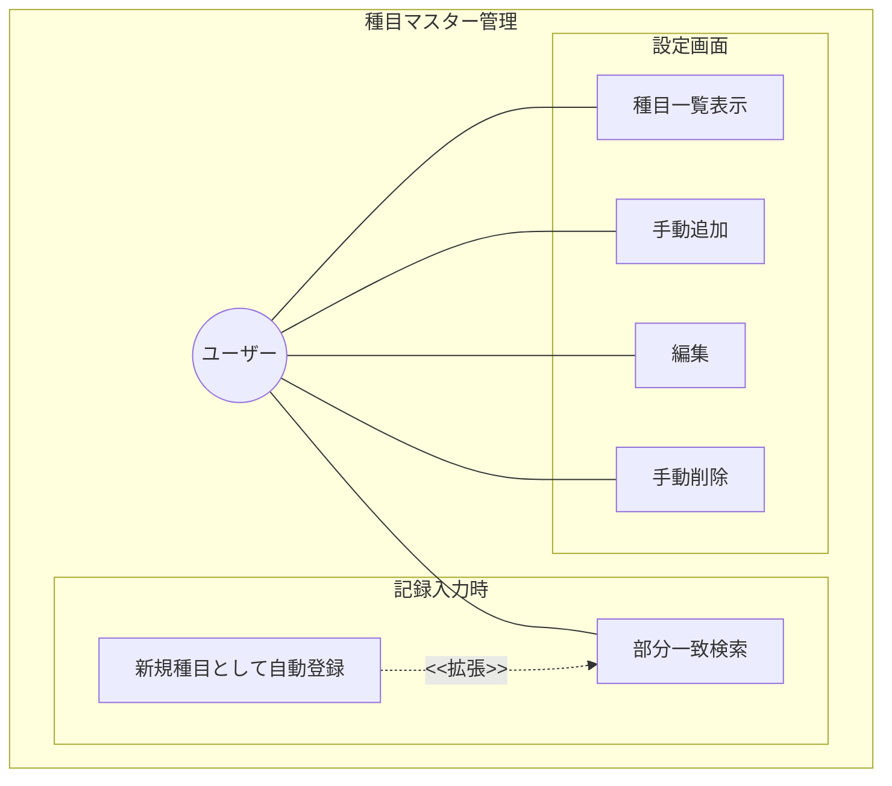
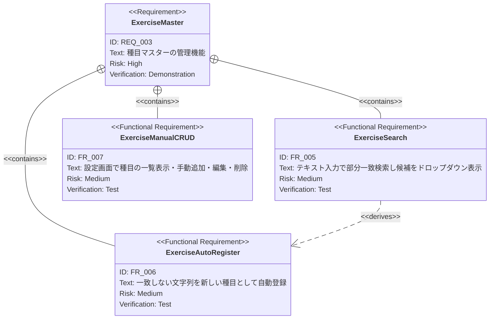

# 種目マスター管理 要求仕様書

**親要求:** [index.md](../index.md) - REQ_003

## 概要

トレーニング種目のマスターデータを管理する機能。2つの利用コンテキストがある:

1. **FRAME2（Active Workout）**: 種目検索フィールドからの検索・選択・自動登録（FR_005, FR_006）
2. **FRAME5（設定画面）**: 種目一覧の閲覧・編集・追加・削除（FR_007）。画面構成の詳細は [settings/index.md](../settings/index.md) FR_025 を参照

---

## 1. ユースケース図

---

## 2. 要求図（SysML Requirements Diagram）

---

## 3. 機能要求の詳細

### FR_005: 種目検索

記録入力時の種目選択において、テキスト入力による部分一致検索（前方一致・中間一致を含む文字列マッチング）を提供する。入力に応じて候補をドロップダウンで表示する。

**検証方法:** テストによる検証

### FR_006: 種目の自動登録

検索で一致する種目がない場合、入力した文字列を「"XX" を新しい種目として追加」という選択肢として表示する。選択すると種目マスターに自動登録される。

**検証方法:** テストによる検証

### FR_007: 種目マスターの手動管理

設定画面（FRAME5）で登録済み種目の一覧表示、手動での追加・編集・削除ができる。

**UIスペック（FRAME5の種目マスターセクション）:**
- 検索: リアルタイム絞り込み
- 種目行: 名前 + 編集ボタン（鉛筆アイコン `ph-pencil-simple`）
- 追加: `+` アイコン + 「種目を追加」ラベル

**検証方法:** テストによる検証
