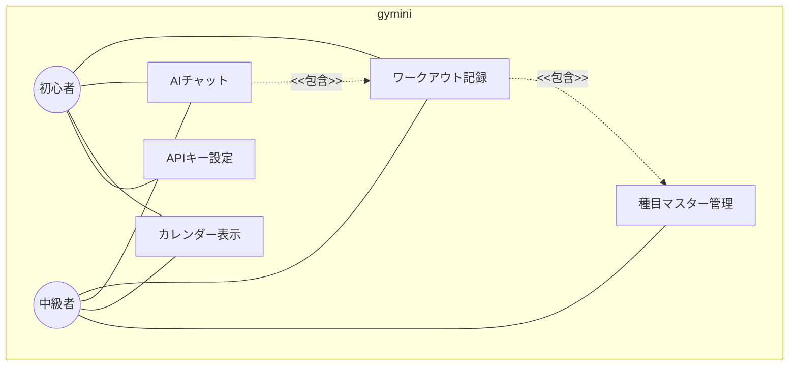
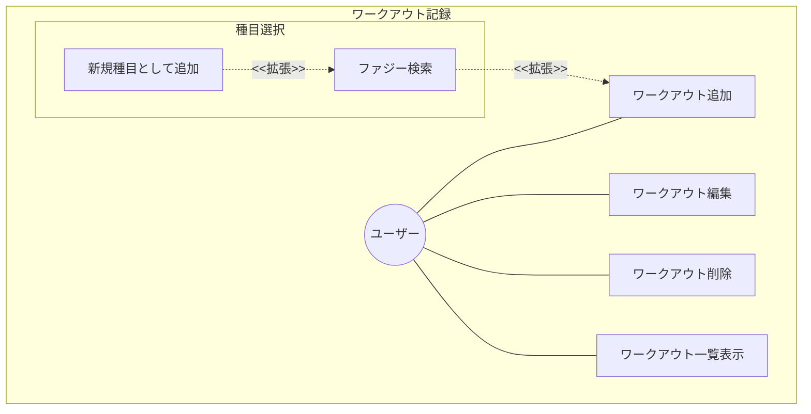
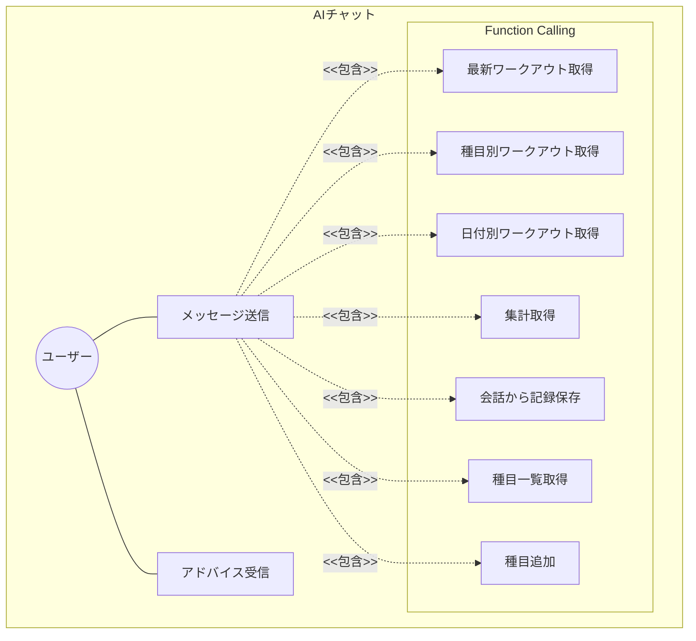
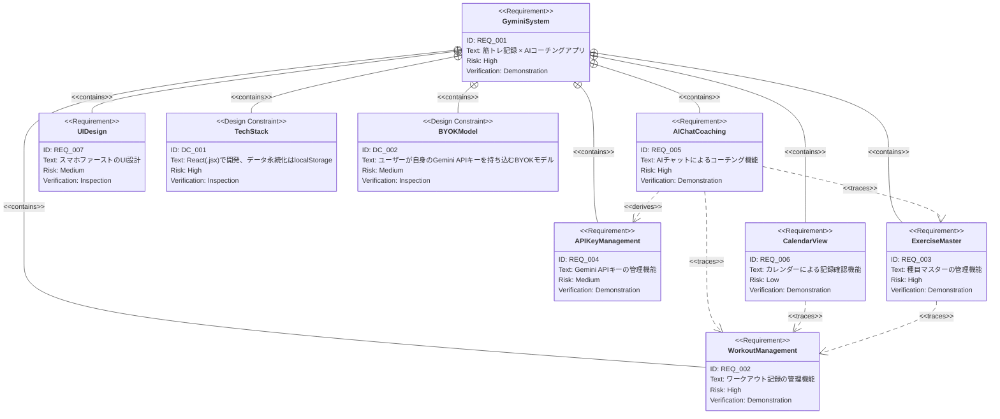
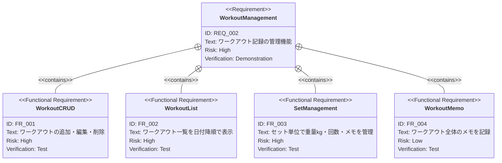
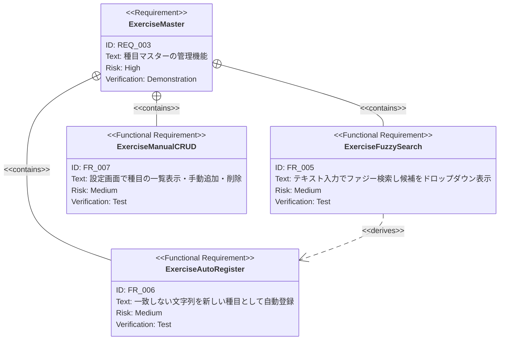
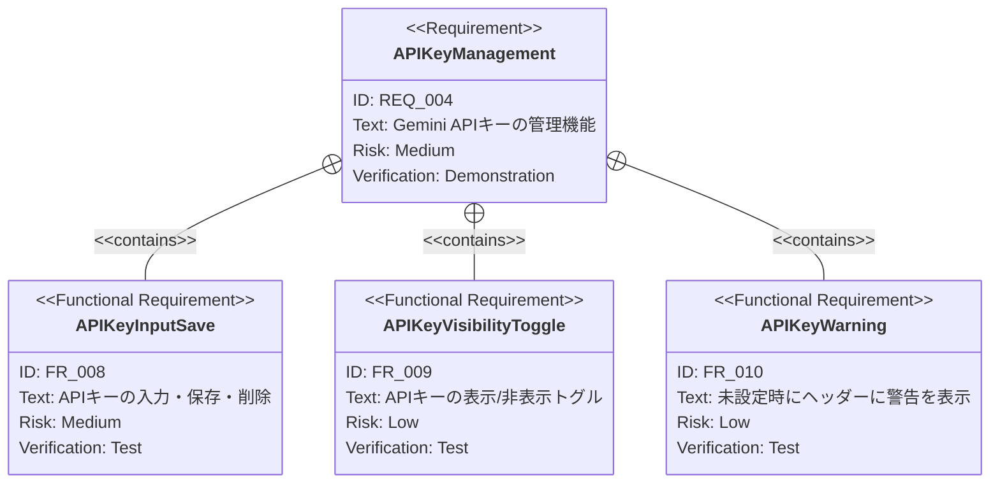
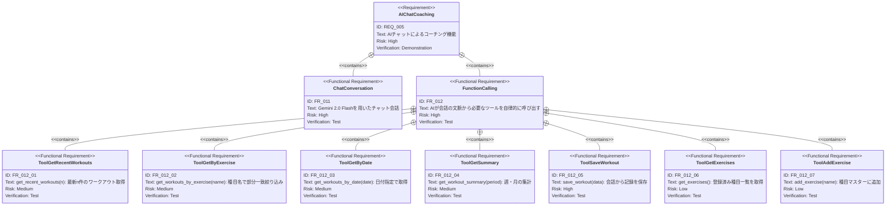
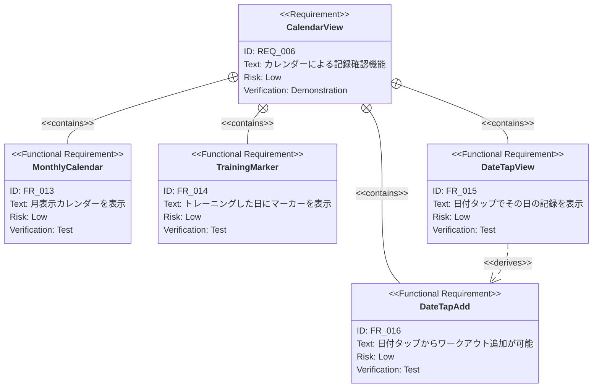

# gymini 要求仕様書

## 概要

gyminiは、筋トレ記録とAIコーチングを組み合わせたWebアプリケーションである。ユーザーが自身のGemini APIキーを持ち込み（BYOK: Bring Your Own Key）、日々のワークアウト記録をAIが自律的に参照してパーソナライズされたアドバイスを提供する。

### ユーザー像

- **筋トレ初心者**: 何をすればいいかわからず、AIからのガイダンスを求める
- **中級者**: 蓄積した記録をAIで分析・最適化し、トレーニング効率を上げたい

### フェーズ構成

段階的にリリースする。各フェーズは以下の画面構成に対応する。

| タブ | 内容 | Phase |
|------|------|-------|
| 💬 チャット | AIとの会話 | 3 |
| 📋 記録 | ワークアウトCRUD | 1 |
| 📅 カレンダー | 月表示・記録確認 | 4 |
| ⚙️ 設定 | APIキー・種目マスター管理 | 1〜2 |

---

# 1. 要求図の読み方

## 1.1. 要求タイプ

- **requirement**: 一般的な要求
- **functionalRequirement**: 機能要求
- **interfaceRequirement**: インターフェース要求
- **designConstraint**: 設計制約

## 1.2. リスクレベル

- **High**: 高リスク（ビジネスクリティカル、実装困難）
- **Medium**: 中リスク（重要だが代替可能）
- **Low**: 低リスク（Nice to have）

## 1.3. 検証方法

- **Test**: テストによる検証
- **Demonstration**: デモンストレーションによる検証
- **Inspection**: インスペクション（レビュー）による検証

## 1.4. 関係タイプ

- **contains**: 包含関係（親要求が子要求を含む）
- **derives**: 派生関係（要求から別の要求が導出される）
- **traces**: トレース関係（要求間の追跡可能性）

---

# 2. 要求一覧

## 2.1. ユースケース図（概要）

## 2.2. ユースケース図（詳細）

### ワークアウト記録（Phase 1）

### AIチャット（Phase 3）

## 2.3. 機能一覧（テキスト形式）

- **Phase 1 — ワークアウト記録 & 種目マスター**
    - ワークアウト記録
        - ワークアウトの追加・編集・削除
        - 一覧表示（日付降順）
        - セット単位の管理（重量kg・回数・メモ）
        - ワークアウト全体のメモ
    - 種目選択UI（記録入力時）
        - テキスト入力でファジー検索（部分一致）
        - 候補をドロップダウン表示
        - 一致しない場合「新しい種目として追加」→ マスターに自動登録
    - 種目マスター管理（設定画面）
        - 登録済み種目の一覧表示
        - 手動追加・削除
- **Phase 2 — APIキー設定**
    - Gemini APIキーの入力・保存・削除
    - 表示/非表示トグル
    - localStorageに保存
    - 未設定時はヘッダーに警告表示
- **Phase 3 — AIチャット × Function Calling**
    - Gemini 2.0 Flashモデルによる会話
    - AIが文脈から必要なツールを自律的に呼び出し
    - 7種のFunction Callingツール
- **Phase 4 — カレンダー**
    - 月表示カレンダー
    - トレーニング日にマーカー表示
    - 日付タップでその日の記録表示
    - 日付タップからワークアウト追加

---

# 3. 要求図（SysML Requirements Diagram）

## 3.1. 全体要求図

## 3.2. 主要サブシステム詳細図

### ワークアウト記録（Phase 1）

### 種目マスター（Phase 1）

### APIキー設定（Phase 2）

### AIチャット（Phase 3）

### カレンダー（Phase 4）

---

# 4. 要求の詳細説明

## 4.1. 機能要求

### FR_001: ワークアウトの追加・編集・削除

ユーザーはワークアウト記録を新規作成、既存記録の編集、および削除ができる。ワークアウトは日付に紐づき、複数のセットと種目を含む。

**検証方法:** テストによる検証

### FR_002: ワークアウト一覧表示

ワークアウト一覧を日付降順（新しい順）で表示する。各ワークアウトには日付・種目・セット情報のサマリーが表示される。

**検証方法:** テストによる検証

### FR_003: セット単位の管理

各ワークアウト内でセット単位のデータを管理する。1セットは以下の情報を持つ:
- 重量（kg）
- 回数（reps）
- メモ（任意）

**検証方法:** テストによる検証

### FR_004: ワークアウト全体のメモ

ワークアウト単位で自由記述のメモを記録できる。体調やトレーニング環境などの補足情報を残すための機能。

**検証方法:** テストによる検証

### FR_005: 種目ファジー検索

記録入力時の種目選択において、テキスト入力による部分一致検索を提供する。入力に応じて候補をドロップダウンで表示する。

**検証方法:** テストによる検証

### FR_006: 種目の自動登録

ファジー検索で一致する種目がない場合、入力した文字列を「"XX" を新しい種目として追加」という選択肢として表示する。選択すると種目マスターに自動登録される。

**検証方法:** テストによる検証

### FR_007: 種目マスターの手動管理

設定画面で登録済み種目の一覧表示、手動での追加・削除ができる。

**検証方法:** テストによる検証

### FR_008: APIキーの入力・保存・削除

Gemini APIキーの入力フォームを提供し、localStorageに保存する。保存済みキーの削除も可能。

**検証方法:** テストによる検証

### FR_009: APIキーの表示/非表示トグル

保存済みAPIキーの表示をマスク（●●●●）し、トグルボタンで表示/非表示を切り替えられる。

**検証方法:** テストによる検証

### FR_010: APIキー未設定時の警告

APIキーが未設定の場合、ヘッダー部分に警告バナーを表示し、設定画面への導線を提供する。

**検証方法:** テストによる検証

### FR_011: AIチャット会話

Gemini 2.0 Flashモデルを使用したチャットインターフェースを提供する。ユーザーのBYOK APIキーを使ってGemini APIに接続する。

**検証方法:** テストによる検証

### FR_012: Function Calling

AIが会話の文脈を解析し、必要に応じて以下のツールを自律的に呼び出す。

**含まれるツール:**

| ツール | 説明 |
|--------|------|
| `get_recent_workouts(n)` | 最新n件のワークアウト取得 |
| `get_workouts_by_exercise(name)` | 種目名で絞り込み（部分一致） |
| `get_workouts_by_date(date)` | 日付指定で取得 |
| `get_workout_summary(period)` | 週・月の集計 |
| `save_workout(data)` | 会話から記録を保存 |
| `get_exercises()` | 登録済み種目一覧を取得 |
| `add_exercise(name)` | 種目マスターに追加 |

**検証方法:** テストによる検証

### FR_013: 月表示カレンダー

月単位のカレンダーUIを表示する。前月・次月への遷移が可能。

**検証方法:** テストによる検証

### FR_014: トレーニング日マーカー

カレンダー上で、ワークアウト記録が存在する日付にマーカー（ドットやハイライト）を表示する。

**検証方法:** テストによる検証

### FR_015: 日付タップで記録表示

カレンダーの日付をタップすると、その日のワークアウト記録を表示する。

**検証方法:** テストによる検証

### FR_016: 日付タップからワークアウト追加

カレンダーの日付タップ時の記録表示画面から、その日付で新しいワークアウトを追加できる。

**検証方法:** テストによる検証

## 4.2. インターフェース要求

### IR_001: タブベースナビゲーション

4つのタブ（チャット・記録・カレンダー・設定）によるメインナビゲーションを提供する。スマホ画面下部に固定配置する。

**検証方法:** インスペクションによる検証

## 4.3. 設計制約

### DC_001: 技術スタック

React（.jsx）で開発する。フェーズごとに独立したファイルで開発する。

**検証方法:** インスペクションによる検証

### DC_002: BYOKモデル

サーバーサイドでAPIキーを管理しない。ユーザーが自身のGemini APIキーをブラウザに保存し、クライアントサイドから直接Gemini APIを呼び出す。

**検証方法:** インスペクションによる検証

### DC_003: データ永続化

全てのデータ（ワークアウト記録・種目マスター・APIキー）はlocalStorageに保存する。

**検証方法:** インスペクションによる検証

### DC_004: スマホファーストUI

スマートフォンでの利用を最優先としたUI設計を行う。

**検証方法:** インスペクションによる検証

---

# 5. 制約事項

## 5.1. 技術的制約

- React（.jsx）を使用、TypeScriptは使用しない
- データ永続化はlocalStorageのみ（バックエンドサーバーなし）
- AIモデルはGemini 2.0 Flashを使用
- APIキーはクライアントサイドで管理（BYOK）
- フェーズごとに独立したファイルで開発

## 5.2. ビジネス的制約

- サーバーコストゼロ（静的ホスティングのみ）
- ユーザーデータはブラウザに閉じる（プライバシー重視）

---

# 6. 前提条件

- ユーザーがGemini APIキーを取得済み（または取得可能）であること
- モダンブラウザ（Chrome, Safari, Firefox最新版）での利用を想定
- localStorageが利用可能なブラウザ環境であること

---

# 7. スコープ外

以下は本PRDのスコープ外とし、将来検討とする：

- 種目別の重量推移グラフ
- 部位タグ（AIの推論でカバーできると判断し保留）
- メニューテンプレート保存
- PWA対応
- ExerciseMasterへの追加属性（部位・種別など）
- ユーザー認証・マルチデバイス同期
- データのエクスポート/インポート

---

# 8. 用語集

| 用語 | 定義 |
|------|------|
| BYOK | Bring Your Own Key。ユーザーが自身のAPIキーを持ち込んで利用するモデル |
| ワークアウト | 1回のトレーニングセッション。日付に紐づき、複数の種目・セットを含む |
| セット | 1種目における1回の実施単位。重量(kg)・回数(reps)・メモで構成される |
| 種目（エクササイズ） | トレーニングの種類（例: ベンチプレス、スクワット、デッドリフト） |
| 種目マスター | アプリに登録された種目の一覧。ユーザーが自由に追加・削除できる |
| Function Calling | AIモデルが会話の文脈に基づいて、定義されたツール（関数）を自律的に呼び出す機能 |
| Gemini 2.0 Flash | GoogleのAIモデル。高速な応答と低コストが特徴 |
