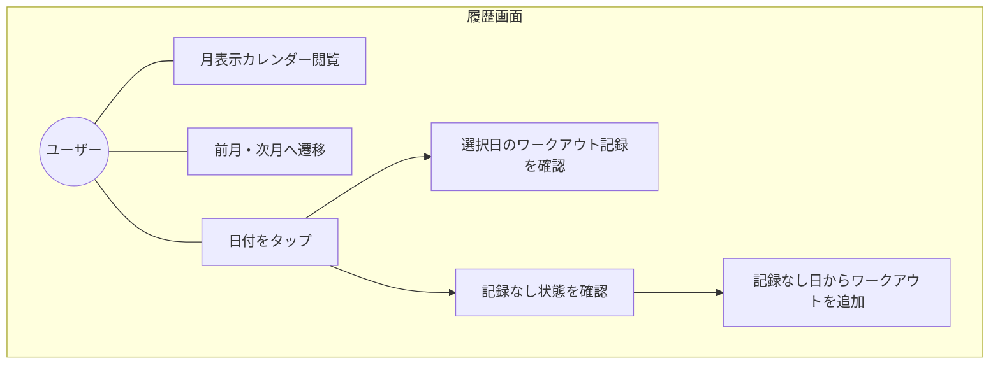
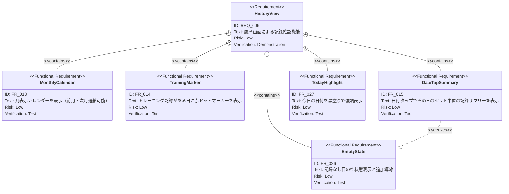

# 履歴画面 要求仕様書

**親要求:** [index.md](../index.md) - REQ_006

**デザインリファレンス:** `.sdd/design-system.html` FRAME3

> **統合:** 旧 [calendar/index.md](../calendar/index.md) の機能要求（FR_013〜FR_016）を本PRDに統合し、履歴画面としての完全な仕様を定義する。

## 概要

月表示カレンダーとワークアウト記録サマリーによる履歴閲覧画面。トレーニングした日を視覚的に把握し、日付選択でその日のセット単位の詳細記録を確認できる。BottomNavの「履歴」タブからアクセスする。

---

## 1. ユースケース図



---

## 2. 要求図（SysML Requirements Diagram）



---

## 3. 機能要求の詳細

### FR_013: 月表示カレンダー

月単位のカレンダーグリッド（7列: 日〜土）を表示する。左右のシェブロンボタンで前月・次月に遷移可能。

**UIスペック:**
- 月ヘッダー: `[<] 2025年10月 [>]`（Outfit Bold）
- 曜日行: 日（accent赤）、月〜土（zinc-400）
- 日付セル: `w-11 h-11` 丸ボタン（44px: T-003 タップターゲット最小要件）

**検証方法:** テストによる検証

### FR_014: トレーニング日マーカー

カレンダー上で、ワークアウト記録が存在する日付の下部に赤いドットマーカーを表示する。

**UIスペック:**
- マーカー: `w-1 h-1 bg-accent rounded-full`
- 位置: 日付数字の下 `absolute bottom-1`
- 記録がある日は日付テキストが `text-black`（なし日は `text-zinc-400`）

**検証方法:** テストによる検証

### FR_015: 日付タップで記録サマリー表示

カレンダーの日付をタップすると選択状態（リングハイライト）になり、カレンダー下部にその日のワークアウト記録を表示する。

**サマリー表示内容（種目ごと）:**
- 種目名（Outfit Bold）
- セット一覧: `SET1: 100kg × 10回` 形式で各セットの重量と回数を表示

**選択状態UIスペック:**
- リング: `ring-2 ring-black ring-offset-2`
- テキスト: `font-bold text-black`

**検証方法:** テストによる検証

### FR_026: 記録なし日の空状態

選択した日付にワークアウト記録がない場合、空状態UIを表示する。

**UIスペック:**
- ゴーストアイコン（`ph-ghost`）+ 「記録なし」テキスト
- 「追加」ボタン: タップするとFRAME2（Active Workout）へ遷移しその日付でセッション開始
- 破線ボーダー: `border-2 border-dashed border-zinc-200`

**検証方法:** テストによる検証

### FR_027: 今日の日付強調

今日の日付セルを黒塗り背景＋白テキストで他の日付と区別する。

**UIスペック:**
- 背景: `bg-black text-white rounded-full`
- シャドウ: `shadow-md`
- トレーニング記録ありの場合は赤ドットも表示（`border border-black` 付き）

**検証方法:** テストによる検証

---

## 4. カレンダー日付セルの状態一覧

| 状態 | 見た目 | 操作 |
|:-----|:-------|:-----|
| 記録なし | `text-zinc-400` | タップ → 空状態表示 |
| 記録あり | `text-black` + 赤ドット | タップ → 記録サマリー表示 |
| 今日 | `bg-black text-white` + (赤ドット) | タップ → 記録表示 |
| 選択中 | `ring-2 ring-black ring-offset-2 font-bold` | 現在選択中の日付 |

---

## 5. 画面レイアウト

```
┌─────────────────────────────────┐
│ (sensor notch)                  │
│                          [  ⚙ ]│  ← 固定: 歯車ボタン
│                                 │
│  履歴                           │  ← スクロールコンテンツ
│                                 │
│  ┌────────────────────────────┐ │
│  │  [<]    2025年10月    [>]  │ │
│  │  日  月  火  水  木  金  土 │ │
│  │           1   2   3   4   │ │
│  │   5   6   7   8·  9  10· 11│ │
│  │  12·  ...        ●24  25  │ │  ← ●=今日, ·=トレ日
│  │              ◎20           │ │  ← ◎=選択中
│  └────────────────────────────┘ │
│                                 │
│  10月20日の記録                  │
│  ┌────────────────────────────┐ │
│  │ Bench Press                │ │
│  │ SET1  100kg × 10回         │ │
│  │ SET2  100kg × 8回          │ │
│  │ SET3   95kg × 8回          │ │
│  │────────────────────────────│ │
│  │ Cable Flyes                │ │
│  │ SET1  30kg × 12回          │ │
│  │ SET2  30kg × 10回          │ │
│  └────────────────────────────┘ │
│                                 │
│ [トレ]  [履歴]        [AI]     │  ← BottomNav（履歴アクティブ）
└─────────────────────────────────┘
```
