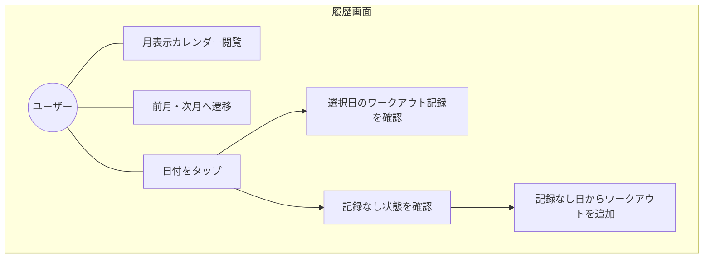
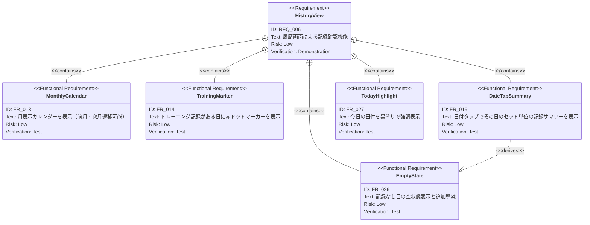

# 履歴画面 要求仕様書

**親要求:** [index.md](../index.md) - REQ_006

**デザインリファレンス:** `.sdd/design-system.html` FRAME3

> **統合:** 旧カレンダーPRDの機能要求（FR_013〜FR_016）を本PRDに統合し、履歴画面としての完全な仕様を定義する。

## 概要

月表示カレンダーとワークアウト記録サマリーによる履歴閲覧画面。トレーニングした日を視覚的に把握し、日付選択でその日のセット単位の詳細記録を確認できる。BottomNavの「履歴」タブからアクセスする。

---

## 1. ユースケース図

---

## 2. 要求図（SysML Requirements Diagram）

---

## 3. 機能要求の詳細

### FR_013: 月表示カレンダー

月単位のカレンダーグリッド（7列: 日〜土）を表示する。左右のシェブロンボタンで前月・次月に遷移可能。

**検証方法:** テストによる検証

### FR_014: トレーニング日マーカー

カレンダー上で、ワークアウト記録が存在する日付の下部に赤いドットマーカーを表示する。記録がある日は日付テキストを強調し、記録がない日は控えめに表示する。

**検証方法:** テストによる検証

### FR_015: 日付タップで記録サマリー表示

カレンダーの日付をタップすると選択状態（リングハイライト）になり、カレンダー下部にその日のワークアウト記録を表示する。

**サマリー表示内容（種目ごと）:**
- 種目名
- セット一覧: 各セットの重量と回数を表示

**検証方法:** テストによる検証

### FR_026: 記録なし日の空状態

選択した日付にワークアウト記録がない場合、空状態UIを表示する。

- 「記録なし」テキストを表示
- 「追加」ボタン: タップするとFRAME2（Active Workout）へ遷移しその日付でセッション開始

**検証方法:** テストによる検証

### FR_027: 今日の日付強調

今日の日付セルを強調表示（塗りつぶし背景）で他の日付と区別する。トレーニング記録ありの場合は赤ドットも併せて表示する。

**検証方法:** テストによる検証

---

## 4. カレンダー日付セルの状態一覧

| 状態 | 見た目 | 操作 |
|:-----|:-------|:-----|
| 記録なし | 控えめな文字色 | タップ → 空状態表示 |
| 記録あり | 強調文字 + 赤ドット | タップ → 記録サマリー表示 |
| 今日 | 塗りつぶし背景で強調 + (赤ドット) | タップ → 記録表示 |
| 選択中 | リングハイライト + 太字 | 現在選択中の日付 |
