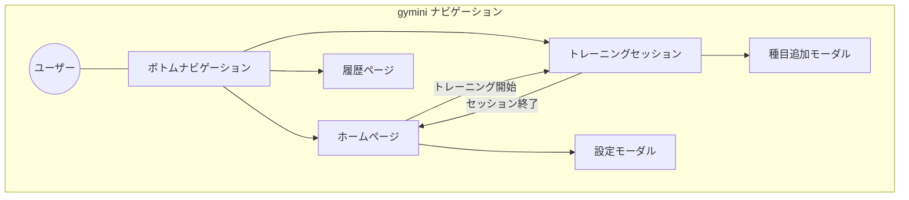
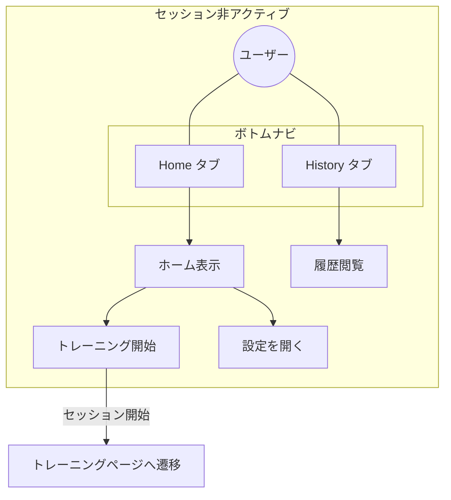
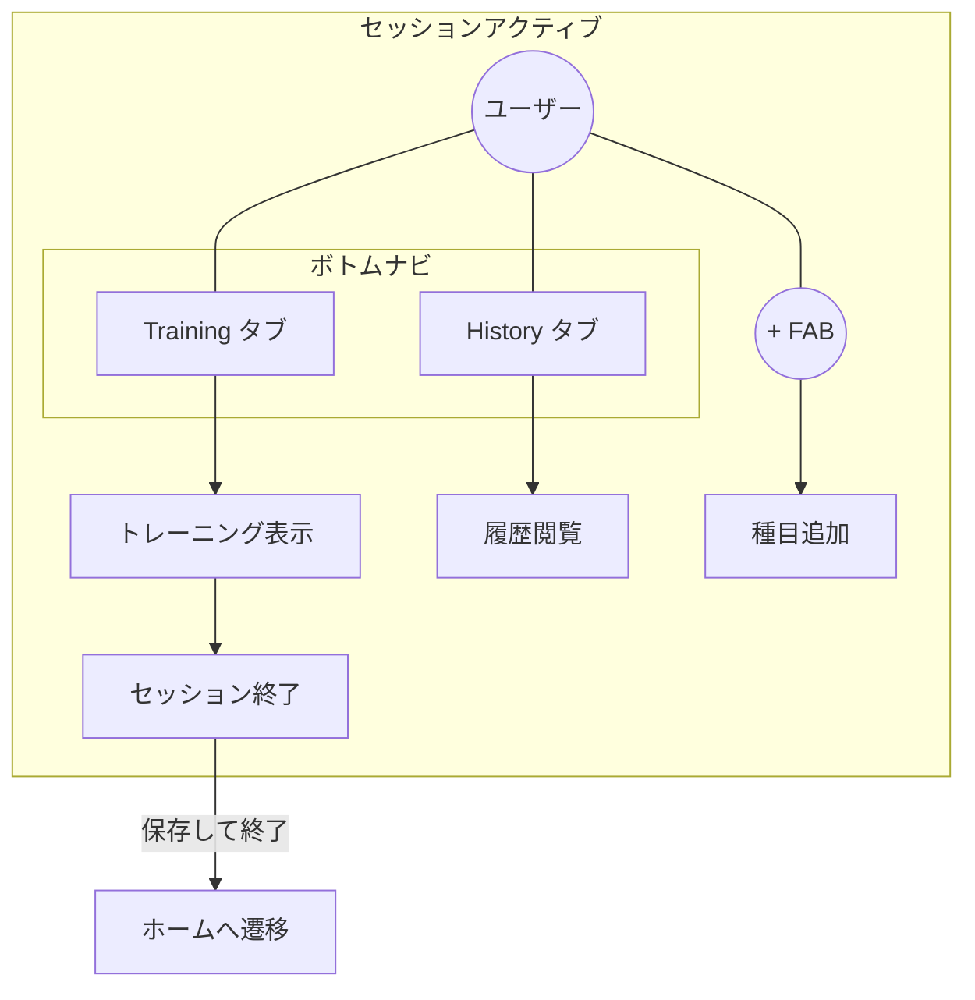
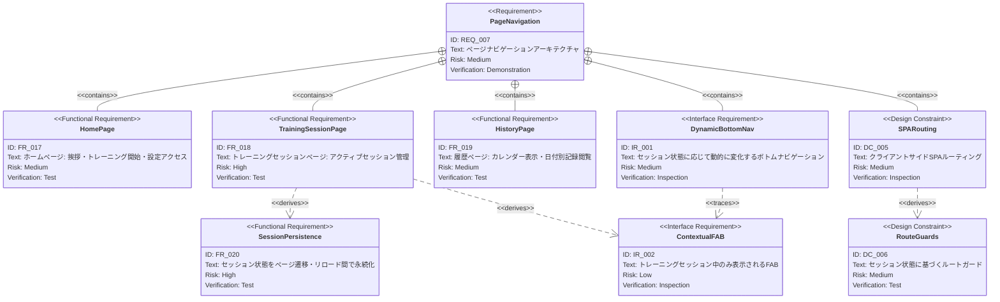
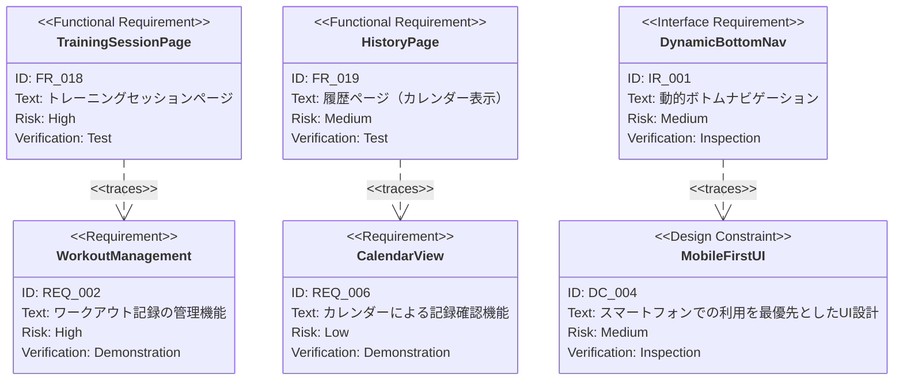

# ページナビゲーション 要求仕様書

**親要求:** [index.md](index.md) - REQ_007 (UI Design), IR_001 (ナビゲーション)

**参照元:** [SakumaTakuya/first-pwa](https://github.com/SakumaTakuya/first-pwa) のページ導線を gymini に適用する。

## 概要

gymini のページナビゲーションアーキテクチャを定義する。first-pwa のセッション対応型ナビゲーションモデル（3ページ + 動的ボトムナビ + コンテキストFAB）を採用し、トレーニングセッションの状態に応じてナビゲーションが動的に変化する設計とする。

既存の IR_001（4タブナビゲーション）を本PRDで再定義し、動的2タブ + FAB モデルに置き換える。フェーズの進行に伴い、ナビゲーション項目が有機的に拡張される。

---

# 1. 要求図の読み方

## 1.1. 要求タイプ

- **requirement**: 一般的な要求
- **functionalRequirement**: 機能要求
- **interfaceRequirement**: インターフェース要求
- **designConstraint**: 設計制約

## 1.2. リスクレベル

- **High**: 高リスク（ビジネスクリティカル、実装困難）
- **Medium**: 中リスク（重要だが代替可能）
- **Low**: 低リスク（Nice to have）

## 1.3. 検証方法

- **Test**: テストによる検証
- **Demonstration**: デモンストレーションによる検証
- **Inspection**: インスペクション（レビュー）による検証

## 1.4. 関係タイプ

- **contains**: 包含関係（親要求が子要求を含む）
- **derives**: 派生関係（要求から別の要求が導出される）
- **traces**: トレース関係（要求間の追跡可能性）

---

# 2. 要求一覧

## 2.1. ユースケース図（概要）

## 2.2. ユースケース図（詳細）

### セッション非アクティブ時

### セッションアクティブ時

## 2.3. 機能一覧（テキスト形式）

- ページ構成
    - FR_017: ホームページ
    - FR_018: トレーニングセッションページ
    - FR_019: 履歴ページ（カレンダー表示）
- セッション管理
    - FR_020: セッション状態の永続化
- ナビゲーション
    - IR_001: 動的ボトムナビゲーション（IR_001 再定義）
    - IR_002: コンテキストFAB
- ルーティング
    - DC_005: クライアントサイドSPAルーティング
    - DC_006: セッション対応ルートガード

---

# 3. 要求図（SysML Requirements Diagram）

## 3.1. 全体要求図

## 3.2. 外部要求との関係

---

# 4. 要求の詳細説明

## 4.1. 機能要求

### FR_017: ホームページ

アプリのランディングページ。ユーザーに挨拶を表示し、トレーニング開始の導線を提供する。

**含まれる機能:**

- 挨拶メッセージの表示（例:「今日の調子はどうですか？」）
- 「トレーニングを開始」ボタン（タップでセッションを開始し、トレーニングページへ遷移）
- 設定アクセス（ギアアイコン等からモーダルを開く）
- セッション進行中の場合、自動的にトレーニングセッションページへリダイレクト

**検証方法:** テストによる検証

### FR_018: トレーニングセッションページ

アクティブなトレーニングセッションを表示・管理するページ。現在の `WorkoutFormPage` の機能を引き継ぐ。

**含まれる機能:**

- セッションヘッダー（開始時刻の表示）
- 種目カードの一覧表示（セット入力を含む）
- FAB（+）による種目追加（モーダル経由）
- 「終了」ボタン（セッションを保存してホームへ遷移）
- アクティブセッションが存在しない場合、ホームページへリダイレクト

**検証方法:** テストによる検証

### FR_019: 履歴ページ（カレンダー表示）

ワークアウト履歴をカレンダー形式で表示するページ。既存の calendar PRD（[calendar/index.md](calendar/index.md) - FR_013〜FR_016）を統合する。

**含まれる機能:**

- FR_013: 月表示カレンダーの表示（前月・次月への遷移）
- FR_014: トレーニング日マーカーの表示
- FR_015: 日付タップでその日のワークアウト記録を表示
- FR_016: 日付タップからワークアウト追加が可能
- 種目タップで進捗グラフモーダルを表示（first-pwa 準拠）

**検証方法:** テストによる検証

### FR_020: セッション状態の永続化

トレーニングセッションのドラフトデータをページ遷移やブラウザリロード間で維持する。ボトムナビによるページ遷移（Training ↔ History）でセッションデータが失われないことを保証する。

**実現方法の方針:**

- Zustand の `persist` ミドルウェアを使用し、セッションデータを localStorage に永続化
- 永続化対象: `draftDate`, `draftExercises`, `draftMemo`, `draftWorkoutId`

**検証方法:** テストによる検証

## 4.2. インターフェース要求

### IR_001: 動的ボトムナビゲーション（再定義）

スマホ画面下部に固定配置されるボトムナビゲーションバー。セッション状態に応じてタブのラベルとリンク先が動的に変化する。

> **注意:** 本PRDにより、master PRD（[index.md](index.md)）の IR_001「4つのタブによるメインナビゲーション」を以下の動的ナビゲーションモデルに再定義する。

**ナビゲーション項目:**

| セッション状態 | タブ1 | タブ2 |
|:-------------|:------|:------|
| 非アクティブ | Home（ホーム） | History（履歴） |
| アクティブ | Training（トレーニング） | History（履歴） |

**UI仕様:**

- アクティブなタブを視覚的にハイライト
- モバイルセーフエリアに対応したパディング
- 一貫した高さとタッチターゲットサイズ

**検証方法:** インスペクションによる検証

### IR_002: コンテキストFAB（Floating Action Button）

トレーニングセッション中のみ表示される「+」ボタン。種目追加モーダルを開く。

**UI仕様:**

- ボトムナビゲーションバーの上に配置
- トレーニングセッションページでのみ表示
- タップで種目追加モーダルを開く（ページ遷移ではない）
- セッション終了時に非表示

**検証方法:** インスペクションによる検証

## 4.3. 設計制約

### DC_005: クライアントサイドSPAルーティング

gymini は React SPA（DC_001）であるため、ルーティングはクライアントサイドで完結する。軽量なルーティング機構を採用し、3つの論理ルート（`home`, `session`, `history`）を管理する。

**検証方法:** インスペクションによる検証

### DC_006: セッション対応ルートガード

ページ間の状態整合性を保つリダイレクトロジック:

- **ホームページ:** アクティブセッションが存在する場合、トレーニングセッションページへリダイレクト
- **トレーニングセッションページ:** アクティブセッションが存在しない場合、ホームページへリダイレクト

**検証方法:** テストによる検証

---

# 5. フェーズ統合戦略

ナビゲーションは各フェーズの進行に伴い有機的に拡張される。

| Phase | 追加機能 | ナビゲーションへの影響 |
|:------|:---------|:---------------------|
| Phase 1 | ワークアウト CRUD + ナビゲーション | 2タブ: Home + History。履歴 = カレンダー表示 |
| Phase 2 | APIキー設定 | ホームの設定モーダルに統合（タブ追加不要） |
| Phase 3 | AIチャット | 3つ目のタブ「Chat」を追加、またはホームに統合 |

カレンダー表示（旧 Phase 4）は FR_019 として本ナビゲーションの履歴ページに統合済み。

---

# 6. IR_001 更新に関する注記

本PRDの採用に伴い、以下のドキュメントを更新する必要がある:

- **[index.md](index.md):** IR_001 のテキストを「4つのタブによるメインナビゲーション」→「動的ボトムナビゲーション（2タブ + コンテキストFAB）」に変更。フェーズ構成テーブルを更新
- **[calendar/index.md](calendar/index.md):** FR_013〜FR_016 が FR_019 に統合された旨を追記

---

# 7. スコープ外

以下は本PRDのスコープ外とする：

- URLベースルーティング（ブラウザ履歴API / ハッシュルーティング）
- ディープリンク / ブックマーク対応
- ページ間のトランジションアニメーション
- タブレット / デスクトップ向けレスポンシブレイアウト

---

# 8. 用語集

| 用語 | 定義 |
|:-----|:-----|
| ボトムナビゲーション | スマホ画面下部に固定配置されるタブ型ナビゲーションバー |
| FAB | Floating Action Button。画面上に浮遊する丸型のアクションボタン |
| セッション | 1回のトレーニングの記録期間。開始から終了（保存）までの状態 |
| ルートガード | ページ遷移時に条件を検証し、不正な状態のページへのアクセスをリダイレクトする仕組み |
| first-pwa | 本PRDの参照元となるPWAアプリケーション（[SakumaTakuya/first-pwa](https://github.com/SakumaTakuya/first-pwa)） |
