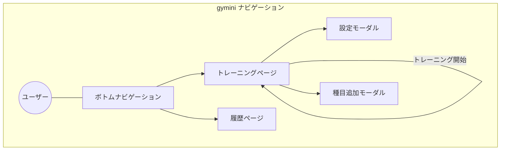
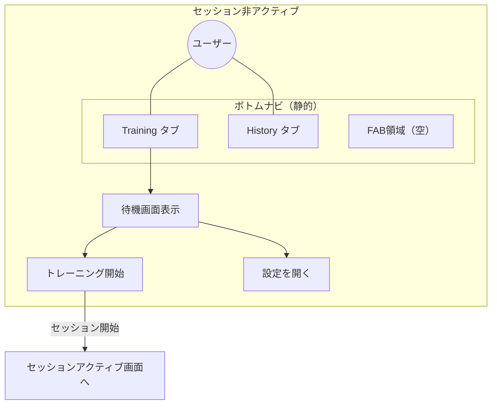
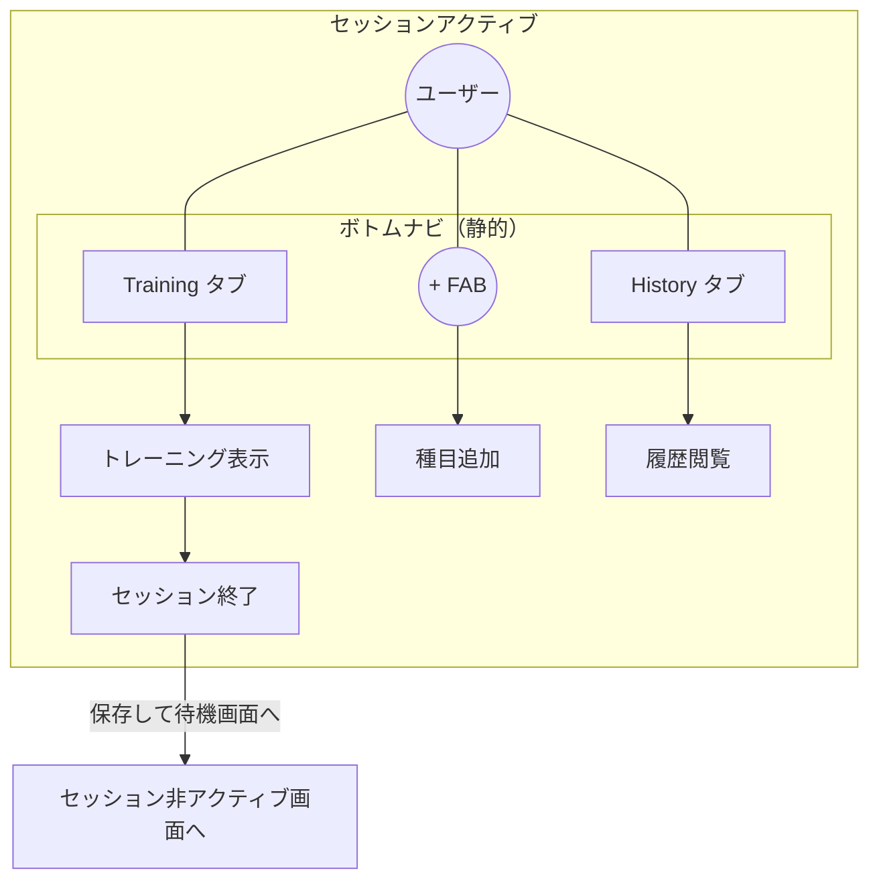
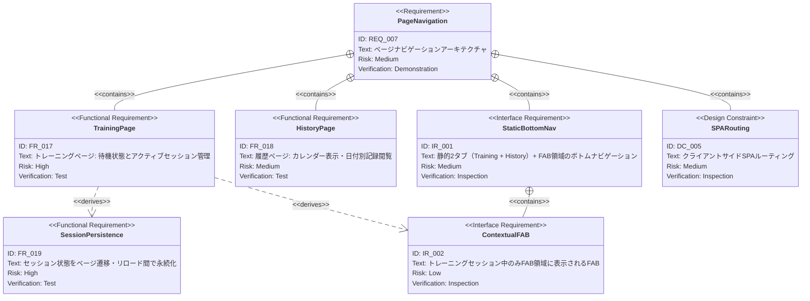
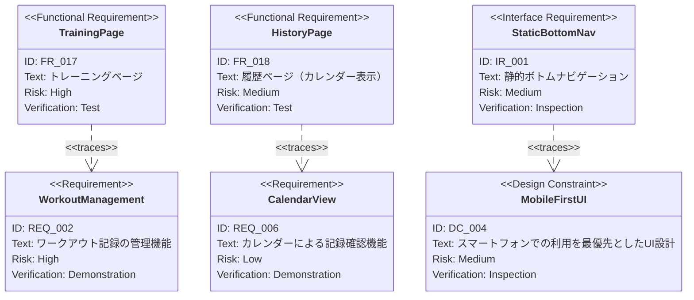

# ページナビゲーション 要求仕様書

**親要求:** [index.md](index.md) - REQ_007 (UI Design), IR_001 (ナビゲーション)

**参照元:** [SakumaTakuya/first-pwa](https://github.com/SakumaTakuya/first-pwa) のページ導線をベースに gymini 向けに適応する。

## 概要

gymini のページナビゲーションアーキテクチャを定義する。first-pwa のナビゲーションモデルをベースに、ボトムナビゲーションを**静的2タブ（Training + History）+ FAB領域**のレイアウトで構成する。

既存の IR_001（4タブナビゲーション）を本PRDで再定義する。

**ボトムナビゲーションのレイアウト:**

```
┌──────────┬──────────┬──────────────────┐
│ Training │ History  │     [+ FAB]      │
└──────────┴──────────┴──────────────────┘
  タブ（左寄せ）          FAB領域（常に確保）
```

- タブは常に **Training** と **History** の2つを固定表示（セッション状態に関わらず変化しない）
- FAB領域はボトムナビの右側に常に確保される
- FAB（+）ボタンはトレーニングセッション中のみ表示される

---

# 1. 要求図の読み方

## 1.1. 要求タイプ

- **requirement**: 一般的な要求
- **functionalRequirement**: 機能要求
- **interfaceRequirement**: インターフェース要求
- **designConstraint**: 設計制約

## 1.2. リスクレベル

- **High**: 高リスク（ビジネスクリティカル、実装困難）
- **Medium**: 中リスク（重要だが代替可能）
- **Low**: 低リスク（Nice to have）

## 1.3. 検証方法

- **Test**: テストによる検証
- **Demonstration**: デモンストレーションによる検証
- **Inspection**: インスペクション（レビュー）による検証

## 1.4. 関係タイプ

- **contains**: 包含関係（親要求が子要求を含む）
- **derives**: 派生関係（要求から別の要求が導出される）
- **traces**: トレース関係（要求間の追跡可能性）

---

# 2. 要求一覧

## 2.1. ユースケース図（概要）



## 2.2. ユースケース図（詳細）

### トレーニングページ（セッション非アクティブ時）



### トレーニングページ（セッションアクティブ時）



## 2.3. 機能一覧（テキスト形式）

- ページ構成
    - FR_017: トレーニングページ（待機状態 + アクティブセッション）
    - FR_018: 履歴ページ（カレンダー表示）
- セッション管理
    - FR_019: セッション状態の永続化
- ナビゲーション
    - IR_001: 静的ボトムナビゲーション（IR_001 再定義）
    - IR_002: コンテキストFAB
- ルーティング
    - DC_005: クライアントサイドSPAルーティング

---

# 3. 要求図（SysML Requirements Diagram）

## 3.1. 全体要求図



## 3.2. 外部要求との関係



---

# 4. 要求の詳細説明

## 4.1. 機能要求

### FR_017: トレーニングページ

アプリのメインページ。セッションの状態に応じて2つの表示モードを持つ。

**セッション非アクティブ時（待機状態）:**

- 挨拶メッセージの表示（例:「今日の調子はどうですか？」）
- 「トレーニングを開始」ボタン（タップでセッションを開始し、アクティブ表示へ切り替え）
- 設定アクセス（ギアアイコン等からモーダルを開く）

**セッションアクティブ時:**

- セッションヘッダー（開始時刻の表示）
- 種目カードの一覧表示（セット入力を含む）
- FAB（+）による種目追加（モーダル経由、IR_002）
- 「終了」ボタン（セッションを保存して待機状態へ戻る）

**検証方法:** テストによる検証

### FR_018: 履歴ページ（カレンダー表示）

ワークアウト履歴をカレンダー形式で表示するページ。既存の calendar PRD（[calendar/index.md](calendar/index.md) - FR_013〜FR_016）を統合する。

**含まれる機能:**

- FR_013: 月表示カレンダーの表示（前月・次月への遷移）
- FR_014: トレーニング日マーカーの表示
- FR_015: 日付タップでその日のワークアウト記録を表示
- FR_016: 日付タップからワークアウト追加が可能
- 種目タップで進捗グラフモーダルを表示（first-pwa 準拠）

**検証方法:** テストによる検証

### FR_019: セッション状態の永続化

トレーニングセッションのドラフトデータをページ遷移やブラウザリロード間で維持する。ボトムナビによるページ遷移（Training ↔ History）でセッションデータが失われないことを保証する。

**実現方法の方針:**

- Zustand の `persist` ミドルウェアを使用し、セッションデータを localStorage に永続化
- 永続化対象: `draftDate`, `draftExercises`, `draftMemo`, `draftWorkoutId`

**検証方法:** テストによる検証

## 4.2. インターフェース要求

### IR_001: 静的ボトムナビゲーション（再定義）

スマホ画面下部に固定配置されるボトムナビゲーションバー。セッション状態に関わらず常に同じタブを表示する。

> **注意:** 本PRDにより、master PRD（[index.md](index.md)）の IR_001「4つのタブによるメインナビゲーション」を以下の静的ナビゲーションモデルに再定義する。

**レイアウト:**

```
┌──────────┬──────────┬──────────────────┐
│ Training │ History  │     [+ FAB]      │
└──────────┴──────────┴──────────────────┘
  タブ（左寄せ）          FAB領域（常に確保）
```

**ナビゲーション項目（固定）:**

| タブ | ラベル | 遷移先 |
|:-----|:-------|:-------|
| タブ1 | Training（トレーニング） | トレーニングページ |
| タブ2 | History（履歴） | 履歴ページ |

**FAB領域:**

- ボトムナビバーの右側に常に確保
- セッションアクティブ時: FAB（+）ボタンを表示
- セッション非アクティブ時: 空のまま（スペースのみ確保）

**UI仕様:**

- タブは左寄せで配置
- アクティブなタブを視覚的にハイライト
- モバイルセーフエリアに対応したパディング
- 一貫した高さとタッチターゲットサイズ

**検証方法:** インスペクションによる検証

### IR_002: コンテキストFAB（Floating Action Button）

ボトムナビの FAB 領域に、トレーニングセッション中のみ表示される「+」ボタン。種目追加モーダルを開く。

**UI仕様:**

- ボトムナビゲーションバー内の右側 FAB 領域に配置
- セッションアクティブ時のみ表示（非アクティブ時は領域だけ確保）
- タップで種目追加モーダルを開く（ページ遷移ではない）

**検証方法:** インスペクションによる検証

## 4.3. 設計制約

### DC_005: クライアントサイドSPAルーティング

gymini は React SPA（DC_001）であるため、ルーティングはクライアントサイドで完結する。軽量なルーティング機構を採用し、2つの論理ルート（`training`, `history`）を管理する。

**検証方法:** インスペクションによる検証

---

# 5. フェーズ統合戦略

ナビゲーションは各フェーズの進行に伴い有機的に拡張される。

| Phase | 追加機能 | ナビゲーションへの影響 |
|:------|:---------|:---------------------|
| Phase 1 | ワークアウト CRUD + ナビゲーション | 2タブ: Training + History |
| Phase 2 | APIキー設定 | トレーニングページの設定モーダルに統合（タブ追加不要） |
| Phase 3 | AIチャット | 3つ目のタブ「Chat」を追加（タブを左寄せで3つ並べ、FAB領域は右端に維持） |

カレンダー表示（旧 Phase 4）は FR_018 として本ナビゲーションの履歴ページに統合済み。

---

# 6. IR_001 更新に関する注記

本PRDの採用に伴い、以下のドキュメントを更新する必要がある:

- **[index.md](index.md):** IR_001 のテキストを「4つのタブによるメインナビゲーション」→「静的ボトムナビゲーション（2タブ + FAB領域）」に変更。フェーズ構成テーブルを更新
- **[calendar/index.md](calendar/index.md):** FR_013〜FR_016 が FR_018 に統合された旨を追記

---

# 7. スコープ外

以下は本PRDのスコープ外とする：

- URLベースルーティング（ブラウザ履歴API / ハッシュルーティング）
- ディープリンク / ブックマーク対応
- ページ間のトランジションアニメーション
- タブレット / デスクトップ向けレスポンシブレイアウト

---

# 8. 用語集

| 用語 | 定義 |
|:-----|:-----|
| ボトムナビゲーション | スマホ画面下部に固定配置されるタブ型ナビゲーションバー |
| FAB | Floating Action Button。ボトムナビ右側の領域に表示される丸型のアクションボタン |
| FAB領域 | ボトムナビバーの右側に常に確保されるスペース。セッション中はFABが表示され、非アクティブ時は空のまま |
| セッション | 1回のトレーニングの記録期間。開始から終了（保存）までの状態 |
| first-pwa | 本PRDの参照元となるPWAアプリケーション（[SakumaTakuya/first-pwa](https://github.com/SakumaTakuya/first-pwa)） |
