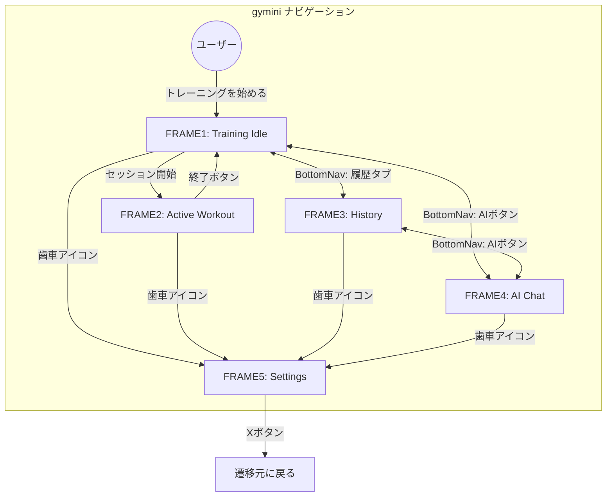
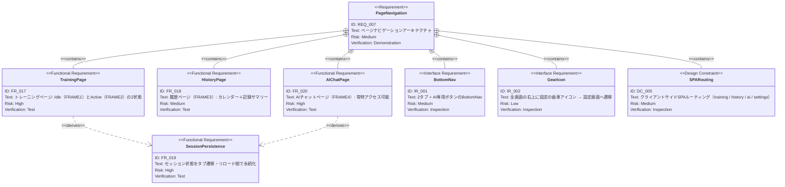

# ページナビゲーション 要求仕様書

**親要求:** [index.md](index.md) - REQ_007 (UI Design), IR_001 (ナビゲーション)

**デザインリファレンス:** `.sdd/design-system.html` 全FRAME共通

## 概要

gymini のページナビゲーションアーキテクチャを定義する。

- **BottomNav**: 2タブ（Training + History）+ 右側 AI 専用ボタン
- **歯車アイコン**: 全画面の右上に固定、タップで設定画面へ遷移
- **ルーティング**: 5つの論理画面（FRAME1〜5）をクライアントサイドで管理

---

## 1. 画面遷移図



---

## 2. 要求図（SysML Requirements Diagram）



---

## 3. 機能要求の詳細

### FR_017: トレーニングページ

アプリのメインページ。セッション状態に応じてFRAME1（Idle）とFRAME2（Active）を切り替える。

- **FRAME1（Idle）**: 挨拶 + 「トレーニングを始める」ボタン。詳細は [workout/index.md](workout/index.md) 参照
- **FRAME2（Active）**: 種目カード一覧 + セット記録。終了ボタンでFRAME1に戻る

**検証方法:** テストによる検証

### FR_018: 履歴ページ（FRAME3）

月表示カレンダー + 選択日の記録サマリー。詳細は [history/index.md](history/index.md) 参照。

**検証方法:** テストによる検証

### FR_019: セッション状態の永続化

BottomNavによるタブ遷移やブラウザリロードでセッションデータが失われないことを保証する。Zustandの`persist`ミドルウェアでlocalStorageに永続化。

**検証方法:** テストによる検証

### FR_020: AIチャットページ（FRAME4）

BottomNavのAIボタンから常時アクセス可能。APIキー未設定時もタップ可能（ページ内で設定を促すUI表示）。詳細は [ai-chat/index.md](ai-chat/index.md) 参照。

**検証方法:** テストによる検証

## 4. インターフェース要求

### IR_001: BottomNav（2タブ + AI専用ボタン）

スマホ画面下部に固定配置。FRAME1〜4で常に表示（FRAME5では非表示）。

**レイアウト:**

```
┌──────────┬──────────┬──────────────────┐
│ Training │ History  │   [ AI ボタン ]   │
└──────────┴──────────┴──────────────────┘
  2タブ（均等 flex-1）   AI 専用ボタン（pill型）
```

**UIスペック:**
- 高さ: `h-24`（セーフエリア含む）
- 背景: `bg-white/80 backdrop-blur-xl`
- ボーダー: `border-t border-zinc-200/50`

**タブ状態:**

| 要素 | ラベル | アイコン | アクティブ | 非アクティブ |
|:-----|:-------|:---------|:-----------|:-------------|
| タブ1 | トレ | `ph-barbell` | `ph-fill text-black font-bold` | `text-zinc-400 font-medium` |
| タブ2 | 履歴 | `ph-clock-counter-clockwise` | `ph-fill text-black font-bold` | `text-zinc-400 font-medium` |

**AIボタン:**

| 状態 | 背景 | テキスト |
|:-----|:-----|:---------|
| 通常 | `bg-black border-zinc-800` | `text-white` |
| アクティブ（FRAME4表示中） | `bg-accent shadow-red-200` | `text-white` |

- サイズ: `px-4 h-11 rounded-2xl`
- アイコン: `ph-robot text-xl` + 「AI」ラベル `text-xs font-bold`

**遷移先:**

| 操作 | 遷移先 |
|:-----|:-------|
| トレタブ | FRAME1（Idle）/ FRAME2（セッション中の場合） |
| 履歴タブ | FRAME3 |
| AIボタン | FRAME4 |

**検証方法:** インスペクションによる検証

### IR_002: 歯車アイコン（全画面共通）

全画面（FRAME1〜4）の右上に固定表示される歯車アイコン。タップでFRAME5（設定）へ遷移する。

**UIスペック:**
- 位置: `absolute top-12 right-4 z-30`
- サイズ: `w-9 h-9`
- スタイル: `bg-white/80 backdrop-blur-sm rounded-full shadow-sm border-zinc-100`
- アイコン: `ph-gear text-base text-zinc-500`

**APIキー未設定時のバッジ:**
- 赤ドット: `w-3 h-3 bg-accent rounded-full`
- 位置: `absolute top-[-2px] right-[-2px]`

**FRAME2での追加要素:**
- 歯車の右隣に「終了」ボタン
- ボタン群の下にタイマーpill

**検証方法:** インスペクションによる検証

## 5. 設計制約

### DC_005: クライアントサイドSPAルーティング

4つの論理ルート（`training`, `history`, `ai`, `settings`）をクライアントサイドで管理。URLベースルーティングやブラウザ履歴APIは使用しない。

**検証方法:** インスペクションによる検証

---

## 6. フェーズ統合戦略

| Phase | 追加機能 | ナビゲーションへの影響 |
|:------|:---------|:---------------------|
| Phase 1 | ワークアウト CRUD、履歴 | FRAME1/2/3が機能。AIボタンは「準備中」表示 |
| Phase 2 | 設定画面（APIキー・種目管理） | FRAME5追加。歯車アイコン全画面表示 |
| Phase 3 | AIチャット | FRAME4が完全機能。AIボタンのアクティブ状態（accent） |

---

## 7. スコープ外

- URLベースルーティング（ブラウザ履歴API / ハッシュルーティング）
- ディープリンク / ブックマーク対応
- ページ間のトランジションアニメーション
- タブレット / デスクトップ向けレスポンシブレイアウト
