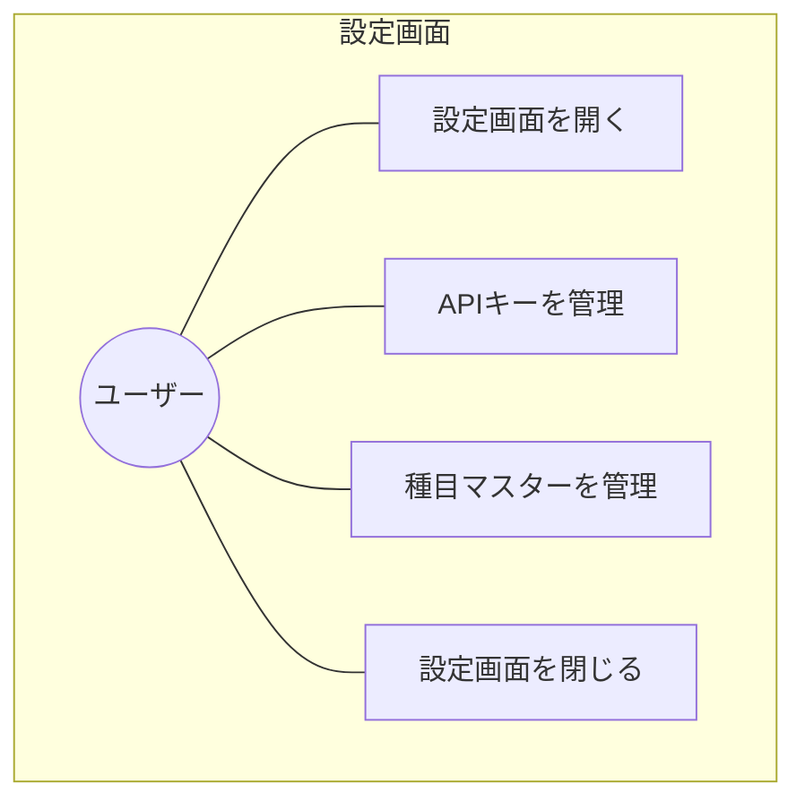

# 設定画面 要求仕様書

**親要求:** [index.md](../index.md)

**デザインリファレンス:** `.sdd/design-system.html` FRAME5

> **統合画面:** APIキー管理（[api-key](../api-key/index.md)）と種目マスター管理（[exercise-master](../exercise-master/index.md)）のUIを単一の設定画面に統合する。各ドメインロジックの詳細は個別PRDを参照。

## 概要

アプリケーション全体の設定を管理する画面。歯車アイコンからどの画面からでもアクセスでき、閉じるボタンで遷移元に戻る。

---

## 1. ユースケース図



---

## 2. 要求図（SysML Requirements Diagram）

```mermaid
requirementDiagram
    requirement SettingsScreen {
        id: REQ_009
        text: "設定画面による一元管理"
        risk: low
        verifymethod: demonstration
    }

    functionalRequirement GearAccess {
        id: FR_021
        text: "歯車アイコンから設定画面へ遷移"
        risk: low
        verifymethod: test
    }

    functionalRequirement GearBadge {
        id: FR_022
        text: "APIキー未設定時に歯車アイコンに赤バッジ表示"
        risk: low
        verifymethod: test
    }

    functionalRequirement CloseReturn {
        id: FR_023
        text: "閉じるボタンで遷移元の画面に戻る"
        risk: low
        verifymethod: test
    }

    functionalRequirement APIKeySection {
        id: FR_024
        text: "APIキー設定セクション表示"
        risk: low
        verifymethod: test
    }

    functionalRequirement ExerciseMasterSection {
        id: FR_025
        text: "種目マスター管理セクション表示"
        risk: low
        verifymethod: test
    }

    SettingsScreen - contains -> GearAccess
    SettingsScreen - contains -> GearBadge
    SettingsScreen - contains -> CloseReturn
    SettingsScreen - contains -> APIKeySection
    SettingsScreen - contains -> ExerciseMasterSection
    APIKeySection - traces -> FR_008
    APIKeySection - traces -> FR_009
    APIKeySection - traces -> FR_010
    ExerciseMasterSection - traces -> FR_007
```

---

## 3. 機能要求の詳細

### FR_021: 歯車アイコンから設定画面へ遷移

全画面（FRAME1〜FRAME4）の右上に歯車アイコンボタンを固定表示する。スクロールしても常にアクセス可能。タップすると設定画面（FRAME5）へ遷移する。

**検証方法:** テストによる検証

### FR_022: APIキー未設定時の赤バッジ

Gemini APIキーが未設定の場合、歯車アイコンの右上に赤いバッジ（ドット）を表示する。

**検証方法:** テストによる検証

### FR_023: 閉じるボタンで遷移元に戻る

設定画面の右上に閉じる（X）ボタンを固定表示する。タップすると設定画面を閉じて遷移元の画面に戻る。

**検証方法:** テストによる検証

### FR_024: APIキー設定セクション

設定画面上部にAPIキー管理セクションを表示する。詳細な入力・表示切替・削除機能は [api-key/index.md](../api-key/index.md) を参照。

**セクション構成:**
1. セクションラベル「Gemini API」
2. APIキー入力フィールド（パスワードマスク + 目アイコンで表示切替）
3. 接続ステータス表示（接続済み / 未設定）
4. 削除ボタン

**検証方法:** テストによる検証

### FR_025: 種目マスター管理セクション

APIキーセクションの下に種目マスター管理セクションを表示する。詳細な検索・追加・削除機能は [exercise-master/index.md](../exercise-master/index.md) を参照。

**セクション構成:**
1. セクションラベル「種目マスター」
2. 検索入力フィールド（リアルタイム絞り込み）
3. 種目一覧（各行に名前 + 編集ボタン）
4. 追加ボタン（`+` アイコン + 「種目を追加」ラベル）

**検証方法:** テストによる検証

---

## 4. 備考

- 設定画面にはBottomNavを表示しない
