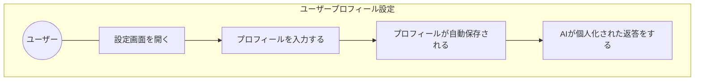
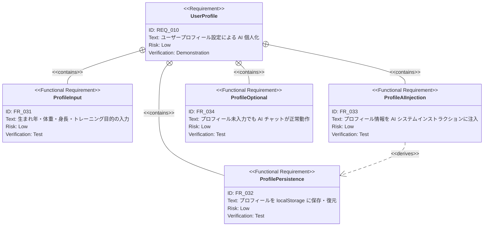

# ユーザープロフィール設定 要求仕様書

**親要求:** [index.md](./index.md)

> **目的:** AI チャットがユーザー個人に合わせたアドバイスを返せるよう、生まれ年・体重・身長・トレーニング目的をユーザーが設定できる機能を追加する。

## 概要

Gemini API を活用した AI コーチが個人化されたアドバイス（推奨重量・セット数・ダイエット指針など）を提供するには、ユーザーの基本属性情報が必要である。ユーザーが任意でプロフィールを設定すると、その情報が AI のシステムインストラクションに組み込まれ、回答の質が向上する。

プロフィールは **任意入力**（入力しなくても AI チャットは動作する）とし、全項目 null のまま使用しても既存機能に影響を与えない。

---

## 1. ユースケース図



---

## 2. 要求図（SysML Requirements Diagram）



---

## 3. 機能要求の詳細

### FR_031: プロフィール入力フィールド

設定画面にプロフィールセクションを追加する。以下の 4 フィールドを提供する。

| フィールド | 入力型 | 単位 | 制約 |
|:----------|:------|:-----|:----|
| 生まれ年 | 数値 | 年 | 1900〜2025（任意） |
| 体重 | 数値 | kg | 1〜300（任意） |
| 身長 | 数値 | cm | 50〜250（任意） |
| トレーニング目的 | 選択肢 | — | 5 択（任意） |

**トレーニング目的の選択肢:**
- 筋肥大（サイズアップ）
- 筋力アップ（パワー）
- 減量・ダイエット
- 維持・健康増進
- 競技パフォーマンス向上

**検証方法:** テストによる検証

### FR_032: プロフィールの永続化

入力した値は localStorage に自動保存（デバウンス 300ms）し、アプリ再起動後も保持する。

**検証方法:** テストによる検証

### FR_033: AI システムインストラクションへの注入

プロフィールが 1 項目以上入力されている場合、Gemini API へのシステムインストラクションにユーザー情報ブロックを追記する。AI はその情報を踏まえてアドバイスを個人化する。

**検証方法:** テストによる検証

### FR_034: 未入力時の正常動作

全フィールドが未入力（null）のときは既存のシステムインストラクションをそのまま使用し、AI チャットの動作に影響を与えない。

**検証方法:** テストによる検証

---

## 4. 画面レイアウト

プロフィールセクションは設定画面の最上部に配置する。

```
┌─────────────────────────────────┐
│                          [  X ] │
│                                 │
│  設定                           │
│                                 │
│  ┌─ プロフィール ──────────────┐ │  ← 新規追加（最上部）
│  │ 生まれ年       [1990    ]  │ │
│  │ 体重           [  70 ] kg  │ │
│  │ 身長           [ 175 ] cm  │ │
│  │ トレーニング目的            │ │
│  │ [筋肥大（サイズアップ）  ▼] │ │
│  └────────────────────────────┘ │
│                                 │
│  ┌─ Gemini API ───────────────┐ │
│  │ ...                         │ │
│  └────────────────────────────┘ │
│                                 │
│  ┌─ 種目マスター ─────────────┐ │
│  │ ...                         │ │
│  └────────────────────────────┘ │
└─────────────────────────────────┘
```

---

## 5. 非機能要求

- **プライバシー（B-001 準拠）:** プロフィール情報は localStorage にのみ保存。Gemini API 以外の外部サーバーへは送信しない
- **オプション性:** 全項目未入力でもアプリは正常動作する
- **T-003 準拠:** タップターゲット最低 44×44px
