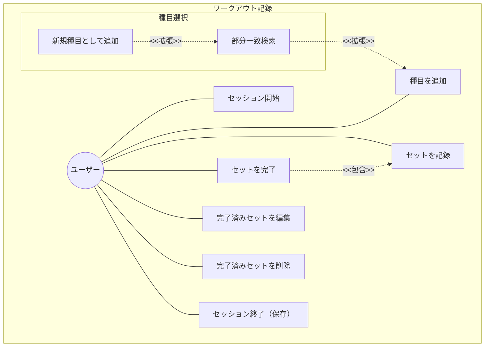
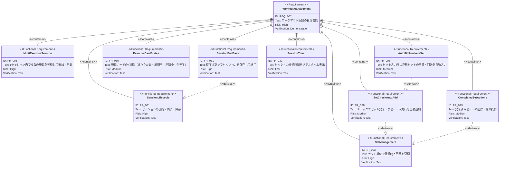

# ワークアウト記録管理 要求仕様書

**親要求:** [index.md](../index.md) - REQ_002

**デザインリファレンス:** `.sdd/design-system.html` FRAME1（Idle）、FRAME2（Active Workout）

## 概要

ユーザーが日々のトレーニング内容を記録・管理する中核機能。ワークアウトは日付に紐づき、複数の種目とセットで構成される。セッション開始（FRAME1）→ セット記録（FRAME2）→ 終了・保存（FRAME1に戻る）のフローで運用する。

---

## 1. ユースケース図



---

## 2. 要求図（SysML Requirements Diagram）



---

## 3. 機能要求の詳細

### FR_001: セッションライフサイクル

FRAME1（Idle）で「トレーニングを始める」ボタンを押すとセッション開始。FRAME2（Active）へ遷移し、種目追加・セット記録を行う。

**検証方法:** テストによる検証

### FR_003: セット単位の管理

各種目内でセット単位のデータを管理する。1セットは以下の情報を持つ:
- 重量（kg）
- 回数（回）

**検証方法:** テストによる検証

### FR_005: 複数種目の連続記録

1回のセッション内で複数の種目を連続して追加・記録できる。画面下部の「種目を追加...」検索フィールドから種目を選択して追加する。

**検証方法:** テストによる検証

### FR_006: 前セットの値を自動入力

チェック後に自動追加される次のセット入力行に、直前セットの重量と回数を初期値として自動入力する。

**検証方法:** テストによる検証

### FR_028: チェックでセット完了→次セット自動追加

セット入力行の右端にあるチェックボタンを押すと:
1. 入力中のセットが完了状態に変わる
2. 次のセット入力行が自動追加される（前セット値で自動入力: FR_006）

最初のセットは種目カード内の「+」ボタンで追加する。

**UIスペック（チェックボタン）:**
- サイズ: `w-7 h-7`
- スタイル: `bg-black text-white rounded shadow-md`
- アイコン: `ph-check`

**検証方法:** テストによる検証

### FR_029: 完了済みセットの削除・編集

完了済みセット行には左端にゴミ箱アイコン、右端に鉛筆アイコンを表示する。

- **ゴミ箱**: タップでそのセットを削除
- **鉛筆**: タップでそのセットを入力行に戻し、重量・回数を編集可能にする

**UIスペック（完了済みセット行）:**
- 背景: `bg-zinc-50 rounded-xl`
- ゴミ箱: `text-zinc-300`（控えめ）
- 鉛筆: `text-zinc-400`

**検証方法:** テストによる検証

### FR_030: 種目カードの4状態

種目カードは以下の4状態を持つ:

| 状態 | 説明 | UI |
|:-----|:-----|:---|
| **折りたたみ** | セット一覧非表示。セット数サマリー表示 | opacity-70、caret-down |
| **展開・セットなし** | 展開直後、まだセット未追加 | 「+」ボタンのみ表示 |
| **記録中** | 完了済みセット + 入力中セット行 | 入力行に左端黒バー |
| **全セット完了** | 全セット完了後 | 「+」ボタンで追加セット可能 |

**カードヘッダー共通:**
- 左: 三点メニュー（`ph-dots-three`）→ 並べ替え・削除
- 中央: 種目名（Outfit Bold、ふりがな不要）
- 右: caret-up（展開時）/ caret-down（折りたたみ時）

**検証方法:** テストによる検証

### FR_031: 終了ボタンでセッション保存・終了

FRAME2の右上に固定表示される「終了」ボタンを押すとセッションを保存して終了し、FRAME1（Idle）に戻る。「保存して終了」のような別途大きなボタンは設けない。

**UIスペック:**
- テキスト: 「終了」
- スタイル: `text-accent font-bold bg-red-50 px-3 py-1.5 rounded-lg`
- 位置: `absolute top-12 right-4`（歯車ボタンの右隣）

**検証方法:** テストによる検証

### FR_032: セッションタイマー

セッション開始からの経過時間をFRAME2の右上にリアルタイム表示する。歯車・終了ボタンの下に配置。

**UIスペック:**
- 形状: pill型（`rounded-lg`）
- 背景: `bg-white/80 backdrop-blur-sm`
- テキスト: `Outfit Bold text-xs`（例: 00:14:32）
- アイコン: `ph-clock`（accent色、`animate-pulse`）

**検証方法:** テストによる検証

---

## 4. 画面レイアウト

### FRAME1: Idle（セッション未開始）

```
┌─────────────────────────────────┐
│ (sensor notch)                  │
│                          [  ⚙·]│  ← 固定: 歯車（·=赤バッジ）
│                                 │
│  [avatar] 10月24日 (木)         │
│           こんにちは、タカさん    │
│                                 │
│         ( barbell icon )        │
│    準備はいいですか？             │
│                                 │
│  [  トレーニングを始める  ]      │  ← FRAME2へ遷移
│                                 │
│ [トレ]  [履歴]        [AI]     │  ← BottomNav
└─────────────────────────────────┘
```

### FRAME2: Active Workout（セッション中）

```
┌─────────────────────────────────┐
│ (sensor notch)                  │
│                    [⚙] [終了]  │  ← 固定: 歯車 + 終了
│                       00:14:32  │  ← 固定: タイマー
│                                 │
│  ワークアウト                    │  ← スクロールコンテンツ
│                                 │
│  ┌─ Card 1 (折りたたみ) ──────┐ │
│  │ [···] Squat           [v]  │ │
│  │        2 Sets • Last: 80kg │ │
│  └────────────────────────────┘ │
│                                 │
│  ┌─ Card 2 (展開・セットなし)──┐│
│  │ [···] Bench Press     [^]  │ │
│  │          [ + ]              ││
│  └────────────────────────────┘ │
│                                 │
│  ┌─ Card 3 (記録中) ─────────┐ │
│  │ [···] Incline DB Press [^] │ │
│  │ [🗑] 30kg  10回      [✏️] │ │  ← SET1完了
│  │ █ 2  [30] kg [10] 回  [✓] │ │  ← SET2入力中
│  └────────────────────────────┘ │
│                                 │
│  ┌─ Card 4 (全完了) ─────────┐ │
│  │ [···] Squat           [^] │ │
│  │ [🗑] 80kg  8回       [✏️] │ │
│  │ [🗑] 80kg  6回       [✏️] │ │
│  │          [ + ]             │ │
│  └────────────────────────────┘ │
│                                 │
│  [🔍 種目を追加...]             │
│                                 │
│ [トレ]  [履歴]        [AI]     │  ← BottomNav
└─────────────────────────────────┘
```

---

## 5. スコープ外

- ワークアウト全体のメモ機能（将来検討）
- セット単位のメモ機能（将来検討）
- 体重の自動増減提案
- セット間レスト計測
