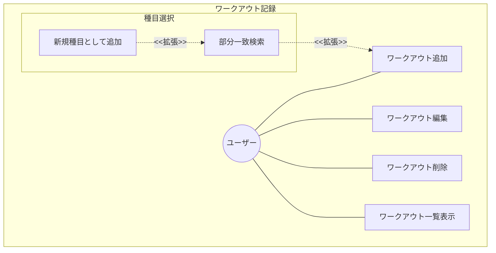
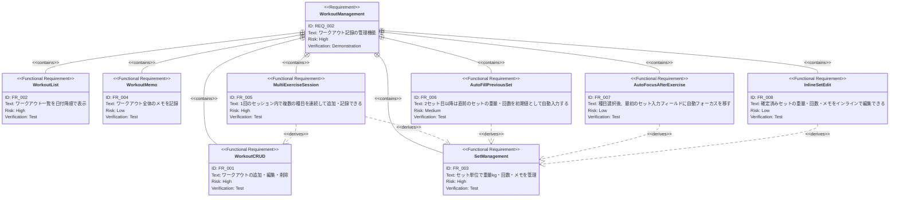

# ワークアウト記録管理 要求仕様書

**親要求:** [index.md](../index.md) - REQ_002

## 概要

ユーザーが日々のトレーニング内容を記録・管理する中核機能。ワークアウトは日付に紐づき、複数の種目とセットで構成される。

---

## 1. ユースケース図

---

## 2. 要求図（SysML Requirements Diagram）

---

## 3. 機能要求の詳細

### FR_001: ワークアウトの追加・編集・削除

ユーザーはワークアウト記録を新規作成、既存記録の編集、および削除ができる。ワークアウトは日付に紐づき、複数のセットと種目を含む。

**検証方法:** テストによる検証

### FR_002: ワークアウト一覧表示

ワークアウト一覧を日付降順（新しい順）で表示する。各ワークアウトには日付・種目・セット情報のサマリーが表示される。

**検証方法:** テストによる検証

### FR_003: セット単位の管理

各ワークアウト内でセット単位のデータを管理する。1セットは以下の情報を持つ:
- 重量（kg）
- 回数（reps）
- メモ（任意）

**検証方法:** テストによる検証

### FR_004: ワークアウト全体のメモ

ワークアウト単位で自由記述のメモを記録できる。体調やトレーニング環境などの補足情報を残すための機能。

**検証方法:** テストによる検証

### FR_005: 複数種目の連続記録（セッション形式）

1回のワークアウトセッション内で、複数の種目を中断なく連続して追加・記録できる。セッション中はすべてのデータをメモリ内の下書きとして保持し、最後にまとめて保存する。

**検証方法:** テストによる検証

### FR_006: 前セットの値を自動入力

「セット追加」後、新しいセットの入力欄に直前のセットの重量と回数を初期値として自動入力する（メモは引き継がない）。ユーザーが値を変更しない場合はそのまま追加できる。

**検証方法:** テストによる検証

### FR_008: 確定済みセットのインライン編集

セッション記録中、すでに確定したセット行の重量・回数・メモを直接タップして編集できる。編集中は該当セット行が入力可能状態になり、変更を確定すると即座に反映される。

**検証方法:** テストによる検証

### FR_007: 種目選択後の自動フォーカス

種目を選択した直後、最初のセット入力フィールド（重量）に自動フォーカスを移す。モバイル環境でキーボードが自動表示され、即座に入力を開始できる。

**検証方法:** テストによる検証
