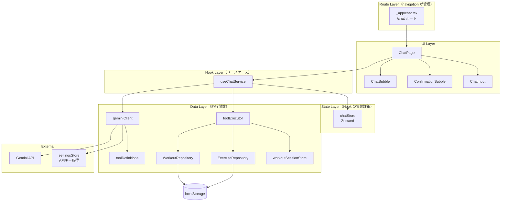

# AIチャット × Function Calling

**関連 Spec:** [index_spec.md](index_spec.md)
**関連 PRD:** [index.md](../../requirement/ai-chat/index.md)

---

# 1. 実装ステータス

**ステータス:** 🔴 未実装

| モジュール/機能 | ステータス | 備考 |
|-------------|--------|------|
| chatStore (Zustand) | 🔴 未実装 | State Layer: チャットメッセージ・ローディング・エラー状態 |
| geminiClient | 🔴 未実装 | Data Layer: Gemini API クライアント（Function Calling 対応） |
| toolDefinitions | 🔴 未実装 | Data Layer: Gemini API に渡すツール定義 |
| toolExecutor | 🔴 未実装 | Data Layer: ツール実行ディスパッチャー |
| useChatService | 🔴 未実装 | Hook Layer: チャット送受信ユースケース |
| ChatPage | 🔴 未実装 | UI Layer: チャット画面 |
| ChatBubble | 🔴 未実装 | UI Layer: メッセージバブル（user/assistant） |
| ConfirmationBubble | 🔴 未実装 | UI Layer: 書き込み確認インラインUI |
| ChatInput | 🔴 未実装 | UI Layer: メッセージ入力バー |

---

# 2. 設計目標

- **Gemini API直接呼び出し**: クライアントからBYOK APIキーを使って直接Gemini APIを呼び出す。中間サーバーなし（A-002）
- **Function Calling の自律実行**: AIが会話の文脈から読み取りツールを自律的に呼び出し、結果を踏まえて応答する
- **書き込み操作のインライン確認**: 書き込みツールの呼び出し時は、チャットバブル内にインラインボタンを表示してユーザー確認を経る（B-002）
- **既存モジュールの再利用**: WorkoutRepository・ExerciseRepository・settingsStore をそのまま利用。独自のデータアクセス層は構築しない（A-001）
- **Phase 3 への拡張性**: 将来的なツール追加（進捗分析・メニュー提案等）に対応しやすいディスパッチ設計

---

# 3. 技術スタック

| 領域 | 採用技術 | 選定理由 |
|------|--------|--------|
| UIフレームワーク | React (TSX) | T-001: TypeScript Strict Mode |
| UIコンポーネント | shadcn/ui + Radix UI | A-001: Library-First。一貫したデザインシステム |
| スタイリング | Tailwind CSS ^4 | T-003: Mobile-First UI |
| AI API | @google/generative-ai (Gemini SDK) | A-001: Library-First。Gemini API の公式 JavaScript SDK。モデルは `gemini-flash-latest` 固定 |
| 状態管理 | Zustand ^5 | チャット状態管理。プロジェクト標準 |
| ルーティング | TanStack Router ^1 | `/chat` ルート。navigation 機能が管理 |
| マークダウン表示 | react-markdown + remark-gfm | AIの応答をマークダウンとしてレンダリング。テーブル・リスト等の表現力 |

---

# 4. アーキテクチャ

## 4.1. システム構成図



UIは Hook Layer だけを知る。State Layer・Data Layer は hooks の実装詳細であり、UI から直接参照しない。

## 4.2. モジュール分割

### Data Layer

| モジュール名 | 責務 | 依存関係 | 配置場所 |
|-----------|------|---------|--------|
| geminiClient | Gemini API との通信。チャット履歴管理、Function Calling 対応 | @google/generative-ai, settingsStore | `src/lib/geminiClient.ts` |
| toolDefinitions | Gemini API に渡す Function Calling のツール定義（スキーマ） | なし | `src/lib/toolDefinitions.ts` |
| toolExecutor | ツール名とパラメータを受け取り、対応する Repository/Store メソッドを呼び出すディスパッチャー | WorkoutRepository, ExerciseRepository, workoutSessionStore | `src/lib/toolExecutor.ts` |

### State Layer（Hook の実装詳細）

| モジュール名 | 責務 | 依存関係 | 配置場所 |
|-----------|------|---------|--------|
| chatStore | チャットメッセージ履歴、ローディング状態、エラー状態、確認待ちアクション | なし | `src/stores/chatStore.ts` |

### Hook Layer（ユースケース）

| モジュール名 | 責務 | 依存関係 | 配置場所 |
|-----------|------|---------|--------|
| useChatService | チャット送受信の全ユースケース。メッセージ送信→Gemini API呼び出し→Function Calling 処理→応答追加 | chatStore, geminiClient, toolExecutor | `src/hooks/useChatService.ts` |

### UI Layer

| モジュール名 | 責務 | 依存関係 | 配置場所 |
|-----------|------|---------|--------|
| ChatPage | `/chat` ルートのページコンポーネント。メッセージ一覧 + 入力バー | useChatService | `src/pages/ChatPage.tsx` |
| ChatBubble | チャットメッセージバブル（user/assistant 両対応） | なし（props） | `src/components/chat/ChatBubble.tsx` |
| ConfirmationBubble | 書き込み確認インラインUI（ボタン付きバブル）。インラインボタンのタップターゲットは h-11（44px）以上（T-003）。PRD の h-9 指定は T-003 違反のため h-11 に修正すること | なし（props） | `src/components/chat/ConfirmationBubble.tsx` |
| ChatInput | メッセージ入力バー（BottomNav 上固定） | なし（props） | `src/components/chat/ChatInput.tsx` |

---

# 5. データモデル

```typescript
// -------------------------------------------------------
// chatStore の状態型（src/stores/chatStore.ts）
// -------------------------------------------------------

type ChatMessage = {
  id: string                          // crypto.randomUUID()
  role: 'user' | 'assistant'
  content: string
  timestamp: ISODateTimeString
  toolCalls?: ToolCallResult[]
  pendingAction?: PendingAction
}

type ToolCallResult = {
  toolName: string
  args: Record<string, unknown>
  result: unknown
}

type PendingAction = {
  id: string
  type: 'saveWorkout' | 'addExercise' | 'addExerciseToSession'
  description: string
  data: SaveWorkoutData | AddExerciseData | AddExerciseToSessionData
  status: PendingActionStatus
}

type PendingActionStatus = 'pending' | 'approved' | 'rejected'

// PendingAction.data の判別共用体
type SaveWorkoutData = {
  actionType: 'saveWorkout'
  exercises: Array<{
    exerciseName: string
    sets: Array<{ weight: number; reps: number }>
  }>
  date: DateString
}

type AddExerciseData = {
  actionType: 'addExercise'
  name: string
}

type AddExerciseToSessionData = {
  actionType: 'addExerciseToSession'
  exerciseId: string
  exerciseName: string
}
```

> **Note**: チャットメッセージは localStorage に永続化しない。ページリロードでチャット履歴はクリアされる（B-001: 不要なデータ残留を防止）。

---

# 6. インターフェース定義

```typescript
// -------------------------------------------------------
// geminiClient (src/lib/geminiClient.ts)
// Gemini API との通信を担当。Function Calling 対応。
// -------------------------------------------------------

import { GoogleGenerativeAI } from '@google/generative-ai'

type GeminiClientConfig = {
  apiKey: string
  toolDeclarations: ToolDeclaration[]  // toolDefinitions から取得
}

type GeminiChatResponse = {
  text: string | null
  functionCalls: FunctionCallRequest[] | null
}

type FunctionCallRequest = {
  name: string
  args: Record<string, unknown>
}

// モデル: gemini-flash-latest 固定（高速・低コスト・Function Calling 対応）
const GEMINI_MODEL = 'gemini-flash-latest'

// API送信時の履歴上限: 直近50件（NFR-005）
const MAX_HISTORY_MESSAGES = 50

function createGeminiClient(config: GeminiClientConfig): {
  sendMessage: (
    history: Array<{ role: 'user' | 'model'; parts: Part[] }>,  // Part は @google/generative-ai の型
    message: string,
    abortSignal?: AbortSignal  // 応答停止用
  ) => Promise<GeminiChatResponse>

  sendFunctionResult: (
    history: Array<{ role: 'user' | 'model'; parts: Part[] }>,
    functionResponses: Array<{ name: string; response: unknown }>,
    abortSignal?: AbortSignal
  ) => Promise<GeminiChatResponse>
}

// システムプロンプト（geminiClient 内で設定）
// - AIコーチの役割・トーン
// - 利用可能なツールの使い方ガイダンス
// - 書き込み操作時は操作内容を自然言語で説明してからツールを呼ぶ指示

// -------------------------------------------------------
// toolDefinitions (src/lib/toolDefinitions.ts)
// Gemini API に渡すツール定義。
// -------------------------------------------------------

// 読み取りツール
const getRecentWorkoutsDeclaration = {
  name: 'getRecentWorkouts',
  description: '最新n件のワークアウト記録を取得する',
  parameters: {
    type: 'object',
    properties: {
      count: { type: 'number', description: '取得件数（デフォルト: 5）' }
    }
  }
}

const getWorkoutsByExerciseDeclaration = {
  name: 'getWorkoutsByExercise',
  description: '指定した種目名で部分一致検索し、該当するワークアウト記録を取得する',
  parameters: {
    type: 'object',
    properties: {
      exerciseName: { type: 'string', description: '種目名（部分一致）' }
    },
    required: ['exerciseName']
  }
}

const getWorkoutsByDateDeclaration = {
  name: 'getWorkoutsByDate',
  description: '指定した日付のワークアウト記録を取得する',
  parameters: {
    type: 'object',
    properties: {
      date: { type: 'string', description: '日付（YYYY-MM-DD形式）' }
    },
    required: ['date']
  }
}

const getWorkoutSummaryDeclaration = {
  name: 'getWorkoutSummary',
  description: '指定期間のワークアウト集計を取得する',
  parameters: {
    type: 'object',
    properties: {
      periodType: { type: 'string', enum: ['week', 'month'], description: '集計期間の種類' },
      startDate: { type: 'string', description: '開始日（YYYY-MM-DD形式）' },
      endDate: { type: 'string', description: '終了日（YYYY-MM-DD形式）' }
    },
    required: ['periodType', 'startDate', 'endDate']
  }
}

const getExercisesDeclaration = {
  name: 'getExercises',
  description: '登録済みの種目一覧を取得する',
  parameters: { type: 'object', properties: {} }
}

// 書き込みツール
const saveWorkoutDeclaration = {
  name: 'saveWorkout',
  description: '会話の内容からワークアウト記録を保存する。ユーザー確認が必要',
  parameters: {
    type: 'object',
    properties: {
      date: { type: 'string', description: '日付（YYYY-MM-DD形式）' },
      exercises: {
        type: 'array',
        items: {
          type: 'object',
          properties: {
            exerciseName: { type: 'string' },
            sets: {
              type: 'array',
              items: {
                type: 'object',
                properties: {
                  weight: { type: 'number' },
                  reps: { type: 'number' }
                },
                required: ['weight', 'reps']
              }
            }
          },
          required: ['exerciseName', 'sets']
        }
      }
    },
    required: ['date', 'exercises']
  }
}

const addExerciseDeclaration = {
  name: 'addExercise',
  description: '種目マスターに新しい種目を追加する。ユーザー確認が必要',
  parameters: {
    type: 'object',
    properties: {
      name: { type: 'string', description: '種目名' }
    },
    required: ['name']
  }
}

const addExerciseToSessionDeclaration = {
  name: 'addExerciseToSession',
  description: 'アクティブなワークアウトセッションに種目を追加する。ユーザー確認が必要',
  parameters: {
    type: 'object',
    properties: {
      exerciseId: { type: 'string', description: '種目ID' },
      exerciseName: { type: 'string', description: '種目名' }
    },
    required: ['exerciseId', 'exerciseName']
  }
}

// -------------------------------------------------------
// toolExecutor (src/lib/toolExecutor.ts)
// ツール名とパラメータを受け取り、対応する操作を実行するディスパッチャー。
// -------------------------------------------------------

type ToolExecutionResult = {
  success: boolean
  data?: unknown
  error?: string
}

// 読み取りツール（即時実行、確認不要）
function executeReadTool(
  name: string,
  args: Record<string, unknown>
): ToolExecutionResult

// 書き込みツール判定
function isWriteTool(name: string): boolean
// → 'saveWorkout' | 'addExercise' | 'addExerciseToSession' の場合 true

// 書き込みツール実行（approve 後に呼ばれる）
function executeWriteTool(
  name: string,
  args: Record<string, unknown>
): ToolExecutionResult

// saveWorkout の種目ID解決:
// 各 exerciseName に対して ExerciseRepository.search(name) で完全一致検索。
// 一致あり → exerciseId を使用。
// 一致なし → { success: false, error: 'EXERCISE_NOT_FOUND', data: { missingExercises: string[] } } を返す。
// AI はエラーを受けて「種目を登録しますか？」とユーザーに確認 → 承認後に addExercise → saveWorkout 再実行。

// addExerciseToSession のセッションチェック:
// workoutSessionStore.isActive === false の場合、
// { success: false, error: 'SESSION_NOT_ACTIVE' } を返す。
// AI はエラーを受けて「セッションを開始して追加しますか？」とユーザーに確認 → 承認後にまとめて実行。

// -------------------------------------------------------
// chatStore (src/stores/chatStore.ts)
// -------------------------------------------------------

type ChatState = {
  messages: ChatMessage[]
  isLoading: boolean
  error: string | null
}

type ChatActions = {
  addMessage: (message: ChatMessage) => void
  setLoading: (loading: boolean) => void
  setError: (error: string | null) => void
  updatePendingAction: (messageId: string, status: PendingActionStatus) => void
  clearMessages: () => void
}

// -------------------------------------------------------
// useChatService (src/hooks/useChatService.ts)
// -------------------------------------------------------

function useChatService() {
  // AbortController を内部で保持し、stopResponse で abort する
  // return: {
  //   messages: ChatMessage[],
  //   isLoading: boolean,
  //   error: string | null,
  //   sendMessage: (text: string) => Promise<void>,
  //   stopResponse: () => void,          // 応答生成を中断。部分応答を破棄し isLoading = false
  //   approve: (messageId: string) => Promise<void>,
  //   reject: (messageId: string) => void,
  //   clearMessages: () => void,
  // }
}
```

### sendMessage フロー詳細

```typescript
// useChatService.sendMessage の疑似コード

async function sendMessage(text: string) {
  // 1. APIキーチェック
  const { apiKey, hasApiKey } = useSettingsStore.getState()
  if (!hasApiKey) {
    chatStore.setError('APIキーが設定されていません。設定画面からGemini APIキーを入力してください。')
    return
  }

  // 2. ユーザーメッセージをストアに追加
  chatStore.addMessage({ role: 'user', content: text, ... })
  chatStore.setLoading(true)

  // 2a. AbortController を作成（stopResponse で abort する）
  abortController = new AbortController()

  try {
    // 3. Gemini API に送信（直近50件の履歴のみ送信: NFR-005）
    const recentHistory = history.slice(-MAX_HISTORY_MESSAGES)
    const response = await geminiClient.sendMessage(recentHistory, text, abortController.signal)

    // 4. Function Call の処理
    if (response.functionCalls) {
      for (const fc of response.functionCalls) {
        if (isWriteTool(fc.name)) {
          // 書き込みツール → PendingAction を作成し確認待ち
          const pendingAction = createPendingAction(fc)
          chatStore.addMessage({
            role: 'assistant',
            content: response.text ?? '',
            pendingAction,
            ...
          })
          // ユーザーの approve/reject を待つ（approve 時に executeWriteTool を呼ぶ）
          return
        } else {
          // 読み取りツール → 即座に実行
          const result = executeReadTool(fc.name, fc.args)
          // ツール結果を Gemini API に返送
          const followUp = await geminiClient.sendFunctionResult(history, [
            { name: fc.name, response: result }
          ])
          // 最終応答をストアに追加
          chatStore.addMessage({
            role: 'assistant',
            content: followUp.text ?? '',
            toolCalls: [{ toolName: fc.name, args: fc.args, result }],
            ...
          })
        }
      }
    } else {
      // テキスト応答のみ
      chatStore.addMessage({ role: 'assistant', content: response.text ?? '', ... })
    }
  } catch (error) {
    // AbortError は stopResponse による正常中断なのでエラー表示しない
    if (error instanceof DOMException && error.name === 'AbortError') {
      return
    }
    chatStore.setError(getErrorMessage(error))
  } finally {
    chatStore.setLoading(false)
  }
}

// stopResponse: 応答生成を中断し、部分応答を破棄する
function stopResponse() {
  abortController?.abort()
  chatStore.setLoading(false)
  // 部分的な assistant メッセージがあれば削除
}
```

---

# 7. 非機能要件実現方針

| 要件 | 実現方針 |
|------|--------|
| セキュリティ（NFR-001）: チャット内容の保護 | チャットメッセージは Zustand ストア（メモリ）のみ。localStorage 永続化なし。ページリロードでクリア |
| セキュリティ（NFR-002）: APIキーの保護 | settingsStore から取得した APIキーは geminiClient 内でのみ使用。Gemini API エンドポイント以外に送信しない |
| 堅牢性（NFR-003）: Gemini API エラー耐性 | geminiClient の全 API 呼び出しを try-catch でラップ。エラー種別（ネットワーク、認証、レート制限、不正レスポンス）を判別し、ユーザーにわかりやすいエラーメッセージを表示 |
| 堅牢性（NFR-004）: APIキー未設定時 | sendMessage 冒頭で `hasApiKey` を確認。未設定時は API 呼び出しを行わず、設定画面への案内メッセージを表示 |

### エラーメッセージ設計

```typescript
function getErrorMessage(error: unknown): string {
  if (error instanceof Error) {
    // 認証エラー
    if (error.message.includes('API_KEY_INVALID') || error.message.includes('401')) {
      return 'APIキーが無効です。設定画面で正しいAPIキーを入力してください。'
    }
    // レート制限
    if (error.message.includes('429') || error.message.includes('RATE_LIMIT')) {
      return 'リクエスト制限に達しました。しばらく待ってから再度お試しください。'
    }
    // ネットワークエラー
    if (error.message.includes('fetch') || error.message.includes('network')) {
      return 'ネットワークエラーが発生しました。インターネット接続を確認してください。'
    }
  }
  return '予期しないエラーが発生しました。もう一度お試しください。'
}
```

---

# 8. テスト戦略

| テストレベル | 対象 | カバレッジ目標 | 対応FR |
|-----------|------|------------|--------|
| ユニットテスト | toolExecutor（全読み取りツール・書き込みツールのディスパッチ） | 全ツール | FR-003〜FR-010 |
| ユニットテスト | toolDefinitions（スキーマの妥当性検証） | 全ツール定義 | FR-002 |
| ユニットテスト | chatStore（addMessage, updatePendingAction, clearMessages） | 全アクション | FR-001 |
| ユニットテスト | geminiClient（正常応答、Function Call応答、エラーケース） | 主要パス | FR-001, NFR-003 |
| ユニットテスト | getErrorMessage（エラー種別の判別） | 全パターン | NFR-003, NFR-004 |
| コンポーネントテスト | ChatBubble（user/assistant バブル表示） | 主要パターン | FR-001 |
| コンポーネントテスト | ConfirmationBubble（承認/キャンセルボタンの動作） | 主要インタラクション | FR-011 |
| コンポーネントテスト | ChatInput（送信ボタン・Enter送信） | 主要インタラクション | FR-001 |
| 統合テスト | useChatService（メッセージ送信→AI応答→メッセージ追加の全フロー） | 読み取り・書き込みフロー | FR-001, FR-002 |
| 統合テスト | useChatService（書き込み確認→approve→実行→結果メッセージ） | 確認フロー | FR-007, FR-009, FR-010, FR-011 |
| 統合テスト | useChatService（APIキー未設定時のエラー表示） | エラーパス | NFR-004 |
| E2Eテスト | ChatPage: メッセージ送信→AI応答表示 | ゴールデンパス | FR-001 |
| E2Eテスト | ChatPage: 書き込み確認→承認→結果表示 | 確認フロー | FR-011 |

### テスト実装方針

- **Gemini API のモック**: `vi.mock('@google/generative-ai')` で SDK をモック。テストではネットワーク呼び出しを行わない
- **toolExecutor のテスト**: WorkoutRepository / ExerciseRepository は `vi.mock` で localStorage 層をモック
- **chatStore のリセット**: 各テスト前に `useChatStore.setState({ messages: [], isLoading: false, error: null })` でリセット

---

# 9. 設計判断

## 9.1. 決定事項

| 決定事項 | 選択肢 | 決定内容 | 理由 |
|---------|--------|--------|------|
| Gemini SDK | @google/generative-ai vs REST API 直接呼び出し | @google/generative-ai | A-001: Library-First。Function Calling のパラメータ構築、ストリーミング対応、型定義が SDK に含まれている |
| チャット履歴の永続化 | localStorage vs メモリのみ | メモリのみ（Zustand、persist なし） | B-001: 不要なデータ残留を防止。チャット履歴はセッション内のみ有効。リロードでクリア |
| 書き込み確認UI | モーダルダイアログ vs インラインボタン | インラインボタン（チャットバブル内） | PRD REQ_008 で明確に指定。モバイル操作の文脈切替を最小化 |
| ツール定義の管理 | 1ファイル集約 vs ツールごとに分割 | 1ファイル集約（toolDefinitions.ts） | ツール数が8個と少なく、分割のオーバーヘッドが利点を上回る |
| ツール実行のディスパッチ | switch-case vs Map vs Strategy パターン | switch-case（toolExecutor.ts） | ツール数が限定的。Map やパターン適用は過剰抽象化 |
| 読み取りツールの結果表示 | ツール結果をそのまま表示 vs AIが自然言語で要約 | AIが自然言語で要約 | ツール結果を Gemini API に返送し、AIが文脈に沿った自然言語で応答する。生データ表示よりユーザー体験が良い |
| 確認待ちアクションの同時数 | 複数同時 vs 1つのみ | 1つのみ（新規発生時に前の確認待ちは自動キャンセル） | UIの複雑さを回避。ユーザーが複数の確認ボタンに混乱するのを防ぐ |
| マークダウンレンダリング | dangerouslySetInnerHTML vs react-markdown | react-markdown | XSS防止（CONSTITUTION セキュリティ標準）。react-markdown は安全なレンダリングを提供 |
| PendingAction.data の型 | unknown vs 判別共用体 | 判別共用体（actionType でディスクリミネート） | T-001: any/unknown を避け、型安全にツール固有データにアクセスする |
| システムプロンプトの管理 | ハードコード vs 外部ファイル | geminiClient.ts 内にハードコード | システムプロンプトは実装の一部。外部ファイル化のメリットが薄い |
| エラーメッセージの国際化 | i18n vs 日本語ハードコード | 日本語ハードコード | gymini は日本語ユーザー向けアプリ。i18n は現時点で過剰 |
| ConfirmationBubble ボタン高さ | PRD h-9（36px） vs T-003 要件（44px） | h-11（44px）に修正 | T-003: タップターゲット最低44px。PRD の h-9 指定は T-003 違反のため h-11 を採用 |
| Gemini モデル選択 | gemini-flash-latest vs gemini-2.5-pro vs ユーザー選択 | `gemini-flash-latest` 固定 | 高速・低コスト・Function Calling 対応。ユーザー選択は Phase 3 初期スコープでは過剰 |
| チャット履歴のAPI送信上限 | 無制限 vs メッセージ件数制限 vs トークン数制限 | 直近50件のメッセージに制限 | トークン上限超過を防止。件数ベースは実装がシンプル。50件は通常の会話で十分な文脈量 |
| saveWorkout の種目ID解決 | AI事前検索 vs toolExecutor内検索 vs exerciseId をAIに渡す | toolExecutor 内で ExerciseRepository.search で検索。未登録時はエラーを返しAIが登録を提案 | AIのツール呼び出し回数を最小化しつつ、ユーザー確認フローを維持（B-002） |
| セッション未開始時の addExerciseToSession | エラーのみ vs セッション開始+追加をまとめて提案 | エラーを返し、AIが「セッションを開始して追加しますか？」と確認 | ユーザー体験を優先。1回の確認でまとめて実行可能 |
| AI応答待ち中のユーザー操作 | 送信無効化 vs キューイング vs 停止+再送信 | 停止ボタンで応答を中断・破棄し即座に新メッセージ送信可能 | モバイルUXを優先。誤った質問をすぐ修正できる。AbortController で実装 |

## 9.2. 未解決の課題

> **注意**: このセクションに内容がある場合は `impl-status: "blocked"` にセットし、解決するまで実装を開始しないこと（D-002）。

*現時点で未解決の課題はありません。*
