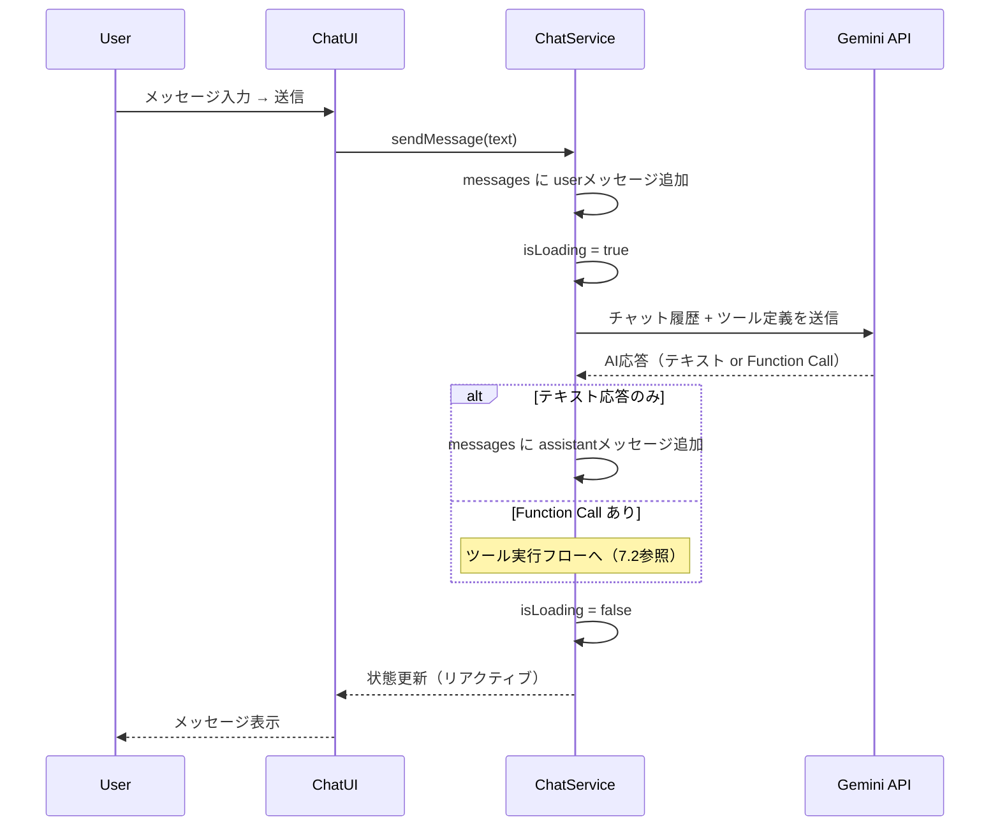
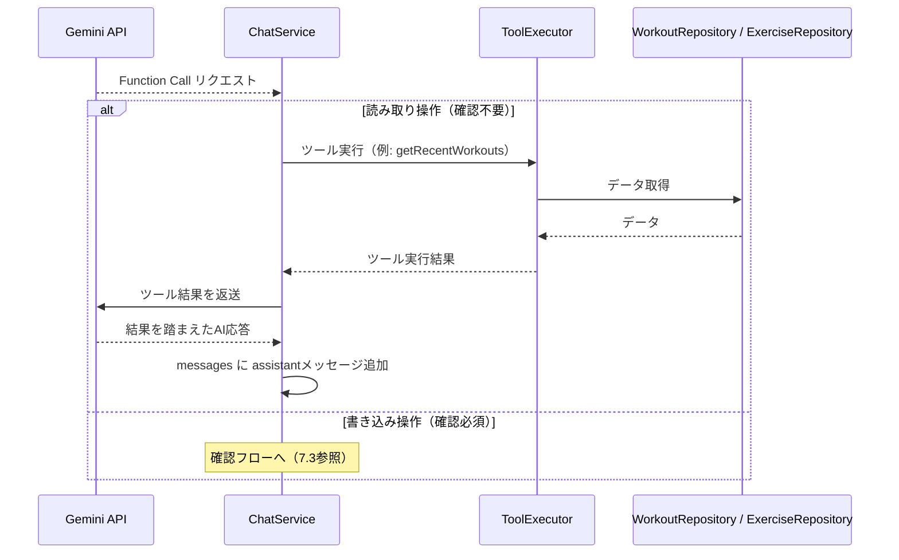
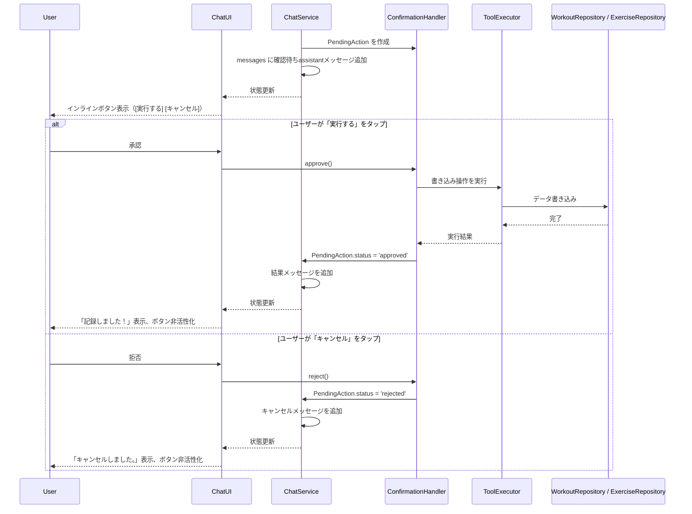
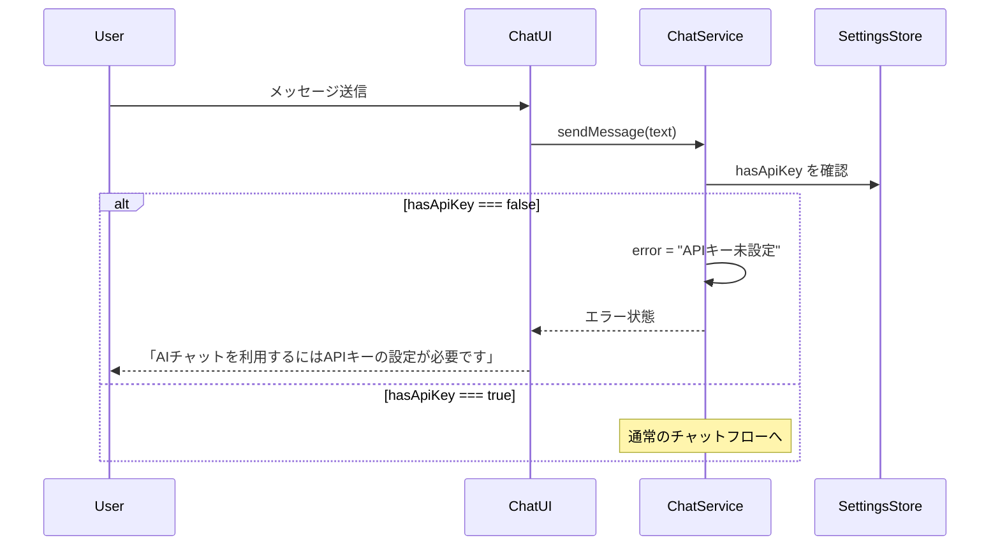

# AIチャット × Function Calling

**関連 Design Doc:** [index_design.md](index_design.md)
**関連 PRD:** [index.md](../../requirement/ai-chat/index.md)

---

# 1. 背景

gymini の Phase 3 中核機能。ユーザーが自然言語でAIコーチに質問し、AIが会話の文脈からワークアウトデータや種目マスターを参照・操作する。Gemini API の Function Calling を活用し、AIが適切なツールを自律的に呼び出すことで、コーディング不要のデータ操作体験を実現する。

AIチャット機能が必要な理由：

- ユーザーが自然言語で「最近のトレーニング内容を教えて」「今日ベンチプレス60kg×10回やった」と伝えるだけで、AIがデータ参照・記録操作を代行する
- Phase 1〜2 で蓄積したワークアウト記録と種目マスターを、AIコーチングのコンテキストとして活用する
- 書き込み操作（ワークアウト保存・種目追加・セッションへの種目追加）は必ずユーザー確認を経る（B-002）

# 2. 概要

AIチャット機能は以下の責務を持つ：

- **チャット会話**: Gemini API を用いたリアルタイムチャットインターフェース。ユーザーの BYOK APIキーで接続する
- **Function Calling**: AIが会話の文脈を解析し、必要なデータ操作ツールを自律的に呼び出す
- **書き込み確認**: 書き込み操作の実行前に、チャットバブル内のインラインUIでユーザーに確認を求める
- **読み取り自律実行**: データ取得・集計操作は確認なしで自律的に実行する

設計原則：

- **Privacy-by-Design**: チャット内容・ワークアウトデータは外部サーバーに保存しない。Gemini API への送信のみ（B-001）
- **AI安全操作の確認優先**: 書き込み操作は必ずインラインUIでユーザー確認を経る（B-002）
- **Client-Only Architecture**: すべての処理はクライアントサイドで完結。中間サーバーなし（A-002）

# 3. 要求定義

## 3.1. 機能要件 (Functional Requirements)

| ID | 要件 | 優先度 | PRD参照 | 検証方法 |
|----|------|--------|---------|---------|
| FR-001 | Gemini API を用いたチャット会話ができる。ユーザーの BYOK APIキーで接続する | 必須 | FR_011 | テスト |
| FR-002 | AIが会話の文脈から必要なツールを自律的に呼び出す（Function Calling） | 必須 | FR_012 | テスト |
| FR-003 | 最新n件のワークアウトを取得するツール | 必須 | FR_012_01 | テスト |
| FR-004 | 種目名で部分一致絞り込みするツール | 必須 | FR_012_02 | テスト |
| FR-005 | 日付指定でワークアウトを取得するツール | 必須 | FR_012_03 | テスト |
| FR-006 | 週・月単位のワークアウト集計ツール | 必須 | FR_012_04 | テスト |
| FR-007 | 会話からワークアウト記録を保存するツール（ユーザー確認必須） | 必須 | FR_012_05 | テスト |
| FR-008 | 登録済み種目一覧を取得するツール | 必須 | FR_012_06 | テスト |
| FR-009 | 種目マスターに新規追加するツール（ユーザー確認必須） | 必須 | FR_012_07 | テスト |
| FR-010 | アクティブセッションに種目を追加するツール（ユーザー確認必須・インラインUI） | 必須 | FR_012_08 | テスト |
| FR-011 | 書き込み操作の実行前にチャットバブル内のインラインUIでユーザー確認を求める | 必須 | REQ_008 | テスト |

## 3.2. 非機能要件 (Non-Functional Requirements)

| ID | カテゴリ | 要件 | 目標値 | 検証方法 |
|----|--------|------|--------|---------|
| NFR-001 | セキュリティ | チャット内容がサーバーに保存されないこと | Gemini API 以外への送信なし | テスト |
| NFR-002 | セキュリティ | APIキーが Gemini API エンドポイント以外に送信されないこと | ネットワーク監視で確認 | テスト |
| NFR-003 | 堅牢性 | Gemini API エラー時にランタイムエラーが発生しないこと | ユーザーにエラーメッセージを表示しフォールバック | テスト |
| NFR-004 | 堅牢性 | APIキー未設定時にチャット送信を試みた場合、適切なエラーメッセージを表示すること | 「APIキーを設定してください」等の案内 | テスト |
| NFR-005 | パフォーマンス | Gemini API に送信するチャット履歴は直近50件に制限すること | 50件を超える古いメッセージはAPI送信対象から除外（UI上は表示を維持） | テスト |

# 4. API

AIチャット機能が外部（他モジュール・UIレイヤー）に公開するインターフェース。

## 4.1. ChatService（チャット管理）

チャットの送受信とメッセージ履歴を管理するインターフェース。

| モジュール | インターフェース | メンバー | 概要 |
|---------|--------------|--------|------|
| ai-chat | ChatService | sendMessage(text) | ユーザーメッセージを送信し、AIの応答を取得する（FR-001） |
| ai-chat | ChatService | stopResponse() | AI応答の生成を中断し、部分応答を破棄する。中断後は即座に新しいメッセージを送信可能になる |
| ai-chat | ChatService | messages | チャットメッセージ履歴（読み取り専用） |
| ai-chat | ChatService | isLoading | AI応答待ち状態（ローディング表示用） |
| ai-chat | ChatService | error | 直近のエラー情報（null = エラーなし） |
| ai-chat | ChatService | clearMessages() | チャット履歴をクリアする |

## 4.2. ToolExecutor（Function Calling ツール実行）

AIが呼び出すツール群のインターフェース。読み取り操作は自律実行、書き込み操作はユーザー確認を経て実行する。

| モジュール | インターフェース | メンバー | 操作種別 | 概要 |
|---------|--------------|--------|---------|------|
| ai-chat | ToolExecutor | getRecentWorkouts(n) | 読み取り | 最新n件のワークアウトを取得する（FR-003） |
| ai-chat | ToolExecutor | getWorkoutsByExercise(name) | 読み取り | 種目名で部分一致絞り込みしてワークアウトを取得する（FR-004） |
| ai-chat | ToolExecutor | getWorkoutsByDate(date) | 読み取り | 日付指定でワークアウトを取得する（FR-005） |
| ai-chat | ToolExecutor | getWorkoutSummary(period) | 読み取り | 週・月単位のワークアウト集計を取得する（FR-006） |
| ai-chat | ToolExecutor | saveWorkout(data) | 書き込み（要確認） | 会話からワークアウト記録を保存する（FR-007） |
| ai-chat | ToolExecutor | getExercises() | 読み取り | 登録済み種目一覧を取得する（FR-008） |
| ai-chat | ToolExecutor | addExercise(name) | 書き込み（要確認） | 種目マスターに新規追加する（FR-009） |
| ai-chat | ToolExecutor | addExerciseToSession(exerciseId) | 書き込み（要確認） | アクティブセッションに種目を追加する（FR-010） |

## 4.3. ConfirmationHandler（書き込み確認）

書き込み操作のユーザー確認を管理するインターフェース。

| モジュール | インターフェース | メンバー | 概要 |
|---------|--------------|--------|------|
| ai-chat | ConfirmationHandler | pendingAction | 確認待ちの書き込み操作（null = 確認待ちなし） |
| ai-chat | ConfirmationHandler | approve() | 確認待ちの操作を承認し実行する（FR-011） |
| ai-chat | ConfirmationHandler | reject() | 確認待ちの操作をキャンセルする（FR-011） |

## 4.4. 型定義

```typescript
// チャットメッセージ
type ChatMessage = {
  id: string
  role: 'user' | 'assistant'
  content: string
  timestamp: ISODateTimeString
  toolCalls?: ToolCallResult[]       // AIが呼び出したツールの結果
  pendingAction?: PendingAction      // 書き込み確認待ちの操作（assistant メッセージのみ）
}

// ツール呼び出し結果（読み取り操作の結果をAIメッセージに付随）
type ToolCallResult = {
  toolName: string
  args: Record<string, unknown>
  result: unknown
}

// 書き込み確認待ちの操作
type PendingAction = {
  id: string
  type: 'saveWorkout' | 'addExercise' | 'addExerciseToSession'
  description: string               // ユーザーに表示する操作説明
  data: unknown                     // 実行時に渡すデータ
  status: PendingActionStatus
}

type PendingActionStatus =
  | 'pending'     // 確認待ち
  | 'approved'    // 承認済み（実行完了）
  | 'rejected'    // キャンセル済み

// 集計期間
type SummaryPeriod = {
  type: 'week' | 'month'
  startDate: DateString
  endDate: DateString
}

// ワークアウト集計結果
type WorkoutSummary = {
  period: SummaryPeriod
  totalSessions: number
  totalSets: number
  exerciseBreakdown: ExerciseBreakdown[]
}

type ExerciseBreakdown = {
  exerciseName: string
  sessionCount: number
  totalSets: number
  maxWeight: number
  totalReps: number
}
```

# 5. 用語集

| 用語 | 説明 |
|------|------|
| Function Calling | Gemini API の機能。AIが会話の文脈を解析し、定義済みのツール（関数）を自律的に呼び出す仕組み |
| ツール (Tool) | AIが呼び出せるデータ操作関数。読み取りツール（データ取得）と書き込みツール（データ変更）に分類 |
| BYOK | Bring Your Own Key。ユーザーが自身の Gemini APIキーを持ち込むモデル |
| インラインUI | チャットバブル内に直接埋め込まれる確認ボタン（「実行する」「キャンセル」）。別モーダルは使用しない |
| 読み取り操作 | データの参照・集計のみを行う操作。ユーザー確認なしでAIが自律実行できる |
| 書き込み操作 | データの作成・更新・削除を行う操作。実行前にユーザー確認が必須（B-002） |
| 確認待ち (Pending) | 書き込み操作がユーザーの承認/キャンセルを待っている状態 |

# 6. 使用例

## シナリオ1: ワークアウト履歴の参照（読み取り・自律実行）

```
1. ユーザー: 「最近のトレーニング内容を教えて」
2. ChatService.sendMessage("最近のトレーニング内容を教えて")
3. AI が Function Calling で getRecentWorkouts(5) を自律呼び出し（確認不要）
4. ツール結果を受け取ったAIが自然言語で応答:
   「直近5回のトレーニング内容です：
    - 4/10: ベンチプレス 60kg×10回×3セット、スクワット 80kg×8回×3セット
    - 4/8: デッドリフト 100kg×5回×3セット
    ...」
```

## シナリオ2: 種目別の集計参照（読み取り・自律実行）

```
1. ユーザー: 「今月のベンチプレスの記録を見せて」
2. AI が getWorkoutsByExercise("ベンチプレス") を自律呼び出し
3. AI が結果をもとに応答:
   「今月のベンチプレスの記録です：
    - 4/10: 60kg×10, 60kg×8, 65kg×6
    - 4/5: 55kg×12, 60kg×10, 60kg×8
    最大重量は 65kg で、着実に伸びていますね！」
```

## シナリオ3: 会話からのワークアウト保存（書き込み・確認必須）

```
1. ユーザー: 「今日ベンチプレス60kg10回を3セットやったよ」
2. AI が会話内容を解析し、保存データを構築
3. AI メッセージ:
   「ベンチプレス 60kg×10回×3セットを記録しますか？」
   [記録する]  [キャンセル]   ← インラインボタン
4a. ユーザーが「記録する」をタップ
    → ConfirmationHandler.approve()
    → ToolExecutor.saveWorkout(data) が実行される
    → AI: 「記録しました！」
4b. ユーザーが「キャンセル」をタップ
    → ConfirmationHandler.reject()
    → AI: 「キャンセルしました。」
```

## シナリオ3a: 未登録種目のワークアウト保存（種目ID解決失敗→登録提案）

```
1. ユーザー: 「今日インクラインダンベルカール10kg12回やったよ」
2. AI が saveWorkout ツールを呼び出す
3. toolExecutor が ExerciseRepository.search("インクラインダンベルカール") を実行
   → 完全一致なし → エラーを返す
4. AI メッセージ:
   「"インクラインダンベルカール" は種目マスターに登録されていません。登録して記録しますか？」
   [登録して記録する]  [キャンセル]
5a. ユーザーが「登録して記録する」をタップ
    → addExercise("インクラインダンベルカール") で種目登録
    → saveWorkout を再実行（登録された exerciseId を使用）
    → AI: 「"インクラインダンベルカール" を登録し、10kg×12回を記録しました！」
5b. ユーザーが「キャンセル」をタップ
    → AI: 「キャンセルしました。」
```

## シナリオ4: 種目の追加（書き込み・確認必須）

```
1. ユーザー: 「インクラインダンベルカールっていう種目を追加して」
2. AI メッセージ:
   「"インクラインダンベルカール" を種目マスターに追加しますか？」
   [追加する]  [キャンセル]
3. ユーザーが「追加する」をタップ
   → ToolExecutor.addExercise("インクラインダンベルカール") が実行される
   → AI: 「"インクラインダンベルカール" を種目マスターに追加しました！」
```

## シナリオ5: アクティブセッションへの種目追加（書き込み・確認必須）

```
1. ユーザー: 「スクワットを今日のセッションに追加して」
2. AI が getExercises() で種目を検索し、該当する種目を特定
3. AI メッセージ:
   「スクワットを今日のセッションに追加しますか？」
   [追加する]  [キャンセル]
4. ユーザーが「追加する」をタップ
   → ToolExecutor.addExerciseToSession(exerciseId) が実行される
   → AI: 「スクワットをセッションに追加しました！」
```

## シナリオ5a: セッション未開始時のaddExerciseToSession

```
1. ユーザー: 「スクワットを今日のセッションに追加して」
2. AI が addExerciseToSession ツールを呼び出す
3. toolExecutor がセッション状態を確認 → isActive === false → エラーを返す
4. AI メッセージ:
   「現在トレーニングセッションが開始されていません。セッションを開始してスクワットを追加しますか？」
   [開始して追加する]  [キャンセル]
5a. ユーザーが「開始して追加する」をタップ
    → セッション開始 + addExerciseToSession 実行
    → AI: 「セッションを開始し、スクワットを追加しました！」
5b. ユーザーが「キャンセル」をタップ
    → AI: 「キャンセルしました。」
```

## シナリオ7: AI応答の停止

```
1. ユーザー: 「今月のトレーニング内容を全部教えて」
2. AI が応答を生成中（isLoading === true）
3. ユーザーが停止ボタンをタップ
4. ChatService.stopResponse()
   → 進行中のリクエストをキャンセル
   → 部分的な応答は破棄
   → isLoading = false
5. ユーザーが即座に新しいメッセージを送信可能
```

## シナリオ8: APIキー未設定時

```
1. ユーザー: 「最近のトレーニング内容を教えて」
2. ChatService.sendMessage("...")
3. settingsStore.hasApiKey === false
   → エラーメッセージ: 「AIチャットを利用するにはAPIキーの設定が必要です。設定画面からGemini APIキーを入力してください。」
```

# 7. 振る舞い図

## 7.1. チャット送受信フロー（FR-001）



## 7.2. Function Calling フロー（FR-002）



## 7.3. 書き込み確認フロー（FR-011, REQ_008）



## 7.4. APIキー未設定時のフロー（NFR-004）



# 8. 制約事項

- チャットメッセージはメモリ上（ストア）にのみ保持する。localStorage への永続化やサーバーへの保存は行わない（B-001）
- Gemini API への送信データはユーザーが送信したメッセージとツール実行結果のみ。ユーザーのワークアウトデータ全体を無差別に送信しない（B-001）
- 書き込み操作（saveWorkout, addExercise, addExerciseToSession）は必ずインラインUIでユーザー確認を経てから実行する。確認なしの書き込みパスは存在しない（B-002, REQ_008）
- 読み取り操作（getRecentWorkouts, getWorkoutsByExercise, getWorkoutsByDate, getWorkoutSummary, getExercises）はユーザー確認なしでAIが自律実行できる
- APIキーは settingsStore から取得する。AIチャットモジュール独自のAPIキー管理は行わない（spec-api-key に委譲）
- Gemini API のエラー（ネットワークエラー、認証エラー、レート制限等）は try-catch で捕捉し、ユーザーにエラーメッセージを表示する（T-002）
- 確認待ち（pending）の書き込み操作は同時に1つまでとする。新たな書き込み操作が発生した場合、前の確認待ちは自動キャンセルされる
- TypeScript strict mode を遵守する（T-001）
- チャットバブルのUIスペックはPRD（FR_011）で定義済み。インラインボタンのUIスペックもPRD（REQ_008）で定義済み
- ToolExecutor の各ツールは WorkoutRepository および ExerciseRepository の既存インターフェースを利用する。独自のデータアクセス層は持たない
- saveWorkout ツール実行時、各 `exerciseName` に対して `ExerciseRepository.search(name)` で種目を検索し、完全一致する種目があれば `exerciseId` として使用する。完全一致がない場合、ツールはエラーを返し、AIがユーザーに「種目を登録しますか？」と確認を求める。ユーザーが承認すれば `addExercise` で種目を登録した後に `saveWorkout` を再実行する
- addExerciseToSession ツール実行時、ワークアウトセッションがアクティブでない場合（`isActive === false`）、ツールはエラーを返す。AIは「セッションを開始して種目を追加しますか？」とユーザーに確認を求め、承認されればセッション開始と種目追加をまとめて実行する
- AI応答の生成中（`isLoading === true`）にユーザーが停止操作を行った場合、進行中のリクエストをキャンセルし、部分的な応答は破棄する。停止後は即座に新しいメッセージを送信可能になる
- Gemini API に送信するチャット履歴は直近50件のメッセージに制限する。50件を超える古いメッセージはAPI送信対象から除外するが、UI上の表示は維持する（NFR-005）

---

## PRD整合性確認

| PRD要求ID | 要件 | Spec対応箇所 |
|----------|------|------------|
| FR_011 | Gemini APIを用いたチャット会話 | FR-001, ChatService.sendMessage, Section 7.1 |
| FR_012 | AIが会話の文脈から必要なツールを自律的に呼び出す | FR-002, ToolExecutor, Section 7.2 |
| FR_012_01 | 最新n件のワークアウトを取得するツール | FR-003, ToolExecutor.getRecentWorkouts |
| FR_012_02 | 種目名で部分一致絞り込みするツール | FR-004, ToolExecutor.getWorkoutsByExercise |
| FR_012_03 | 日付指定でワークアウトを取得するツール | FR-005, ToolExecutor.getWorkoutsByDate |
| FR_012_04 | 週・月単位のワークアウト集計ツール | FR-006, ToolExecutor.getWorkoutSummary |
| FR_012_05 | 会話からワークアウト記録を保存するツール（ユーザー確認必須） | FR-007, ToolExecutor.saveWorkout, Section 7.3 |
| FR_012_06 | 登録済み種目一覧を取得するツール | FR-008, ToolExecutor.getExercises |
| FR_012_07 | 種目マスターに新規追加するツール（ユーザー確認必須） | FR-009, ToolExecutor.addExercise, Section 7.3 |
| FR_012_08 | アクティブセッションに種目を追加するツール（ユーザー確認必須・インラインUI） | FR-010, ToolExecutor.addExerciseToSession, Section 7.3 |
| REQ_008 | AIが書き込み操作を実行する前にインラインUIでユーザー確認を求める | FR-011, ConfirmationHandler, Section 7.3 |

### CONSTITUTION.md 原則準拠

| 原則ID | 原則名 | 準拠状況 |
|--------|--------|---------|
| B-001 | Privacy-by-Design | 準拠: チャットはメモリ上のみ保持。Gemini API 以外へのデータ送信なし（Section 8） |
| B-002 | AI安全操作の確認優先 | 準拠: 書き込み操作は必ずインラインUIでユーザー確認を経る。確認なしの書き込みパスなし（FR-011, Section 7.3） |
| A-001 | Library-First | 準拠: Gemini API SDK を利用。独自のAI通信層は構築しない |
| A-002 | Client-Only Architecture | 準拠: 中間サーバーなし。クライアントから直接 Gemini API を呼び出す |
| T-001 | TypeScript Strict Mode | 準拠: 全型定義で any 型を使用しない（Section 4.4） |
| T-002 | No Runtime Errors | 準拠: Gemini API エラーは try-catch で捕捉しフォールバック（NFR-003, Section 8） |
| T-003 | Mobile-First UI | 準拠: チャットバブルの UIスペックは PRD で定義済み。インラインボタンは h-11（44px）でタップターゲットを確保する必要あり（PRD の h-9 指定は T-003 違反のため要修正） |
