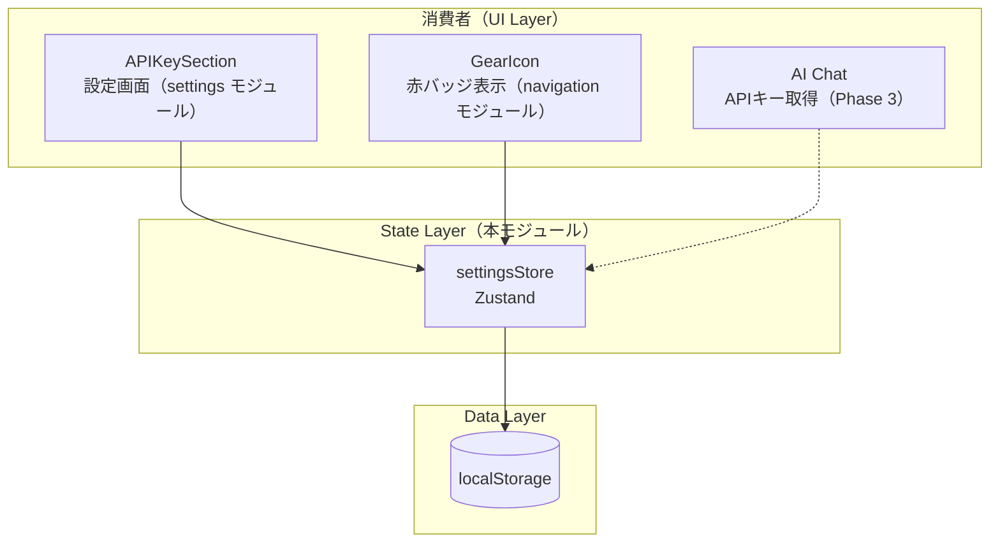

# APIキー管理

**関連 Spec:** [index_spec.md](index_spec.md)
**関連 PRD:** [index.md](../../requirement/api-key/index.md)

---

# 1. 実装ステータス

**ステータス:** 🔴 未実装

| モジュール/機能 | ステータス | 備考 |
|-------------|--------|------|
| settingsStore | 🔴 未実装 | Zustand ストア（APIキー永続化） |
| loadApiKey 初期化 | 🔴 未実装 | アプリ起動時の localStorage 読み込み |

---

# 2. 設計目標

- **シンプルなストア**: APIキーは単一の文字列値であり、Zustand の `create()` で直接 localStorage を操作する。persist ミドルウェアは使用しない
- **React 非依存の永続化**: localStorage 操作は Zustand ストア内で完結させ、React コンポーネントに永続化の詳細を漏らさない
- **安全なデフォルト**: localStorage アクセスの全箇所を try-catch で保護し、失敗時は空文字列にフォールバックする（T-002）
- **複数消費者対応**: 設定画面（APIKeySection）、navigation（GearIcon バッジ）、将来の AI チャットから参照される共有ストア

---

# 3. 技術スタック

| 領域 | 採用技術 | 選定理由 |
|------|--------|--------|
| 言語 | TypeScript (.ts) | T-001: TypeScript strict mode |
| 状態管理 | Zustand ^5 | A-001: Library-First。プロジェクト標準の状態管理ライブラリ |
| データ永続化 | localStorage（直接操作） | A-002: Client-Only Architecture。B-001: Privacy-by-Design |

---

# 4. アーキテクチャ

## 4.1. システム構成図



## 4.2. モジュール分割

### State Layer

| モジュール名 | 責務 | 依存関係 | 配置場所 |
|-----------|------|---------|--------|
| settingsStore | APIキーの保存・削除・読み込み。`hasApiKey` 派生値の公開 | なし（localStorage 直接操作） | `src/stores/settingsStore.ts` |

### 既存モジュールの変更

| モジュール名 | 変更内容 | 配置場所 |
|-----------|---------|--------|
| ルートレイアウト | アプリ起動時に `loadApiKey()` を呼び出す初期化処理を追加 | `src/routes/__root.tsx` |

> **Note**: UIコンポーネント（APIKeySection 等）は [settings/index_design.md](../settings/index_design.md) で定義。本モジュールは State Layer のみを担当する。

---

# 5. データモデル

```typescript
// localStorage キー
const STORAGE_KEY = 'gymini:api-key'

// 保存形式: プレーンテキスト（文字列）
// JSON ではなく、APIキー文字列をそのまま保存する
// 例: "AIzaSyB1234567890abcdefghijklmnop"

// ストア状態型
type SettingsState = {
  apiKey: string       // APIキー文字列（未設定時は ''）
  hasApiKey: boolean   // 派生値: apiKey !== ''
}

type SettingsActions = {
  setApiKey: (key: string) => void
  deleteApiKey: () => void
  loadApiKey: () => void
}
```

---

# 6. インターフェース定義

```typescript
// settingsStore (src/stores/settingsStore.ts)

import { create } from 'zustand'

const STORAGE_KEY = 'gymini:api-key'

type SettingsState = {
  apiKey: string
  hasApiKey: boolean
}

type SettingsActions = {
  setApiKey: (key: string) => void
  deleteApiKey: () => void
  loadApiKey: () => void
}

export const useSettingsStore = create<SettingsState & SettingsActions>()(
  (set) => ({
    apiKey: '',
    hasApiKey: false,

    setApiKey: (key: string) => {
      if (key === '') {
        throw new Error('空文字列は setApiKey に渡せません。削除には deleteApiKey() を使用してください。')
      }
      try {
        localStorage.setItem(STORAGE_KEY, key)
      } catch {
        // T-002: localStorage 書き込み失敗時も状態は更新する
      }
      set({ apiKey: key, hasApiKey: true })
    },

    deleteApiKey: () => {
      try {
        localStorage.removeItem(STORAGE_KEY)
      } catch {
        // T-002: localStorage 削除失敗時も状態はリセットする
      }
      set({ apiKey: '', hasApiKey: false })
    },

    loadApiKey: () => {
      try {
        const key = localStorage.getItem(STORAGE_KEY) ?? ''
        set({ apiKey: key, hasApiKey: key !== '' })
      } catch {
        // T-002: localStorage 読み取り失敗時はデフォルト
        set({ apiKey: '', hasApiKey: false })
      }
    },
  })
)
```

### 初期化の呼び出し

```typescript
// src/routes/__root.tsx（既存ファイルへの追加）
// ルートレイアウトの useEffect で loadApiKey を呼び出す

import { useSettingsStore } from '../stores/settingsStore'

function RootLayout() {
  const loadApiKey = useSettingsStore((s) => s.loadApiKey)

  useEffect(() => {
    loadApiKey()
  }, [loadApiKey])

  // ...existing layout code
}
```

---

# 7. 非機能要件実現方針

| 要件 | 実現方針 |
|------|--------|
| セキュリティ（NFR-001）: APIキーの保護 | settingsStore が localStorage のみで永続化。外部通信パスなし。APIキーを使用するのは Phase 3 の Gemini API 呼び出し時のみ |
| 堅牢性（NFR-002）: localStorage エラー耐性 | `setApiKey` / `deleteApiKey` / `loadApiKey` の全3メソッドで try-catch。失敗時はストア状態のみ更新（localStorage は best-effort） |

---

# 8. テスト戦略

| テストレベル | 対象 | カバレッジ目標 | 対応FR |
|-----------|------|------------|--------|
| ユニットテスト | settingsStore.setApiKey | 正常保存、空文字保存、localStorage エラー時 | FR-001 |
| ユニットテスト | settingsStore.loadApiKey | キー存在時、キー不在時、localStorage エラー時 | FR-002, FR-006 |
| ユニットテスト | settingsStore.deleteApiKey | 正常削除、localStorage エラー時 | FR-003 |
| ユニットテスト | settingsStore.hasApiKey | setApiKey 後に true、deleteApiKey 後に false、空文字時に false | FR-004 |

### テストの実装方針

- localStorage のモック: `vi.spyOn(Storage.prototype, 'setItem')` 等で localStorage をスパイ / モック
- Zustand ストアのリセット: 各テスト前に `useSettingsStore.setState({ apiKey: '', hasApiKey: false })` でリセット
- エラーケース: `vi.spyOn(Storage.prototype, 'getItem').mockImplementation(() => { throw new Error('QuotaExceeded') })` でエラー時のフォールバックを検証

---

# 9. 設計判断

## 9.1. 決定事項

| 決定事項 | 選択肢 | 決定内容 | 理由 |
|---------|--------|--------|------|
| 永続化アプローチ | Zustand persist ミドルウェア vs localStorage 直接操作 | localStorage 直接操作 | APIキーは単一文字列。persist ミドルウェアは JSON シリアライズ・デシリアライズを行うが、プレーンテキスト保存で十分。オーバーヘッドを避ける |
| ストア名 | `apiKeyStore` vs `settingsStore` | `settingsStore` | APIキーは設定ドメインに属する。将来の設定項目追加（テーマ、通知等）にも対応可能な命名。設定画面モジュール（[settings](../settings/index_design.md)）との統合を考慮 |
| 保存形式 | JSON vs プレーンテキスト | プレーンテキスト | APIキーは単一文字列。JSON.parse/stringify のオーバーヘッドと T-002（パースエラーハンドリング）の複雑さを回避 |
| APIキーの保存タイミング | onChange 即保存 vs 保存ボタン | onChange 即保存 | `setApiKey` が呼ばれた時点で localStorage に書き込む。UI側（APIKeySection）が onChange ハンドラで呼び出す想定。ユーザーが保存ボタンを探す手間を省く |
| 初期化タイミング | ストア作成時（モジュールロード時） vs useEffect | useEffect（ルートレイアウト） | ストア作成時の localStorage アクセスは SSR 互換性の問題がある。useEffect で明示的に呼び出すことで、ブラウザ環境を保証する |
| `set` と localStorage の順序 | localStorage → set vs set → localStorage | localStorage → set（setApiKey）、set のみ（エラー時） | 永続化が成功した場合のみ状態が正確に反映される。ただし localStorage エラー時もユーザー体験を優先して状態は更新する |

## 9.2. 未解決の課題

*未解決の課題なし（実装開始可能）*
