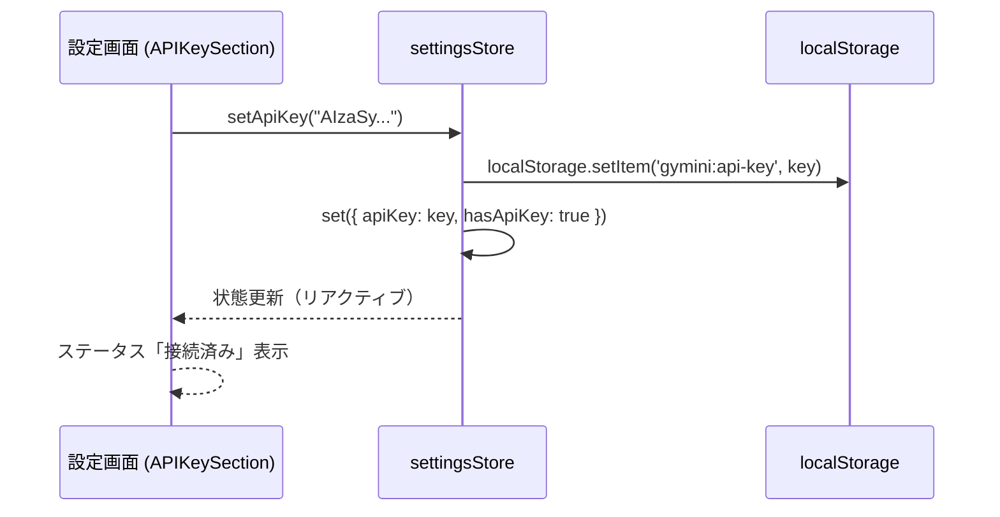
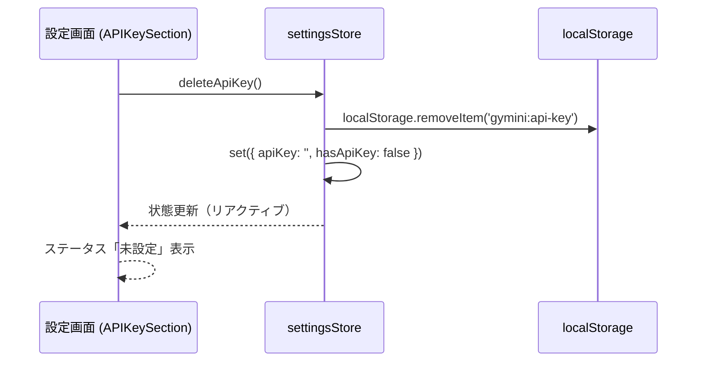
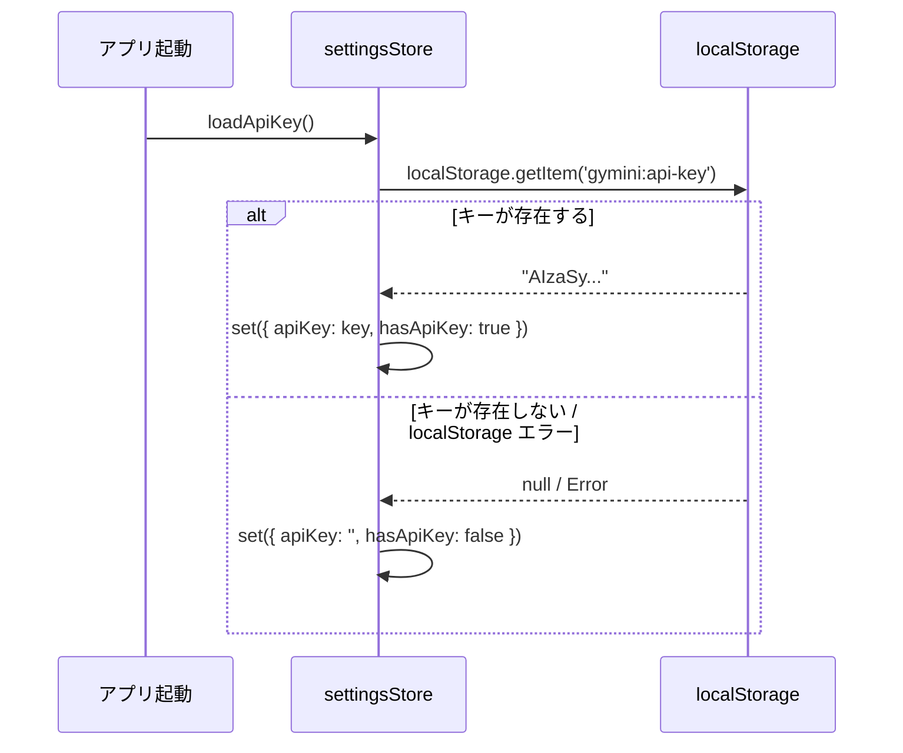
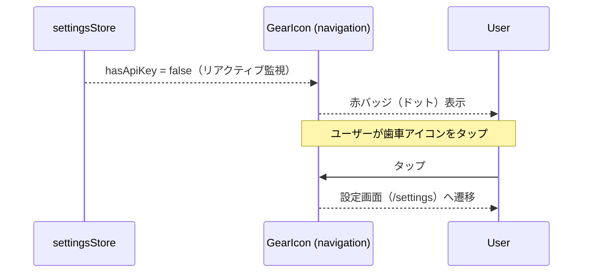

# APIキー管理

**関連 Design Doc:** [index_design.md](index_design.md)
**関連 PRD:** [index.md](../../requirement/api-key/index.md)

---

# 1. 背景

gymini は Gemini API を利用した AI コーチング機能（Phase 3）を提供する。AI 機能の前提として、ユーザーが自身の Gemini APIキーをブラウザに保存する BYOK（Bring Your Own Key）モデルを採用する。

APIキー管理モジュールが独立して必要な理由：

- APIキーの永続化ロジック（localStorage への保存・読み込み・削除）を単一モジュールに集約し、設定画面（[index_spec.md](../settings/index_spec.md)）や GearIcon バッジ（[navigation_spec.md](../navigation_spec.md)）など複数の消費者から利用可能にする
- Phase 3 の AI チャット機能（[ai-chat](../../requirement/ai-chat/index.md)）が Gemini API 呼び出し時にAPIキーを取得する統一的なインターフェースを提供する
- セキュリティ制約（B-001: APIキーを localStorage にのみ保存し外部送信しない）の遵守を本モジュールに集約する

# 2. 概要

APIキー管理機能は以下の責務を持つ：

- **永続化**: Gemini APIキーを localStorage に保存・読み込み・削除する
- **状態公開**: APIキーの設定状態（設定済み / 未設定）を他モジュールに公開する
- **表示制御**: APIキーの表示 / マスク切替のための値を提供する

設計原則：

- **単一責任**: APIキーの永続化と状態管理のみを担当。UIレンダリングは設定画面モジュールに委譲する
- **Privacy-by-Design**: APIキーは localStorage にのみ保存し、Gemini API エンドポイント以外に送信しない（B-001）
- **安全なデフォルト**: APIキー未設定時はすべての操作が安全にフォールバックする（T-002）

# 3. 要求定義

## 3.1. 機能要件 (Functional Requirements)

| ID | 要件 | 優先度 | PRD参照 | 検証方法 |
|----|------|--------|---------|---------|
| FR-001 | APIキーを localStorage に保存できる | 必須 | FR_008 | Test |
| FR-002 | 保存済みのAPIキーを localStorage から読み込める | 必須 | FR_008 | Test |
| FR-003 | 保存済みのAPIキーを localStorage から削除できる | 必須 | FR_008 | Test |
| FR-004 | APIキーの設定状態（設定済み / 未設定）を派生値として公開する（navigation GearIcon 赤バッジにも使用） | 必須 | FR_010, FR_022 | Test |
| FR-005 | APIキーの表示 / 非表示（パスワードマスク）切替を可能にする | 必須 | FR_009 | Test |
| FR-006 | アプリ起動時に localStorage から保存済みAPIキーを自動読み込みする | 必須 | FR_008 | Test |

> **Note (FR-005)**: 表示 / 非表示の切替ロジック（`visible` 状態）はUIレイヤーのローカルステートで管理する。本モジュールはAPIキーの生値を提供し、マスク表示の判断はUIに委ねる。

## 3.2. 非機能要件 (Non-Functional Requirements)

| ID | カテゴリ | 要件 | 目標値 | 検証方法 |
|----|--------|------|--------|---------|
| NFR-001 | セキュリティ | APIキーが localStorage 以外に送信されないこと | Gemini API エンドポイント以外へのネットワーク送信なし | Test |
| NFR-002 | 堅牢性 | localStorage アクセス失敗時にランタイムエラーが発生しないこと | try-catch によるフォールバック | Test |

# 4. API

APIキー管理機能が外部（他モジュール・UIレイヤー）に公開するインターフェース。

| モジュール | インターフェース | メンバー | 概要 |
|---------|--------------|--------|------|
| api-key | settingsStore | apiKey | 保存済みAPIキー文字列。未設定時は空文字列 |
| api-key | settingsStore | hasApiKey | APIキーが設定済みかどうかの派生値（`boolean`） |
| api-key | settingsStore | setApiKey(key) | APIキーを localStorage に保存し、ストア状態を更新する。空文字列（`''`）が渡された場合は内部で削除扱いとなり `deleteApiKey()` と同等の動作をする（明示的削除は `deleteApiKey()` 推奨）|
| api-key | settingsStore | deleteApiKey() | APIキーを localStorage から削除し、ストア状態をリセットする |
| api-key | settingsStore | loadApiKey() | localStorage から保存済みAPIキーを読み込み、ストア状態を反映する |

> **Note**: ストア名 `settingsStore` は設定画面との統合を考慮した命名。APIキーは現時点で唯一の設定値であるため、独立した `apiKeyStore` ではなく `settingsStore` として設定ドメインに統合する。将来の設定項目追加にも対応可能。

## 4.1. 型定義

```typescript
// settingsStore の状態
type SettingsState = {
  apiKey: string       // APIキー文字列（未設定時は空文字列）
  hasApiKey: boolean   // 派生値: apiKey !== ''
}

// settingsStore のアクション
type SettingsActions = {
  setApiKey: (key: string) => void    // 保存（localStorage + ストア更新）。空文字列が渡された場合は内部で削除扱い（deleteApiKey と同等）
  deleteApiKey: () => void            // 削除（localStorage + ストアリセット）
  loadApiKey: () => void              // 読み込み（localStorage → ストア反映）
}
```

# 5. 用語集

| 用語 | 説明 |
|------|------|
| BYOK | Bring Your Own Key。ユーザーが自身の Gemini APIキーを持ち込むモデル |
| APIキー | Gemini API へのアクセスに必要な認証キー。ユーザーが Google AI Studio で取得する |
| パスワードマスク | APIキーを `●●●●●●●●` で非表示にする表示モード。目アイコンで切替 |
| 接続ステータス | APIキーの設定状態を示す表示。`connected`（接続済み）または `not-set`（未設定） |

# 6. 使用例

## シナリオ1: APIキーの保存（FR-001）

```
1. ユーザーが設定画面のAPIキー入力フィールドにキーを入力
2. settingsStore.setApiKey("AIzaSy...")
   → localStorage に保存
   → hasApiKey が true に更新
3. 設定画面のステータスバッジが「接続済み」に変化
4. GearIcon の赤バッジが非表示になる
```

## シナリオ2: アプリ起動時の自動読み込み（FR-006）

```
1. ユーザーがアプリを開く
2. settingsStore.loadApiKey()
   → localStorage.getItem('gymini:api-key') を実行
3a. キーが存在する場合: apiKey にセット、hasApiKey = true
3b. キーが存在しない場合: apiKey = '', hasApiKey = false
4. GearIcon が hasApiKey を参照して赤バッジの表示/非表示を決定
```

## シナリオ3: APIキーの削除（FR-003）

```
1. ユーザーが設定画面の削除ボタンをタップ
2. settingsStore.deleteApiKey()
   → localStorage.removeItem('gymini:api-key')
   → apiKey = '', hasApiKey = false
3. 設定画面のステータスバッジが「未設定」に変化
4. GearIcon の赤バッジが表示される
```

## シナリオ4: AI チャットからのAPIキー参照（Phase 3）

```
1. AI チャット機能が Gemini API を呼び出す前にキーを取得
2. const { apiKey, hasApiKey } = useSettingsStore()
3a. hasApiKey === true: apiKey を使って Gemini API を呼び出す
3b. hasApiKey === false: エラー表示（「APIキーを設定してください」）
```

# 7. 振る舞い図

## 7.1. APIキー保存フロー



## 7.2. APIキー削除フロー



## 7.3. アプリ起動時の読み込みフロー



## 7.4. APIキー未設定時の警告フロー



# 8. 制約事項

- APIキーは localStorage にのみ保存する。外部サーバー・中間サーバー・第三者サービスに送信しない（B-001）
- APIキーの用途は Gemini API エンドポイントへの通信のみに限定する（prd-api-key セキュリティ制約）
- APIキーのバリデーション（Gemini API への接続テスト）は Phase 3（AI チャット）で実装する。Phase 2 では保存・削除・状態管理のみ
- `APIKeyStatus` 型（`'connected' | 'not-set'`）はUIレイヤー（設定画面モジュール）で定義する。`'error'` 状態の追加は Phase 3 スコープ
- localStorage アクセスは try-catch で保護し、失敗時は安全なデフォルト値にフォールバックする（T-002）
- TypeScript strict mode を遵守する（T-001）
- ストレージキーは `'gymini:api-key'` を使用する

---

## PRD整合性確認

| PRD要求ID | 要件 | Spec対応箇所 |
|----------|------|------------|
| FR_008 | APIキーの入力・保存・削除 | FR-001, FR-002, FR-003, FR-006, settingsStore.setApiKey/deleteApiKey/loadApiKey |
| FR_009 | APIキーの表示/非表示トグル | FR-005（UIレイヤーの `visible` ローカルステートに委譲。本モジュールは生値を提供） |
| FR_010 | APIキー未設定時の警告表示 | FR-004, settingsStore.hasApiKey（GearIcon が参照して赤バッジを表示） |

### CONSTITUTION.md 原則準拠

| 原則ID | 原則名 | 準拠状況 |
|--------|--------|---------|
| B-001 | Privacy-by-Design | 準拠: APIキーは localStorage にのみ保存。Gemini API 以外への送信禁止（Section 8） |
| A-002 | Client-Only Architecture | 準拠: クライアントサイドで完結。バックエンドなし |
| T-001 | TypeScript Strict Mode | 準拠: 型定義で `any` 型を使用しない（Section 4.1） |
| T-002 | No Runtime Errors | 準拠: localStorage アクセスは try-catch で保護（NFR-002, Section 8） |
