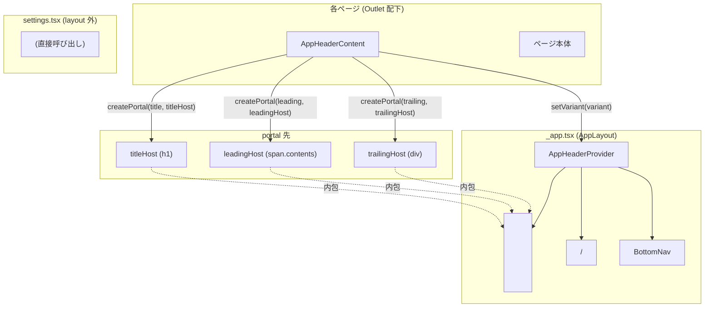

# アプリヘッダー（AppHeader）

**関連 Spec:** [app-header_spec.md](app-header_spec.md)
**関連 PRD:** [app-header.md](../requirement/app-header.md)

---

# 1. 実装ステータス

**ステータス:** 🟢 実装済み

| モジュール/機能 | ステータス | 備考 |
|---|---|---|
| `AppHeader` コンポーネント | 🟢 実装済み | layout 外（Settings）で直接利用 |
| `AppHeaderProvider` | 🟢 実装済み | `_app.tsx` に統合済み |
| `AppHeaderContent` | 🟢 実装済み | 各画面が portal 経由で content を注入 |
| `GearIcon` の `inline` variant | 🟢 実装済み | trailing slot 内で使用 |
| `TimerPill` | 🟢 実装済み | `session-active` trailing に配置 |
| `useHydrated` ガード | 🟢 実装済み | `_app.tsx` で rehydration 完了まで render を遅延 |
| `APP_HEADER_VARIANT_HEIGHT` 定数 | 🟢 実装済み | `AppHeader.tsx` でエクスポートし `AppHeaderContext.tsx` が共有 |

---

# 2. 設計目標

- **DOM 単一インスタンス**: ヘッダーを1度だけマウントし、画面遷移時に DOM が再生成されないようにする
- **JSX 直接渡し**: portal に React ノードをそのまま渡すことで、`elapsedSeconds` のような動的値が通常の React render flow で自動的に更新される
- **テスタビリティ**: `AppHeader`（プレゼンテーショナル）と `AppHeaderProvider`（状態管理 + DOM 注入）を分離し、各々を独立してテストできる
- **視覚仕様の単一所有者**: 高さ・背景・border は `AppHeaderProvider` が持つ。画面側は content のみを宣言する

---

# 3. 技術スタック

| 領域 | 採用技術 | 選定理由 |
|---|---|---|
| コンテンツ注入 | `React.createPortal` | 各画面の JSX を DOM 上の別ノード（ヘッダー内 host）に再配置する。Context の `children` として渡すより DOM 位置を明示的に制御できる |
| host node 取得 | `useState` + ref callback | `useRef` では DOM が確定するタイミングで再 render がトリガーされないため、`useState<HTMLElement | null>` + `ref={setXxxHost}` で host 確定時に portal を発火させる |
| 状態共有 | `React.createContext` | ProviderScope内の任意の深さから `AppHeaderContent` がホストを参照できる |
| 高さ定数共有 | `APP_HEADER_VARIANT_HEIGHT` (exported const) | `AppHeader.tsx` と `AppHeaderContext.tsx` の両方が同じ variant→クラス対応を使うため、単一の定数としてエクスポートして重複を排除 |
| スタイリング | Tailwind CSS | デザインシステム準拠（DC_006） |
| アイコン | `@phosphor-icons/react` | design-system.html が Phosphor Icons を規定（A-001） |

---

# 4. アーキテクチャ

## 4.1. システム構成図



## 4.2. モジュール分割

| モジュール名 | 責務 | 依存関係 | 配置場所 |
|---|---|---|---|
| `AppHeader` | プレゼンテーショナルコンポーネント。`title`/`leading`/`trailing`/`variant`/`sticky` を props で受け取り `<header>` を描画 | なし | `src/components/AppHeader.tsx` |
| `APP_HEADER_VARIANT_HEIGHT` | variant → Tailwind クラス のマッピング定数 | なし | `src/components/AppHeader.tsx`（エクスポート） |
| `AppHeaderProvider` | Context Provider。`<header>` を1度だけ render し、各 slot の host DOM node を `useState` + ref callback で管理する | `AppHeader.tsx` の定数 | `src/components/AppHeaderContext.tsx` |
| `AppHeaderContent` | 各ページが render するスロット宣言コンポーネント。`createPortal` で `title`/`leading`/`trailing` を host に注入し、`useEffect` で `variant` を Context に伝播する | `AppHeaderContext.tsx` | `src/components/AppHeaderContext.tsx` |
| `GearIcon` | 歯車アイコン。`variant: 'inline' | 'overlay'` で見た目を切り替え。APIキー未設定バッジを内包 | `settingsStore`, TanStack Router `Link` | `src/components/GearIcon.tsx` |
| `TimerPill` | 経過時間（HH:MM:SS）表示。`elapsedSeconds: number` を受け取り `formatElapsedTime` で整形 | `formatElapsedTime` | `src/components/workout/TimerPill.tsx` |

---

# 5. データモデル

```typescript
// src/components/AppHeader.tsx
export type AppHeaderVariant = 'default' | 'session-active' | 'modal'

export type AppHeaderProps = {
  title: string
  leading?: React.ReactNode
  trailing?: React.ReactNode
  variant?: AppHeaderVariant   // default: 'default'
  sticky?: boolean             // default: true
  className?: string
}

export const APP_HEADER_VARIANT_HEIGHT: Record<AppHeaderVariant, string> = {
  default: 'h-14',
  'session-active': 'min-h-14 py-2',
  modal: 'h-14',
}

// src/components/AppHeaderContext.tsx — Context 内部型
type ContextValue = {
  setTitleHost: (el: HTMLElement | null) => void
  setLeadingHost: (el: HTMLElement | null) => void
  setTrailingHost: (el: HTMLElement | null) => void
  titleHost: HTMLElement | null
  leadingHost: HTMLElement | null
  trailingHost: HTMLElement | null
  variant: AppHeaderVariant
  setVariant: (v: AppHeaderVariant) => void
}

// src/components/AppHeaderContext.tsx — AppHeaderContent props
type AppHeaderContentProps = {
  title: string
  leading?: React.ReactNode
  trailing?: React.ReactNode
  variant?: AppHeaderVariant
}

// src/components/GearIcon.tsx
export type GearIconVariant = 'overlay' | 'inline'
type GearIconProps = { className?: string; variant?: GearIconVariant }
```

---

# 6. インターフェース定義

```typescript
// -------------------------------------------------------
// src/routes/_app.tsx — AppHeaderProvider の統合
// -------------------------------------------------------

function AppLayout() {
  const hydrated = useHydrated()

  if (!hydrated) {
    return <div className="min-h-screen bg-zinc-50" />
  }

  return (
    <AppHeaderProvider>
      <main className="flex-1 pb-24">
        <Outlet />
      </main>
      <BottomNav />
    </AppHeaderProvider>
  )
}

// -------------------------------------------------------
// AppHeaderProvider — ヘッダー DOM の構造（簡略）
// -------------------------------------------------------

// <header role="banner" data-variant={variant} className={`sticky top-0 z-30 px-4 ${heightClass} ...`}>
//   <div className="flex items-center gap-2 min-w-0">
//     <span ref={setLeadingHost} className="contents" />   ← leading portal host
//     <h1  ref={setTitleHost} className="font-outfit ..." />  ← title portal host
//   </div>
//   <div ref={setTrailingHost} className="flex items-center gap-2 shrink-0" />  ← trailing portal host
// </header>

// -------------------------------------------------------
// AppHeaderContent — portal 発火ロジック（簡略）
// -------------------------------------------------------

function AppHeaderContent({ title, leading, trailing, variant = 'default' }: AppHeaderContentProps) {
  const ctx = useContext(AppHeaderContext)
  if (!ctx) throw new Error('<AppHeaderContent> must be rendered inside <AppHeaderProvider>')

  useEffect(() => {
    ctx.setVariant(variant)
    return () => { ctx.setVariant('default') }  // unmount 時に default へ戻す
  }, [ctx, variant])

  return (
    <>
      {ctx.titleHost && createPortal(title, ctx.titleHost)}
      {leading != null && ctx.leadingHost ? createPortal(leading, ctx.leadingHost) : null}
      {trailing != null && ctx.trailingHost ? createPortal(trailing, ctx.trailingHost) : null}
    </>
  )
}

// -------------------------------------------------------
// GearIcon — variant 別クラスマッピング
// -------------------------------------------------------

const VARIANT_CLASS: Record<GearIconVariant, string> = {
  overlay: 'bg-white/80 backdrop-blur-sm shadow-sm border border-zinc-100',
  inline:  'hover:bg-zinc-100/60',
}

// trailing slot 内での基本的な使い方（inline variant）
// <GearIcon />

// -------------------------------------------------------
// TimerPill — session-active trailing での使い方
// -------------------------------------------------------

// <TimerPill elapsedSeconds={elapsedSeconds} />
// → formatElapsedTime(n) で "00:05:23" 形式に整形して表示
```

---

# 7. 非機能要件実現方針

| 要件 | 実現方針 |
|---|---|
| アクセシビリティ（NFR-001）: `role="banner"` + `<h1>` | `AppHeaderProvider` が `<header role="banner">` を render し、`<h1>` を titleHost として確保。全画面で portal 経由のタイトルが `<h1>` 内に注入される |
| 操作性（NFR-002）: タップ領域 ≥ 44×44px | `GearIcon` は `min-h-[44px] min-w-[44px]` で視覚サイズ（36px）と独立したタップ領域を確保。trailing 内の raw `<button>` も同様に設定 |
| キーボード操作性（NFR-003）: `focus-ring` | `GearIcon`（`Link`）に `focus-ring` を付与。trailing 内の raw `<button>` にも適用。CLAUDE.md キーボードフォーカス規約に準拠 |
| 表示安定性（NFR-004）: hydration mismatch 防止 | `_app.tsx` で `useHydrated()` が `true` になるまでブランク（`<div className="min-h-screen bg-zinc-50" />`）を表示し、AppHeaderProvider のマウントを遅延 |
| 性能（NFR-005）: content 切替 ≤ 1フレーム | portal を用いることで DOM 上のヘッダーノードに直接 React ツリーを注入し、仮想 DOM の diff だけで更新が完結する。新しい `AppHeaderContent` の mount で即時反映 |

---

# 8. テスト戦略

| テストレベル | 対象 | 主な検証内容 |
|---|---|---|
| コンポーネントテスト | `AppHeader` | variant 別の高さクラス・`data-variant` 属性・`role="banner"`・leading/trailing slot 描画 |
| コンポーネントテスト | `AppHeaderProvider` + `AppHeaderContent` | portal による title/leading/trailing の注入、variant 切替、unmount 時の default 復帰 |
| コンポーネントテスト | `AppHeaderContent`（Provider 外） | `throw new Error` の発生確認 |
| コンポーネントテスト | `GearIcon` | バッジ表示（`hasApiKey = false`）、`inline`/`overlay` variant クラス、`focus-ring` 付与 |
| コンポーネントテスト | `TimerPill` | `formatElapsedTime` の結果が描画されること |
| 統合テスト | `AppLayout` + `AppHeaderContent` | 画面遷移時の content 切替（title 更新・variant 更新） |
| 統合テスト | `SettingsPage` + `AppHeader` (direct) | `variant="modal"` で X ボタンが trailing に表示されること |

---

# 9. 設計判断

## 9.1. 決定事項

| 決定事項 | 選択肢 | 決定内容 | 理由 |
|---|---|---|---|
| content 注入方式 | ① Context + `children` で JSX を prop drilling / ② React Portal / ③ Zustand store でシリアライズ | React Portal（`createPortal`） | prop drilling は `_app.tsx` に全画面の JSX が集まるため保守性が低い。Zustand は React ノードのシリアライズが不可能。Portal は DOM 位置を明示的に制御しつつ通常の React render flow を維持でき、`elapsedSeconds` などの動的値も追加の購読なしに更新される |
| host node 管理方式 | `useRef<HTMLElement>` vs `useState<HTMLElement \| null>` + ref callback | `useState` + ref callback（`setTitleHost` 等） | `useRef` は値の変化で再 render がトリガーされない。host が確定（`null` → `HTMLElement`）したタイミングで `AppHeaderContent` が portal を発火する必要があるため、`useState` による再 render が必須 |
| variant 管理場所 | AppHeaderContent props を直接 Provider に渡す vs Context の state として保持 | Context の state（`setVariant`） | ヘッダーは1度だけマウントされており `<header>` の className を動的に変える唯一の方法は Provider 自身の state を更新することである |
| `leading` の host 要素 | `<div>` vs `<span className="contents">` | `<span className="contents">` | `contents` により span 自体はレイアウトボックスを持たず、`<div class="flex items-center gap-2">` の flex children として leading の JSX ノードが直接参加できる。`<div>` にすると不要なブロックボックスが生まれ gap が乱れる |
| `APP_HEADER_VARIANT_HEIGHT` の配置 | `AppHeaderContext.tsx` 内に定義 vs `AppHeader.tsx` でエクスポート | `AppHeader.tsx` でエクスポートし両ファイルが共有 | `AppHeader`（layout 外）と `AppHeaderProvider`（layout 内）の両方が同じ variant クラスを使う必要があるため、定数の単一所有者を `AppHeader.tsx` に置き循環参照を回避 |
| GearIcon variant | `overlay`（白背景・shadow）vs `inline`（ホバー背景のみ） | trailing slot 内では `inline`（default）を採用 | ヘッダー背景が `bg-white/80 backdrop-blur-xl` のため `overlay` の白背景は視覚的に二重になる。`inline` は hover 時のみ背景色が付くため chrome に自然に溶け込む |
| Settings 画面の AppHeader | `AppHeaderProvider` 配下に移動 vs `<AppHeader>` を直接呼び出す | `<AppHeader>` を直接呼び出す（現行維持） | `settings.tsx` は `_app` layout 外に配置されており（navigation_spec 制約を継承）、BottomNav を非表示にする構造と不可分。AppHeaderProvider への移動は layout-route の再設計が必要であり、現時点では spec の要件（AH-FR-006）通り直接呼び出しで十分 |

## 9.2. 未解決の課題

*未解決の課題なし*

---

# 10. 変更履歴

## v1.0 (2026-04-30) — 初版

**変更内容:**

- `AppHeader`（プレゼンテーショナル）+ `AppHeaderProvider`/`AppHeaderContent`（portal ベース）の二系統実装
- navigation_design.md の GearIcon 配置（各ページ `absolute` 配置）から trailing slot 経由に移行
- `SessionHeader` を廃止し、trailing slot 内の `TimerPill` + 終了ボタン + `GearIcon` に置換

**移行ガイド:**

```tsx
// ❌ 旧（navigation v3.0: 各ページが absolute 配置）
// IdleView.tsx / HistoryPage.tsx
<GearIcon className="absolute top-12 right-4 z-30" />

// ❌ 旧（FRAME2: SessionHeader）
// SessionHeader が歯車 + 終了 + タイマーを absolute で配置
<SessionHeader elapsedSeconds={n} onEnd={endSession} />

// ✅ 新（AppHeaderContent + trailing slot 経由）
// HistoryPage.tsx
<AppHeaderContent title="履歴" trailing={<GearIcon />} />

// TrainingPage.tsx (session-active)
<AppHeaderContent
  title="セッション中"
  variant="session-active"
  trailing={
    <>
      <TimerPill elapsedSeconds={elapsedSeconds} />
      <button type="button" onClick={endSession} className="focus-ring ...">終了</button>
      <GearIcon />
    </>
  }
/>

// SettingsPage.tsx (layout 外 — 変更なし)
<AppHeader
  title="設定"
  variant="modal"
  trailing={
    <button type="button" onClick={handleClose} aria-label="閉じる" className="focus-ring ...">
      <X size={16} weight="bold" />
    </button>
  }
/>
```
