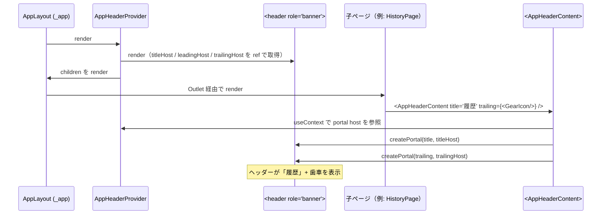
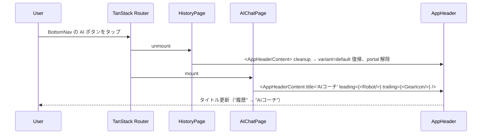
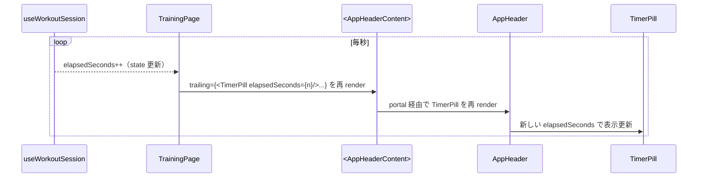

# アプリヘッダー（AppHeader）

**関連 PRD:** [app-header.md](../requirement/app-header.md)

**関連 Spec:** [navigation_spec.md](navigation_spec.md)

---

# 1. 背景

gymini は5つの論理画面（FRAME1〜5）を持つモバイルファースト Web アプリである。BottomNav（IR_001）は再利用可能コンポーネントとして `_app.tsx` に1度だけマウントされ、画面遷移時にも DOM が維持される。

一方、各画面の上部 chrome（ヘッダー領域）は次のように ad-hoc に実装されていた:

- `IdleView` / `HistoryPage`: 各画面が `pt-16` を確保し、`<GearIcon className="absolute top-12 right-4 z-30" />` を浮かせて配置
- `SessionHeader`: アクティブセッション中の歯車・終了ボタン・タイマーを `absolute top-12 right-4` に配置する独自コンポーネント
- `AIChatPage`: 浮かせた `<GearIcon>` と独自 `<header sticky>` の二重配置（視覚ノイズ）
- `SettingsPage`: タイトル無し、X ボタンを `absolute top-12 right-4` に浮かせる

この結果、以下の課題が顕在化していた:

- 高さ・余白の微妙な不揃い
- 同じ要素（歯車アイコン）が複数箇所で再配置される
- タイトル（`<h1>`）が AIChatPage にしかなく、アクセシビリティが不十分
- 新規画面追加時に chrome のコピペが発生

# 2. 概要

AppHeader は以下の責務を持つ:

- **chrome の単一規定**: BottomNav と対称な構造で、全画面に共通の上部 chrome を提供
- **タイトル必須表示**: 全画面で `<h1>` タイトルを表示し、現在地のセマンティクスを明示
- **slot ベースの拡張**: `leading`（左アイコン）/ `trailing`（右の操作ボタン群）を各画面が任意に提供
- **3 variant の高さ制御**: `default` / `session-active` / `modal` で高さと装飾を切り替え
- **layout 内外の二系統対応**: AppLayout 内の画面（FRAME1〜4）は context 経由で content を登録、layout 外の Settings は `<AppHeader>` を直接呼び出す

設計原則:

- **構造的な単一性**: AppHeader 本体は1度だけマウント。画面ごとの内容差分は portal で注入
- **JSX による直接的な reactivity**: 状態のシリアライズや明示的な購読は不要。React の通常の render flow が timer 等の動的内容を伝搬
- **レイアウトの不変条件**: 高さ・背景・境界は AppHeader が所有し、画面側は内容のみを宣言する

# 3. 要求定義

## 3.1. 機能要件 (Functional Requirements)

| ID | 要件 | 優先度 | PRD参照 | 検証方法 |
|----|------|--------|---------|---------|
| AH-FR-001 | AppHeader は AppLayout（`_app.tsx`）に1度だけマウントされ、FRAME1〜4 の遷移時にも DOM が維持される | 必須 | IR_003 | Inspection |
| AH-FR-002 | 全画面でタイトル（`<h1>`）を必須表示する | 必須 | IR_004 | Test |
| AH-FR-003 | leading（左アイコン）/ trailing（右操作群）スロットを提供し、各画面が内容を渡せる | 必須 | IR_005 | Test |
| AH-FR-004 | `default`/`session-active`/`modal` の3 variant を提供し、高さと余白を切り替える | 必須 | IR_006 | Test |
| AH-FR-005 | session-active variant では `min-h-14 py-2` で複数要素（タイマー/終了/歯車）が trailing に並ぶことを許容する | 必須 | IR_006 | Test |
| AH-FR-006 | 設定画面（FRAME5、layout 外）は `<AppHeader>` を直接呼び出し `variant="modal"` で X 閉じるボタンを trailing に配置する | 必須 | IR_007 | Test |
| AH-FR-007 | 歯車アイコン（IR_002）は AppHeader の trailing slot 経由で表示する。各画面が浮かせた `<GearIcon>` を直接配置することは禁止する | 必須 | IR_002, IR_005 | Inspection |
| AH-FR-008 | 画面側は React Context + portal を介して content を登録する。`<AppHeaderContent>` が unmount されたら header content は default（空）に戻る | 必須 | IR_003 | Test |
| AH-FR-009 | session-active variant の trailing 要素には `<TimerPill>` が含まれ、`elapsedSeconds` の更新が毎秒 portal 経由で反映される | 必須 | IR_006 | Test |
| AH-FR-010 | 動的な variant 切り替え（例: Idle → Active）に追従し、unmount 時に default variant へ戻る | 必須 | IR_006 | Test |

## 3.2. 非機能要件 (Non-Functional Requirements)

| ID | カテゴリ | 要件 | 目標値 | 検証方法 |
|----|--------|------|--------|---------|
| AH-NFR-001 | アクセシビリティ | ヘッダーは `role="banner"` を持ち、タイトルは `<h1>` でマークアップされる | 全画面で WAI-ARIA 準拠 | Inspection |
| AH-NFR-002 | 操作性 | trailing 内の操作要素はタップ領域 ≥ 44×44px を確保する（T-003） | 44×44px | Inspection |
| AH-NFR-003 | キーボード操作性 | trailing の raw `<button>` には `focus-ring` ユーティリティを適用する（CLAUDE.md） | focus-visible 時にリング表示 | Inspection |
| AH-NFR-004 | 表示安定性 | hydration 完了前にヘッダーを表示しない（`useHydrated`）| ブランク表示で hydration mismatch を回避 | Test |
| AH-NFR-005 | 性能 | 画面遷移時の content 切替は1フレーム（16ms@60fps）以内で完了する | 16ms | Test |

# 4. API

AppHeader 機能が外部（UIレイヤー・他モジュール）に公開するインターフェース。

| pkg | class（ファイル名）| member | 概要 |
|-----|------|--------|------|
| components | AppHeader | (component) | layout 外で直接利用するプレゼンテーショナルコンポーネント。Settings ページで使用 |
| components | AppHeaderProvider | (component) | AppLayout 内部に配置し header の単一インスタンスをマウント。children から portal 経由で content を受け取る |
| components | AppHeaderContent | (component) | layout 配下の各画面が render する slot コンポーネント。`title` / `leading` / `trailing` / `variant` を受け取り、内部で portal を実行 |
| components/workout | TimerPill | (component) | session-active 時の trailing に配置する経過時間表示。`elapsedSeconds: number` を受け取る |
| components | GearIcon | (component) | trailing slot 内で使用する歯車アイコン。`variant?: 'overlay' | 'inline'`（default `'inline'`）|

## 4.1. 型定義

```typescript
// AppHeader.tsx
export type AppHeaderVariant = 'default' | 'session-active' | 'modal'

export type AppHeaderProps = {
  title: string
  leading?: React.ReactNode
  trailing?: React.ReactNode
  variant?: AppHeaderVariant   // default 'default'
  sticky?: boolean             // default true
  className?: string
}

// AppHeaderContext.tsx
export function AppHeaderProvider(props: { children: React.ReactNode }): JSX.Element

export function AppHeaderContent(props: {
  title: string
  leading?: React.ReactNode
  trailing?: React.ReactNode
  variant?: AppHeaderVariant
}): JSX.Element

// GearIcon.tsx
export type GearIconVariant = 'overlay' | 'inline'
```

# 5. 用語集

| 用語 | 説明 |
|------|------|
| AppHeader | 全画面共通の上部 chrome を提供するプレゼンテーショナルコンポーネント |
| AppHeaderProvider | AppLayout 内部で AppHeader を1度だけマウントし、children に portal host を提供する Context Provider |
| AppHeaderContent | 各画面が render する slot コンポーネント。title / leading / trailing を portal で AppHeader に注入する |
| portal | React Portal。子コンポーネントの JSX を別の DOM ノードへ再配置する仕組み。本仕様では各画面の content をヘッダー側に注入する |
| variant | ヘッダーの高さと装飾のバリエーション。`default` / `session-active` / `modal` の3種 |
| TimerPill | session-active 時の trailing 内に配置する経過時間表示（HH:MM:SS）|
| trailing slot | ヘッダー右側に配置される操作ボタン群（歯車、終了、X など）の挿入位置 |
| leading slot | ヘッダー左側、タイトルの直前に配置される補助アイコン（例: AI チャットの Robot アイコン）|

# 6. 使用例

```tsx
// _app.tsx — AppLayout（FRAME1〜4 共通）
import { AppHeaderProvider } from '../components/AppHeaderContext'

function AppLayout() {
  const hydrated = useHydrated()
  if (!hydrated) return <div className="min-h-screen bg-zinc-50" />
  return (
    <AppHeaderProvider>
      <main className="flex-1 pb-24">
        <Outlet />
      </main>
      <BottomNav />
    </AppHeaderProvider>
  )
}

// HistoryPage.tsx — layout 配下の画面
function HistoryPage() {
  return (
    <>
      <AppHeaderContent title="履歴" trailing={<GearIcon />} />
      <div className="flex-1">{/* ... */}</div>
    </>
  )
}

// AIChatPage.tsx — leading + trailing
function AIChatPage() {
  return (
    <div className="flex flex-col min-h-screen bg-zinc-50">
      <AppHeaderContent
        title="AIコーチ"
        leading={<Robot size={20} weight="bold" />}
        trailing={<GearIcon />}
      />
      {/* ... */}
    </div>
  )
}

// TrainingPage.tsx — session-active variant + 動的な timer
function TrainingPage() {
  const { isActive, elapsedSeconds, endSession } = useWorkoutSession()
  if (isActive) {
    return (
      <>
        <AppHeaderContent
          title="セッション中"
          variant="session-active"
          trailing={
            <>
              <TimerPill elapsedSeconds={elapsedSeconds} />
              <button type="button" onClick={endSession} className="focus-ring ...">
                終了
              </button>
              <GearIcon />
            </>
          }
        />
        <ActiveSessionView />
      </>
    )
  }
  return (
    <>
      <AppHeaderContent title="トレーニング" trailing={<GearIcon />} />
      <IdleView onStartTraining={...} />
    </>
  )
}

// SettingsPage.tsx — layout 外。AppHeader を直接呼び出す
function SettingsPage() {
  const router = useRouter()
  const canGoBack = useCanGoBack()
  const handleClose = () => canGoBack ? router.history.back() : router.navigate({ to: '/training' })
  return (
    <div className="min-h-screen bg-zinc-50">
      <AppHeader
        title="設定"
        variant="modal"
        trailing={
          <button type="button" onClick={handleClose} aria-label="閉じる" className="focus-ring ...">
            <X size={16} weight="bold" />
          </button>
        }
      />
      <SettingsContent />
    </div>
  )
}
```

# 7. 振る舞い図

## 7.1. ヘッダーの単一マウントと portal 注入



## 7.2. 画面遷移時の content 切替



## 7.3. session-active variant とタイマー反応性



# 8. 制約事項

- AppHeaderProvider は `AppLayout` の hydration 完了後にのみ render される（`useHydrated`）。SSR 環境ではないが、Zustand persist の rehydration 中はブランク表示で対応する（NFR-004）
- AppHeaderContent は AppHeaderProvider 配下でのみ使用できる。配下でない場合は明示的にエラーを投げる
- 設定画面（FRAME5）は AppLayout 配下に配置しない（IR_007）。layout-route 構造は [navigation_spec.md](navigation_spec.md) 制約事項を継承
- 歯車アイコン（IR_002）は AppHeader の trailing slot 経由で表示することを必須とする。画面側で `absolute` 配置することは禁止
- 終了ボタン・タイマーpill（FRAME2）は TrainingPage が trailing slot 内に組み込む。SessionHeader コンポーネントは廃止
- variant `modal` は意味的マーカーとしての役割が中心であり、視覚的には default と同一（高さ h-14）
- 視覚スペック（高さ・色・タイポグラフィ）は AppHeader が単一の所有者となり、画面側からの上書きは `className` 経由で trailing/leading 内のみ許可する
- TypeScript strict mode を遵守（T-001）
- タップ領域は最低 44×44px（T-003）
- raw `<button>` には `focus-ring` を適用（CLAUDE.md キーボードフォーカス規約）

---

## PRD整合性確認

| PRD要求ID | 要件 | Spec対応箇所 |
|----------|------|------------|
| IR_003 | AppHeader の単一マウント | AH-FR-001, §6 使用例（_app.tsx） |
| IR_004 | タイトル必須表示 | AH-FR-002, §6 使用例 |
| IR_005 | leading / trailing スロット | AH-FR-003, §6 使用例 |
| IR_006 | variant（default/session-active/modal）| AH-FR-004, AH-FR-005, AH-FR-009, AH-FR-010 |
| IR_007 | 設定画面のスコープ | AH-FR-006, §6 SettingsPage 例 |
| IR_002 | 歯車アイコン（traces）| AH-FR-007（trailing slot 経由）|
| DC_006 | 視覚スペック | §8 制約事項 |

## navigation_spec との関係

| navigation_spec の要件 | 移譲先 |
|------------------------|--------|
| FR-009 歯車アイコン位置 | AH-FR-007（trailing slot 経由）へ移譲 |
| FR-011 FRAME2 の終了ボタン・タイマーpill | AH-FR-005, AH-FR-009 へ移譲 |

navigation_spec.md は引き続き BottomNav（IR_001）と GearIcon の機能要件（バッジ表示・遷移）を所有し、配置については本 spec を参照する。
