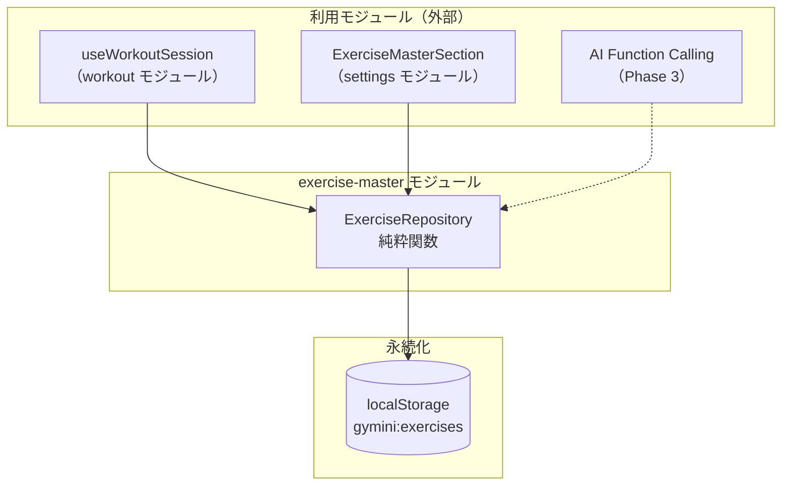

# 種目マスター管理

**関連 Spec:** [index_spec.md](index_spec.md)
**関連 PRD:** [index.md](../../requirement/exercise-master/index.md)

---

# 1. 実装ステータス

**ステータス:** 🔴 未実装

| モジュール/機能 | ステータス | 備考 |
|-------------|--------|------|
| ExerciseRepository.getAll | 🔴 未実装 | 全件取得 |
| ExerciseRepository.search | 🔴 未実装 | 部分一致検索（FR-005） |
| ExerciseRepository.create | 🔴 未実装 | 重複名チェック付き新規登録（FR-006, FR-007） |
| ExerciseRepository.update | 🔴 未実装 | 重複名チェック付き名前変更（FR-007） |
| ExerciseRepository.remove | 🔴 未実装 | ID 指定削除（FR-007） |

> **UI統合モジュール**: 種目マスターのUIは本モジュールのスコープ外。ワークアウト記録時の検索・自動登録UIは [workout](../workout/index_design.md) モジュール、設定画面での CRUD UIは [settings](../settings/index_design.md) モジュールが担当する。

---

# 2. 設計目標

- **純粋関数としての Data Layer**: ExerciseRepository は React を知らない純粋関数として設計し、ワークアウトモジュール・設定画面モジュール・Phase 3 の AI からも呼び出せるようにする
- **シンプルな CRUD**: localStorage を直接操作するシンプルな実装。余分な抽象化をしない
- **他モジュールへの影響なし**: ExerciseRepository は独立したモジュールとして提供し、UIレイヤーの設計に影響を与えない

---

# 3. 技術スタック

| 領域 | 採用技術 | 選定理由 |
|------|--------|--------|
| 言語 | TypeScript (.ts) | T-001: TypeScript strict mode |
| データ永続化 | localStorage (JSON) | A-002: Client-Only Architecture。ブラウザローカル保存 |
| ID生成 | crypto.randomUUID() | ワークアウトモジュールと統一。外部依存ゼロ（A-001 準拠: 自作理由は依存削減） |

---

# 4. アーキテクチャ

## 4.1. システム構成図



本モジュールは ExerciseRepository（Data Layer）のみを提供する。UIレイヤーは利用モジュールが各自で実装する。

## 4.2. モジュール分割

### Data Layer

| モジュール名 | 責務 | 依存関係 | 配置場所 |
|-----------|------|---------|--------|
| ExerciseRepository | 種目データの CRUD。React を知らない純粋関数 | なし | `src/lib/exerciseRepository.ts` |

### 利用モジュール（参考 — 各モジュールの設計書で詳細定義）

| 利用元モジュール | 利用するAPI | 用途 | 参照先 |
|------------|----------|------|--------|
| workout | search, create | ワークアウト記録時の種目検索・自動登録 | [index_design.md](../workout/index_design.md) |
| settings | getAll, search, create, update, remove | 設定画面での種目一覧・検索・追加・編集・削除 | [index_design.md](../settings/index_design.md) |
| ai-chat（Phase 3） | getAll, search | AI がコンテキストとして種目一覧を参照 | 未定義（Phase 3 スコープ — 設計書未作成） |

---

# 5. データモデル

```typescript
// localStorage キー
// このキーは ExerciseRepository が排他的に所有する。他のモジュールはこのキーに直接アクセスしてはならない。
const STORAGE_KEY = 'gymini:exercises'

// 保存形式: JSON配列
// 型定義: src/types/index.ts の Exercise インターフェース
// [
//   { id: "uuid-v4", name: "ベンチプレス" },
//   { id: "uuid-v4", name: "スクワット" }
// ]
```

---

# 6. インターフェース定義

```typescript
// ExerciseRepository (src/lib/exerciseRepository.ts)
// 純粋関数群。localStorage を直接読み書きする。

import type { Exercise } from '../types'

export function getAll(): Exercise[] {
  // localStorage から全種目を返す。返却順は登録順（配列順）。
  // 失敗時・空の場合は []
}

export function search(query: string): Exercise[] {
  // 部分一致検索。大文字小文字を区別しない。
  // query が空文字列または空白のみ（trim 後に空文字列）の場合は全件返す
}

export function create(name: string): Exercise {
  // 新しい種目を登録する。
  // id は crypto.randomUUID() で生成。
  // name が空文字列または空白のみの場合はエラーをスローする。
  // name が既存の種目名と重複する場合はエラーをスローする。
  // throws: Error("Exercise name is empty") — name が空/空白のみ
  // throws: Error("Duplicate name: {name}") — 名前重複時
}

export function update(id: string, name: string): Exercise {
  // 指定IDの種目名を変更する。
  // name が空文字列または空白のみの場合はエラーをスローする。
  // name が他の種目名と重複する場合はエラーをスローする。
  // id が存在しない場合はエラーをスローする。
  // throws: Error("Exercise name is empty") — name が空/空白のみ
  // throws: Error("Exercise not found: {id}") — ID不存在時
  // throws: Error("Duplicate name: {name}") — 名前重複時
}

export function remove(id: string): void {
  // 指定IDの種目を削除する。存在しないIDの場合は何もしない。
}
```

---

# 7. 非機能要件実現方針

| 要件 | 実現方針 |
|------|--------|
| データ整合性（NFR-001）: 種目名の一意性 | `create()` / `update()` 内で `getAll()` を呼び、同名の種目が存在しないことを確認してから保存。大文字小文字の違いは別名として扱う |
| 操作性（NFR-002）: 検索の即時応答 | localStorage の全件取得 + `Array.filter()` によるインメモリ検索。数百件規模では十分高速 |
| エラーハンドリング（T-002） | localStorage の JSON.parse を try-catch で囲み、パース失敗時は空配列にフォールバック |

---

# 8. テスト戦略

> **カバレッジ目標:** >= 80%（D-001: CONSTITUTION.md）

| テストレベル | 対象 | カバレッジ目標 | 対応FR |
|-----------|------|------------|--------|
| ユニットテスト | ExerciseRepository.getAll | 全件取得、空データ、localStorage 破損時のフォールバック | - |
| ユニットテスト | ExerciseRepository.search | 部分一致、空クエリで全件、大文字小文字無視 | FR-005 |
| ユニットテスト | ExerciseRepository.create | 正常登録、重複名エラー | FR-006, FR-007 |
| ユニットテスト | ExerciseRepository.update | 正常変更、重複名エラー、存在しないIDエラー | FR-007 |
| ユニットテスト | ExerciseRepository.remove | 正常削除、存在しないID | FR-007 |

> **UI・統合テスト**: 種目マスターの UI テスト（設定画面での CRUD 操作、ワークアウト記録時の自動登録フロー）は利用モジュール（[settings](../settings/index_design.md)、[workout](../workout/index_design.md)）のテスト戦略で定義する。

---

# 9. 設計判断

## 9.1. 決定事項

| 決定事項 | 選択肢 | 決定内容 | 理由 |
|---------|--------|--------|------|
| モジュールのスコープ | Data Layer + Hook + UI vs Data Layer のみ | Data Layer（ExerciseRepository）のみ | UIは設定画面モジュール（[settings](../settings/index_design.md)）、ワークアウトモジュール（[workout](../workout/index_design.md)）が各自実装。Hook は各利用モジュール内の useState で十分（設定画面は単純な CRUD、ワークアウトは既存 useWorkoutSession 内で対応） |
| create の入力 | `create(name)` vs `create({ name })` | `create(name)` | 入力が name の1フィールドのみ。オブジェクトにラップする必要がない |
| update の入力 | `update(id, name)` vs `update(id, { name })` | `update(id, name)` | create と同様、変更対象は name の1フィールドのみ |
| 重複名の判定 | 大文字小文字を区別 vs 区別しない | 区別する | 「ベンチプレス」と「べんちぷれす」は異なる種目として扱う。日本語の種目名では実用上問題にならない。Note: search() は case-insensitive（検索ヒット率優先）だが、create()/update() の一意性チェックは case-sensitive（格納時の厳密性）。この非対称は意図的 |
| 空白名の入力バリデーション | Repository 内で検証 vs 呼び出し側の責務 | Repository 内で検証 | create()/update() は空文字列・空白のみの name を受け付けずエラーをスローする。UIバリデーションとの二重チェックとなるが、Data Layer の堅牢性を優先 |
| 初期データ（初回起動時） | シードデータあり vs 空リスト | 空リスト | 初回起動時はユーザーが自分で種目を追加する。プリセット種目は要求にないため提供しない |
| B-002 確認ゲートの責務 | Repository 内で実装 vs 呼び出し側の責務 | 呼び出し側の責務 | ExerciseRepository は B-002 確認ゲートを内部実装しない。AI が write 操作（create/update/remove）を呼び出す場合、呼び出し側（Phase 3 ai-chat モジュール）がユーザー確認を実装する責務を持つ |
| remove 時のワークアウト記録 | 連鎖削除 vs 何もしない | 何もしない | spec 制約事項に従い、ワークアウト記録は `exerciseName` スナップショットでフォールバック表示する |
| update 時のワークアウト記録 | スナップショット更新 vs 何もしない | 何もしない | ワークアウト記録の `exerciseName` は記録時のスナップショットであり、種目マスターの名前変更は既存記録に影響しない |
| 種目の並び順 | 五十音順 vs 登録順 | 登録順（配列順） | PRD に並び順の要求なし。並び替えが必要になった時点で追加実装する |
| 存在しないIDの remove | エラーをスロー vs 何もしない | 何もしない | 冪等性を確保。UIからの呼び出し時に不整合を起こさない |
| 存在しないIDの update | エラーをスロー vs 何もしない | エラーをスロー | 更新操作は対象の存在が前提。存在しないIDの更新はプログラムバグの兆候であり、明示的にエラーとする |

## 9.2. 未解決の課題

*未解決の課題なし（実装開始可能）*

---

# 10. 変更履歴

## v2.0 (2026-04-11) — PRD・設定画面仕様との整合

**変更内容:**

- `impl-status` を `"implemented"` から `"not-implemented"` に修正（実装が存在しないため）
- `update(id, name)` メソッドを追加（PRD FR_007 の「編集」対応）
- アーキテクチャを刷新: ExerciseRepository（Data Layer）のみに集中。UI統合は設定画面モジュール・ワークアウトモジュールが担当
- `ExerciseMasterPage`（スタンドアロンページ）を削除。設定画面の `ExerciseMasterSection` に統合（[index_design.md](../settings/index_design.md) 参照）
- `useExerciseMaster` Hook を削除。設定画面セクションが ExerciseRepository を直接利用
- 種目リネーム機能をスコープ内に変更（旧: Phase 1 スコープ外）

## v1.1 (2026-03-29)

**変更内容:**

- TypeScript 移行に合わせてファイル名・コード例を `.ts`/`.tsx` に更新（T-001 準拠）
- 技術スタックに Language（TypeScript）行を追加
- 制約 ID 参照を旧 DC_xxx から CONSTITUTION.md 原則 ID（A-001, A-002, T-001, T-003）に更新

## v1.0 (2026-03-28)

**変更内容:**

- 初版作成
