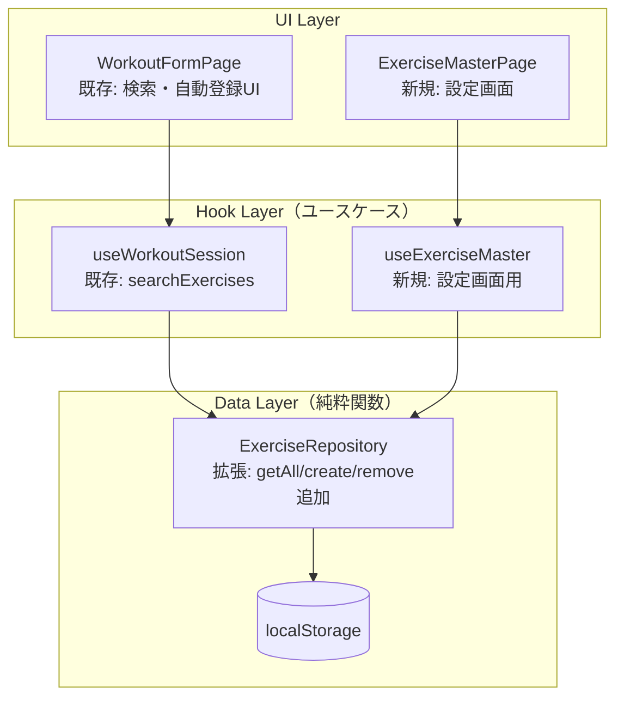

# 種目マスター管理

**関連 Spec:** [index_spec.md](index_spec.md)
**関連 PRD:** [index.md](../../requirement/exercise-master/index.md)

---

# 1. 実装ステータス

**ステータス:** 🟡 部分実装

| モジュール/機能 | ステータス | 備考 |
|-------------|--------|------|
| ExerciseRepository.search | 🟢 実装済み | 部分一致検索（FR-005） |
| ExerciseRepository.getAll | 🟡 部分実装 | 内部関数として存在。公開が必要 |
| ExerciseRepository.create | 🔴 未実装 | FR-006, FR-007 で必要 |
| ExerciseRepository.remove | 🔴 未実装 | FR-007 で必要 |
| 自動登録フロー（UI） | 🔴 未実装 | WorkoutFormPage での候補なし時のUI |
| 設定画面（種目管理） | 🔴 未実装 | 種目一覧・追加・削除のUI |

---

# 2. 設計目標

- **既存パターンの踏襲**: ワークアウトモジュールと同じ Data Layer → Hook Layer → UI Layer のレイヤー構成に従う
- **シンプルな CRUD**: localStorage を直接操作するシンプルな実装。余分な抽象化をしない
- **再利用可能な Data Layer**: ExerciseRepository は React を知らない純粋関数として設計し、Phase 3 の AI からも呼び出せるようにする
- **既存コードへの影響最小化**: 現在の `search()` のインターフェースを維持しつつ、`getAll`・`create`・`remove` を追加する

---

# 3. 技術スタック

| 領域 | 採用技術 | 選定理由 |
|------|--------|--------|
| UIフレームワーク | React (JSX) | DC_001: プロジェクト制約 |
| 状態管理 | Zustand | ワークアウトモジュールと統一。種目一覧の状態管理に使用 |
| データ永続化 | localStorage (JSON) | DC_003: ブラウザローカル保存。ワークアウトと同じ方式 |
| スタイリング | Tailwind CSS | DC_004: スマホファースト。ワークアウトモジュールと統一。UIデザインシステムは [workout/index_design.md](../workout/index_design.md) Section 3.1 を参照 |
| ID生成 | crypto.randomUUID() | ワークアウトモジュールと統一。外部依存ゼロ |

---

# 4. アーキテクチャ

## 4.1. システム構成図



種目マスター固有の State Layer（Zustand store）は不要。設定画面の種目一覧は Hook 内で `useState` で管理すれば十分であり、ワークアウトモジュールのような複数ページ間の状態共有が不要なため。

## 4.2. モジュール分割

### Data Layer

| モジュール名 | 責務 | 依存関係 | 配置場所 |
|-----------|------|---------|--------|
| ExerciseRepository | 種目データの CRUD。React を知らない純粋関数 | なし | `src/lib/exerciseRepository.js` |

### Hook Layer（ユースケース）

| モジュール名 | 責務 | 依存関係 | 配置場所 |
|-----------|------|---------|--------|
| useWorkoutSession | 既存。種目検索を含むセッション記録のユースケース | ExerciseRepository | `src/hooks/useWorkoutSession.js`（既存） |
| useExerciseMaster | 設定画面での種目一覧・追加・削除のユースケース | ExerciseRepository | `src/hooks/useExerciseMaster.js`（新規） |

### UI Layer

| モジュール名 | 責務 | 依存関係 | 配置場所 |
|-----------|------|---------|--------|
| WorkoutFormPage | 既存。検索・自動登録UIの追加が必要 | useWorkoutSession | `src/pages/WorkoutFormPage.jsx`（既存・変更） |
| ExerciseMasterPage | 設定画面の種目管理ページ | useExerciseMaster | `src/pages/ExerciseMasterPage.jsx`（新規） |

---

# 5. データモデル

```javascript
// localStorage キー
const STORAGE_KEY = 'gymini:exercises'

// 保存形式: JSON配列
// [
//   {
//     id: "uuid-v4",
//     name: "ベンチプレス",
//     createdAt: "2026-03-28T10:00:00.000Z",
//     updatedAt: "2026-03-28T10:00:00.000Z"
//   },
//   {
//     id: "uuid-v4",
//     name: "スクワット",
//     createdAt: "2026-03-28T10:00:00.000Z",
//     updatedAt: "2026-03-28T10:00:00.000Z"
//   }
// ]
```

### 既存データの移行

現在の実装では Exercise は `{ id, name }` の2フィールドのみ。spec で定義した `createdAt`・`updatedAt` フィールドを追加する。

**移行方針**: `getAll()` 読み取り時に `createdAt`/`updatedAt` が存在しないエントリは現在時刻で補完する（遅延マイグレーション）。明示的なマイグレーションスクリプトは不要。

---

# 6. インターフェース定義

```javascript
// ExerciseRepository (src/lib/exerciseRepository.js)
// 純粋関数群。localStorage を直接読み書きする。

function getAll() {
  // localStorage から全種目を返す。失敗時・空の場合は []
  // createdAt/updatedAt が存在しないエントリは現在時刻で補完する
  // return: Exercise[]
}

function search(query) {
  // 部分一致検索。大文字小文字を区別しない。
  // query が空の場合は全件返す（既存の挙動を維持）
  // return: Exercise[]
}

function create(name) {
  // 新しい種目を登録する。
  // id は crypto.randomUUID() で生成。
  // createdAt, updatedAt は現在時刻の ISO 8601 文字列。
  // name が既存の種目名と重複する場合はエラーをスローする。
  // return: Exercise
  // throws: Error（名前重複時）
}

function remove(id) {
  // 指定IDの種目を削除する。存在しないIDの場合は何もしない。
  // return: void
}

// -------------------------------------------------------
// useExerciseMaster (src/hooks/useExerciseMaster.js)
// 設定画面のユースケース。UI はこれだけ知ればよい。
// -------------------------------------------------------

function useExerciseMaster() {
  // return:
  // {
  //   exercises: Exercise[],              // 種目一覧
  //   addExercise: (name) => Exercise,    // 種目追加（成功時に一覧を再読み込み）
  //   removeExercise: (id) => void,       // 種目削除（一覧を再読み込み）
  //   error: string | null,              // 直近のエラーメッセージ（重複名など）
  // }
}
```

---

# 7. 非機能要件実現方針

| 要件 | 実現方針 |
|------|--------|
| データ整合性（NFR-001）: 種目名の一意性 | `create()` 内で `getAll()` を呼び、同名の種目が存在しないことを確認してから保存。大文字小文字の違いは別名として扱う |
| 操作性（NFR-002）: 検索の即時応答 | localStorage の全件取得 + `Array.filter()` によるインメモリ検索。数百件規模では十分高速 |

---

# 8. テスト戦略

| テストレベル | 対象 | カバレッジ目標 |
|-----------|------|------------|
| ユニットテスト | ExerciseRepository.getAll | 全件取得、空データ、既存データの createdAt 補完 |
| ユニットテスト | ExerciseRepository.create | 正常登録、重複名エラー |
| ユニットテスト | ExerciseRepository.remove | 正常削除、存在しないID |
| ユニットテスト | ExerciseRepository.search | 既存テストに加え、create 後の検索 |
| ユニットテスト | useExerciseMaster | 一覧取得、追加、削除、エラーハンドリング |
| コンポーネントテスト | ExerciseMasterPage | 一覧表示、追加操作、削除操作 |
| 統合テスト | WorkoutFormPage | 自動登録フロー（検索→候補なし→新規追加→種目セット） |

---

# 9. 設計判断

## 9.1. 決定事項

| 決定事項 | 選択肢 | 決定内容 | 理由 |
|---------|--------|--------|------|
| 種目マスター専用の Zustand store | 専用 store を作る vs Hook 内 useState | Hook 内 useState | 設定画面は単一ページで完結し、他ページとの状態共有が不要。ワークアウトのような複数画面間共有のユースケースがないため、store は過剰 |
| getAll の公開方法 | 新関数 vs 既存の内部関数を export | 既存の内部関数を export | 現在 `getAll()` は内部関数として存在。ロジックは変更不要で、`export` を追加するだけ |
| create の入力 | `create(name)` vs `create({ name })` | `create(name)` | 入力が name の1フィールドのみ。オブジェクトにラップする必要がない |
| 重複名の判定 | 大文字小文字を区別 vs 区別しない | 区別する | 「ベンチプレス」と「べんちぷれす」は異なる種目として扱う。日本語の種目名では実用上問題にならない |
| 既存データの移行 | マイグレーションスクリプト vs 遅延補完 | 遅延補完 | `getAll()` 読み取り時に `createdAt`/`updatedAt` がないエントリを補完する。明示的な移行ステップが不要でユーザー影響ゼロ |
| remove 時のワークアウト記録 | 連鎖削除 vs 何もしない | 何もしない | spec 制約事項に従い、ワークアウト記録は `exerciseName` スナップショットでフォールバック表示する。種目削除が既存記録に影響しない |

## 9.2. 未解決の課題

| 課題 | 影響度 | 対応方針 |
|------|--------|--------|
| 種目の並び順 | 低 | 現時点では登録順（配列順）で表示。将来的に五十音順やよく使う順への並び替えを検討 |
| 種目のリネーム | 低 | Phase 1 スコープ外。将来追加時にワークアウトのスナップショットとの整合性を設計する |
