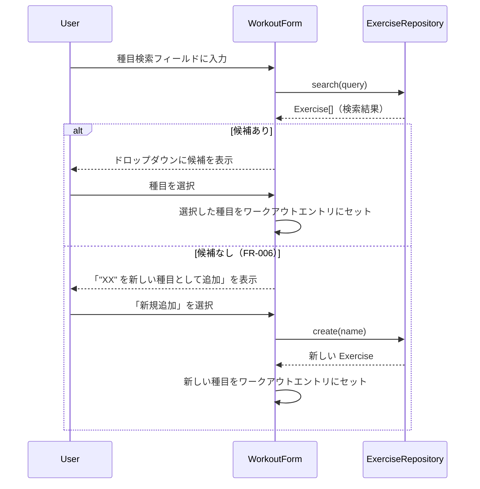
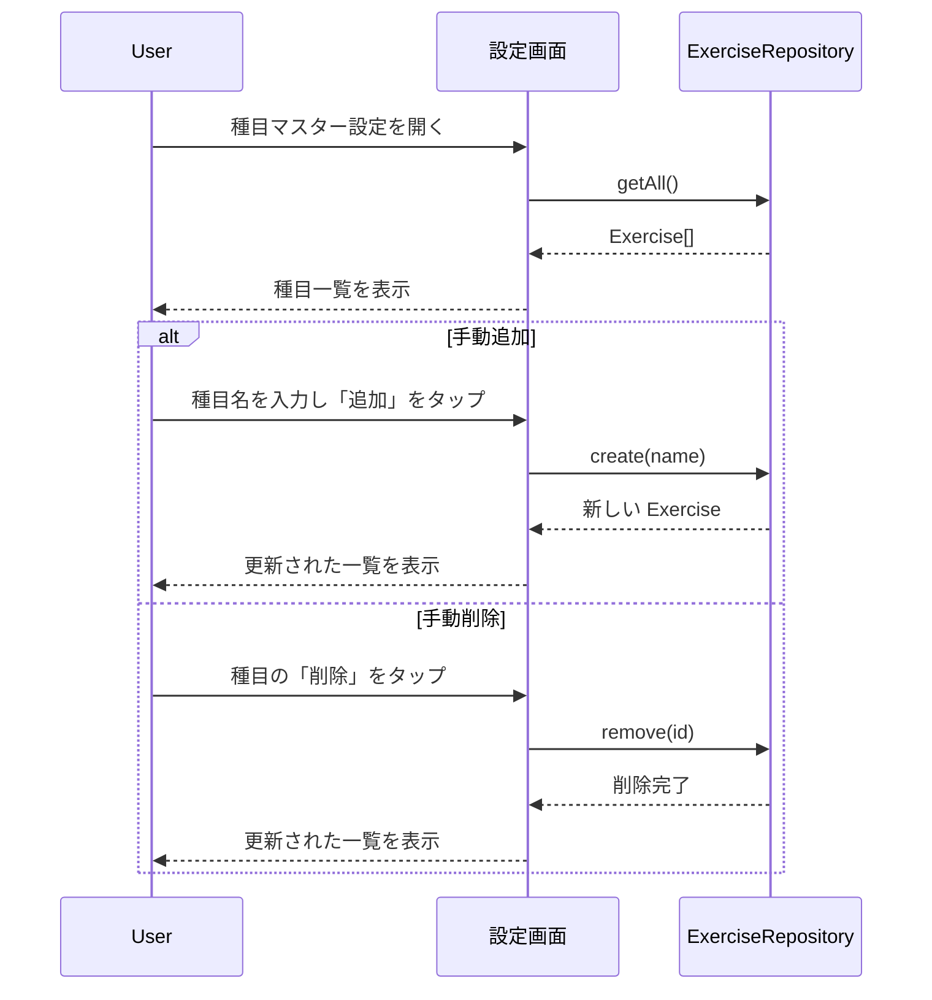

# 種目マスター管理

**関連 Design Doc:** [index_design.md](index_design.md)
**関連 PRD:** [index.md](../../requirement/exercise-master/index.md)

---

# 1. 背景

gymini の Phase 1 中核機能。トレーニング種目のマスターデータを管理し、ワークアウト記録時の種目選択と設定画面での手動管理を提供する。

ワークアウト記録（[workout](../workout/index_spec.md)）は種目マスターの `exerciseId` と `exerciseName` を参照しており、種目マスターはアプリ全体のマスターデータ基盤となる。また、Phase 3 の AI コーチング機能がユーザーのトレーニング種目一覧を読み取るため、外部モジュールから利用可能な公開インターフェースが必要となる。

# 2. 概要

種目マスター管理機能は以下の責務を持つ：

- **種目検索**: テキスト入力による部分一致検索で候補を表示する
- **種目の自動登録**: 検索で一致しない場合、入力した文字列を新しい種目として登録する
- **一覧表示**: 設定画面で登録済みの種目一覧を表示する
- **手動管理**: 設定画面から種目の追加・削除を行う

本モジュールは独立したデータ管理モジュールであり、ワークアウトモジュールや将来の AI モジュールから利用される。他のドメインモジュールには依存しない。

# 3. 要求定義

## 3.1. 機能要件

| ID | 要件 | 優先度 | PRD参照 |
|----|------|--------|---------|
| FR-005 | テキスト入力で部分一致検索（前方一致・中間一致を含む文字列マッチング）し、候補をドロップダウン表示する | 必須 | FR_005 |
| FR-006 | 検索で一致する種目がない場合、「"XX" を新しい種目として追加」という選択肢を表示し、選択すると種目マスターに自動登録する | 必須 | FR_006 |
| FR-007 | 設定画面で登録済み種目の一覧表示、手動での追加・削除ができる | 必須 | FR_007 |

## 3.2. 非機能要件

| ID | カテゴリ | 要件 | 目標値 |
|----|--------|------|--------|
| NFR-001 | データ整合性 | 種目名は一意であること（重複登録を防止する） | create 時に一意性を保証 |
| NFR-002 | 操作性 | 検索結果が体感できる遅延なく表示されること | 一般的なデータ量（数百件以下）で 100ms 以内 |

# 4. API

種目マスター機能が外部（他モジュール・UIレイヤー）に公開するインターフェース。

| モジュール | インターフェース | メンバー | 概要 |
|---------|--------------|--------|------|
| exercise | ExerciseRepository | getAll() | 登録済みの全種目を取得する |
| exercise | ExerciseRepository | search(query) | 部分一致検索（大文字小文字を区別しない）で一致する種目を返す。query が空の場合は全件返す |
| exercise | ExerciseRepository | create(name) | 新しい種目を登録する。登録した Exercise を返す。名前が重複する場合はエラーとする |
| exercise | ExerciseRepository | remove(id) | 指定 ID の種目を削除する（`delete` は JS 予約語のため `remove` を使用） |

## 4.1. 型定義

```typescript
// 種目マスターエントリ
type Exercise = {
  id: string            // 一意識別子（自動生成）
  name: string          // 種目名（一意、ユーザー定義）
  createdAt: string     // ISO 8601 datetime
  updatedAt: string     // ISO 8601 datetime
}

```

# 5. 用語集

| 用語 | 説明 |
|------|------|
| 種目 (Exercise) | トレーニング運動の種類（例: ベンチプレス、スクワット、デッドリフト） |
| 種目マスター | アプリに登録されている種目の一覧。ユーザーが自由に追加・削除できる |
| 自動登録 | ワークアウト記録時に検索で一致しない種目名を選択操作で種目マスターに登録するフロー |

# 6. 使用例

## シナリオ1: ワークアウト記録時の検索と自動登録（FR-005, FR-006）

```
# 検索で候補が見つかる場合
1. ユーザーが種目検索フィールドに「ベンチ」と入力
2. results = ExerciseRepository.search("ベンチ")
   → [{ id: "xxx", name: "ベンチプレス", ... }]
3. ドロップダウンに「ベンチプレス」が表示される
4. ユーザーが「ベンチプレス」を選択 → 現在のワークアウトエントリに種目がセットされる

# 検索で候補が見つからない場合（自動登録）
5. ユーザーが「インクラインダンベルカール」と入力
6. results = ExerciseRepository.search("インクラインダンベルカール")
   → []（一致なし）
7. ドロップダウンに「"インクラインダンベルカール" を新しい種目として追加」が表示される
8. ユーザーがその選択肢を選択
9. newExercise = ExerciseRepository.create("インクラインダンベルカール")
   → { id: "generated-id", name: "インクラインダンベルカール", createdAt: "...", updatedAt: "..." }
10. newExercise が現在のワークアウトエントリの種目としてセットされる
```

## シナリオ2: 設定画面での手動管理（FR-007）

```
# 種目一覧の表示
1. exercises = ExerciseRepository.getAll()
   → [{ id: "xxx", name: "ベンチプレス", ... }, { id: "yyy", name: "スクワット", ... }, ...]
2. 種目リストを表示

# 手動追加
3. ユーザーが「ブルガリアンスクワット」と入力し追加ボタンをタップ
4. newExercise = ExerciseRepository.create("ブルガリアンスクワット")
5. リストが更新され、新しい種目が表示される

# 手動削除
6. ユーザーが「ブルガリアンスクワット」の削除ボタンをタップ
7. ExerciseRepository.remove(newExercise.id)
8. リストが更新され、削除した種目が非表示になる

# AI が種目一覧を参照する場合（Phase 3、読み取り専用）
9. allExercises = ExerciseRepository.getAll()
   // AI コーチング機能がコンテキストとして利用する
```

# 7. 振る舞い図

## ワークアウト記録時の検索・自動登録フロー（FR-005, FR-006）



## 設定画面での手動管理フロー（FR-007）



# 8. 制約事項

- 種目名は一意でなければならない。重複する名前での登録はエラーとなる
- ワークアウト記録（WorkoutExercise）に保存される `exerciseName` は記録時のスナップショットである。種目マスターから種目が削除されても、既存のワークアウト記録は影響を受けない（ワークアウト仕様書の制約事項を継承）
- 種目データはブラウザの localStorage に永続化される（DC_003 - [index.md](../../requirement/index.md)）
- Phase 3 の AI コーチング機能は `getAll()` および `search()` を通じて種目マスターを読み取り専用で参照する。AI による書き込み操作（`create`, `remove`）は REQ_008（[index.md](../../requirement/index.md)）に基づきユーザー確認が必要
- Phase 1 では種目の更新（リネーム）機能は提供しない。将来追加する場合、ワークアウト記録のスナップショットとの整合性を考慮する必要がある

---

## PRD整合性確認

| PRD要求ID | 要件 | Spec対応箇所 |
|----------|------|------------|
| FR_005 | テキスト入力で部分一致検索し候補をドロップダウン表示 | FR-005, ExerciseRepository.search(), Section 7 振る舞い図（検索フロー） |
| FR_006 | 一致しない文字列を新しい種目として自動登録 | FR-006, ExerciseRepository.create(), Section 7 振る舞い図（候補なし alt） |
| FR_007 | 設定画面で種目の一覧表示・手動追加・削除 | FR-007, ExerciseRepository.getAll()/create()/remove(), Section 7 振る舞い図（設定画面フロー） |

> **Note**: CONSTITUTION.md が存在しないため原則準拠チェックはスキップしました。`/sdd-init` で作成を推奨します。
