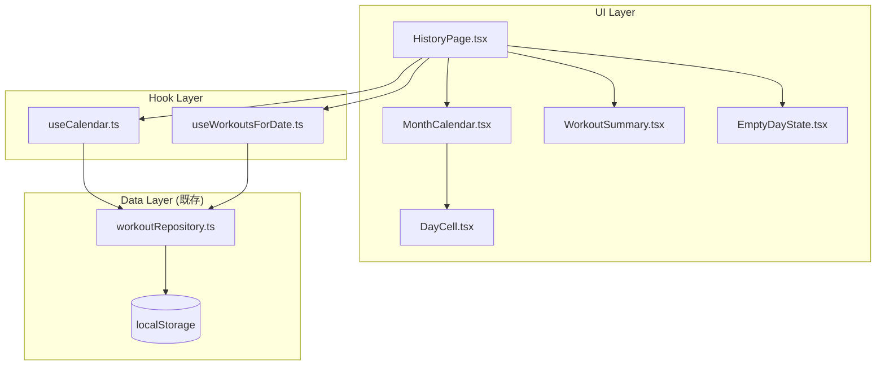

# 履歴画面

**関連 Spec:** [index_spec.md](index_spec.md)
**関連 PRD:** [index.md](../../requirement/history/index.md)

---

# 1. 実装ステータス

**ステータス:** 🔴 未実装

| モジュール/機能 | ステータス | 備考 |
|-------------|--------|------|
| useCalendar フック | 🔴 未実装 | カレンダー状態管理 |
| useWorkoutsForDate フック | 🔴 未実装 | 日付指定ワークアウト取得 |
| MonthCalendar コンポーネント | 🔴 未実装 | カレンダーグリッドUI |
| WorkoutSummary コンポーネント | 🔴 未実装 | 記録サマリー表示 |
| EmptyDayState コンポーネント | 🔴 未実装 | 空状態UI |
| HistoryPage リファクタリング | 🔴 未実装 | プレースホルダーから実装へ |

---

# 2. 設計目標

- **既存データ層の再利用**: `workoutRepository` をそのまま利用し、新たなストア・リポジトリは追加しない
- **コンポーネント分離**: カレンダーUI、サマリー表示、空状態を独立コンポーネントとし、単体テスト可能にする
- **ローカル状態のみ**: カレンダーの表示月と選択日はコンポーネントローカル状態（useState / カスタムフック）で管理。グローバルストアは不要
- **パフォーマンス**: 月遷移・日付選択を1フレーム（16ms）以内に完了させる。DOM操作のみでネットワーク通信なし
- **モバイルファースト**: 日付セルのタップターゲット44px以上を確保（T-003）

---

# 3. 技術スタック

| 領域 | 採用技術 | 選定理由 |
|------|--------|--------|
| 言語 | TypeScript (.tsx) | プロジェクト全体がTypeScript strict mode（T-001） |
| カレンダーロジック | 自作（date-fns ユーティリティ活用） | カレンダーUIライブラリ（react-calendar等）は過剰。月のグリッド生成は純粋関数で十分実現可能。date-fnsは既にプロジェクトで使用可能（A-001: 必要最小限の依存） |
| 状態管理 | React useState + カスタムフック | カレンダー状態は画面ローカル。Zustandに載せる必要はない |
| データ取得 | workoutRepository（既存） | 既存のlocalStorageアクセス層をそのまま利用（A-002, B-001） |
| スタイリング | Tailwind CSS | プロジェクト標準のスタイリング手法（A-001） |

---

# 4. アーキテクチャ

## 4.1. システム構成図



## 4.2. モジュール分割

### 新規モジュール

| モジュール名 | 責務 | 依存関係 | 配置場所 |
|-----------|------|---------|--------|
| useCalendar | 表示月・選択日・ワークアウト日集合の管理 | workoutRepository | `src/hooks/useCalendar.ts` |
| useWorkoutsForDate | 指定日付のワークアウト記録取得 | workoutRepository | `src/hooks/useWorkoutsForDate.ts` |
| MonthCalendar | カレンダーグリッドUI（7列 × 最大6行） | なし（props） | `src/components/MonthCalendar.tsx` |
| DayCell | 個別の日付セル（状態に応じたスタイリング） | なし（props） | `src/components/DayCell.tsx` |
| WorkoutSummary | 選択日のワークアウト記録サマリー表示 | なし（props） | `src/components/WorkoutSummary.tsx` |
| EmptyDayState | 記録なし日の空状態UI + 追加ボタン | なし（props） | `src/components/EmptyDayState.tsx` |
| calendarUtils | 月のグリッド生成、日付比較等の純粋関数 | なし | `src/utils/calendarUtils.ts` |

### 既存モジュールの変更

| モジュール名 | 変更内容 | 配置場所 |
|-----------|---------|--------|
| HistoryPage.tsx | プレースホルダーからカレンダー + サマリー表示へ | `src/pages/HistoryPage.tsx` |

---

# 5. データモデル

```typescript
// calendarUtils.ts - カレンダーグリッド生成

/** カレンダーグリッドの1日分 */
interface CalendarDay {
  date: string          // "YYYY-MM-DD"
  dayOfMonth: number    // 1-31
  isCurrentMonth: boolean  // 表示月に属するか
  isToday: boolean
  hasWorkout: boolean
}

/** カレンダーグリッド（6行 × 7列） */
type CalendarGrid = CalendarDay[][]

/**
 * 指定年月のカレンダーグリッドを生成する純粋関数
 * 前月・次月の日付も含めて6行×7列のグリッドを返す
 */
function generateCalendarGrid(
  year: number,
  month: number,        // 1-indexed
  workoutDates: Set<string>
): CalendarGrid
```

---

# 6. インターフェース定義

```typescript
// -------------------------------------------------------
// useCalendar (src/hooks/useCalendar.ts)
// -------------------------------------------------------

interface UseCalendarReturn {
  selectedDate: string | null
  displayMonth: { year: number; month: number }
  goToPrevMonth: () => void
  goToNextMonth: () => void
  selectDate: (date: string) => void
  daysWithWorkouts: Set<string>
}

function useCalendar(): UseCalendarReturn
// 初期値: displayMonth = 今月, selectedDate = null
// goToPrevMonth/goToNextMonth: displayMonthを±1し、selectedDateをnullにリセット
// daysWithWorkouts: displayMonthが変わるたびにworkoutRepository.listByDateDesc()から
//   該当月のワークアウト日付をSetに変換

// -------------------------------------------------------
// useWorkoutsForDate (src/hooks/useWorkoutsForDate.ts)
// -------------------------------------------------------

function useWorkoutsForDate(date: string | null): WorkoutRecord[]
// dateがnullの場合は空配列を返す
// workoutRepository.listByDate(date)で取得

// -------------------------------------------------------
// MonthCalendar (src/components/MonthCalendar.tsx)
// -------------------------------------------------------

interface MonthCalendarProps {
  displayMonth: { year: number; month: number }
  selectedDate: string | null
  daysWithWorkouts: Set<string>
  onPrevMonth: () => void
  onNextMonth: () => void
  onSelectDate: (date: string) => void
}

// -------------------------------------------------------
// DayCell (src/components/DayCell.tsx)
// -------------------------------------------------------

interface DayCellProps {
  day: CalendarDay
  isSelected: boolean
  onSelect: (date: string) => void
}

// 状態に応じたTailwindクラス:
// - default (当月・記録なし):  text-zinc-400
// - hasWorkout (記録あり):     text-black font-medium + 赤ドット
// - today (今日):              bg-black text-white rounded-full
// - todayWithWorkout:          bg-black text-white rounded-full + 赤ドット
// - selected:                  ring-2 ring-black ring-offset-2 font-bold
// - otherMonth (前月/次月):    text-zinc-200（タップ不可）

// -------------------------------------------------------
// WorkoutSummary (src/components/WorkoutSummary.tsx)
// -------------------------------------------------------

interface WorkoutSummaryProps {
  date: string
  workouts: WorkoutRecord[]
}

// 表示形式:
// 日付ヘッダー: "10月20日の記録"
// 種目ごとのセクション:
//   種目名（太字）
//   SET1  100kg × 10回
//   SET2  100kg × 8回

// -------------------------------------------------------
// EmptyDayState (src/components/EmptyDayState.tsx)
// -------------------------------------------------------

interface EmptyDayStateProps {
  date: string
  onAddWorkout: (date: string) => void
}

// 表示: 「記録なし」テキスト + 「追加」ボタン
// 追加ボタン: min-h-[44px] min-w-[44px]（T-003）
// onAddWorkout → navigate('training') + startSession(date)

// -------------------------------------------------------
// 型の設計判断
// -------------------------------------------------------

// spec の WorkoutSummaryData 型は独立した型として定義しない。
// WorkoutSummary は WorkoutRecord[] を直接 props で受け取り、
// コンポーネント内で表示形式に変換する。

// spec の DayCellState 型は DayCell 内部で CalendarDay フィールド
// + isSelected から派生的に計算する。DayCellProps には含めない。
```

---

# 7. 非機能要件実現方針

| 要件 | 実現方針 |
|------|--------|
| 操作性（NFR-001）: 月遷移の即時性 | useState による displayMonth の更新は同期的で1フレーム以内に完了。カレンダーグリッド生成は純粋関数で計算コストO(42)（6行×7列）。workoutRepository からの日付取得は localStorage の同期読み出し |
| 操作性（NFR-002）: 日付タップからサマリー表示 | selectedDate の useState 更新でサマリーを条件レンダリング。workoutRepository.listByDate() は localStorage の同期読み出しで即座に完了 |
| アクセシビリティ（NFR-003）: タップターゲット | DayCell を `min-w-[44px] min-h-[44px]` で確保。シェブロンボタン・追加ボタンも同サイズ以上を確保（T-003） |
| エラー耐性（T-002）: workoutRepository エラー | useCalendar / useWorkoutsForDate は workoutRepository のエラーを catch し、空の Set / 空配列にフォールバック。console.error でログ出力 |

---

# 8. テスト戦略

| テストレベル | 対象 | カバレッジ目標 |
|-----------|------|------------|
| ユニットテスト | calendarUtils（グリッド生成、日付判定） | 全分岐（D-001: TDD） |
| ユニットテスト | useCalendar（月遷移、日付選択、ワークアウト日集合） | 全アクション |
| ユニットテスト | useWorkoutsForDate（null / 記録あり / 記録なし） | 全分岐 |
| コンポーネントテスト | MonthCalendar（グリッド表示、シェブロン操作） | FR-001, FR-002 |
| コンポーネントテスト | DayCell（5状態の表示、タップイベント） | FR-003, FR-004, FR-009, FR-010 |
| コンポーネントテスト | WorkoutSummary（種目・セット表示） | FR-005, FR-006 |
| コンポーネントテスト | EmptyDayState（テキスト表示、追加ボタン） | FR-007, FR-008 |
| 統合テスト | HistoryPage（カレンダー + サマリー連携） | 全FR |
| E2Eテスト | 履歴画面フロー（Playwright） | 主要ユーザーフロー |

---

# 9. 設計判断

## 9.1. 決定事項

| 決定事項 | 選択肢 | 決定内容 | 理由 |
|---------|--------|--------|------|
| カレンダーUI | react-calendar / date-picker ライブラリ vs 自作 | 自作（calendarUtils + MonthCalendar） | カレンダーライブラリはスタイリングの自由度が低く、Tailwindとの統合が煩雑。必要な機能は月グリッド生成と日付選択のみで、純粋関数で十分実現可能。依存を増やさない（A-001: 自作の明確な理由あり） |
| 状態管理 | Zustand グローバルストア vs React ローカル状態 | React ローカル状態（useCalendar フック） | カレンダーの表示月・選択日は画面ローカルな関心事。他の画面から参照する必要がないためグローバルストアは不要 |
| ワークアウト日の取得方法 | 月ごとにフィルタリング vs 全件取得してメモリでフィルタ | 全件取得してメモリでフィルタ | workoutRepository.listByDateDesc() で全件取得し、表示月の日付をSetに変換。ローカルアプリで件数が限定的（数百件程度）なため、月ごとのインデックス構築は過剰 |
| 赤ドットマーカーの色 | デザインシステム参照 | accent色（#DE3A2B / `bg-accent`） | `.sdd/design-system.html` で定義済みのアクセントカラーに準拠 |
| 今日の日付セルの色 | デザインシステム参照 | 黒塗り（`bg-black text-white rounded-full`） | PRDの「黒塗りで強調表示」に準拠。他の日付と明確に区別可能 |
| DayCell の非当月日表示 | 非表示 vs 薄く表示 | 薄く表示（`text-zinc-200`、タップ不可） | カレンダーグリッドの形状を維持し、空白セルによるレイアウト崩れを防ぐ |
| 実装言語 | JavaScript (.jsx) vs TypeScript (.tsx) | TypeScript (.tsx) | プロジェクト全体がTypeScript strict mode（T-001） |

## 9.2. 未解決の課題

*未解決の課題なし（実装開始可能）*
