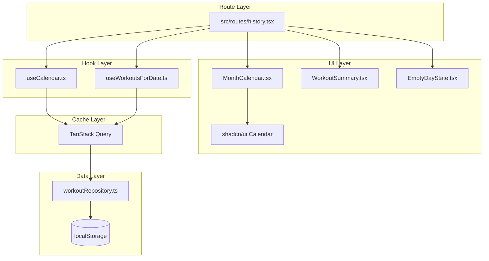

# 履歴画面

**関連 Spec:** [index_spec.md](index_spec.md)
**関連 PRD:** [index.md](../../requirement/history/index.md)
**視覚仕様:** [design-system.html](../../design-system.html) FRAME 3: History Tab

> **実装時の視覚仕様について:** 全コンポーネントのレイアウト・スタイリング（カラー、角丸、フォント、スペーシング、シャドウ等）は `design-system.html` FRAME 3 を正規リファレンスとする。本 design doc に記載のクラス名・スタイル値は FRAME 3 からの抜粋であり、差異がある場合は FRAME 3 を優先する。

---

# 1. 実装ステータス

**ステータス:** 🟢 実装済み

| モジュール/機能 | ステータス | 備考 |
|-------------|--------|------|
| useCalendar フック | 🟢 実装済み | TanStack Router search params + TanStack Query |
| useWorkoutsForDate フック | 🟢 実装済み | TanStack Query + workoutRepository |
| MonthCalendar コンポーネント | 🟢 実装済み | react-day-picker 不使用、自作カレンダーグリッド |
| WorkoutSummary コンポーネント | 🟢 実装済み | FRAME 3 準拠 |
| EmptyDayState コンポーネント | 🟢 実装済み | FRAME 3 準拠 |
| history ルート | 🟢 実装済み | validateSearch + Zod スキーマ |

---

# 2. 設計目標

- **データ層の設計**: `workoutRepository`（localStorage CRUD）を新規実装し、TanStack Query でキャッシュ管理をラップする。workout design doc のインターフェース仕様（[workout/index_design.md](../workout/index_design.md)）に準拠
- **コンポーネント分離**: カレンダーUI、サマリー表示、空状態を独立コンポーネントとし、単体テスト可能にする
- **URL駆動の状態管理**: カレンダーの表示月と選択日を TanStack Router の search params で管理。タブ切替・ブラウザバックでも状態が保持され、Zustand グローバルストアは不要
- **TanStack Query によるキャッシュ**: ワークアウト日一覧の取得を TanStack Query で管理し、画面復帰時の自動再取得とキャッシュ無効化を実現
- **モバイルファースト**: 日付セルは視覚サイズ36px（`w-9 h-9`）、グリッドセル領域でタップターゲット44px相当を確保（T-003、design-system.html FRAME3 準拠）

---

# 3. 技術スタック

| 領域 | 採用技術 | 選定理由 |
|------|--------|--------|
| 言語 | TypeScript (.tsx) | プロジェクト全体がTypeScript strict mode（T-001） |
| カレンダーUI | shadcn/ui Calendar（react-day-picker ベース） | A-001 準拠: shadcn/ui が提供するカレンダーコンポーネントを活用。`components` prop でカスタム day レンダリング（マーカー・今日強調）を実現。グリッド生成・月遷移は react-day-picker が担当 |
| ルーティング | TanStack Router | CONSTITUTION v3.0.0 準拠。ファイルベース型安全ルーティング |
| データフェッチ/キャッシュ | TanStack Query | CONSTITUTION v3.0.0 準拠。workoutRepository をラップし、キャッシュ管理・自動再取得を実現 |
| UIコンポーネント | shadcn/ui + Radix UI | CONSTITUTION v3.0.0 準拠。Button 等の基本コンポーネントに利用 |
| 状態管理 | TanStack Router search params | 表示月・選択日をURLに保持。タブ切替・ブラウザバックで状態維持。Zustand不要 |
| データ取得 | workoutRepository | localStorage CRUD 層。workout design doc のインターフェース仕様に準拠して新規実装（A-002, B-001） |
| スタイリング | Tailwind CSS | プロジェクト標準のスタイリング手法 |

---

# 4. アーキテクチャ

## 4.1. システム構成図



## 4.2. モジュール分割

### 新規モジュール

| モジュール名 | 責務 | 依存関係 | 配置場所 |
|-----------|------|---------|--------|
| dateStringSchema | "YYYY-MM-DD" の Zod スキーマ + DateString branded type + ヘルパー関数。**本モジュールが定義元（canonical）。** workout 等の他モジュールはここから import する | Zod | `src/schemas/date.ts` |
| history ルート | 履歴画面のルート定義 | useCalendar, useWorkoutsForDate, UI components | `src/routes/history.tsx` |
| useCalendar | 表示月・選択日・ワークアウト日集合の管理 | TanStack Query, workoutRepository | `src/hooks/useCalendar.ts` |
| useWorkoutsForDate | 指定日付のワークアウト記録取得 | TanStack Query, workoutRepository | `src/hooks/useWorkoutsForDate.ts` |
| MonthCalendar | shadcn/ui Calendar をラップし、カスタム day レンダリング（マーカー・今日強調・選択状態）を提供 | shadcn/ui Calendar（react-day-picker） | `src/components/MonthCalendar.tsx` |
| WorkoutSummary | 選択日のワークアウト記録サマリー表示 | shadcn/ui Card | `src/components/WorkoutSummary.tsx` |
| EmptyDayState | 記録なし日の空状態UI + 追加ボタン | shadcn/ui Button | `src/components/EmptyDayState.tsx` |

### 前提モジュール（他機能で実装）

| モジュール名 | 依存内容 | 配置場所 |
|-----------|---------|--------|
| workoutRepository | localStorage CRUD（listByDateDesc, listByDate） | `src/lib/workoutRepository.ts` |
| __root.tsx | ルートレイアウト。履歴ルートへのナビゲーションリンクを含む | `src/routes/__root.tsx` |

---

# 5. データモデル

```typescript
// -------------------------------------------------------
// DateString スキーマ (src/schemas/date.ts)
// -------------------------------------------------------

import { z } from 'zod'

export const dateStringSchema = z.string().regex(/^\d{4}-\d{2}-\d{2}$/)
export type DateString = string & { readonly __brand: 'DateString' }

/** 文字列を DateString にパース。無効な形式は ZodError をスロー */
export function toDateString(value: string): DateString {
  dateStringSchema.parse(value)
  return value as DateString
}

/** 今日の日付を DateString で返す（ローカルタイムゾーン） */
export function todayDateString(): DateString {
  const d = new Date()
  const value = `${d.getFullYear()}-${String(d.getMonth() + 1).padStart(2, '0')}-${String(d.getDate()).padStart(2, '0')}`
  return dateStringSchema.parse(value) as DateString
}

// カレンダーグリッド生成は react-day-picker が内部で担当するため、
// 自前の calendarUtils / CalendarGrid / CalendarDay 型は不要。
// カスタム day レンダリングは shadcn/ui Calendar の components prop で実現する。
```

---

# 6. インターフェース定義

```typescript
// -------------------------------------------------------
// TanStack Query キー定義
// -------------------------------------------------------

const queryKeys = {
  workoutDates: (year: number, month: number) => ['workoutDates', year, month] as const,
  workoutsForDate: (date: DateString | null) => ['workoutsForDate', date] as const,
}

// -------------------------------------------------------
// history ルート search params 定義 (src/routes/history.tsx)
// -------------------------------------------------------

const historySearchSchema = z.object({
  month: z.string().regex(/^\d{4}-\d{2}$/).optional(),  // "YYYY-MM"
  date: dateStringSchema.optional(),                      // "YYYY-MM-DD"
})

export const Route = createFileRoute('/history')({
  validateSearch: historySearchSchema,
})

// -------------------------------------------------------
// useCalendar (src/hooks/useCalendar.ts)
// -------------------------------------------------------

interface UseCalendarReturn {
  selectedDate: DateString
  displayMonth: { year: number; month: number }
  goToPrevMonth: () => void
  goToNextMonth: () => void
  selectDate: (date: DateString) => void
  daysWithWorkouts: Set<DateString>
}

function useCalendar(): UseCalendarReturn
// 状態管理:
//   displayMonth と selectedDate は Route.useSearch() から取得。
//   デフォルト: month = 今月（"YYYY-MM"）, date = todayDateString()（今日を自動選択）
//
// goToPrevMonth/goToNextMonth:
//   navigate({ search: { month: 前/次月, date: undefined } }) で search params を更新。
//   selectedDate は月遷移時にリセット。
//
// selectDate(date):
//   navigate({ search: (prev) => ({ ...prev, date }) }) で search params を更新。
//
// daysWithWorkouts の取得:
//   useQuery({
//     queryKey: queryKeys.workoutDates(displayMonth.year, displayMonth.month),
//     queryFn: () => {
//       const all = workoutRepository.listByDateDesc()
//       return new Set(all
//         .filter(w => w.date が displayMonth に属する)
//         .map(w => w.date))
//     },
//     staleTime: 0,  // 画面復帰時に常に再取得
//   })
//
// タブ復帰時の状態保持:
//   displayMonth と selectedDate は URL search params に保持されるため、
//   ルートコンポーネントがアンマウント・再マウントされても状態は維持される。
//   daysWithWorkouts は staleTime: 0 によりウィンドウフォーカス時に自動再取得される。

// -------------------------------------------------------
// useWorkoutsForDate (src/hooks/useWorkoutsForDate.ts)
// -------------------------------------------------------

function useWorkoutsForDate(date: DateString | null): Workout[]
// TanStack Query でラップ:
//   useQuery({
//     queryKey: queryKeys.workoutsForDate(date),
//     queryFn: () => workoutRepository.listByDate(date!),
//     enabled: date !== null,
//   })
// dateがnullの場合はクエリ無効化（enabled: false）で空配列を返す

// -------------------------------------------------------
// MonthCalendar (src/components/MonthCalendar.tsx)
// -------------------------------------------------------

interface MonthCalendarProps {
  displayMonth: { year: number; month: number }
  selectedDate: DateString
  daysWithWorkouts: Set<DateString>
  onPrevMonth: () => void
  onNextMonth: () => void
  onSelectDate: (date: DateString) => void
}

// shadcn/ui Calendar（react-day-picker ベース）をラップ。
// 視覚仕様は design-system.html FRAME 3: History Tab に完全準拠すること。
//
// [カレンダーモジュール全体]
// - コンテナ: bg-white rounded-[32px] p-5 shadow-soft border border-gym-zinc-100
// - 月ヘッダー: font-outfit font-bold, 「2025年10月」形式
//   シェブロン: w-8 h-8 rounded-full, ph-bold ph-caret-left / ph-caret-right
// - 曜日行: text-[10px] font-bold, 日曜のみ text-gym-accent, 他は text-gym-zinc-400
// - グリッド: grid-cols-7 gap-y-3 gap-x-1, font-outfit text-sm font-medium
//
// [日付セルの状態別スタイル（FRAME 3 準拠）]
// - 全セル共通: w-9 h-9 mx-auto flex items-center justify-center rounded-full
// - 記録なし（当月）: text-gym-zinc-400 hover:bg-gym-zinc-50
// - 記録あり: text-gym-black hover:bg-gym-zinc-50
//   + 赤ドット: absolute bottom-1 w-1 h-1 bg-gym-accent rounded-full
// - 選択中: ring-2 ring-gym-black ring-offset-2 ring-offset-white text-gym-black font-bold
// - 今日: bg-gym-black text-white shadow-[0_4px_12px_rgba(0,0,0,0.2)]
//   + 赤ドット（記録あり時）: border border-gym-black 付き, bottom-[3px]
// - 前月/次月: text-gym-zinc-200（タップ不可）
//
// [react-day-picker との統合]
// - month / onMonthChange: displayMonth の制御
// - selected / onSelect: selectedDate の制御
// - modifiers: { hasWorkout: [...daysWithWorkouts] } でマーカー対象日を指定
// - components prop でカスタム day レンダリング

// -------------------------------------------------------
// WorkoutSummary (src/components/WorkoutSummary.tsx)
// -------------------------------------------------------

interface WorkoutSummaryProps {
  date: DateString
  workouts: Workout[]
}

// 視覚仕様は design-system.html FRAME 3 に完全準拠すること。
//
// [日付ヘッダー]
// - font-jp font-bold text-sm text-gym-zinc-500, 「10月20日の記録」形式
//
// [サマリーコンテナ]
// - bg-white rounded-[24px] p-5 shadow-soft border border-gym-zinc-100
// - 種目間セパレーター: h-px w-full bg-gym-zinc-100
//
// [種目表示]
// - 種目名: font-outfit font-bold text-base text-gym-black mb-2
// - セット行: flex items-center gap-2
//   - ラベル: text-[10px] font-bold text-gym-zinc-400 w-8（「SET1」）
//   - 重量: font-outfit font-semibold text-sm text-gym-black
//     + 単位: text-xs font-normal text-gym-zinc-400 ml-0.5（「kg」）
//   - ×: text-gym-zinc-300
//   - 回数: 重量と同スタイル + 単位「回」
//
// 同日複数ワークアウトはセクション分割して縦に並べる。
// 削除済み種目は exerciseName をそのまま表示（特別な表示なし）

// -------------------------------------------------------
// EmptyDayState (src/components/EmptyDayState.tsx)
// -------------------------------------------------------

interface EmptyDayStateProps {
  date: DateString
  onAddWorkout: (date: DateString) => void
}

// 視覚仕様は design-system.html FRAME 3 に完全準拠すること。
//
// [空状態コンテナ]
// - border-2 border-dashed border-gym-zinc-200 rounded-[24px] py-8 px-6
//   flex flex-col items-center justify-center gap-3
//
// [ゴーストアイコン]
// - w-12 h-12 bg-white rounded-full shadow-sm text-gym-zinc-300
// - ph-duotone ph-ghost text-2xl
//
// [テキスト]
// - text-xs font-bold text-gym-zinc-400 tracking-wider（「記録なし」）
//
// [追加ボタン]
// - text-[10px] font-bold bg-white border border-gym-zinc-200 shadow-sm
//   text-gym-black px-3 py-1.5 rounded-lg
// - ph-bold ph-plus アイコン + 「追加」テキスト
//
// onAddWorkout → useNavigate({ to: '/', search: { startDate: date } })
//   + startSession(date) でワークアウト開始

// -------------------------------------------------------
// history ルート (src/routes/history.tsx)
// -------------------------------------------------------

// search params のスキーマ定義と validateSearch は上記「history ルート search params 定義」を参照
// useCalendar, useWorkoutsForDate を組み合わせてカレンダーとサマリーを表示

// -------------------------------------------------------
// 型の設計判断
// -------------------------------------------------------

// spec の WorkoutSummaryData 型は独立した型として定義しない。
// WorkoutSummary は Workout[] を直接 props で受け取り、
// コンポーネント内で表示形式に変換する。

// spec の DayCellState 型は MonthCalendar のカスタム day レンダリング内で
// modifiers（hasWorkout, today）+ selected 状態から派生的に計算する。
```

---

# 7. 非機能要件実現方針

| 要件 | 実現方針 |
|------|--------|
| 操作性（NFR-001）: 月遷移の即時性 | search params の更新による再レンダリングは同期的。react-day-picker がグリッド生成を担当し描画は高速。TanStack Query のキャッシュにより2回目以降の月遷移は即座に完了 |
| 操作性（NFR-002）: 日付タップからサマリー表示 | selectedDate の search params 更新でサマリーを条件レンダリング。TanStack Query が workoutRepository.listByDate() の結果をキャッシュするため、同じ日付の再選択時は即座に表示 |
| アクセシビリティ（NFR-003）: タップターゲット | カレンダー日付セルは視覚サイズ `w-9 h-9`（36px）、グリッドセル領域でタップターゲット44px相当を確保。追加ボタンは `min-h-[44px] min-w-[44px]` を確保（T-003、design-system.html FRAME3 準拠） |
| エラー耐性（T-002）: workoutRepository エラー | TanStack Query の onError コールバックで console.error ログ出力。エラー時は空の Set / 空配列にフォールバック |

---

# 8. テスト戦略

| テストレベル | 対象 | カバレッジ目標 |
|-----------|------|------------|
| ユニットテスト | useCalendar（月遷移、日付選択、TanStack Query連携） | 全アクション |
| ユニットテスト | useWorkoutsForDate（null / 記録あり / 記録なし） | 全分岐 |
| コンポーネントテスト | MonthCalendar（カレンダー表示、月遷移、日付選択、マーカー・今日強調・選択状態の表示） | FR-001〜FR-004, FR-009, FR-010 |
| コンポーネントテスト | WorkoutSummary（種目・セット表示） | FR-005, FR-006 |
| コンポーネントテスト | EmptyDayState（テキスト表示、追加ボタン） | FR-007, FR-008 |
| 統合テスト | history ルート（カレンダー + サマリー連携） | 全FR |
| E2Eテスト | 履歴画面フロー（Playwright） | 主要ユーザーフロー |

### 受け入れ基準（FR別アサーション）

テストID規約: `data-testid` 属性を各コンポーネントに付与し、テストから参照する。

| FR | テスト対象 | パス条件（アサーション） |
|:---|:---|:---|
| FR-001 | MonthCalendar | 7列のグリッドが描画される。曜日ヘッダーが「日〜土」の順で表示される |
| FR-002 | MonthCalendar | シェブロンクリック後に `displayMonth` が前月/次月に更新される。カレンダーヘッダーの年月テキストが変化する |
| FR-003 | MonthCalendar | ワークアウトがある日付セルに `[data-testid="workout-marker"]` 要素が存在する |
| FR-004 | MonthCalendar | 記録ありの日付セルが `text-gym-black` クラスを持つ。記録なしの日付セルが `text-gym-zinc-400` クラスを持つ |
| FR-005 | MonthCalendar | 日付クリック後にそのセルが `ring-2 ring-gym-black` クラスを持つ。`onSelectDate` が呼ばれる |
| FR-006 | WorkoutSummary | 種目名がテキストとして描画される。各セットが「{weight}kg × {reps}回」形式で表示される |
| FR-007 | EmptyDayState | `[data-testid="empty-day-state"]` が描画される。「記録なし」テキストが存在する |
| FR-008 | EmptyDayState | 追加ボタンクリック時に `onAddWorkout` が `date` 引数付きで呼ばれる |
| FR-009 | MonthCalendar | 今日の日付セルが `bg-gym-black text-white` クラスを持つ |
| FR-010 | MonthCalendar | 今日かつ記録ありの日付セルに `bg-gym-black` と `[data-testid="workout-marker"]` が共存する |
| FR-011 | MonthCalendar | 未来日付のクリックで `onSelectDate` が呼ばれる |

---

# 9. 設計判断

## 9.1. 決定事項

| 決定事項 | 選択肢 | 決定内容 | 理由 |
|---------|--------|--------|------|
| カレンダーUI | 自作カレンダーグリッド vs shadcn/ui Calendar（react-day-picker ベース） | 自作カレンダーグリッド | 実装時の判断: shadcn/ui は Tailwind v4 プロジェクトでセットアップされておらず、react-day-picker の `components` prop によるカスタマイズは FRAME 3 の細かいスタイリング要件（5状態の日付セル、赤ドット位置制御、今日の影）に対してオーバーヘッドが大きい。自作グリッド（`getDaysInMonth` + `getFirstDayOfWeek`）は50行程度で実装でき、FRAME 3 完全準拠が容易 |
| ルーティング | Zustand 状態ベース vs TanStack Router | TanStack Router（ファイルベース） | CONSTITUTION v3.0.0 で TanStack Router が必須技術に指定。`src/routes/history.tsx` として定義 |
| データフェッチ/キャッシュ | 直接 workoutRepository 呼び出し vs TanStack Query | TanStack Query | CONSTITUTION v3.0.0 準拠。staleTime: 0 で画面復帰時の自動再取得を実現。キャッシュによる2回目以降の高速表示 |
| UIコンポーネント基盤 | 全自作 vs shadcn/ui 活用 | 全自作（Tailwind CSS + Phosphor Icons） | shadcn/ui はプロジェクトにセットアップされていないため、Tailwind CSS でFRAME 3 のスタイリングを直接実装。Phosphor Icons（@phosphor-icons/react）でアイコン表示 |
| 状態管理 | Zustand vs React useState vs TanStack Router search params | TanStack Router search params | useState はルートアンマウント時に消失。Zustand は追加ストアが必要。search params ならURL に状態が乗りタブ切替・ブラウザバックで保持され、Zod validateSearch と自然に統合できる |
| ワークアウト日の取得方法 | 月ごとにフィルタリング vs 全件取得してメモリでフィルタ | 全件取得してメモリでフィルタ | workoutRepository.listByDateDesc() で全件取得し、表示月の日付をSetに変換。ローカルアプリで件数が限定的（数百件程度）なため、月ごとのインデックス構築は過剰 |
| 赤ドットマーカーの色 | デザインシステム参照 | accent色（#DE3A2B / `bg-accent`） | `.sdd/design-system.html` で定義済みのアクセントカラーに準拠 |
| 今日の日付セルの色 | デザインシステム参照 | 黒塗り（`bg-black text-white rounded-full`） | PRDの「黒塗りで強調表示」に準拠。他の日付と明確に区別可能 |
| 非当月日の表示 | 非表示 vs 薄く表示 | 薄く表示（`text-zinc-200`、タップ不可） | カレンダーグリッドの形状を維持し、空白セルによるレイアウト崩れを防ぐ。react-day-picker の `outside` modifier で制御 |
| 未来日付の扱い | タップ可能 vs タップ不可 | タップ可能（当月の日付と同じ扱い） | 未来日付でもワークアウト追加の導線を提供。空状態UIの「追加」ボタンで未来日付のセッション開始が可能 |
| タブ復帰時の状態保持 | useState vs search params | TanStack Router search params | displayMonth・selectedDate は URL search params に保持されるため、ルートのアンマウント・再マウントでも状態維持。daysWithWorkouts は TanStack Query の staleTime: 0 + refetchOnWindowFocus で自動再取得 |
| 同日複数ワークアウト表示 | フラット統合 vs セクション分割 | セクション分割（ワークアウトごとに縦に並べる） | 各トレーニングセッションの区切りが明確になり、ユーザーが記録の時系列を把握しやすい |
| 削除済み種目の表示 | ラベル付き vs そのまま表示 | exerciseNameをそのまま表示 | WorkoutExercise.exerciseName はスナップショットとして保存されているため、削除済みかどうかの判定コストを避ける。ユーザーにとっても過去記録の名前が変わらない方が自然 |
| カレンダーマーカー更新 | 画面表示ごと vs 月遷移時のみ | 画面表示（フォーカス復帰）のたびに再取得 | TanStack Query の refetchOnWindowFocus + staleTime: 0 で実現。別画面でのWO追加/削除が即座に反映される |
| MonthCalendar 配置 | src/components/ | src/components/MonthCalendar.tsx | shadcn/ui Calendar をラップするコンポーネント。カスタム day レンダリングロジックを含む |
| 日付の型表現 | 素の `string` vs `Date` vs Zod branded type | Zod branded type（`DateString`） | 素の `string` では任意の文字列が型チェックを通過する。`Date` はタイムゾーン問題・localStorage非互換。Zod branded type は境界でパースし内部は型安全に流通でき、CONSTITUTION v3.0.0 の Zod 活用方針に合致。スキーマは `src/schemas/date.ts` に配置 |

## 9.2. 未解決の課題

*未解決の課題なし（実装開始可能）*
