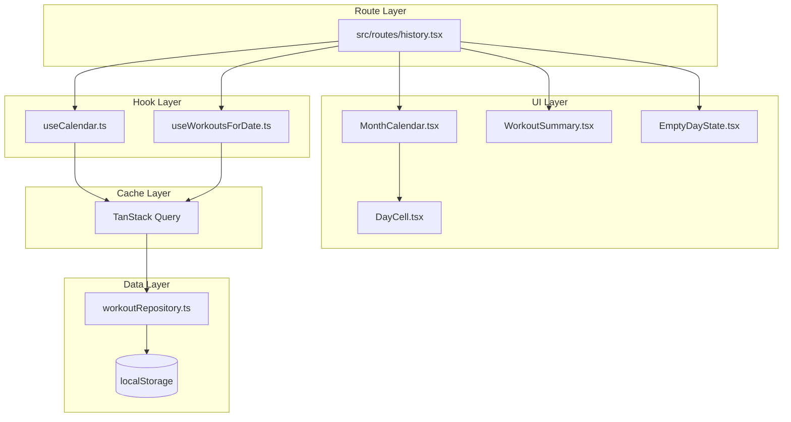

# 履歴画面

**関連 Spec:** [index_spec.md](index_spec.md)
**関連 PRD:** [index.md](../../requirement/history/index.md)

---

# 1. 実装ステータス

**ステータス:** 🔴 未実装

| モジュール/機能 | ステータス | 備考 |
|-------------|--------|------|
| useCalendar フック | 🔴 未実装 | カレンダー状態管理 |
| useWorkoutsForDate フック | 🔴 未実装 | TanStack Query + workoutRepository |
| MonthCalendar コンポーネント | 🔴 未実装 | カレンダーグリッドUI |
| WorkoutSummary コンポーネント | 🔴 未実装 | 記録サマリー表示 |
| EmptyDayState コンポーネント | 🔴 未実装 | 空状態UI |
| history ルート | 🔴 未実装 | TanStack Router ルート定義 |

---

# 2. 設計目標

- **データ層の設計**: `workoutRepository`（localStorage CRUD）を新規実装し、TanStack Query でキャッシュ管理をラップする。workout design doc のインターフェース仕様（[workout/index_design.md](../workout/index_design.md)）に準拠
- **コンポーネント分離**: カレンダーUI、サマリー表示、空状態を独立コンポーネントとし、単体テスト可能にする
- **ローカル状態のみ**: カレンダーの表示月と選択日はコンポーネントローカル状態（useState / カスタムフック）で管理。Zustand グローバルストアは不要
- **TanStack Query によるキャッシュ**: ワークアウト日一覧の取得を TanStack Query で管理し、画面復帰時の自動再取得とキャッシュ無効化を実現
- **モバイルファースト**: 日付セルは視覚サイズ36px（`w-9 h-9`）、グリッドセル領域でタップターゲット44px相当を確保（T-003、design-system.html FRAME3 準拠）

---

# 3. 技術スタック

| 領域 | 採用技術 | 選定理由 |
|------|--------|--------|
| 言語 | TypeScript (.tsx) | プロジェクト全体がTypeScript strict mode（T-001） |
| カレンダーロジック | 自作（date-fns ユーティリティ活用） | カレンダーUIライブラリ（react-calendar等）は過剰。月のグリッド生成は純粋関数で十分実現可能。date-fnsは既にプロジェクトで使用可能（A-001: 自作の明確な理由あり） |
| ルーティング | TanStack Router | CONSTITUTION v3.0.0 準拠。ファイルベース型安全ルーティング |
| データフェッチ/キャッシュ | TanStack Query | CONSTITUTION v3.0.0 準拠。workoutRepository をラップし、キャッシュ管理・自動再取得を実現 |
| UIコンポーネント | shadcn/ui + Radix UI | CONSTITUTION v3.0.0 準拠。Button 等の基本コンポーネントに利用 |
| 状態管理 | React useState + カスタムフック | カレンダー状態は画面ローカル。Zustandに載せる必要はない |
| データ取得 | workoutRepository | localStorage CRUD 層。workout design doc のインターフェース仕様に準拠して新規実装（A-002, B-001） |
| スタイリング | Tailwind CSS | プロジェクト標準のスタイリング手法 |

---

# 4. アーキテクチャ

## 4.1. システム構成図



## 4.2. モジュール分割

### 新規モジュール

| モジュール名 | 責務 | 依存関係 | 配置場所 |
|-----------|------|---------|--------|
| dateStringSchema | "YYYY-MM-DD" の Zod スキーマ + DateString branded type + ヘルパー関数 | Zod | `src/schemas/date.ts` |
| history ルート | 履歴画面のルート定義 | useCalendar, useWorkoutsForDate, UI components | `src/routes/history.tsx` |
| useCalendar | 表示月・選択日・ワークアウト日集合の管理 | TanStack Query, workoutRepository | `src/hooks/useCalendar.ts` |
| useWorkoutsForDate | 指定日付のワークアウト記録取得 | TanStack Query, workoutRepository | `src/hooks/useWorkoutsForDate.ts` |
| MonthCalendar | カレンダーグリッドUI（7列 × 最大6行） | shadcn/ui Button | `src/components/MonthCalendar.tsx` |
| DayCell | 個別の日付セル（状態に応じたスタイリング） | なし（props） | `src/components/DayCell.tsx` |
| WorkoutSummary | 選択日のワークアウト記録サマリー表示 | shadcn/ui Card | `src/components/WorkoutSummary.tsx` |
| EmptyDayState | 記録なし日の空状態UI + 追加ボタン | shadcn/ui Button | `src/components/EmptyDayState.tsx` |
| calendarUtils | 月のグリッド生成、日付比較等の純粋関数 | なし | `src/lib/calendarUtils.ts` |

### 前提モジュール（他機能で実装）

| モジュール名 | 依存内容 | 配置場所 |
|-----------|---------|--------|
| workoutRepository | localStorage CRUD（listByDateDesc, listByDate） | `src/lib/workoutRepository.ts` |
| __root.tsx | ルートレイアウト。履歴ルートへのナビゲーションリンクを含む | `src/routes/__root.tsx` |

---

# 5. データモデル

```typescript
// -------------------------------------------------------
// DateString スキーマ (src/schemas/date.ts)
// -------------------------------------------------------

import { z } from 'zod'

export const dateStringSchema = z.string().regex(/^\d{4}-\d{2}-\d{2}$/)
export type DateString = string & { readonly __brand: 'DateString' }

/** 文字列を DateString にパース。無効な形式は ZodError をスロー */
export function toDateString(value: string): DateString {
  dateStringSchema.parse(value)
  return value as DateString
}

/** 今日の日付を DateString で返す */
export function todayDateString(): DateString {
  return new Date().toISOString().slice(0, 10) as DateString
}

// -------------------------------------------------------
// src/lib/calendarUtils.ts - カレンダーグリッド生成
// -------------------------------------------------------

/** カレンダーグリッドの1日分 */
interface CalendarDay {
  date: DateString
  dayOfMonth: number    // 1-31
  isCurrentMonth: boolean  // 表示月に属するか
  isToday: boolean
  hasWorkout: boolean
}

/** カレンダーグリッド（6行 × 7列） */
type CalendarGrid = CalendarDay[][]

/**
 * 指定年月のカレンダーグリッドを生成する純粋関数
 * 前月・次月の日付も含めて6行×7列のグリッドを返す
 */
function generateCalendarGrid(
  year: number,
  month: number,        // 1-indexed
  workoutDates: Set<DateString>
): CalendarGrid
```

---

# 6. インターフェース定義

```typescript
// -------------------------------------------------------
// TanStack Query キー定義
// -------------------------------------------------------

const queryKeys = {
  workoutDates: (year: number, month: number) => ['workoutDates', year, month] as const,
  workoutsForDate: (date: DateString | null) => ['workoutsForDate', date] as const,
}

// -------------------------------------------------------
// useCalendar (src/hooks/useCalendar.ts)
// -------------------------------------------------------

interface UseCalendarReturn {
  selectedDate: DateString | null
  displayMonth: { year: number; month: number }
  goToPrevMonth: () => void
  goToNextMonth: () => void
  selectDate: (date: DateString) => void
  daysWithWorkouts: Set<DateString>
}

function useCalendar(): UseCalendarReturn
// 初期値: displayMonth = 今月, selectedDate = null
// goToPrevMonth/goToNextMonth: displayMonthを±1し、selectedDateをnullにリセット
//
// daysWithWorkouts の取得:
//   useQuery({
//     queryKey: queryKeys.workoutDates(displayMonth.year, displayMonth.month),
//     queryFn: () => {
//       const all = workoutRepository.listByDateDesc()
//       return new Set(all
//         .filter(w => w.date が displayMonth に属する)
//         .map(w => w.date))
//     },
//     staleTime: 0,  // 画面復帰時に常に再取得
//   })
//
// タブ復帰時の状態保持:
//   TanStack Router はルートコンポーネントをアンマウントしないため、
//   useState 状態（displayMonth, selectedDate）は自然に維持される。
//   daysWithWorkouts は staleTime: 0 によりウィンドウフォーカス時に自動再取得される。

// -------------------------------------------------------
// useWorkoutsForDate (src/hooks/useWorkoutsForDate.ts)
// -------------------------------------------------------

function useWorkoutsForDate(date: DateString | null): WorkoutRecord[]
// TanStack Query でラップ:
//   useQuery({
//     queryKey: queryKeys.workoutsForDate(date),
//     queryFn: () => workoutRepository.listByDate(date!),
//     enabled: date !== null,
//   })
// dateがnullの場合はクエリ無効化（enabled: false）で空配列を返す

// -------------------------------------------------------
// MonthCalendar (src/components/MonthCalendar.tsx)
// -------------------------------------------------------

interface MonthCalendarProps {
  displayMonth: { year: number; month: number }
  selectedDate: DateString | null
  daysWithWorkouts: Set<DateString>
  onPrevMonth: () => void
  onNextMonth: () => void
  onSelectDate: (date: DateString) => void
}

// シェブロンボタン: shadcn/ui Button variant="ghost" を使用
// min-h-[44px] min-w-[44px] でタップターゲット確保（T-003）

// -------------------------------------------------------
// DayCell (src/components/DayCell.tsx)
// -------------------------------------------------------

interface DayCellProps {
  day: CalendarDay
  isSelected: boolean
  onSelect: (date: DateString) => void
}

// 状態に応じたTailwindクラス:
// - default (当月・記録なし):  text-zinc-400
// - hasWorkout (記録あり):     text-black font-medium + 赤ドット
// - today (今日):              bg-black text-white rounded-full
// - todayWithWorkout:          bg-black text-white rounded-full + 赤ドット
// - selected:                  ring-2 ring-black ring-offset-2 font-bold
// - otherMonth (前月/次月):    text-zinc-200（タップ不可）
//
// セルサイズ: w-9 h-9（36px視覚サイズ）、グリッドセル領域でタップターゲット44px相当を確保（T-003、design-system.html FRAME3 準拠）

// -------------------------------------------------------
// WorkoutSummary (src/components/WorkoutSummary.tsx)
// -------------------------------------------------------

interface WorkoutSummaryProps {
  date: DateString
  workouts: WorkoutRecord[]
}

// shadcn/ui Card でラップ
// 表示形式:
// 日付ヘッダー: "10月20日の記録"
// 同日に複数ワークアウトがある場合はワークアウトごとにセクション分割して縦に並べる
// 各ワークアウト内:
//   種目名（太字）
//   SET1  100kg × 10回
//   SET2  100kg × 8回
// 削除済み種目は exerciseName をそのまま表示（特別な表示なし）

// -------------------------------------------------------
// EmptyDayState (src/components/EmptyDayState.tsx)
// -------------------------------------------------------

interface EmptyDayStateProps {
  date: DateString
  onAddWorkout: (date: DateString) => void
}

// 表示: 「記録なし」テキスト + shadcn/ui Button（追加ボタン）
// 追加ボタン: min-h-[44px] min-w-[44px]（T-003）
// onAddWorkout → useNavigate({ to: '/', search: { startDate: date } })
//   + startSession(date) でワークアウト開始

// -------------------------------------------------------
// history ルート (src/routes/history.tsx)
// -------------------------------------------------------

// TanStack Router のファイルベースルーティングにより自動登録
// createFileRoute('/history') で定義
// useCalendar, useWorkoutsForDate を組み合わせてカレンダーとサマリーを表示

// -------------------------------------------------------
// 型の設計判断
// -------------------------------------------------------

// spec の WorkoutSummaryData 型は独立した型として定義しない。
// WorkoutSummary は WorkoutRecord[] を直接 props で受け取り、
// コンポーネント内で表示形式に変換する。

// spec の DayCellState 型は DayCell 内部で CalendarDay フィールド
// + isSelected から派生的に計算する。DayCellProps には含めない。
```

---

# 7. 非機能要件実現方針

| 要件 | 実現方針 |
|------|--------|
| 操作性（NFR-001）: 月遷移の即時性 | useState による displayMonth の更新は同期的。カレンダーグリッド生成は純粋関数で計算コストO(42)（6行×7列）。TanStack Query のキャッシュにより2回目以降の月遷移は即座に完了 |
| 操作性（NFR-002）: 日付タップからサマリー表示 | selectedDate の useState 更新でサマリーを条件レンダリング。TanStack Query が workoutRepository.listByDate() の結果をキャッシュするため、同じ日付の再選択時は即座に表示 |
| アクセシビリティ（NFR-003）: タップターゲット | DayCell は視覚サイズ `w-9 h-9`（36px）、グリッドセル領域でタップターゲット44px相当を確保。シェブロンボタン・追加ボタンは `min-h-[44px] min-w-[44px]` を確保（T-003、design-system.html FRAME3 準拠） |
| エラー耐性（T-002）: workoutRepository エラー | TanStack Query の onError コールバックで console.error ログ出力。エラー時は空の Set / 空配列にフォールバック |

---

# 8. テスト戦略

| テストレベル | 対象 | カバレッジ目標 |
|-----------|------|------------|
| ユニットテスト | calendarUtils（グリッド生成、日付判定） | 全分岐（D-001: TDD） |
| ユニットテスト | useCalendar（月遷移、日付選択、TanStack Query連携） | 全アクション |
| ユニットテスト | useWorkoutsForDate（null / 記録あり / 記録なし） | 全分岐 |
| コンポーネントテスト | MonthCalendar（グリッド表示、シェブロン操作） | FR-001, FR-002 |
| コンポーネントテスト | DayCell（5状態の表示、タップイベント） | FR-003, FR-004, FR-009, FR-010 |
| コンポーネントテスト | WorkoutSummary（種目・セット表示） | FR-005, FR-006 |
| コンポーネントテスト | EmptyDayState（テキスト表示、追加ボタン） | FR-007, FR-008 |
| 統合テスト | history ルート（カレンダー + サマリー連携） | 全FR |
| E2Eテスト | 履歴画面フロー（Playwright） | 主要ユーザーフロー |

---

# 9. 設計判断

## 9.1. 決定事項

| 決定事項 | 選択肢 | 決定内容 | 理由 |
|---------|--------|--------|------|
| カレンダーUI | react-calendar / date-picker ライブラリ vs 自作 | 自作（calendarUtils + MonthCalendar） | カレンダーライブラリはスタイリングの自由度が低く、shadcn/ui・Tailwindとの統合が煩雑。必要な機能は月グリッド生成と日付選択のみで、純粋関数で十分実現可能。依存を増やさない（A-001: 自作の明確な理由あり） |
| ルーティング | Zustand 状態ベース vs TanStack Router | TanStack Router（ファイルベース） | CONSTITUTION v3.0.0 で TanStack Router が必須技術に指定。`src/routes/history.tsx` として定義 |
| データフェッチ/キャッシュ | 直接 workoutRepository 呼び出し vs TanStack Query | TanStack Query | CONSTITUTION v3.0.0 準拠。staleTime: 0 で画面復帰時の自動再取得を実現。キャッシュによる2回目以降の高速表示 |
| UIコンポーネント基盤 | 全自作 vs shadcn/ui 活用 | shadcn/ui（Button, Card 等） | CONSTITUTION v3.0.0 準拠。DayCell 等のカレンダー固有コンポーネントは自作、汎用コンポーネント（Button, Card）は shadcn/ui を使用 |
| 状態管理 | Zustand グローバルストア vs React ローカル状態 | React ローカル状態（useCalendar フック） | カレンダーの表示月・選択日は画面ローカルな関心事。他の画面から参照する必要がないためグローバルストアは不要 |
| ワークアウト日の取得方法 | 月ごとにフィルタリング vs 全件取得してメモリでフィルタ | 全件取得してメモリでフィルタ | workoutRepository.listByDateDesc() で全件取得し、表示月の日付をSetに変換。ローカルアプリで件数が限定的（数百件程度）なため、月ごとのインデックス構築は過剰 |
| 赤ドットマーカーの色 | デザインシステム参照 | accent色（#DE3A2B / `bg-accent`） | `.sdd/design-system.html` で定義済みのアクセントカラーに準拠 |
| 今日の日付セルの色 | デザインシステム参照 | 黒塗り（`bg-black text-white rounded-full`） | PRDの「黒塗りで強調表示」に準拠。他の日付と明確に区別可能 |
| DayCell の非当月日表示 | 非表示 vs 薄く表示 | 薄く表示（`text-zinc-200`、タップ不可） | カレンダーグリッドの形状を維持し、空白セルによるレイアウト崩れを防ぐ |
| 未来日付の扱い | タップ可能 vs タップ不可 | タップ可能（当月の日付と同じ扱い） | 未来日付でもワークアウト追加の導線を提供。空状態UIの「追加」ボタンで未来日付のセッション開始が可能 |
| タブ復帰時の状態保持 | TanStack Router ルート状態保持 | TanStack Router のデフォルト動作 | TanStack Router はルートコンポーネントをアンマウントしないため、useState 状態は自然に維持される。daysWithWorkouts は TanStack Query の staleTime: 0 + refetchOnWindowFocus で自動再取得 |
| 同日複数ワークアウト表示 | フラット統合 vs セクション分割 | セクション分割（ワークアウトごとに縦に並べる） | 各トレーニングセッションの区切りが明確になり、ユーザーが記録の時系列を把握しやすい |
| 削除済み種目の表示 | ラベル付き vs そのまま表示 | exerciseNameをそのまま表示 | WorkoutExercise.exerciseName はスナップショットとして保存されているため、削除済みかどうかの判定コストを避ける。ユーザーにとっても過去記録の名前が変わらない方が自然 |
| カレンダーマーカー更新 | 画面表示ごと vs 月遷移時のみ | 画面表示（フォーカス復帰）のたびに再取得 | TanStack Query の refetchOnWindowFocus + staleTime: 0 で実現。別画面でのWO追加/削除が即座に反映される |
| calendarUtils 配置 | src/utils/ vs src/lib/ | src/lib/ | CONSTITUTION v3.0.0 のモジュール構成で `src/utils/` は廃止、`src/lib/` に統合 |
| 日付の型表現 | 素の `string` vs `Date` vs Zod branded type | Zod branded type（`DateString`） | 素の `string` では任意の文字列が型チェックを通過する。`Date` はタイムゾーン問題・localStorage非互換。Zod branded type は境界でパースし内部は型安全に流通でき、CONSTITUTION v3.0.0 の Zod 活用方針に合致。スキーマは `src/schemas/date.ts` に配置 |

## 9.2. 未解決の課題

*未解決の課題なし（実装開始可能）*
