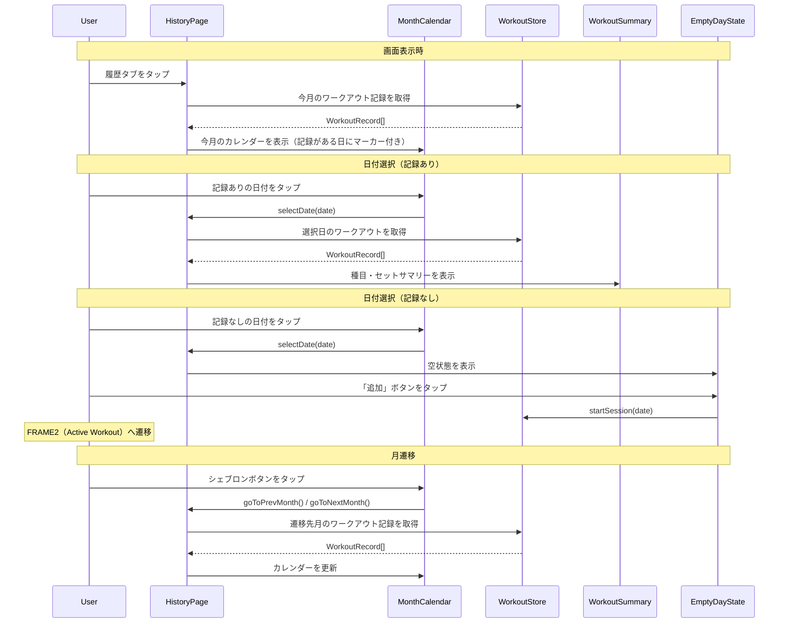

# 履歴画面

**関連 Design Doc:** [index_design.md](index_design.md)

**関連 PRD:** [index.md](../../requirement/history/index.md)

---

# 1. 背景

ユーザーが過去のトレーニング実績を月単位で俯瞰し、日付を選択して詳細を確認できる画面が必要である。

また、記録がない日にはワークアウト追加への導線を提供し、過去日付でのトレーニング記録を可能にする。

# 2. 概要

履歴画面は以下の責務を持つ:

- **月表示カレンダー**: 7列（日〜土）のカレンダーグリッドで月単位の表示。前月・次月への遷移が可能
- **トレーニング日マーカー**: ワークアウト記録がある日を視覚的に識別可能にする
- **日付選択とサマリー表示**: 日付タップで選択状態にし、その日の記録を種目・セット単位で表示
- **空状態とワークアウト追加導線**: 記録がない日にはワークアウト追加への導線を提供
- **今日の強調表示**: 今日の日付を他と区別して表示

設計原則:

- **データモデルの共有**: `WorkoutRecord` / `workoutRepository` を workout モジュールと共有し、履歴画面固有のデータ層は追加しない
- **コンポーネント分離**: カレンダーUI、サマリー表示、空状態をそれぞれ独立したコンポーネントとする
- **URL駆動の状態管理**: カレンダーの表示月と選択日を TanStack Router の search params で管理し、タブ切替・ブラウザバックでも状態を保持

# 3. 要求定義

## 3.1. 機能要件 (Functional Requirements)

| ID | 要件 | 優先度 | PRD参照 | 検証方法 |
|----|------|--------|---------|---------|
| FR-001 | 月表示カレンダーグリッド（7列: 日〜土）を表示する | 必須 | FR_013 | Test |
| FR-002 | 左右のシェブロンボタンで前月・次月に遷移できる | 必須 | FR_013 | Test |
| FR-003 | ワークアウト記録がある日に赤ドットマーカーを表示する | 必須 | FR_014 | Test |
| FR-004 | 記録がある日の日付テキストを強調し、記録がない日は控えめに表示する | 必須 | FR_014 | Test |
| FR-005 | 日付タップでリングハイライトの選択状態にし、カレンダー下部にワークアウト記録サマリーを表示する | 必須 | FR_015 | Test |
| FR-006 | サマリーは種目名とセット一覧（重量 × 回数）を表示する。同日に複数ワークアウトがある場合はワークアウトごとにセクション分割して縦に並べる | 必須 | FR_015 | Test |
| FR-007 | 記録がない日を選択した場合、空状態UI（「記録なし」テキスト + 追加ボタン）を表示する | 必須 | FR_026 | Test |
| FR-008 | 空状態の「追加」ボタンタップでFRAME2（Active Workout）へ遷移し、選択日付でセッション開始する | 必須 | FR_026 | Test |
| FR-009 | 今日の日付セルを塗りつぶし背景で強調表示する（具体的な色はdesign docで決定） | 必須 | FR_027 | Test |
| FR-010 | 今日にトレーニング記録がある場合、強調表示と赤ドットを併せて表示する | 必須 | FR_027 | Test |
| FR-011 | 未来の日付もタップ可能とし、記録なしの場合は空状態UIを表示する（追加ボタンで未来日付のワークアウト開始可能） | 必須 | - | Test |

## 3.2. 非機能要件 (Non-Functional Requirements)

| ID | カテゴリ | 要件 | 目標値 | 検証方法 |
|----|--------|------|--------|---------|
| NFR-001 | 操作性 | カレンダーの月遷移がユーザーに待機感を与えないこと | 瞬時（具体的なフレーム目標はdesign docで定義） | Test |
| NFR-002 | 操作性 | 日付タップからサマリー表示までが即座に行われること | 100ms以内にサマリー表示 | Test |
| NFR-003 | アクセシビリティ | タップターゲットが十分なサイズであること | 日付セルのタップ領域が44px × 44px相当（視覚サイズ36px + グリッドセル領域で確保。T-003） | Inspection |

# 4. API

履歴画面が外部（UIレイヤー・他モジュール）に公開するインターフェース。

| モジュール | インターフェース | メンバー | 概要 |
|---------|--------------|--------|------|
| history | HistoryPage | (component) | 履歴画面のルートコンポーネント |
| history | MonthCalendar | (component) | shadcn/ui Calendar ベースの月表示カレンダーコンポーネント |
| history | WorkoutSummary | (component) | 選択日のワークアウト記録サマリー |
| history | EmptyDayState | (component) | 記録なし日の空状態コンポーネント |
| history | useWorkoutsForDate | (hook) | 指定日付のワークアウト記録を取得するフック。内部で TanStack Query + workoutRepository.listByDate() を使用 |
| history | DateString | (type) | "YYYY-MM-DD" 形式の branded type（Zod スキーマで検証。`src/schemas/date.ts`） |
| history | useCalendar | selectedDate | 現在選択中の日付（DateString \| null）。search params から取得 |
| history | useCalendar | displayMonth | 表示中の年月。search params から取得（デフォルト: 今月） |
| history | useCalendar | goToPrevMonth() | 前月に遷移 |
| history | useCalendar | goToNextMonth() | 次月に遷移 |
| history | useCalendar | selectDate(date) | 日付を選択 |
| history | useCalendar | daysWithWorkouts | 表示月内のワークアウト記録がある日付の集合（TanStack Query でキャッシュ管理） |

## 4.1. 型定義

```typescript
// 日付型（Zod branded type）
// "YYYY-MM-DD" 形式の文字列。境界（ユーザー入力・localStorage読み出し）で
// Zod パースし、内部は DateString として流通させる。
// スキーマ定義は src/schemas/date.ts に配置。
type DateString = string & { readonly __brand: 'DateString' }

// カレンダーフック
type UseCalendar = () => {
  selectedDate: DateString | null
  displayMonth: { year: number; month: number }  // 1-indexed month
  goToPrevMonth: () => void
  goToNextMonth: () => void
  selectDate: (date: DateString) => void
  daysWithWorkouts: Set<DateString>
}

// カレンダー日付セルの状態
type DayCellState = 'default' | 'hasWorkout' | 'today' | 'todayWithWorkout' | 'selected'

// ワークアウトサマリーの表示データ
interface WorkoutSummaryData {
  date: DateString
  exercises: {
    exerciseName: string
    sets: { weight: number; reps: number }[]
  }[]
}
```

# 5. 用語集

| 用語 | 説明 |
|------|------|
| DateString | "YYYY-MM-DD" 形式の branded type。Zod スキーマで実行時検証し、型安全に日付を扱う |
| 表示月 | カレンダーに表示している年月。初期値は今月 |
| 選択日 | ユーザーがタップして選択した日付。サマリー表示の対象 |
| 赤ドットマーカー | ワークアウト記録がある日付の下部に表示するインジケーター |
| 空状態 | 選択日にワークアウト記録がない場合に表示するUI |
| サマリー | 選択日のワークアウト記録の概要（種目名 + セット一覧） |

# 6. 使用例

```tsx
// HistoryPage - カレンダーとサマリーの統合（src/routes/history.tsx）
// URL例: /history?month=2026-04&date=2026-04-09
export const Route = createFileRoute('/history')({
  validateSearch: z.object({
    month: z.string().regex(/^\d{4}-\d{2}$/).optional(),
    date: dateStringSchema.optional(),
  }),
})

function HistoryPage() {
  // useCalendar は内部で Route.useSearch() を使い search params を読み書きする
  const { selectedDate, displayMonth, goToPrevMonth, goToNextMonth, selectDate, daysWithWorkouts } = useCalendar()
  const workouts = useWorkoutsForDate(selectedDate)
  const navigate = useNavigate()

  const handleAddWorkout = (date: DateString) => {
    navigate({ to: '/', search: { startDate: date } })
  }

  return (
    <div>
      <h1>履歴</h1>
      <MonthCalendar
        displayMonth={displayMonth}
        selectedDate={selectedDate}
        daysWithWorkouts={daysWithWorkouts}
        onPrevMonth={goToPrevMonth}
        onNextMonth={goToNextMonth}
        onSelectDate={selectDate}
      />
      {selectedDate && (
        workouts.length > 0
          ? <WorkoutSummary date={selectedDate} workouts={workouts} />
          : <EmptyDayState date={selectedDate} onAddWorkout={handleAddWorkout} />
      )}
    </div>
  )
}
```

# 7. 振る舞い図

## カレンダー操作フロー



# 8. 制約事項

- データ取得は `workoutRepository` 経由でlocalStorageから行う。サーバー通信は行わない（A-002, B-001）
- TypeScript strict mode を遵守する（T-001）
- 日付セルの視覚サイズは `w-9 h-9`（36px）、グリッドセル領域でタップターゲット44px相当を確保する（T-003、design-system.html FRAME3 準拠）
- カレンダーUIは shadcn/ui Calendar（react-day-picker ベース）を使用する（A-001: Library-First）
- 履歴画面はデータの閲覧専用であり、既存記録の編集・削除機能は含まない
- 削除済み種目を含む過去のワークアウトは、保存済みの `exerciseName` をそのまま表示する（削除済みラベル等の特別な表示は行わない）
- 他タブに切り替えて履歴画面に戻った際、カレンダーの表示月と選択日は保持される（TanStack Router の search params による URL 状態管理）
- カレンダーマーカー（daysWithWorkouts）は履歴画面が表示されるたびに最新データを再取得する（TanStack Query のキャッシュ無効化による）
- 空状態からのワークアウト追加は、既存の workout モジュールの `startSession(date)` を呼び出し、TanStack Router でトレーニング画面（`/`）へ遷移する（[workout/index_spec.md](../workout/index_spec.md) FR-001 参照）

---

## PRD整合性確認

| PRD要求ID | 要件 | Spec対応箇所 |
|----------|------|------------|
| FR_013 | 月表示カレンダーを表示（前月・次月遷移可能） | FR-001, FR-002, MonthCalendar コンポーネント |
| FR_014 | トレーニング記録がある日に赤ドットマーカーを表示 | FR-003, FR-004, useCalendar.daysWithWorkouts |
| FR_015 | 日付タップでその日のセット単位の記録サマリーを表示 | FR-005, FR-006, WorkoutSummary コンポーネント |
| FR_026 | 記録なし日の空状態表示と追加導線 | FR-007, FR-008, EmptyDayState コンポーネント |
| FR_027 | 今日の日付を強調表示 | FR-009, FR-010, DayCellState 型 |
