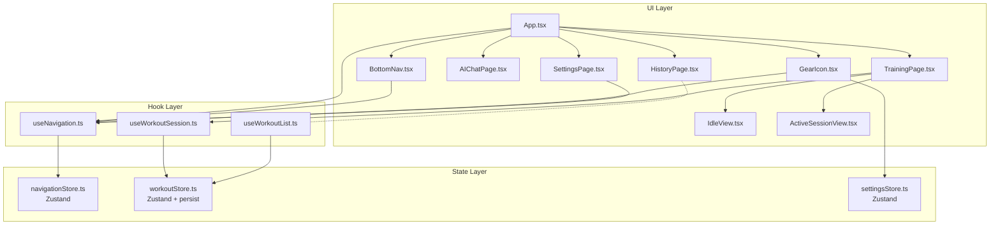

# ページナビゲーション

**関連 Spec:** [navigation_spec.md](navigation_spec.md)
**関連 PRD:** [navigation.md](../requirement/navigation.md)

---

# 1. 実装ステータス

**ステータス:** 🔴 未実装（再設計）

> v1.x（2026-03-29）で2ルート + FAB構成を実装済みだったが、PRD準拠の再設計に伴い
> 4ルート + AIボタン + 歯車アイコン構成へ刷新する。旧実装は破棄済み。

| モジュール/機能 | ステータス | 備考 |
|-------------|--------|------|
| navigationStore | 🔴 未実装 | 4ルート + previousRoute 対応 |
| useNavigation フック | 🔴 未実装 | previousRoute 追加 |
| BottomNav コンポーネント | 🔴 未実装 | 2タブ + AI専用ボタン（旧FAB構成から変更） |
| GearIcon コンポーネント | 🔴 未実装 | 新規。歯車アイコン + APIキーバッジ |
| TrainingPage | 🔴 未実装 | Idle/Active の二面表示 |
| HistoryPage | 🔴 未実装 | プレースホルダー（中身は別design） |
| AIChatPage | 🔴 未実装 | 新規。プレースホルダー（中身は別design） |
| SettingsPage | 🔴 未実装 | 新規。プレースホルダー（中身は別design） |
| App.tsx リファクタリング | 🔴 未実装 | 4ルート + GearIcon + BottomNav統合 |
| workoutStore persist | 🔴 未実装 | Zustand persist ミドルウェア追加 |

---

# 2. 設計目標

- **PRD完全準拠**: 5つの論理画面（FRAME1〜5）、4ルート、BottomNav（2タブ + AIボタン）、歯車アイコンをすべて実現する
- **デザインシステム準拠**: `.sdd/design-system.html` のレイアウト・スタイルを忠実に再現する
- **レイアウト安定性**: BottomNavの構成（2タブ + AIボタン）は全画面で一定。歯車アイコンの位置も固定（T-003）
- **セッション安全性**: ページ遷移やリロードでセッションデータが失われない（B-001: ローカルストレージ完結）
- **TypeScript strict mode**: すべてのファイルを `.ts`/`.tsx` で記述し、型安全を維持する（T-001）

---

# 3. 技術スタック

| 領域 | 採用技術 | 選定理由 |
|------|--------|--------|
| 言語 | TypeScript（.ts / .tsx） | T-001準拠。型安全なルート管理が可能 |
| ルーティング | Zustand（状態ベース） | A-001例外として承認要。4ルートのみで TanStack Router は過剰。詳細は設計判断 9.1 を参照 |
| セッション永続化 | Zustand persist + localStorage | 既存 workoutStore に persist ミドルウェアを追加（B-001準拠: サーバー送信なし） |
| スタイリング | Tailwind CSS | デザインシステム準拠。BottomNav / GearIcon のスタイルを再現 |
| アイコン | @phosphor-icons/react | デザインシステムが Phosphor Icons を使用（ph-barbell, ph-clock-counter-clockwise, ph-robot, ph-gear）。OSSライセンス対応（A-001） |

---

# 4. アーキテクチャ

## 4.1. システム構成図



## 4.2. モジュール分割

### 新規モジュール

| モジュール名 | 責務 | 依存関係 | 配置場所 |
|-----------|------|---------|--------|
| navigationStore | ルーティング状態管理（currentRoute, previousRoute） | なし | `src/stores/navigationStore.ts` |
| useNavigation | ルーティングフック（currentRoute, navigate, previousRoute） | navigationStore | `src/hooks/useNavigation.ts` |
| BottomNav | 2タブ（トレ / 履歴）+ AI専用pill型ボタン | useNavigation | `src/components/BottomNav.tsx` |
| GearIcon | 歯車アイコン + APIキー未設定バッジ | useNavigation, settingsStore | `src/components/GearIcon.tsx` |
| TrainingPage | トレーニングページ（Idle/Active 切り替え） | useWorkoutSession | `src/pages/TrainingPage.tsx` |
| IdleView | Idle画面（挨拶・開始ボタン） | useWorkoutSession | `src/components/IdleView.tsx` |
| HistoryPage | 履歴ページ（プレースホルダー。中身は別design） | なし | `src/pages/HistoryPage.tsx` |
| AIChatPage | AIチャットページ（プレースホルダー。中身は別design） | なし | `src/pages/AIChatPage.tsx` |
| SettingsPage | 設定ページ（プレースホルダー。中身は別design。Xボタンで戻る） | useNavigation | `src/pages/SettingsPage.tsx` |

### 既存モジュールの変更

| モジュール名 | 変更内容 | 配置場所 |
|-----------|---------|--------|
| App.tsx | 4ルートの条件レンダリング + GearIcon + BottomNav 統合 | `src/App.tsx` |
| workoutStore.ts | Zustand `persist` ミドルウェア追加 | `src/stores/workoutStore.ts` |
| types/index.ts | Route 型を4ルートに拡張、NavRoute 型追加 | `src/types/index.ts` |

---

# 5. データモデル

```typescript
// navigationStore の状態
interface NavigationState {
  currentRoute: Route
  previousRoute: NavRoute | null  // settings遷移前のルート
}

interface NavigationActions {
  navigate: (route: Route) => void
}

// workoutStore に追加される persist 設定
// 既存の draftDate, draftExercises, draftMemo, draftWorkoutId を永続化対象とする
type WorkoutSessionPersistedKeys = Pick<
  WorkoutState,
  'draftDate' | 'draftExercises' | 'draftMemo' | 'draftWorkoutId'
>
```

---

# 6. インターフェース定義

```typescript
// -------------------------------------------------------
// types/index.ts（型定義）
// -------------------------------------------------------

// 4つの論理ルート
type Route = 'training' | 'history' | 'ai' | 'settings'

// BottomNavで遷移可能なルート（settingsは歯車アイコンからのみ遷移）
type NavRoute = Exclude<Route, 'settings'>

// -------------------------------------------------------
// navigationStore (src/stores/navigationStore.ts)
// -------------------------------------------------------

interface NavigationStore {
  currentRoute: Route
  previousRoute: NavRoute | null
  navigate: (route: Route) => void
}

const useNavigationStore = create<NavigationStore>()((set, get) => ({
  currentRoute: 'training',
  previousRoute: null,
  navigate: (route) => {
    const current = get().currentRoute
    if (route === 'settings' && current !== 'settings') {
      // settings遷移時に戻り先を記録
      set({ currentRoute: route, previousRoute: current as NavRoute })
    } else {
      set({ currentRoute: route })
    }
  },
}))

// -------------------------------------------------------
// useNavigation (src/hooks/useNavigation.ts)
// -------------------------------------------------------

interface UseNavigationReturn {
  currentRoute: Route
  navigate: (route: Route) => void
  previousRoute: NavRoute | null
}

function useNavigation(): UseNavigationReturn

// -------------------------------------------------------
// BottomNav (src/components/BottomNav.tsx)
// -------------------------------------------------------

// Props: なし（内部で useNavigation を使用）
// レイアウト（PRD IR_001 / design-system.html 準拠）:
//   ┌──────────┬──────────┬──────────────────┐
//   │  トレ     │  履歴    │   [ 🤖 AI ]      │
//   └──────────┴──────────┴──────────────────┘
//     2タブ（均等 flex-1）    AI専用ボタン（pill型）
//
// Tailwind クラス（design-system.html 準拠）:
//   コンテナ: h-24 bg-white/80 backdrop-blur-xl border-t border-zinc-200/50
//            flex items-start pt-3 px-4
//
// タブ状態:
//   アクティブ: ph-fill text-black font-bold（text-[10px]）
//   非アクティブ: text-zinc-400 font-medium（text-[10px]）
//
// AIボタン:
//   通常: bg-black text-white rounded-2xl px-4 h-11 border border-zinc-800
//   アクティブ（FRAME4）: bg-accent text-white shadow-lg shadow-red-200
//   アイコン: ph-bold ph-robot text-xl + "AI" text-xs font-bold
//
// 内部タブ定義（静的）:
// const NAV_TABS: NavTab[] = [
//   { route: 'training', label: 'トレ', icon: <PhBarbell />, activeIcon: <PhBarbell weight="fill" /> },
//   { route: 'history',  label: '履歴', icon: <PhClockCounterClockwise />, activeIcon: <PhClockCounterClockwise weight="fill" /> },
// ]
//
// 表示条件: FRAME1〜4で表示、FRAME5（settings）では App.tsx 側で非表示

// -------------------------------------------------------
// GearIcon (src/components/GearIcon.tsx)
// -------------------------------------------------------

// Props: なし（内部で useNavigation, settingsStore を使用）
//
// Tailwind クラス（design-system.html / PRD IR_002 準拠）:
//   位置: absolute top-12 right-4 z-30
//   ボタン: w-9 h-9 rounded-full bg-white/80 backdrop-blur-sm
//          shadow-sm border border-zinc-100
//   アイコン: ph ph-gear text-base text-zinc-500
//
// APIキー未設定バッジ:
//   位置: absolute top-[-2px] right-[-2px]
//   スタイル: w-3 h-3 bg-accent rounded-full border-2 border-white
//
// FRAME2（Active Workout）追加要素:
//   歯車の右隣に「終了」ボタン:
//     text-accent text-sm font-bold bg-red-50/90 backdrop-blur-sm px-3 py-1.5 rounded-lg
//   ボタン群の下にタイマーpill:
//     flex items-center gap-1 bg-white/80 backdrop-blur-sm px-2 py-1 rounded-lg shadow-sm border border-zinc-100
//     アイコン: ph-fill ph-clock text-accent text-xs
//     テキスト: font-outfit font-bold text-xs
//
// 表示条件: FRAME1〜4で表示、FRAME5（settings）では App.tsx 側で非表示

interface GearIconProps {
  showEndButton?: boolean  // FRAME2のみtrue
  elapsedTime?: string     // FRAME2のみ。"00:14:32" 形式
  onEndSession?: () => void  // FRAME2の終了ボタン
}

// -------------------------------------------------------
// TrainingPage (src/pages/TrainingPage.tsx)
// -------------------------------------------------------

// Props: なし（内部で useWorkoutSession を使用）
// セッション非アクティブ時: IdleView を表示（FRAME1）
// セッションアクティブ時: ActiveSessionView を表示（FRAME2）

// -------------------------------------------------------
// IdleView (src/components/IdleView.tsx)
// -------------------------------------------------------

interface IdleViewProps {
  onStartTraining: () => void
}

// FRAME1 表示内容（design-system.html 準拠）:
//   - アバター + 日付 + 挨拶メッセージ
//   - 「トレーニングを始める」ボタン（w-[85%] h-13 bg-black text-white rounded-2xl）

// -------------------------------------------------------
// HistoryPage (src/pages/HistoryPage.tsx)
// -------------------------------------------------------

// Props: なし
// FRAME3 プレースホルダー。中身（カレンダー・記録サマリー）は別design。

// -------------------------------------------------------
// AIChatPage (src/pages/AIChatPage.tsx)
// -------------------------------------------------------

// Props: なし
// FRAME4 プレースホルダー。中身（チャットUI・Function Calling）は別design。
// Phase 1 では「準備中」表示（PRD フェーズ統合戦略参照）。

// -------------------------------------------------------
// SettingsPage (src/pages/SettingsPage.tsx)
// -------------------------------------------------------

// Props: なし（内部で useNavigation を使用）
// FRAME5。Xボタンで previousRoute に戻る。
// BottomNav・歯車アイコンは非表示（App.tsx 側で制御）。
//
// Xボタン（design-system.html 準拠）:
//   位置: absolute top-12 right-4 z-30
//   スタイル: w-9 h-9 rounded-full bg-white/80 backdrop-blur-sm shadow-sm border border-zinc-100
//   アイコン: ph-bold ph-x text-base text-zinc-500
//
// 中身（APIキー管理・種目マスター）は別designで定義。

// -------------------------------------------------------
// workoutStore の persist 変更 (src/stores/workoutStore.ts)
// -------------------------------------------------------

// Before:
//   const useWorkoutStore = create<WorkoutStore>()((set, get) => ({ ... }))
//
// After:
//   const useWorkoutStore = create<WorkoutStore>()(
//     persist(
//       (set, get) => ({ ... }),
//       {
//         name: 'gymini:workout-session',
//         partialize: (state): WorkoutSessionPersistedKeys => ({
//           draftDate: state.draftDate,
//           draftExercises: state.draftExercises,
//           draftMemo: state.draftMemo,
//           draftWorkoutId: state.draftWorkoutId,
//         }),
//         // T-002: localStorage 不可・パースエラー時はデフォルト初期状態へフォールバック
//         onRehydrateStorage: () => (_state, error) => {
//           if (error) {
//             console.warn('[gymini] workoutStore rehydration failed, using defaults', error)
//           }
//         },
//       }
//     )
//   )
```

---

# 7. 非機能要件実現方針

| 要件 | 実現方針 |
|------|--------|
| 操作性（NFR-001）: 1フレーム以内のページ切り替え | 状態ベースルーティング（Zustand setState）による条件レンダリング。DOMの追加/削除のみで、ネットワーク通信やコード分割なし |
| データ整合性（NFR-002）: セッションデータ永続化 | Zustand `persist` ミドルウェアで `draftDate`, `draftExercises`, `draftMemo`, `draftWorkoutId` を localStorage に自動保存。`partialize` で永続化対象を限定。localStorage が利用不可またはパースエラー時は `onRehydrateStorage` でデフォルト初期状態へフォールバック（T-002） |
| レイアウト安定性（NFR-003）: BottomNav一貫性 | BottomNavの構成（2タブ + AIボタン）は静的。FRAME5では App.tsx 側で BottomNav / GearIcon をレンダリングしない |

---

# 8. テスト戦略

| テストレベル | 対象 | カバレッジ目標 |
|-----------|------|------------|
| ユニットテスト | navigationStore（navigate, currentRoute, previousRoute） | 全アクション・全ルート遷移パターン（D-001: TDD） |
| ユニットテスト | useNavigation（ルーティングフック） | 全返り値（currentRoute, navigate, previousRoute） |
| コンポーネントテスト | BottomNav（タブ切り替え、AIボタン、アクティブ状態） | FR-007, FR-008 |
| コンポーネントテスト | GearIcon（表示、バッジ表示、FRAME2の終了ボタン・タイマー） | FR-009, FR-010, FR-011 |
| コンポーネントテスト | TrainingPage（Idle/Active 切り替え） | FR-001, FR-002 |
| 統合テスト | App（4ルート遷移 + settings戻り + GearIcon + BottomNav表示制御） | FR-004, FR-005, FR-012 |
| 統合テスト | workoutStore persist（リロード後のデータ復元） | NFR-002 |
| E2Eテスト | ナビゲーション全体フロー（Playwright） | 主要ユーザーフロー（D-001） |

---

# 9. 設計判断

## 9.1. 決定事項

| 決定事項 | 選択肢 | 決定内容 | 理由 |
|---------|--------|--------|------|
| ルーティング方式 | TanStack Router（A-001 mandated）vs Zustand 状態ベース | Zustand 状態ベース | **A-001例外**: 4ルートのみで TanStack Router のファイルベースルーティングは過剰。gymini は完全クライアントサイドアーキテクチャ（A-002）であり SSR/SSG は不要。既存 Zustand で状態ベースルーティングを実現し外部依存を増やさない。**補償統制**: Route 型を TypeScript union type で明示的に定義し型安全性を確保（T-001）。**承認要**: この例外は CONSTITUTION 例外プロセスに基づくチームレビューでの明示的承認が必要 |
| navigationStore の分離 | workoutStore に統合 vs 独立ストア | 独立ストア | 責務分離。ルーティングとワークアウトデータは異なる関心事 |
| BottomNav 第3要素 | FAB（種目追加）vs AI専用ボタン | AI専用ボタン | PRD IR_001 / design-system.html に準拠。旧設計のFABはPRDに存在しない。種目追加はFRAME2のクイック追加バー（ActiveSessionView内）で行う |
| アイコンライブラリ | lucide-react vs @phosphor-icons/react | @phosphor-icons/react | design-system.html が Phosphor Icons を使用（ph-barbell, ph-robot, ph-gear 等）。デザインシステム準拠のため変更（A-001） |
| FRAME5 の BottomNav | 非表示 vs 表示（settingsタブ追加） | 非表示 | PRD: FRAME5 では BottomNav 非表示。Xボタンで遷移元に戻る。settings は歯車アイコンからのみ遷移 |
| previousRoute の管理 | URL履歴 vs ストア状態 | ストア状態 | URLベースルーティングはスコープ外（DC_005）。Zustand で遷移元を1つ記録するだけで十分 |
| workoutStore の persist 対象 | 全状態 vs ドラフトのみ | ドラフトのみ（partialize） | `workouts`（一覧キャッシュ）は都度 localStorage から読み込むため永続化不要。ストレージ消費を抑える（B-001） |
| persist の localStorage キー | `gymini:workouts` と共有 vs 別キー | 別キー `gymini:workout-session` | ワークアウトデータ（CRUD）とセッションドラフトは別の目的。キーを分離することで管理しやすくなる |
| 実装言語 | JavaScript (.jsx) vs TypeScript (.tsx) | TypeScript (.tsx) | T-001原則準拠 |

## 9.2. 未解決の課題

*未解決の課題なし（実装開始可能）*

> スコープ外メモ（他機能で解決）:
> - 履歴ページの中身（カレンダーUI等）→ 履歴ページ design doc で決定
> - AIチャットの中身（チャットUI・Function Calling）→ AIチャット design doc で決定
> - 設定ページの中身（APIキー管理・種目マスター）→ 設定ページ design doc で決定

---

# 10. 変更履歴

## v2.0 (2026-04-10) — PRD準拠の全面再設計

**変更内容:**

- Route 型を2ルート（training/history）から4ルート（training/history/ai/settings）に拡張
- BottomNav: FAB（種目追加ボタン）→ AI専用pill型ボタンに変更
- GearIcon コンポーネントを新規追加（FRAME1〜4の右上固定、APIキーバッジ付き）
- AIChatPage、SettingsPage コンポーネントを新規追加
- previousRoute（settings戻り先）を navigationStore に追加
- アイコンライブラリを lucide-react → @phosphor-icons/react に変更
- ルーティング方式の例外根拠を React Router → TanStack Router に更新（CONSTITUTION v3.0.0対応）
- impl-status を "implemented" → "not-implemented" に変更（再設計のため）
- FAB コンポーネント、AddExerciseModal を navigation モジュールから除外（ワークアウト機能の責務）

**移行ガイド:**

```typescript
// ❌ 旧（v1.x: 2ルート + FAB）
type Route = 'training' | 'history'
interface NavigationStore {
  currentRoute: Route
  navigate: (route: Route) => void
}
// BottomNav: [Training] [History] [+ FAB]

// ✅ 新（v2.0: 4ルート + AIボタン + 歯車アイコン）
type Route = 'training' | 'history' | 'ai' | 'settings'
type NavRoute = Exclude<Route, 'settings'>
interface NavigationStore {
  currentRoute: Route
  previousRoute: NavRoute | null
  navigate: (route: Route) => void
}
// BottomNav: [トレ] [履歴] [🤖 AI]
// GearIcon: ⚙️ (FRAME1〜4 右上固定)
```
