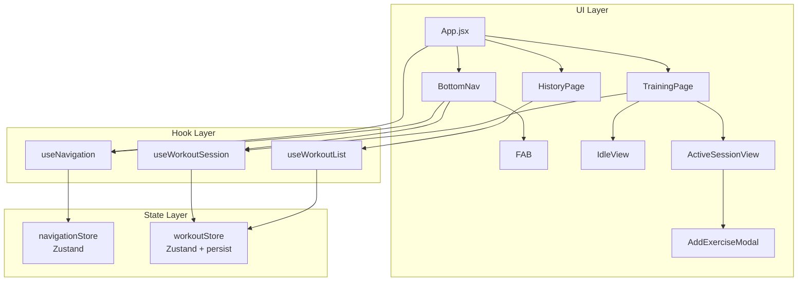

# ページナビゲーション

**関連 Spec:** [navigation_spec.md](navigation_spec.md)
**関連 PRD:** [navigation.md](../requirement/navigation.md)

---

# 1. 実装ステータス

**ステータス:** 🔴 未実装

| モジュール/機能 | ステータス | 備考 |
|-------------|--------|------|
| useNavigation フック | 🔴 未実装 | ルーティング状態管理 |
| BottomNav コンポーネント | 🔴 未実装 | 静的2タブ + FAB領域 |
| FAB コンポーネント | 🔴 未実装 | コンテキストFAB |
| TrainingPage | 🔴 未実装 | 待機/アクティブの二面表示（既存WorkoutFormPageを統合） |
| HistoryPage | 🔴 未実装 | カレンダー表示（既存WorkoutListPageを置換）。カレンダーUIライブラリ選定が前提（Section 9.2 参照） |
| App.jsx リファクタリング | 🔴 未実装 | useState ルーティング → useNavigation へ移行 |
| workoutStore persist | 🔴 未実装 | Zustand persist ミドルウェア追加 |

---

# 2. 設計目標

- **既存コードの最小変更**: 現在の Data Layer / Hook Layer はそのまま維持し、UI Layer とルーティングのみ変更する
- **外部依存ゼロ**: React Router 等のルーターライブラリを追加しない。Zustand で状態ベースルーティングを実現
- **レイアウト安定性**: FAB領域を常に確保し、表示/非表示でのレイアウトシフトを防ぐ
- **セッション安全性**: ページ遷移やリロードでセッションデータが失われない

---

# 3. 技術スタック

| 領域 | 採用技術 | 選定理由 |
|------|--------|--------|
| 言語 | JavaScript（.jsx） | 型定義は仕様書でTypeScript形式でドキュメント目的に記述されているが、実装は既存コードに合わせ JavaScript で行う |
| ルーティング | Zustand（状態ベース） | 既にプロジェクトで使用中。外部ルーターライブラリ不要で依存を増やさない |
| セッション永続化 | Zustand persist + localStorage | 既存 workoutStore に persist ミドルウェアを追加するだけで実現可能 |
| BottomNav スタイリング | Tailwind CSS | 既存デザインシステムのTabBarクラスを活用 |
| FAB | Tailwind CSS | デザインシステムに準拠した丸型ボタン |

---

# 4. アーキテクチャ

## 4.1. システム構成図



## 4.2. モジュール分割

### 新規モジュール

| モジュール名 | 責務 | 依存関係 | 配置場所 |
|-----------|------|---------|--------|
| navigationStore | ルーティング状態管理（currentRoute） | なし | `src/stores/navigationStore.js` |
| useNavigation | ルーティングフック（currentRoute, navigate） | navigationStore | `src/hooks/useNavigation.js` |
| BottomNav | 静的2タブ + FAB領域のナビゲーションバー | useNavigation, useWorkoutSession | `src/components/BottomNav.jsx` |
| FAB | コンテキストFAB（セッション中のみ表示） | なし（props） | `src/components/FAB.jsx` |
| TrainingPage | トレーニングページ（待機/アクティブ切り替え） | useWorkoutSession | `src/pages/TrainingPage.jsx` |
| IdleView | 待機画面（挨拶・開始ボタン・設定） | useWorkoutSession | `src/components/IdleView.jsx` |
| HistoryPage | 履歴ページ（カレンダー表示） | useWorkoutList | `src/pages/HistoryPage.jsx` |
| AddExerciseModal | 種目追加モーダル | useWorkoutSession | `src/components/AddExerciseModal.jsx` |

### 既存モジュールの変更

| モジュール名 | 変更内容 | 配置場所 |
|-----------|---------|--------|
| App.jsx | useState ルーティング → useNavigation + BottomNav 統合 | `src/App.jsx` |
| workoutStore | Zustand `persist` ミドルウェア追加 | `src/stores/workoutStore.js` |

### 廃止予定モジュール

| モジュール名 | 理由 | 配置場所 |
|-----------|------|--------|
| WorkoutListPage | HistoryPage に置換 | `src/pages/WorkoutListPage.jsx` |
| WorkoutFormPage | TrainingPage (ActiveSessionView) に統合 | `src/pages/WorkoutFormPage.jsx` |

---

# 5. データモデル

```javascript
// navigationStore の状態
const navigationState = {
  currentRoute: 'training',  // 'training' | 'history'
}

// workoutStore に追加される persist 設定
// 既存の draftDate, draftExercises, draftMemo, draftWorkoutId を永続化対象とする
const workoutStorePersistedKeys = [
  'draftDate',
  'draftExercises',
  'draftMemo',
  'draftWorkoutId',
]
```

---

# 6. インターフェース定義

```javascript
// -------------------------------------------------------
// navigationStore (src/stores/navigationStore.js)
// -------------------------------------------------------

const useNavigationStore = create((set) => ({
  currentRoute: 'training',  // 'training' | 'history'

  navigate: (route) => set({ currentRoute: route }),
}))

// -------------------------------------------------------
// useNavigation (src/hooks/useNavigation.js)
// -------------------------------------------------------

function useNavigation() {
  // return:
  // {
  //   currentRoute: 'training' | 'history',
  //   navigate: (route: 'training' | 'history') => void,
  // }
}

// -------------------------------------------------------
// BottomNav (src/components/BottomNav.jsx)
// -------------------------------------------------------

// Props: なし（内部で useNavigation, useWorkoutSession を使用）
// レイアウト:
//   ┌──────────┬──────────┬──────────────────┐
//   │ Training │ History  │     [+ FAB]      │
//   └──────────┴──────────┴──────────────────┘
//
// Tailwind クラス（design-system.pen 準拠）:
//   TabBar: h-[83px] bg-white border-t border-zinc-100 px-5 pt-3 flex
//   タブ: 左寄せ（justify-start に変更）
//   FAB領域: ml-auto（右端に配置）
//
// 内部タブ定義（静的）:
// const NAV_TABS = [
//   { route: 'training', label: 'Training', icon: <TrainingIcon /> },
//   { route: 'history',  label: 'History',  icon: <HistoryIcon /> },
// ]
// ※ アイコンコンポーネントは実装時に決定（Section 9.2 参照）

// -------------------------------------------------------
// FAB (src/components/FAB.jsx)
// -------------------------------------------------------

// Props:
//   visible: boolean  - 表示/非表示
//   onClick: () => void - タップ時のコールバック
//
// visible=false の場合は DOM に存在するがopacity-0/pointer-events-none
// （FAB領域のスペースは常に確保）

// -------------------------------------------------------
// TrainingPage (src/pages/TrainingPage.jsx)
// -------------------------------------------------------

// Props: なし（内部で useWorkoutSession を使用）
// セッション非アクティブ時: IdleView を表示
// セッションアクティブ時: ActiveSessionView を表示
//   （ActiveSessionView は既存 WorkoutFormPage の内容を移植）

// -------------------------------------------------------
// IdleView (src/components/IdleView.jsx)
// -------------------------------------------------------

// Props:
//   onStartTraining: () => void
//   onOpenSettings: () => void
//
// 表示内容:
//   - 挨拶メッセージ
//   - 「トレーニングを開始」ボタン
//   - 設定アイコン

// -------------------------------------------------------
// HistoryPage (src/pages/HistoryPage.jsx)
// -------------------------------------------------------

// Props: なし（内部で useWorkoutList, workoutRepository を使用）
// カレンダーUI + 日付選択 + 記録詳細表示

// -------------------------------------------------------
// AddExerciseModal (src/components/AddExerciseModal.jsx)
// -------------------------------------------------------

// Props:
//   open: boolean       - モーダルの表示/非表示
//   onClose: () => void - 閉じるコールバック
// 内部で useWorkoutSession を使用して種目検索・追加を行う

// -------------------------------------------------------
// workoutStore の persist 変更 (src/stores/workoutStore.js)
// -------------------------------------------------------

// Before:
//   const useWorkoutStore = create((set, get) => ({ ... }))
//
// After:
//   const useWorkoutStore = create(
//     persist(
//       (set, get) => ({ ... }),
//       {
//         name: 'gymini:workout-session',
//         partialize: (state) => ({
//           draftDate: state.draftDate,
//           draftExercises: state.draftExercises,
//           draftMemo: state.draftMemo,
//           draftWorkoutId: state.draftWorkoutId,
//         }),
//       }
//     )
//   )
```

---

# 7. 非機能要件実現方針

| 要件 | 実現方針 |
|------|--------|
| 操作性（NFR-001）: 1フレーム以内のページ切り替え | 状態ベースルーティング（Zustand setState）による条件レンダリング。DOMの追加/削除のみで、ネットワーク通信やコード分割なし |
| データ整合性（NFR-002）: セッションデータ永続化 | Zustand `persist` ミドルウェアで `draftDate`, `draftExercises`, `draftMemo`, `draftWorkoutId` を localStorage に自動保存。`partialize` で永続化対象を限定し、`workouts`（一覧キャッシュ）は永続化しない |
| レイアウト安定性（NFR-003）: FABレイアウトシフト防止 | FABコンポーネントは `visible=false` でも DOM に存在し、`opacity-0 pointer-events-none` で不可視化。FAB領域のサイズは常に確保される |

---

# 8. テスト戦略

| テストレベル | 対象 | カバレッジ目標 |
|-----------|------|------------|
| ユニットテスト | navigationStore（navigate, currentRoute） | 全アクション |
| ユニットテスト | useNavigation（ルーティングフック） | 全返り値 |
| コンポーネントテスト | BottomNav（タブ切り替え、アクティブ状態ハイライト） | FR-008 |
| コンポーネントテスト | FAB（表示/非表示、クリック） | FR-009, FR-010 |
| コンポーネントテスト | TrainingPage（待機/アクティブ切り替え） | FR-001, FR-002 |
| 統合テスト | App（ページ遷移 + セッション永続化） | FR-007, FR-011 |
| 統合テスト | workoutStore persist（リロード後のデータ復元） | NFR-002 |

---

# 9. 設計判断

## 9.1. 決定事項

| 決定事項 | 選択肢 | 決定内容 | 理由 |
|---------|--------|--------|------|
| ルーティング方式 | React Router vs Zustand 状態ベース | Zustand 状態ベース | 2ページのみで React Router は過剰。既存の Zustand をルーティングにも活用し依存を増やさない |
| navigationStore の分離 | workoutStore に統合 vs 独立ストア | 独立ストア | 責務分離。ルーティングとワークアウトデータは異なる関心事 |
| FAB の非表示方式 | 条件レンダリング（null） vs CSS非表示 | CSS非表示（opacity-0） | レイアウトシフト防止（NFR-003）。FAB領域のスペースを常に確保する。なお spec 使用例では `{isActive && <FAB />}` と条件レンダリングで示されているが、本設計では NFR-003 のために CSS非表示を採用する（意図的な乖離） |
| workoutStore の persist 対象 | 全状態 vs ドラフトのみ | ドラフトのみ（partialize） | `workouts`（一覧キャッシュ）は都度 localStorage から読み込むため永続化不要。ドラフト状態のみ永続化してストレージ消費を抑える |
| 既存ページの扱い | リファクタリング vs 新規作成 | 新規作成 + 段階的移行 | WorkoutListPage → HistoryPage, WorkoutFormPage → TrainingPage/ActiveSessionView として新規作成。既存ページは移行完了後に削除 |
| persist の localStorage キー | `gymini:workouts` と共有 vs 別キー | 別キー `gymini:workout-session` | ワークアウトデータ（CRUD）とセッションドラフトは別の目的。キーを分離することで管理しやすくなる |

## 9.2. 未解決の課題

| 課題 | 影響度 | 対応方針 |
|------|--------|--------|
| カレンダーUIライブラリの選定 | 中 | HistoryPage 実装時に決定。自前実装 vs 軽量ライブラリ（例: react-day-picker）を比較 |
| 進捗グラフモーダルの実装方式 | 低 | HistoryPage 実装時に決定。Chart.js / Recharts 等の選定が必要 |
| ボトムナビのアイコン選定 | 低 | 実装時に決定。SVGアイコンの自前実装 or アイコンライブラリ（lucide-react 等）を比較 |
| Phase 3 でのChat タブ追加方式 | 低 | Phase 3 着手時にナビゲーション拡張方法を設計 |
