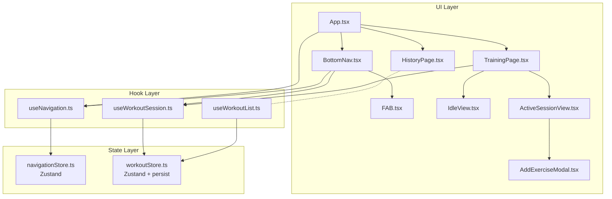

# ページナビゲーション

**関連 Spec:** [navigation_spec.md](navigation_spec.md)
**関連 PRD:** [navigation.md](../requirement/navigation.md)

---

# 1. 実装ステータス

**ステータス:** 🟢 実装済み（2026-03-29）

| モジュール/機能 | ステータス | 備考 |
|-------------|--------|------|
| navigationStore | 🟢 実装済み | ルーティング状態管理 |
| useNavigation フック | 🟢 実装済み | ルーティングフック |
| BottomNav コンポーネント | 🟢 実装済み | 静的2タブ + FAB領域 |
| FAB コンポーネント | 🟢 実装済み | コンテキストFAB |
| TrainingPage | 🟢 実装済み | 待機/アクティブの二面表示（既存WorkoutFormPageを統合） |
| HistoryPage | 🟢 実装済み | プレースホルダー空ページ（中身は別spec/designで定義） |
| App.tsx リファクタリング | 🟢 実装済み | useState ルーティング → useNavigation へ移行 |
| workoutStore persist | 🟢 実装済み | Zustand persist ミドルウェア追加 |

---

# 2. 設計目標

- **既存コードの最小変更**: 現在の Data Layer / Hook Layer はそのまま維持し、UI Layer とルーティングのみ変更する
- **外部依存ゼロ**: React Router 等のルーターライブラリを追加しない。Zustand で状態ベースルーティングを実現（A-001）
- **レイアウト安定性**: FAB領域を常に確保し、表示/非表示でのレイアウトシフトを防ぐ（T-003）
- **セッション安全性**: ページ遷移やリロードでセッションデータが失われない（B-001: ローカルストレージ完結）
- **TypeScript strict mode**: すべてのファイルを `.ts`/`.tsx` で記述し、型安全を維持する（T-001）

---

# 3. 技術スタック

| 領域 | 採用技術 | 選定理由 |
|------|--------|--------|
| 言語 | TypeScript（.ts / .tsx） | プロジェクト全体がTypeScript strict modeに移行済み（T-001）。型安全なルート管理が可能 |
| ルーティング | Zustand（状態ベース） | 既にプロジェクトで使用中。外部ルーターライブラリ不要で依存を増やさない（A-001） |
| セッション永続化 | Zustand persist + localStorage | 既存 workoutStore に persist ミドルウェアを追加するだけで実現可能（B-001準拠: サーバー送信なし） |
| BottomNav スタイリング | Tailwind CSS | 既存デザインシステムのTabBarクラスを活用（A-001） |
| アイコン | lucide-react | SVGのAI生成は著作権リスクがあるため、OSSアイコンライブラリを採用（A-001） |
| FAB | Tailwind CSS | デザインシステムに準拠した丸型ボタン |

---

# 4. アーキテクチャ

## 4.1. システム構成図



## 4.2. モジュール分割

### 新規モジュール

| モジュール名 | 責務 | 依存関係 | 配置場所 |
|-----------|------|---------|--------|
| navigationStore | ルーティング状態管理（currentRoute） | なし | `src/stores/navigationStore.ts` |
| useNavigation | ルーティングフック（currentRoute, navigate） | navigationStore | `src/hooks/useNavigation.ts` |
| BottomNav | 静的2タブ + FAB領域のナビゲーションバー | useNavigation, useWorkoutSession | `src/components/BottomNav.tsx` |
| FAB | コンテキストFAB（セッション中のみ表示） | なし（props） | `src/components/FAB.tsx` |
| TrainingPage | トレーニングページ（待機/アクティブ切り替え） | useWorkoutSession | `src/pages/TrainingPage.tsx` |
| IdleView | 待機画面（挨拶・開始ボタン・設定） | useWorkoutSession | `src/components/IdleView.tsx` |
| HistoryPage | 履歴ページ（プレースホルダー。中身は別specで定義・実装） | なし | `src/pages/HistoryPage.tsx` |
| AddExerciseModal | 種目追加モーダル | useWorkoutSession | `src/components/AddExerciseModal.tsx` |

### 既存モジュールの変更

| モジュール名 | 変更内容 | 配置場所 |
|-----------|---------|--------|
| App.tsx | useState ルーティング → useNavigation + BottomNav 統合 | `src/App.tsx` |
| workoutStore.ts | Zustand `persist` ミドルウェア追加 | `src/stores/workoutStore.ts` |

### 廃止予定モジュール

| モジュール名 | 理由 | 配置場所 |
|-----------|------|--------|
| WorkoutListPage.tsx | HistoryPage に置換 | `src/pages/WorkoutListPage.tsx` |
| WorkoutFormPage.tsx | TrainingPage (ActiveSessionView) に統合 | `src/pages/WorkoutFormPage.tsx` |

---

# 5. データモデル

```typescript
// navigationStore の状態
interface NavigationState {
  currentRoute: 'training' | 'history'
}

interface NavigationActions {
  navigate: (route: 'training' | 'history') => void
}

// workoutStore に追加される persist 設定
// 既存の draftDate, draftExercises, draftMemo, draftWorkoutId を永続化対象とする
type WorkoutSessionPersistedKeys = Pick<
  WorkoutState,
  'draftDate' | 'draftExercises' | 'draftMemo' | 'draftWorkoutId'
>
```

---

# 6. インターフェース定義

```typescript
// -------------------------------------------------------
// navigationStore (src/stores/navigationStore.ts)
// -------------------------------------------------------

type Route = 'training' | 'history'

interface NavigationStore {
  currentRoute: Route
  navigate: (route: Route) => void
}

const useNavigationStore = create<NavigationStore>()((set) => ({
  currentRoute: 'training',
  navigate: (route) => set({ currentRoute: route }),
}))

// -------------------------------------------------------
// useNavigation (src/hooks/useNavigation.ts)
// -------------------------------------------------------

interface UseNavigationReturn {
  currentRoute: Route
  navigate: (route: Route) => void
}

function useNavigation(): UseNavigationReturn

// -------------------------------------------------------
// BottomNav (src/components/BottomNav.tsx)
// -------------------------------------------------------

// Props: なし（内部で useNavigation, useWorkoutSession を使用）
// FAB の visible プロップ: BottomNav が useWorkoutSession.isActive を取得し、props として FAB へ渡す
//   → FAB 自身は WorkoutSession を参照しない（FABProps.visible で制御）
// レイアウト:
//   ┌──────────┬──────────┬──────────────────┐
//   │ Training │ History  │     [+ FAB]      │
//   └──────────┴──────────┴──────────────────┘
//
// Tailwind クラス（PRD デザインリファレンス準拠）:
//   TabBar: h-[83px] bg-white border-t border-zinc-100 px-5 pt-3 flex
//   タブ: 左寄せ（justify-start）
//   FAB領域: ml-auto（右端に配置）
//
// 内部タブ定義（静的）:
// const NAV_TABS: NavTab[] = [
//   { route: 'training', label: 'Training', icon: <Dumbbell /> },  // lucide-react
//   { route: 'history',  label: 'History',  icon: <Calendar /> },  // lucide-react
// ]

// -------------------------------------------------------
// FAB (src/components/FAB.tsx)
// -------------------------------------------------------

interface FABProps {
  visible: boolean
  onClick: () => void
}

// visible=false の場合は DOM に存在するが opacity-0/pointer-events-none
// （FAB領域のスペースは常に確保）

// -------------------------------------------------------
// TrainingPage (src/pages/TrainingPage.tsx)
// -------------------------------------------------------

// Props: なし（内部で useWorkoutSession を使用）
// セッション非アクティブ時: IdleView を表示
// セッションアクティブ時: ActiveSessionView を表示
//   （ActiveSessionView は既存 WorkoutFormPage の内容を移植）

// -------------------------------------------------------
// IdleView (src/components/IdleView.tsx)
// -------------------------------------------------------

interface IdleViewProps {
  onStartTraining: () => void
  onOpenSettings: () => void
}

// 表示内容:
//   - 挨拶メッセージ
//   - 「トレーニングを開始」ボタン（min-h-[44px] min-w-[44px] 確保）
//   - 設定アイコン（min-h-[44px] min-w-[44px] 確保）

// -------------------------------------------------------
// HistoryPage (src/pages/HistoryPage.tsx)
// -------------------------------------------------------

// Props: なし
// ナビゲーションとしてはルートの遷移先として空ページを用意するのみ。
// 中身（カレンダーUI・記録詳細等）は別 spec/design で定義・実装する。
// 初期実装は「Coming Soon」等のプレースホルダー表示。

// -------------------------------------------------------
// AddExerciseModal (src/components/AddExerciseModal.tsx)
// -------------------------------------------------------

interface AddExerciseModalProps {
  open: boolean
  onClose: () => void
}
// 内部で useWorkoutSession を使用して種目検索・追加を行う

// -------------------------------------------------------
// workoutStore の persist 変更 (src/stores/workoutStore.ts)
// -------------------------------------------------------

// Before:
//   const useWorkoutStore = create<WorkoutStore>()((set, get) => ({ ... }))
//
// After:
//   const useWorkoutStore = create<WorkoutStore>()(
//     persist(
//       (set, get) => ({ ... }),
//       {
//         name: 'gymini:workout-session',
//         partialize: (state): WorkoutSessionPersistedKeys => ({
//           draftDate: state.draftDate,
//           draftExercises: state.draftExercises,
//           draftMemo: state.draftMemo,
//           draftWorkoutId: state.draftWorkoutId,
//         }),
//         // T-002: localStorage 不可・パースエラー時はデフォルト初期状態へフォールバック
//         onRehydrateStorage: () => (_state, error) => {
//           if (error) {
//             console.warn('[gymini] workoutStore rehydration failed, using defaults', error)
//           }
//         },
//       }
//     )
//   )
```

---

# 7. 非機能要件実現方針

| 要件 | 実現方針 |
|------|--------|
| 操作性（NFR-001）: 1フレーム以内のページ切り替え | 状態ベースルーティング（Zustand setState）による条件レンダリング。DOMの追加/削除のみで、ネットワーク通信やコード分割なし |
| データ整合性（NFR-002）: セッションデータ永続化 | Zustand `persist` ミドルウェアで `draftDate`, `draftExercises`, `draftMemo`, `draftWorkoutId` を localStorage に自動保存。`partialize` で永続化対象を限定し、`workouts`（一覧キャッシュ）は永続化しない（B-001: 外部送信なし）。localStorage が利用不可（Safari プライベートモード等）またはパースエラー時は `onRehydrateStorage` でエラーをキャッチしデフォルト初期状態へフォールバック（T-002） |
| レイアウト安定性（NFR-003）: FABレイアウトシフト防止 | FABコンポーネントは `visible=false` でも DOM に存在し、`opacity-0 pointer-events-none` で不可視化。FAB領域のサイズは常に確保される（T-003） |

---

# 8. テスト戦略

| テストレベル | 対象 | カバレッジ目標 |
|-----------|------|------------|
| ユニットテスト | navigationStore（navigate, currentRoute） | 全アクション（D-001: TDD） |
| ユニットテスト | useNavigation（ルーティングフック） | 全返り値 |
| コンポーネントテスト | BottomNav（タブ切り替え、アクティブ状態ハイライト） | FR-005 |
| コンポーネントテスト | FAB（表示/非表示、クリック） | FR-006, FR-007 |
| コンポーネントテスト | TrainingPage（待機/アクティブ切り替え） | FR-001, FR-002 |
| 統合テスト | App（ページ遷移 + セッション永続化） | FR-004, FR-008 |
| 統合テスト | workoutStore persist（リロード後のデータ復元） | NFR-002 |
| E2Eテスト | ナビゲーション全体フロー（Playwright） | 主要ユーザーフロー（D-001） |

---

# 9. 設計判断

## 9.1. 決定事項

| 決定事項 | 選択肢 | 決定内容 | 理由 |
|---------|--------|--------|------|
| ルーティング方式 | React Router vs Zustand 状態ベース | Zustand 状態ベース | 2ページのみで React Router は過剰。既存の Zustand をルーティングにも活用し依存を増やさない（A-001） |
| navigationStore の分離 | workoutStore に統合 vs 独立ストア | 独立ストア | 責務分離。ルーティングとワークアウトデータは異なる関心事（CONSTITUTION.md モジュール構成の依存ルールに準拠: stores/ は独立した関心事ごとに分割） |
| FAB の非表示方式 | 条件レンダリング（null） vs CSS非表示 | CSS非表示（opacity-0） | レイアウトシフト防止（NFR-003）。FAB領域のスペースを常に確保する（T-003） |
| workoutStore の persist 対象 | 全状態 vs ドラフトのみ | ドラフトのみ（partialize） | `workouts`（一覧キャッシュ）は都度 localStorage から読み込むため永続化不要。ドラフト状態のみ永続化してストレージ消費を抑える（B-001） |
| 既存ページの扱い | リファクタリング vs 新規作成 | 新規作成 + 段階的移行 | WorkoutListPage → HistoryPage, WorkoutFormPage → TrainingPage/ActiveSessionView として新規作成。既存ページは移行完了後に削除 |
| persist の localStorage キー | `gymini:workouts` と共有 vs 別キー | 別キー `gymini:workout-session` | ワークアウトデータ（CRUD）とセッションドラフトは別の目的。キーを分離することで管理しやすくなる |
| ボトムナビのアイコン選定 | SVG自作 vs ライブラリ | lucide-react を採用 | SVGのAI生成は著作権リスクがあるためライブラリを使用（A-001） |
| 実装言語 | JavaScript (.jsx) vs TypeScript (.tsx) | TypeScript (.tsx) | プロジェクト全体がTypeScript strict modeへ移行済み（コミット 57594eb）。T-001原則準拠 |

## 9.2. 未解決の課題

*未解決の課題なし（実装開始可能）*

> スコープ外メモ（他機能で解決）:
> - カレンダーUIライブラリの選定 → 履歴ページ design doc で決定
> - 進捗グラフモーダルの実装方式 → 履歴ページ design doc で決定
> - Chat タブ追加方式（Phase 3）→ Phase 3 着手時のナビゲーション拡張 design doc で決定

---

# 10. 変更履歴

## v1.1 (2026-03-29)

**変更内容:**

- TypeScript移行に合わせてファイル名・コード例を `.ts`/`.tsx` に更新
- 技術スタックの言語をTypeScriptに変更
- CONSTITUTION.md原則への参照（T-001, A-001, B-001, T-003, D-001）を追加
- E2Eテスト（Playwright）をテスト戦略に追加

**移行ガイド:**

```typescript
// ❌ 旧（JavaScript）
// src/stores/navigationStore.js
const useNavigationStore = create((set) => ({
  currentRoute: 'training',
  navigate: (route) => set({ currentRoute: route }),
}))

// ✅ 新（TypeScript strict）
// src/stores/navigationStore.ts
type Route = 'training' | 'history'

interface NavigationStore {
  currentRoute: Route
  navigate: (route: Route) => void
}

const useNavigationStore = create<NavigationStore>()((set) => ({
  currentRoute: 'training',
  navigate: (route) => set({ currentRoute: route }),
}))
```
