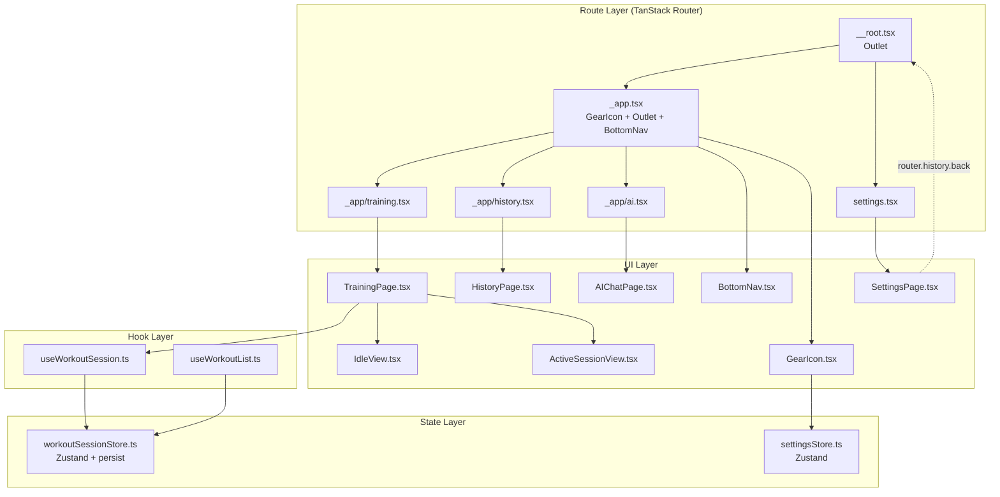

# ページナビゲーション

**関連 Spec:** [navigation_spec.md](navigation_spec.md)
**関連 PRD:** [navigation.md](../requirement/navigation.md)

---

# 1. 実装ステータス

**ステータス:** 🟢 実装済み

| モジ��ール/機能 | ステータス | 備考 |
|-------------|--------|------|
| TanStack Router セットアップ | 🟢 実装済み | Vite plugin + routeTree 自動生成 |
| __root.tsx (��ートレイアウト) | 🟢 実装済み | ルートの Outlet + notFoundComponent |
| _app.tsx (pathless layout) | 🟢 実装済み | GearIcon + Outlet + BottomNav + rehydration ガード |
| _app/training.tsx | ���� 実装済み | プレースホルダー（workout タスクで詳細実装） |
| _app/history.tsx | 🟢 実装済み | FRAME3: プレースホルダー（中身は別design） |
| _app/ai.tsx | 🟢 実装済み | FRAME4: プレースホルダー（中身は別design） |
| settings.tsx | 🟢 実装済��� | FRAME5: layout外。Xボタンで history.back() |
| BottomNav コン���ーネント | 🟢 実装済み | 2タブ + AI専用ボタン。Link コンポーネント使用 |
| GearIcon ���ンポーネント | 🟢 実装済み | 歯車アイ��ン + APIキーバッジ。Link で /settings へ |
| workoutStore persist | 🔴 未実装 | workout タスクで実装予定 |

---

# 2. 設計目標

- **CONSTITUTION 完全準拠**: TanStack Router によるファイルベースルーティング（A-001）。自作ルーティング禁止に従う
- **PRD 完全準拠**: 5つの論理画面（FRAME1〜5）、4ルート、BottomNav（2タブ + AIボタン）、歯車アイコン
- **宣言的レイアウト制御**: pathless layout route により BottomNav / GearIcon の表示を構造的に制御する
- **デザインシステム準拠**: `.sdd/design-system.html` のレイアウト・スタイルを忠実に再現する
- **セッション安全性**: ページ遷移やリロードでセッションデータが失われない（B-001: ローカルストレージ完結）
- **TypeScript strict mode**: TanStack Router の型推論 + strict mode で型安全を確保する（T-001）

---

# 3. 技術スタック

| 領域 | 採用技術 | 選定理由 |
|------|--------|--------|
| 言語 | TypeScript（.ts / .tsx） | T-001準拠 |
| ルーティング | TanStack Router ^1 (hash history) | A-001準拠。ファイルベースルーティング + hash history + basename（GitHub Pages 対応）+ 型安全なパス推論 + layout route パターン |
| ルーティング Vite プラグイン | @tanstack/router-plugin (devDep) | ファイルベースルートの自動生成（routeTree.gen.ts） |
| セッション永続化 | Zustand persist + localStorage | workoutStore に persist ミドルウェアを追加（B-001準拠: サーバー送信なし） |
| 状態管理 | Zustand ^5 | ワークアウト・設定の状態管理。ルーティングは TanStack Router に委譲 |
| スタイリング | Tailwind CSS | デザインシステム準拠 |
| アイコン | @phosphor-icons/react | デザインシステムが Phosphor Icons を使用（ph-barbell, ph-robot, ph-gear 等）。OSS対応（A-001） |

---

# 4. アーキテクチャ

## 4.1. システム構成図



## 4.2. モジュール分割

### ルートファイル（TanStack Router ファイルベースルーティング）

| ファイル | 責務 | URLパス | レイアウト |
|---------|------|--------|----------|
| `src/routes/__root.tsx` | ルートレイアウト（Outlet のみ） | - | - |
| `src/routes/_app.tsx` | pathless layout: GearIcon + Outlet + BottomNav | - (URLセグメントなし) | BottomNav + GearIcon あり |
| `src/routes/_app/training.tsx` | /training ルート → TrainingPage | `/training` | _app layout |
| `src/routes/_app/history.tsx` | /history ルート → HistoryPage | `/history` | _app layout |
| `src/routes/_app/ai.tsx` | /ai ルート → AIChatPage | `/ai` | _app layout |
| `src/routes/settings.tsx` | /settings ルート → SettingsPage | `/settings` | layout外（BottomNav なし） |

> **Not Found**: `__root.tsx` の `notFoundComponent` で未知ルートを `/training` にサイレントリダイレクトする（FR-013）

### UIコンポーネント

| モジュール名 | 責務 | 依存関係 | 配置場所 |
|-----------|------|---------|--------|
| BottomNav | 2タブ（トレ / 履歴）+ AI専用pill型ボタン | TanStack Router Link | `src/components/BottomNav.tsx` |
| GearIcon | 歯車アイコン + APIキー未設定バッジ | TanStack Router Link, settingsStore | `src/components/GearIcon.tsx` |
| TrainingPage | トレーニングページ（Idle/Active 切り替え）。**workout モジュールが実装** | useWorkoutSession | `src/pages/TrainingPage.tsx` |
| IdleView | Idle画面（挨拶・開始ボタン）。**workout モジュールが実装** | なし（props: onStartTraining） | `src/components/IdleView.tsx` |
| HistoryPage | 履歴ページ（プレースホルダー。中身は別design） | なし | `src/pages/HistoryPage.tsx` |
| AIChatPage | AIチャットページ（プレースホルダー。中身は別design） | なし | `src/pages/AIChatPage.tsx` |
| SettingsPage | 設定ページ（Xボタンで戻る。中身は別design） | TanStack Router useRouter, useCanGoBack | `src/pages/SettingsPage.tsx` |

### 既存モジュールの変更

| モジュール名 | 変更内容 | 配置場所 |
|-----------|---------|--------|
| workoutSessionStore.ts | Zustand `persist` ミドルウェア追加 | `src/stores/workoutSessionStore.ts` |
| vite.config.ts | TanStack Router Vite plugin 追加 + `base: '/gymini/'`（GitHub Pages） | `vite.config.ts` |
| main.tsx | RouterProvider でラップ | `src/main.tsx` |

### 廃止モジュール

| モジュール名 | 理由 |
|-----------|------|
| `src/stores/navigationStore.ts` | TanStack Router がルーティング状態を管理するため不要 |
| `src/hooks/useNavigation.ts` | TanStack Router の `Link`, `useRouter`, `useCanGoBack` に置換 |
| `src/types/index.ts` の Route / NavRoute 型 | TanStack Router が routeTree.gen.ts から型を自動推論するため不要 |

---

# 5. データモデル

```typescript
// TanStack Router のルーティング状態は router 内部で管理される。
// 自前の NavigationState / NavigationStore は不要。

// workoutSessionStore の persist 設定（workout design で定義）
// セッション状態を永続化し、ページ遷移・リロード後に復元する
type WorkoutSessionPersistedKeys = {
  isActive: boolean
  startedAt: ISODateTimeString | null
  draftExercises: DraftExercise[]
}
```

---

# 6. インターフェース定義

```typescript
// -------------------------------------------------------
// vite.config.ts（TanStack Router Vite plugin + GitHub Pages base）
// -------------------------------------------------------

import { defineConfig } from 'vite'
import react from '@vitejs/plugin-react'
import { tanstackRouter } from '@tanstack/router-plugin/vite'

export default defineConfig({
  base: '/gymini/',
  plugins: [
    tanstackRouter({ target: 'react', autoCodeSplitting: true }),
    react(),
  ],
})

// -------------------------------------------------------
// src/main.tsx（RouterProvider）
// -------------------------------------------------------

import { createRouter, RouterProvider, createHashHistory } from '@tanstack/react-router'
import { routeTree } from './routeTree.gen'

const hashHistory = createHashHistory()
const router = createRouter({
  routeTree,
  history: hashHistory,
  basepath: '/gymini',
})

declare module '@tanstack/react-router' {
  interface Register {
    router: typeof router
  }
}

ReactDOM.createRoot(document.getElementById('root')!).render(
  <RouterProvider router={router} />
)

// -------------------------------------------------------
// src/routes/__root.tsx（ルートレイアウト）
// -------------------------------------------------------

import { createRootRoute, Outlet, Navigate } from '@tanstack/react-router'

export const Route = createRootRoute({
  component: () => (
    <div className="min-h-screen bg-zinc-50">
      <Outlet />
    </div>
  ),
  // FR-013: 未知ルートは /training にサイレントリダイレクト
  notFoundComponent: () => <Navigate to="/training" />,
})

// -------------------------------------------------------
// src/routes/_app.tsx（pathless layout: BottomNav + GearIcon）
// -------------------------------------------------------

import { createFileRoute, Outlet } from '@tanstack/react-router'

export const Route = createFileRoute('/_app')({
  component: AppLayout,
})

function AppLayout() {
  return (
    <>
      <GearIcon />
      <main className="flex-1 pb-24">
        <Outlet />
      </main>
      <BottomNav />
    </>
  )
}

// -------------------------------------------------------
// src/routes/_app/training.tsx
// -------------------------------------------------------

import { createFileRoute } from '@tanstack/react-router'

export const Route = createFileRoute('/_app/training')({
  component: TrainingPage,
})

// -------------------------------------------------------
// src/routes/settings.tsx（layout外 — BottomNav なし）
// -------------------------------------------------------

import { createFileRoute, useRouter, useCanGoBack } from '@tanstack/react-router'

export const Route = createFileRoute('/settings')({
  component: SettingsPage,
})

// -------------------------------------------------------
// BottomNav (src/components/BottomNav.tsx)
// -------------------------------------------------------

// Props: なし（TanStack Router の Link を使用）
// レイアウト（PRD IR_001 / design-system.html 準拠）:
//   ┌──────────┬──────────┬──────────────────┐
//   │  トレ     │  履歴    │   [ 🤖 AI ]      │
//   └──────────┴──────────┴──────────────────┘
//     2タブ（均等 flex-1）    AI専用ボタン（pill型）
//
// Tailwind クラス（design-system.html 準拠）:
//   コンテナ: fixed bottom-0 left-0 w-full h-24 bg-white/80 backdrop-blur-xl
//            border-t border-zinc-200/50 flex items-start pt-3 px-4 z-40
//
// タブ状態（Link の activeProps / inactiveProps で制御）:
//   アクティブ: ph-fill text-black font-bold（text-[10px]）
//   非アクティブ: text-zinc-400 font-medium（text-[10px]）
//
// AIボタン（Link の activeProps で制御）:
//   通常: bg-black text-white rounded-2xl px-4 h-11 border border-zinc-800
//   アクティブ（/ai）: bg-accent text-white shadow-lg shadow-red-200
//   アイコン: ph-bold ph-robot text-xl + "AI" text-xs font-bold
//
// 内部タブ定義（静的）:
// const NAV_TABS = [
//   { to: '/training' as const, label: 'トレ', icon: <PhBarbell />, activeIcon: <PhBarbell weight="fill" /> },
//   { to: '/history' as const,  label: '履歴', icon: <PhClockCounterClockwise />, activeIcon: <PhClockCounterClockwise weight="fill" /> },
// ]

// -------------------------------------------------------
// GearIcon (src/components/GearIcon.tsx)
// -------------------------------------------------------

// TanStack Router の Link to="/settings" を使用
//
// Tailwind クラス（design-system.html / PRD IR_002 準拠）:
//   位置: absolute top-12 right-4 z-30
//   ボタン: w-9 h-9 rounded-full bg-white/80 backdrop-blur-sm
//          shadow-sm border border-zinc-100
//          p-0 min-h-[44px] min-w-[44px]（T-003: 視覚サイズ36px + タッチ領域44px）
//   アイコン: ph ph-gear text-base text-zinc-500
//
// APIキー未設定バッジ:
//   位置: absolute top-[-2px] right-[-2px]
//   スタイル: w-3 h-3 bg-accent rounded-full border-2 border-white
//
// GearIcon は gear + APIキーバッジのみを担当する。
// FRAME2 の追加要素（終了ボタン・タイマーpill）は TrainingPage が
// absolute 配置で GearIcon の隣に自前でレンダリングする。
// Tailwind クラスは以下を参照（TrainingPage / workout design doc で使用）:
//   終了ボタン: text-accent text-sm font-bold bg-red-50/90 backdrop-blur-sm px-3 py-1.5 rounded-lg
//   タイマーpill: flex items-center gap-1 bg-white/80 backdrop-blur-sm px-2 py-1 rounded-lg shadow-sm border border-zinc-100
//     アイコン: ph-fill ph-clock text-accent text-xs
//     テキスト: font-outfit font-bold text-xs

// GearIconProps は不要（settingsStore.hasApiKey を内部で読み取る）

// -------------------------------------------------------
// SettingsPage (src/pages/SettingsPage.tsx)
// -------------------------------------------------------

// useRouter + useCanGoBack によるネイティブ戻りナビゲーション:
//   const router = useRouter()
//   const canGoBack = useCanGoBack()
//   const handleClose = () => {
//     canGoBack ? router.history.back() : router.navigate({ to: '/training' })
//   }
//
// Xボタン（design-system.html 準拠）:
//   位置: absolute top-12 right-4 z-30
//   スタイル: w-9 h-9 rounded-full bg-white/80 backdrop-blur-sm shadow-sm border border-zinc-100
//            min-h-[44px] min-w-[44px]（T-003: 視覚サイズ36px + タッチ領域44px）
//   アイコン: ph-bold ph-x text-base text-zinc-500

// -------------------------------------------------------
// TrainingPage (src/pages/TrainingPage.tsx)
// -------------------------------------------------------

// Props: なし（内部で useWorkoutSession を使用）
// セッション非アクティブ時: IdleView を表示（FRAME1）
// セッションアクティブ時: ActiveSessionView を表示（FRAME2）

// -------------------------------------------------------
// IdleView (src/components/IdleView.tsx)
// -------------------------------------------------------

interface IdleViewProps {
  onStartTraining: () => void
}

// FRAME1 表示内容（design-system.html 準拠）:
//   - アバター + 日付 + 挨拶メッセージ
//   - 「トレーニングを始める」ボタン（w-[85%] h-13 bg-black text-white rounded-2xl）

// -------------------------------------------------------
// workoutSessionStore の persist 設定 (src/stores/workoutSessionStore.ts)
// 詳細は workout design doc を参照
// -------------------------------------------------------

// const useWorkoutSessionStore = create<WorkoutSessionState>()(
//   persist(
//     (set, get) => ({ ... }),
//     {
//       name: 'gymini:workout-session',
//       partialize: (state) => ({
//         isActive: state.isActive,
//         startedAt: state.startedAt,
//         draftExercises: state.draftExercises,
//       }),
//       // T-002: localStorage 不可・パースエラー時はデフォルト初期状態へフォールバック
//       onRehydrateStorage: () => (_state, error) => {
//         if (error) {
//           console.warn('[gymini] workoutSessionStore rehydration failed, using defaults', error)
//         }
//       },
//     }
//   )
// )
```

---

# 7. 非機能要件実現方針

| 要件 | 実現方針 |
|------|--------|
| 操作性（NFR-001）: 1フレーム以内のページ切り替え | TanStack Router の SPA ルーティング + autoCodeSplitting によるルート別遅延読み込み。ルート遷移はクライアントサイド完結でネットワーク通信なし |
| データ整合性（NFR-002）: セッションデータ永続化 | Zustand `persist` ミドルウェアで `isActive`, `startedAt`, `draftExercises` を localStorage に自動保存（`gymini:workout-session` キー）。`partialize` で永続化対象を限定。localStorage 利用不可またはパースエラー時は `onRehydrateStorage` でデフォルト初期状態へフォールバック（T-002）。詳細は workout design doc を参照 |
| レイアウト安定性（NFR-003）: BottomNav一貫性 | pathless layout route (`_app.tsx`) により BottomNav + GearIcon を構造的に制御。FRAME5（/settings）は layout 外に配置し自動的に非表示 |
| 表示安定性（NFR-004）: rehydration フリッカー防止 | Zustand persist の `onRehydrateStorage` コールバックと `useHydrated()` パターンで rehydration 完了を検知。完了前は skeleton / ブランク表示にし、FRAME1→FRAME2 のフリッカーを防止 |

---

# 8. テスト戦略

| テストレベル | 対象 | カバレッジ目標 |
|-----------|------|------------|
| コンポーネントテスト | BottomNav（Link アクティブ状態、タブ切り替え、AIボタン） | FR-007 |
| コンポーネントテスト | GearIcon（表示、バッジ表示） | FR-009, FR-010 |
| コンポーネントテスト | TrainingPage FRAME2 拡張要素（終了ボタン・タイマーpill の absolute 配置） | FR-011 |
| コンポーネントテスト | TrainingPage（Idle/Active 切り替え） | FR-001, FR-002 |
| 統合テスト | ルート遷移（/training → /history → /ai → /settings → back） | FR-004, FR-005, FR-012 |
| 統合テスト | layout route（_app 配下は BottomNav あり、/settings は BottomNav なし） | FR-007, FR-008 |
| 統合テスト | workoutStore persist（リロード後のデータ復元） | NFR-002 |
| E2Eテスト | ナビゲーション全体フロー（Playwright） | 主要ユーザーフロー（D-001） |
| E2Eテスト | ブラウザバックボタンで /settings から戻れること | FR-005 |

---

# 9. 設計判断

## 9.1. 決定事項

| 決定事項 | 選択肢 | 決定内容 | 理由 |
|---------|--------|--------|------|
| ルーティング方式 | TanStack Router vs Zustand 状態ベース | TanStack Router (hash history) | A-001準拠。CONSTITUTION が TanStack Router を必須とし自作ルーティングを禁止。`createHashHistory()` + `basepath: '/gymini'` で GitHub Pages 対応。layout route で BottomNav/GearIcon の表示制御を宣言的に解決でき、`useCanGoBack` + `router.history.back()` で settings 戻りナビゲーションをネイティブに実現 |
| ルーティングファイル配置 | コードベースルーティング vs ファイルベースルーティング | ファイルベース | CONSTITUTION 注記: 「`src/routes/` 配下にルートファイルを配置する」。routeTree.gen.ts の自動生成による型安全性 |
| layout route パターン | pathless layout (`_app`) vs 手動条件分岐 | pathless layout | FRAME1〜4 は `_app/` 配下（BottomNav + GearIcon あり）、FRAME5 は `settings.tsx`（layout 外、BottomNav なし）。構造的に表示制御を解決し、手動 `{route !== 'settings' && ...}` が不要 |
| settings 戻りナビゲーション | 自前 previousRoute 管理 vs ブラウザ履歴 | ブラウザ履歴 | `useCanGoBack()` + `router.history.back()` でネイティブに実現。自前のストア管理が不要。直接アクセス時は `/training` にフォールバック |
| BottomNav 第3要素 | FAB（種目追加）vs AI専用ボタン | AI専用ボタン | PRD IR_001 / design-system.html に準拠 |
| アイコンライブラリ | lucide-react vs @phosphor-icons/react | @phosphor-icons/react | design-system.html が Phosphor Icons を使用（A-001） |
| TanStack Start | 使用する vs 使用しない | 使用しない | A-002: 完全クライアントサイドアーキテクチャ。SSR/SSG は不要 |
| workoutStore の persist 対象 | 全状態 vs ドラフトのみ | ドラフトのみ（partialize） | ストレージ消費を抑える（B-001） |
| persist の localStorage キー | 共有 vs 別キー | 別キー `gymini:workout-session` | セッションドラフトとワークアウトデータの分離 |
| デフォルトルート | `/` → /training リダイレクト | リダイレクト | アプリ起動時は /training を表示。__root.tsx の `beforeLoad` で `/` → `/training` にリダイレクト |
| GearIcon の FRAME2 拡張 | GearIcon 内部で管理 vs AppLayout が props 渡し vs TrainingPage が自前レンダリング | TrainingPage が自前レンダリング | GearIcon は gear+badge のみのシンプルなコンポーネントに保つ。FRAME2 の終了ボタン・タイマーpill は TrainingPage が absolute 配置で GearIcon の隣にレンダリング。GearIcon がワークアウトドメインに結合することを避ける |
| rehydration 中の表示 | フリッカー許容 vs skeleton 表示 vs 同期ストレージ | skeleton / ブランク表示 | Zustand persist の非同期 rehydration 完了まで `useHydrated()` パターンでコンテンツを非表示にし、FRAME1→FRAME2 のフリッカーを防止する（NFR-004） |
| セッションタイマー計算 | startedAt ベース再計算 vs カウンター保持 | カウンター保持（カスタム Hook） | カスタム Hook（useElapsedTime 等）がカウンターを Zustand ストアに保持し、定期更新する。TrainingPage がこの Hook を使用してタイマーpill を表示。タブ遷移で Hook がアンマウントされてもストアの値は維持される |
| 未知ルート | ブランクページ vs エラー画面 vs サイレントリダイレクト | /training にサイレントリダイレクト | __root.tsx の notFoundComponent で /training にリダイレクトする。ユーザーにエラーを見せる必要がない（FR-013） |
| History モード | HTML5 history vs hash history | hash history + basename | GitHub Pages はサーバーサイドリダイレクトをサポートしないため、`createHashHistory()` で `/#/training` 形式の URL を使用。`basepath: '/gymini'` と Vite `base: '/gymini/'` で GitHub Pages サブパスに対応 |

## 9.2. 未解決の課題

*未解決の課題なし（実装開始可能）*

> スコープ外メモ（他機能で解決）:
> - 履歴ページの中身（カレンダーUI等）→ 履歴ページ design doc で決定
> - AIチャットの中身（チャットUI・Function Calling）→ AIチャット design doc で決定
> - 設定ページの中身（APIキー管理・種目マスター）→ 設定ページ design doc で決定

---

# 10. 変更履歴

## v3.0 (2026-04-10) — TanStack Router 採用

**変更内容:**

- ルーティングを Zustand 状態ベース → TanStack Router ファイルベースに変更（A-001準拠）
- navigationStore.ts, useNavigation.ts を廃止（TanStack Router に委譲）
- Route / NavRoute 手動型定義を廃止（routeTree.gen.ts から自動推論）
- previousRoute の自前管理を廃止（`useCanGoBack` + `router.history.back()` に置換）
- pathless layout route (`_app.tsx`) で BottomNav / GearIcon の表示制御を構造的に解決
- ブラウザ戻るボタンが正常に動作するようになった

**移行ガイド:**

```typescript
// ❌ 旧（v2.0: Zustand 状態ベース — A-001例外）
// src/stores/navigationStore.ts
type Route = 'training' | 'history' | 'ai' | 'settings'
const useNavigationStore = create<NavigationStore>()((set, get) => ({
  currentRoute: 'training',
  previousRoute: null,
  navigate: (route) => { /* ... */ },
}))

// App.tsx: 手動条件分岐
{currentRoute === 'training' && <TrainingPage />}
{currentRoute !== 'settings' && <BottomNav />}

// ✅ 新（v3.0: TanStack Router — A-001準拠）
// src/routes/_app.tsx: pathless layout
export const Route = createFileRoute('/_app')({
  component: () => (
    <>
      <GearIcon />
      <Outlet />
      <BottomNav />
    </>
  ),
})

// src/routes/_app/training.tsx: ルートファイル
export const Route = createFileRoute('/_app/training')({
  component: TrainingPage,
})

// src/routes/settings.tsx: layout 外（BottomNav なし）
export const Route = createFileRoute('/settings')({
  component: SettingsPage,
})
```

## v2.0 (2026-04-10) — PRD準拠の全面再設計

- Route 型を2ルートから4ルートに拡張
- BottomNav: FAB → AI専用pill型ボタンに変更
- GearIcon / AIChatPage / SettingsPage を新規追加
- アイコンを lucide-react → @phosphor-icons/react に変更

## v1.x (2026-03-29) — 初期実装

- Zustand 状態ベースの2ルート（training/history）ルーティング
- BottomNav: 2タブ + FAB 構成
- 実装済み → v3.0 で破棄
