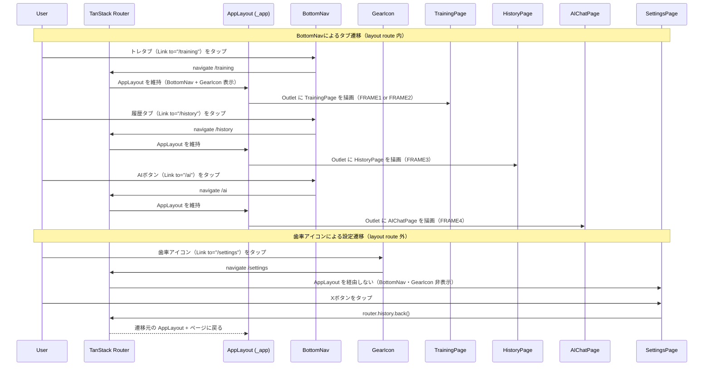
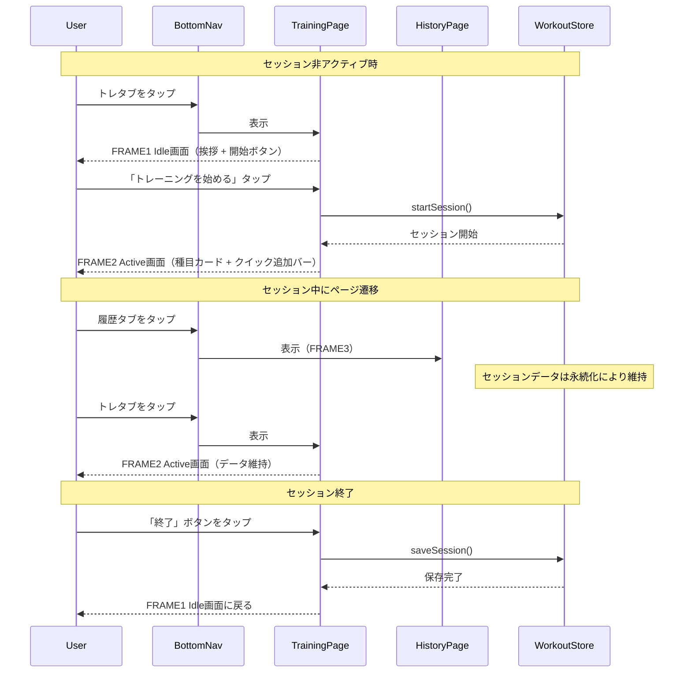

# ページナビゲーション

**関連 Design Doc:** [navigation_design.md](navigation_design.md)

**関連 PRD:** [navigation.md](../requirement/navigation.md)

---

# 1. 背景

gymini は5つの論理画面（FRAME1〜5）を持つモバイルフィットネスアプリである。ユーザーはトレーニング記録、履歴閲覧、AIコーチングチャット、設定管理をシームレスに切り替えながら利用する。

ナビゲーションには以下の課題がある:

- トレーニングセッション中に他ページへ遷移してもセッションデータが失われないこと
- BottomNav の2タブ + AI専用ボタンにより、主要3画面へ常時アクセス可能であること
- 歯車アイコンから設定画面へ全画面から遷移でき、遷移元に戻れること

# 2. 概要

ナビゲーション機能は以下の責務を持つ:

- **ページルーティング**: 4つの論理ルート（/training, /history, /ai, /settings）を TanStack Router で管理（A-001準拠）
- **レイアウト制御**: pathless layout route により、FRAME1〜4 では BottomNav + 歯車アイコンを表示し、FRAME5（設定）では非表示にする
- **BottomNav**: 2タブ（トレーニング / 履歴）+ AI専用pill型ボタン
- **歯車アイコン**: FRAME1〜4の右上に固定表示。タップでFRAME5（設定）へ遷移
- **セッション永続化**: ページ遷移やリロード時にトレーニングセッションデータを維持
- **トレーニングページの二面性**: セッション未開始時はIdle画面（FRAME1）、開始後はActive画面（FRAME2）を表示

設計原則:

- **常時アクセス可能なAI**: AIボタンはBottomNavに常時表示され、どの画面からもワンタップでAIチャットへ遷移可能
- **設定への統一アクセス**: 歯車アイコンは全画面共通で、ブラウザ履歴によるネイティブな戻りナビゲーションを提供
- **宣言的レイアウト**: layout route パターンにより BottomNav / GearIcon の表示制御を構造的に解決する（手動条件分岐ではなく）
- **型安全ルーティング**: TanStack Router の型推論により、ルートパスの型安全性を確保する（A-001, T-001）

# 3. 要求定義

## 3.1. 機能要件 (Functional Requirements)

| ID | 要件 | 優先度 | PRD参照 | 検証方法 |
|----|------|--------|---------|---------|
| FR-001 | トレーニングページはセッション非アクティブ時にIdle画面（FRAME1: 挨拶・開始ボタン）を表示する | 必須 | FR_017 | Test |
| FR-002 | トレーニングページはセッションアクティブ時にActive画面（FRAME2: 種目カード・終了ボタン・クイック追加バー）を表示する | 必須 | FR_017 | Test |
| FR-003 | 履歴ページ（FRAME3）をルートとして用意する（中身は別specで定義） | 必須 | FR_018 | Test |
| FR-004 | AIチャットページ（FRAME4）をルートとして用意し、BottomNavのAIボタンから常時アクセス可能にする | 必須 | FR_020 | Test |
| FR-005 | 設定ページ（FRAME5）を歯車アイコンから遷移可能にし、Xボタンまたはブラウザバックで遷移元に戻れるようにする | 必須 | IR_002, DC_005 | Test |
| FR-006 | セッションデータをページ遷移・リロード間で永続化する | 必須 | FR_019 | Test |
| FR-007 | BottomNavで Training / History タブと AI ボタンを常に表示する（FRAME1〜4） | 必須 | IR_001 | Inspection |
| FR-008 | BottomNavはFRAME5（設定）では非表示にする | 必須 | IR_001 | Inspection |
| FR-009 | 歯車アイコンをFRAME1〜4の右上に固定表示する | 必須 | IR_002 | Inspection |
| FR-010 | 歯車アイコンにAPIキー未設定時の赤バッジを表示する | 必須 | IR_002 | Inspection |
| FR-011 | FRAME2では歯車アイコンの右隣に「終了」ボタン、ボタン群の下にタイマーpillを表示する | 必須 | IR_002 | Inspection |
| FR-012 | 4つの論理ルート（/training, /history, /ai, /settings）をクライアントサイドで切り替える | 必須 | DC_005 | Inspection |

> **Note (FR-005)**: IR_002 は歯車アイコンの表示と設定画面への遷移をカバーする。戻りナビゲーションはブラウザ履歴スタック（`router.history.back()`）により実現する。直接アクセス時のフォールバックとして `/training` へ遷移する。

> **Note (FR-007, FR-008)**: BottomNav / GearIcon の表示制御は layout route パターンにより構造的に実現する。FRAME1〜4 のルートは共通 layout の子ルートとして配置し、FRAME5（/settings）は layout 外に配置する。

## 3.2. 非機能要件 (Non-Functional Requirements)

| ID | カテゴリ | 要件 | 目標値 | 検証方法 |
|----|--------|------|--------|---------|
| NFR-001 | 操作性 | ページ切り替えが即座に行われること | 1フレーム（16ms）以内に完了 | Test |
| NFR-002 | データ整合性 | セッション中のページ遷移・リロードでデータが失われないこと | セッションデータが完全に復元される | Test |
| NFR-003 | レイアウト安定性 | BottomNavのレイアウトが全画面で一貫していること | タブ構成・AIボタンの位置が固定 | Inspection |

# 4. API

ナビゲーション機能が外部（UIレイヤー・他モジュール）に公開するインターフェース。

| モジュール | インターフェース | メンバー | 概要 |
|---------|--------------|--------|------|
| @tanstack/react-router | Link | (component) | 型安全なナビゲーションリンク。BottomNav / GearIcon で使用 |
| @tanstack/react-router | useRouter | router.history.back() | ブラウザ履歴による戻りナビゲーション。SettingsPage の X ボタンで使用 |
| @tanstack/react-router | useCanGoBack | () => boolean | 戻り先の有無を判定。フォールバック制御に使用 |
| @tanstack/react-router | useMatch | (opts) => Match | 現在のルートマッチ情報。アクティブ状態の判定に使用 |
| navigation | BottomNav | (component) | 2タブ + AI専用ボタンのボトムナビゲーションコンポーネント |
| navigation | GearIcon | (component) | 歯車アイコンコンポーネント（APIキーバッジ付き） |
| navigation | TrainingPage | (component) | トレーニングページ（FRAME1 Idle / FRAME2 Active の二面表示） |
| navigation | HistoryPage | (component) | 履歴ページ（FRAME3。中身は別specで定義） |
| navigation | AIChatPage | (component) | AIチャットページ（FRAME4。中身は別specで定義） |
| navigation | SettingsPage | (component) | 設定ページ（FRAME5。中身は別specで定義） |

## 4.1. 型定義

```typescript
// ルートパスは TanStack Router が自動生成する routeTree.gen.ts から推論される。
// 手動での Route union type 定義は不要。

// BottomNavのタブ定義
type NavTab = {
  to: '/training' | '/history' | '/ai'  // TanStack Router の Link の to prop
  label: string
  icon: ReactNode
  activeIcon: ReactNode
}

// 歯車アイコンの設定
type GearIconConfig = {
  showBadge: boolean  // APIキー未設定時にtrue
}
```

# 5. 用語集

| 用語 | 説明 |
|------|------|
| ルート | アプリ内の論理的なページパス。`/training`, `/history`, `/ai`, `/settings` の4種。TanStack Router により型安全に管理される |
| FRAME | PRDで定義された論理画面。FRAME1（Training Idle）、FRAME2（Active Workout）、FRAME3（History）、FRAME4（AI Chat）、FRAME5（Settings） |
| layout route | TanStack Router の pathless layout route。URLセグメントを追加せずに共通レイアウト（BottomNav + GearIcon）を子ルートに適用する |
| BottomNav | 画面下部に固定配置されるナビゲーションバー。2タブ + AI専用ボタンで構成 |
| AI専用ボタン | BottomNav右側のpill型ボタン。タップでFRAME4（AIチャット）へ遷移 |
| 歯車アイコン | 全画面（FRAME1〜4）の右上に固定表示されるアイコン。タップでFRAME5（設定）へ遷移 |
| Idle画面 | トレーニングページのセッション未開始時の表示（FRAME1） |
| Active画面 | トレーニングページのセッション開始後の表示（FRAME2） |
| セッション永続化 | ページ遷移やブラウザリロード後もトレーニングセッションデータが失われずに復元される機能。実装詳細は [navigation_design.md](navigation_design.md) を参照 |

# 6. 使用例

```tsx
// __root.tsx - ルートレイアウト
function RootComponent() {
  return <Outlet />
}

// _app.tsx - pathless layout route（FRAME1〜4 共通レイアウト）
// BottomNav と GearIcon はこの layout 内に配置される
// /settings はこの layout の外にあるため、BottomNav / GearIcon は表示されない
function AppLayout() {
  return (
    <>
      <GearIcon />
      <main className="pb-24">
        <Outlet />
      </main>
      <BottomNav />
    </>
  )
}

// _app/training.tsx - トレーニングページ（FRAME1 / FRAME2）
function TrainingPage() {
  const { isActive } = useWorkoutSession()

  if (!isActive) {
    return <IdleView />     // FRAME1: 挨拶 + 開始ボタン
  }
  return <ActiveSessionView />  // FRAME2: 種目カード + クイック追加バー
}

// BottomNav - 2タブ + AI専用ボタン（Link コンポーネントで型安全遷移）
// ┌──────────┬──────────┬──────────────────┐
// │  トレ     │  履歴    │   [ 🤖 AI ]      │
// └──────────┴──────────┴──────────────────┘
//   2タブ（均等 flex-1）    AI専用ボタン（pill型）
function BottomNav() {
  return (
    <nav>
      <Link to="/training" activeProps={{ className: 'text-black font-bold' }}>
        <BarbellIcon />
        <span>トレ</span>
      </Link>
      <Link to="/history" activeProps={{ className: 'text-black font-bold' }}>
        <ClockIcon />
        <span>履歴</span>
      </Link>
      <Link to="/ai" activeProps={{ className: 'bg-accent' }}>
        <RobotIcon />
        <span>AI</span>
      </Link>
    </nav>
  )
}

// GearIcon - 歯車アイコン + APIキーバッジ（Link で /settings へ遷移）
function GearIcon() {
  const hasApiKey = useSettingsStore((s) => s.hasApiKey)

  return (
    <Link to="/settings">
      <GearIconSvg />
      {!hasApiKey && <RedBadge />}
    </Link>
  )
}

// settings.tsx - Xボタンでブラウザ履歴バック（layout route 外）
function SettingsPage() {
  const router = useRouter()
  const canGoBack = useCanGoBack()

  const handleClose = () => {
    if (canGoBack) {
      router.history.back()
    } else {
      router.navigate({ to: '/training' })
    }
  }

  return (
    <div>
      <button onClick={handleClose}>
        <XIcon />
      </button>
      {/* 設定内容（別specで定義） */}
    </div>
  )
}
```

# 7. 振る舞い図

## 7.1. ページ遷移ライフサイクル



## 7.2. トレーニングセッションとナビゲーション



# 8. 制約事項

- ルーティングは TanStack Router（ファイルベースルーティング）で実現する（A-001, DC_005）。ルートファイルは `src/routes/` 配下に配置する（CONSTITUTION 注記準拠）
- FRAME1〜4 のルートは pathless layout route (`_app`) の子ルートとして配置し、BottomNav / GearIcon の表示を構造的に制御する
- FRAME5（/settings）は layout route の外に配置し、BottomNav / GearIcon を非表示にする
- TanStack Start（SSR/SSGフレームワーク）は使用しない（A-002: 完全クライアントサイドアーキテクチャ）
- BottomNavのタブ構成（2タブ + AIボタン）は静的であり、セッション状態による変更は行わない（IR_001）
- 歯車アイコンはFRAME1〜4で常時表示（layout route 内）、FRAME5では非表示（IR_002）
- セッション永続化はワークアウトストアの永続化機能によって実現する（FR_019）
- 各ページの中身（トレーニング詳細、履歴カレンダー、AIチャット、設定）はナビゲーションの責務外。別specで定義する
- TypeScript strict mode を遵守する。ルートパスの型は TanStack Router が自動推論する（T-001）
- タップターゲットは最低 44px × 44px を確保する（T-003）

---

## PRD整合性確認

| PRD要求ID | 要件 | Spec対応箇所 |
|----------|------|------------|
| FR_017 | トレーニングページ（Idle + Active） | FR-001, FR-002, TrainingPage コンポーネント |
| FR_018 | 履歴ページ | FR-003, HistoryPage コンポーネント（中身は別specで定義） |
| FR_019 | セッション状態の永続化 | FR-006, NFR-002 |
| FR_020 | AIチャットページ（常時アクセス可能） | FR-004, AIChatPage コンポーネント（中身は別specで定義） |
| IR_001 | BottomNav（2タブ + AI専用ボタン） | FR-007, FR-008, BottomNav コンポーネント, layout route パターン |
| IR_002 | 歯車アイコン（全画面右上固定 → 設定へ遷移） | FR-005, FR-009, FR-010, FR-011, GearIcon コンポーネント |
| DC_005 | クライアントサイドSPAルーティング（4ルート） | FR-012, TanStack Router ファイルベースルーティング |
