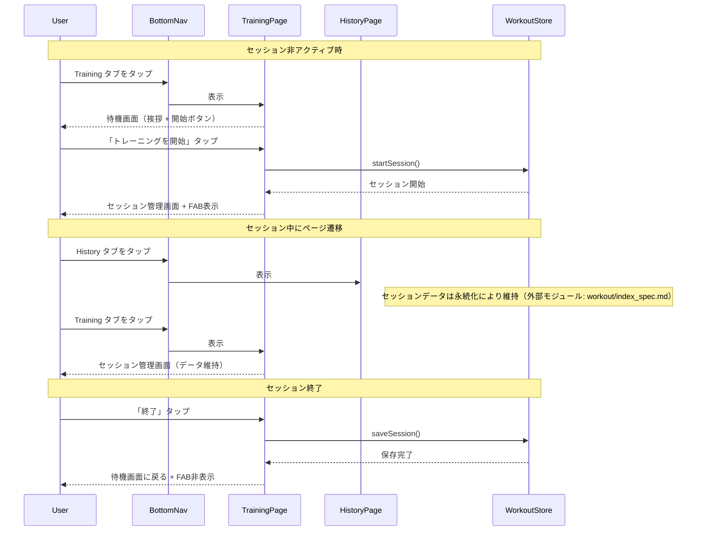
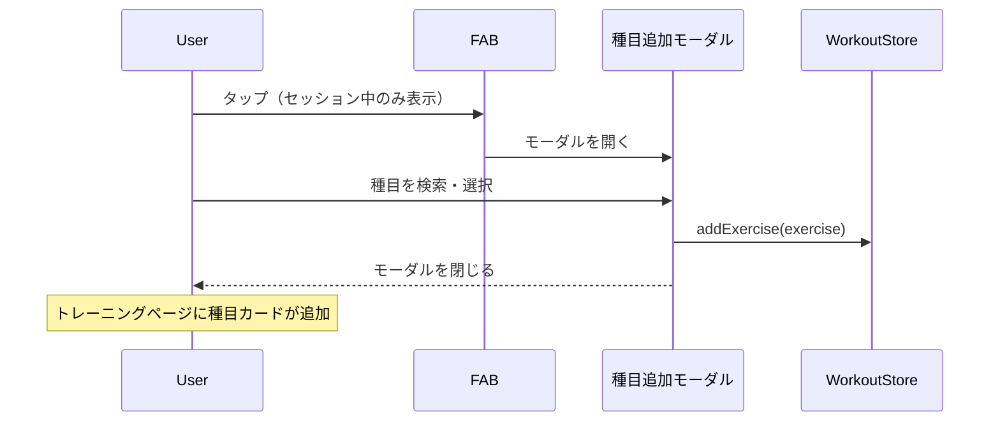

# ページナビゲーション

**関連 Design Doc:** [navigation_design.md](navigation_design.md)

**関連 PRD:** [navigation.md](../requirement/navigation.md)

---

# 1. 背景

gymini は現在 `useState` による簡易的な2画面切り替え（一覧 / フォーム）で動作しており、ボトムナビゲーションが存在しない。Phase 1 の機能が揃った段階で、[first-pwa](https://github.com/SakumaTakuya/first-pwa) のセッション対応型ナビゲーションモデルを適用し、複数ページ間をスムーズに行き来できるようにする必要がある。

また、トレーニングセッション中に履歴ページへ遷移してもセッションデータが失われない永続化が求められる。

# 2. 概要

ナビゲーション機能は以下の責務を持つ:

- **ページルーティング**: 2つの論理ページ（Training / History）間の切り替え
- **ボトムナビゲーション**: 静的2タブ + FAB領域のUI。タブは常に固定、FABはセッション中のみ表示
- **セッション永続化**: ページ遷移やリロード時にセッションデータを維持
- **トレーニングページの二面性**: セッション未開始時は待機画面、開始後はセッション管理画面を表示

設計原則:

- **静的ナビゲーション**: タブの構成はセッション状態に関わらず一定。ユーザーが迷わない
- **FAB領域の常時確保**: レイアウトシフトを防ぎ、FABの出現位置を予測可能にする
- **最小限のルーティング**: React Router 等の外部ライブラリを使わず、状態ベースの軽量ルーティング

# 3. 要求定義

## 3.1. 機能要件 (Functional Requirements)

| ID | 要件 | 優先度 | PRD参照 |
|----|------|--------|---------|
| FR-001 | トレーニングページはセッション非アクティブ時に待機画面（挨拶・開始ボタン・設定アクセス）を表示する | 必須 | FR_017 |
| FR-002 | トレーニングページはセッションアクティブ時にセッション管理画面（種目カード・終了ボタン）を表示する | 必須 | FR_017 |
| FR-003 | 履歴ページは月表示カレンダーでワークアウト履歴を表示する | 必須 | FR_018, FR_013 |
| FR-004 | カレンダー上でトレーニング日にマーカーを表示する | 必須 | FR_018, FR_014 |
| FR-005 | 日付タップでその日のワークアウト記録を表示する | 必須 | FR_018, FR_015 |
| FR-006 | 日付タップからワークアウトを追加できる | 推奨 | FR_018, FR_016 |
| FR-012 | 種目タップで進捗グラフモーダルを表示する | 推奨 | FR_018 |
| FR-007 | セッションデータをページ遷移・リロード間で永続化する | 必須 | FR_019 |
| FR-008 | ボトムナビで Training / History タブを常に固定表示する | 必須 | IR_001 |
| FR-009 | FAB領域をボトムナビ右側に常に確保し、セッション中のみFABを表示する | 必須 | IR_001, IR_002 |
| FR-010 | FABタップで種目追加モーダルを開く | 必須 | IR_002 |
| FR-011 | 2つの論理ルート（training, history）間をクライアントサイドで切り替える | 必須 | DC_005 |

## 3.2. 非機能要件 (Non-Functional Requirements)

| ID | カテゴリ | 要件 | 目標値 |
|----|--------|------|--------|
| NFR-001 | 操作性 | ページ切り替えが即座に行われること | ページ切り替えは1フレーム（16ms）以内に完了すること |
| NFR-002 | データ整合性 | セッション中のページ遷移・リロードでデータが失われないこと | ページ遷移・リロード後もセッションデータが完全に復元される |
| NFR-003 | レイアウト安定性 | FAB の表示/非表示でボトムナビのレイアウトがシフトしないこと | FAB領域を常に確保 |

# 4. API

ナビゲーション機能が外部（UIレイヤー・他モジュール）に公開するインターフェース。

| モジュール | インターフェース | メンバー | 概要 |
|---------|--------------|--------|------|
| navigation | useNavigation | currentRoute | 現在のアクティブルート（`'training'` \| `'history'`） |
| navigation | useNavigation | navigate(route) | 指定ルートへ遷移する |
| navigation | BottomNav | (component) | 静的2タブ + FAB領域のボトムナビゲーションコンポーネント |
| navigation | FAB | (component) | コンテキストFABコンポーネント（セッション状態に応じて表示/非表示） |
| navigation | TrainingPage | (component) | トレーニングページ（待機/アクティブの二面表示） |
| navigation | HistoryPage | (component) | 履歴ページ（カレンダー表示） |

## 4.1. 型定義

```typescript
// ルート定義
type Route = 'training' | 'history'

// ナビゲーションフック
type UseNavigation = () => {
  currentRoute: Route
  navigate: (route: Route) => void
}

// ボトムナビのタブ定義
type NavTab = {
  route: Route
  label: string
  icon: ReactNode
}

// FABの設定（UIストアで管理）
type FABConfig = {
  visible: boolean
  onClick: () => void
}
```

# 5. 用語集

| 用語 | 説明 |
|------|------|
| ルート | アプリ内の論理的なページ識別子。`'training'` または `'history'` |
| ボトムナビゲーション | 画面下部に固定配置されるタブバー。2タブ + FAB領域で構成 |
| FAB | Floating Action Button。ボトムナビ右側のアクションボタン |
| FAB領域 | ボトムナビ右側に常に確保されるスペース |
| 待機画面 | トレーニングページのセッション未開始時の表示 |
| セッション永続化 | Zustand persist によるドラフトデータの localStorage 保存 |

# 6. 使用例

```jsx
// App.jsx - ルーティングとボトムナビの統合
function App() {
  const { currentRoute } = useNavigation()

  return (
    <div>
      {currentRoute === 'training' && <TrainingPage />}
      {currentRoute === 'history' && <HistoryPage />}
      <BottomNav />
    </div>
  )
}

// TrainingPage - セッション状態による表示切り替え
function TrainingPage() {
  const { isActive } = useWorkoutSession()

  if (!isActive) {
    return <IdleView />  // 待機画面: 挨拶 + 開始ボタン + 設定
  }
  return <ActiveSessionView />  // セッション管理画面
}

// BottomNav - 静的レイアウト
// ┌──────────┬──────────┬──────────────────┐
// │ Training │ History  │     [+ FAB]      │
// └──────────┴──────────┴──────────────────┘
function BottomNav() {
  const { currentRoute, navigate } = useNavigation()
  const { isActive } = useWorkoutSession()

  return (
    <nav>
      <TabButton active={currentRoute === 'training'} onClick={() => navigate('training')}>
        Training
      </TabButton>
      <TabButton active={currentRoute === 'history'} onClick={() => navigate('history')}>
        History
      </TabButton>
      <FABArea>
        {isActive && <FAB onClick={openAddExerciseModal} />}
      </FABArea>
    </nav>
  )
}
```

# 7. 振る舞い図

## ページ遷移とセッションライフサイクル



## FABによる種目追加



# 8. 制約事項

- ルーティングは状態ベースで実現する（React Router 等の外部ルーターライブラリは使用しない）（DC_005）
- URLベースのルーティング（ブラウザ履歴API / ハッシュルーティング）はスコープ外
- ボトムナビのタブ構成は静的であり、セッション状態による変更は行わない（IR_001）
- FABの表示/非表示のみがセッション状態に依存する（IR_002）
- セッション永続化はワークアウトストアの永続化機能によって実現する（FR_019）
- 履歴ページのカレンダー表示は段階的に実装可能（初期はリスト表示でも可）

---

## PRD整合性確認

| PRD要求ID | 要件 | Spec対応箇所 |
|----------|------|------------|
| FR_017 | トレーニングページ（待機 + アクティブ） | FR-001, FR-002, TrainingPage コンポーネント |
| FR_018 | 履歴ページ（カレンダー表示） | FR-003, FR-004, FR-005, FR-006, HistoryPage コンポーネント |
| FR_019 | セッション状態の永続化 | FR-007, NFR-002 |
| IR_001 | 静的ボトムナビゲーション | FR-008, FR-009, BottomNav コンポーネント |
| IR_002 | コンテキストFAB | FR-009, FR-010, FAB コンポーネント |
| DC_005 | クライアントサイドSPAルーティング | FR-011, useNavigation フック |
| FR_013 | 月表示カレンダー | FR-003 |
| FR_014 | トレーニング日マーカー | FR-004 |
| FR_015 | 日付タップで記録表示 | FR-005 |
| FR_016 | 日付タップからワークアウト追加 | FR-006 |
| FR_018（進捗グラフ） | 種目タップで進捗グラフモーダル表示 | FR-012 |

> **Note**: CONSTITUTION.md が存在しないため原則準拠チェックはスキップしました。`/sdd-init` で作成を推奨します。
