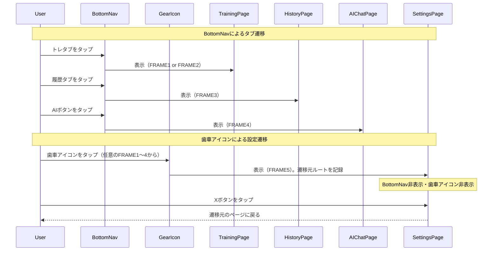
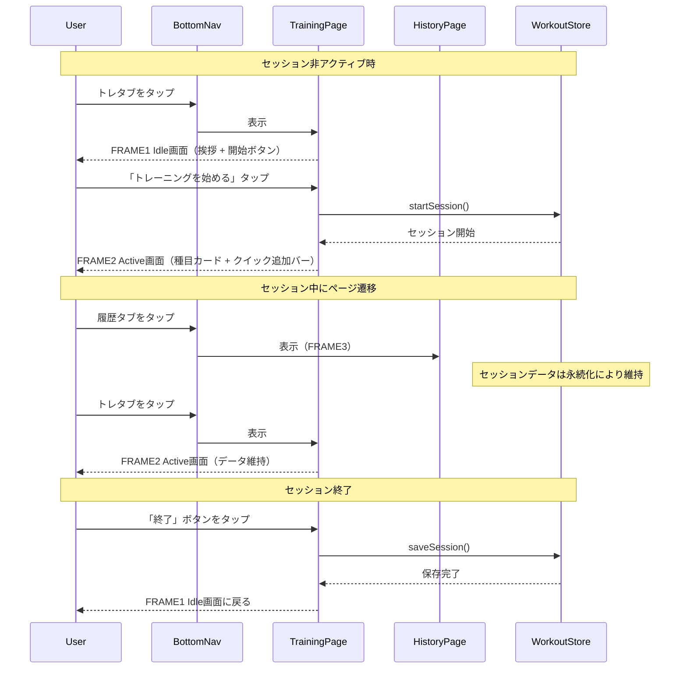

# ページナビゲーション

**関連 Design Doc:** [navigation_design.md](navigation_design.md)

**関連 PRD:** [navigation.md](../requirement/navigation.md)

---

# 1. 背景

gymini は5つの論理画面（FRAME1〜5）を持つモバイルフィットネスアプリである。ユーザーはトレーニング記録、履歴閲覧、AIコーチングチャット、設定管理をシームレスに切り替えながら利用する。

ナビゲーションには以下の課題がある:

- トレーニングセッション中に他ページへ遷移してもセッションデータが失われないこと
- BottomNav の2タブ + AI専用ボタンにより、主要3画面へ常時アクセス可能であること
- 歯車アイコンから設定画面へ全画面から遷移でき、遷移元に戻れること

# 2. 概要

ナビゲーション機能は以下の責務を持つ:

- **ページルーティング**: 4つの論理ルート（training / history / ai / settings）間のクライアントサイド切り替え
- **BottomNav**: 2タブ（トレーニング / 履歴）+ AI専用pill型ボタン。FRAME1〜4で常時表示、FRAME5では非表示
- **歯車アイコン**: FRAME1〜4の右上に固定表示。タップでFRAME5（設定）へ遷移
- **セッション永続化**: ページ遷移やリロード時にトレーニングセッションデータを維持
- **トレーニングページの二面性**: セッション未開始時はIdle画面（FRAME1）、開始後はActive画面（FRAME2）を表示

設計原則:

- **常時アクセス可能なAI**: AIボタンはBottomNavに常時表示され、どの画面からもワンタップでAIチャットへ遷移可能
- **設定への統一アクセス**: 歯車アイコンは全画面共通で、遷移元を記憶して戻れる
- **状態ベースの軽量ルーティング**: 4ルートのみの単純な画面切り替えを状態管理で実現する（A-001例外。詳細は制約事項を参照）

# 3. 要求定義

## 3.1. 機能要件 (Functional Requirements)

| ID | 要件 | 優先度 | PRD参照 | 検証方法 |
|----|------|--------|---------|---------|
| FR-001 | トレーニングページはセッション非アクティブ時にIdle画面（FRAME1: 挨拶・開始ボタン）を表示する | 必須 | FR_017 | Test |
| FR-002 | トレーニングページはセッションアクティブ時にActive画面（FRAME2: 種目カード・終了ボタン・クイック追加バー）を表示する | 必須 | FR_017 | Test |
| FR-003 | 履歴ページ（FRAME3）をルートとして用意する（中身は別specで定義） | 必須 | FR_018 | Test |
| FR-004 | AIチャットページ（FRAME4）をルートとして用意し、BottomNavのAIボタンから常時アクセス可能にする | 必須 | FR_020 | Test |
| FR-005 | 設定ページ（FRAME5）を歯車アイコンから遷移可能にし、Xボタンで遷移元に戻れるようにする | 必須 | IR_002, DC_005 | Test |
| FR-006 | セッションデータをページ遷移・リロード間で永続化する | 必須 | FR_019 | Test |
| FR-007 | BottomNavで Training / History タブと AI ボタンを常に表示する（FRAME1〜4） | 必須 | IR_001 | Inspection |
| FR-008 | BottomNavはFRAME5（設定）では非表示にする | 必須 | IR_001 | Inspection |
| FR-009 | 歯車アイコンをFRAME1〜4の右上に固定表示する | 必須 | IR_002 | Inspection |
| FR-010 | 歯車アイコンにAPIキー未設定時の赤バッジを表示する | 必須 | IR_002 | Inspection |
| FR-011 | FRAME2では歯車アイコンの右隣に「終了」ボタン、ボタン群の下にタイマーpillを表示する | 必須 | IR_002 | Inspection |
| FR-012 | 4つの論理ルート（training, history, ai, settings）をクライアントサイドで切り替える | 必須 | DC_005 | Inspection |

> **Note (FR-005)**: IR_002 は歯車アイコンの表示と設定画面への遷移をカバーする。戻りナビゲーション（previousRoute の記録と X ボタンによる復帰）は useNavigation フック（FR-012 / DC_005）の責務である。

## 3.2. 非機能要件 (Non-Functional Requirements)

| ID | カテゴリ | 要件 | 目標値 | 検証方法 |
|----|--------|------|--------|---------|
| NFR-001 | 操作性 | ページ切り替えが即座に行われること | 1フレーム（16ms）以内に完了 | Test |
| NFR-002 | データ整合性 | セッション中のページ遷移・リロードでデータが失われないこと | セッションデータが完全に復元される | Test |
| NFR-003 | レイアウト安定性 | BottomNavのレイアウトが全画面で一貫していること | タブ構成・AIボタンの位置が固定 | Inspection |

# 4. API

ナビゲーション機能が外部（UIレイヤー・他モジュール）に公開するインターフェース。

| モジュール | インターフェース | メンバー | 概要 |
|---------|--------------|--------|------|
| navigation | useNavigation | currentRoute | 現在のアクティブルート |
| navigation | useNavigation | navigate(route) | 指定ルートへ遷移する |
| navigation | useNavigation | previousRoute | 設定画面からの戻り先ルート（settings遷移時に記録） |
| navigation | BottomNav | (component) | 2タブ + AI専用ボタンのボトムナビゲーションコンポーネント |
| navigation | GearIcon | (component) | 歯車アイコンコンポーネント（APIキーバッジ付き） |
| navigation | TrainingPage | (component) | トレーニングページ（FRAME1 Idle / FRAME2 Active の二面表示） |
| navigation | HistoryPage | (component) | 履歴ページ（FRAME3。中身は別specで定義） |
| navigation | AIChatPage | (component) | AIチャットページ（FRAME4。中身は別specで定義） |
| navigation | SettingsPage | (component) | 設定ページ（FRAME5。中身は別specで定義） |

## 4.1. 型定義

```typescript
// ルート定義（4つの論理ルート）
type Route = 'training' | 'history' | 'ai' | 'settings'

// BottomNavで遷移可能なルート（settingsはBottomNavからは遷移しない）
type NavRoute = Exclude<Route, 'settings'>

// ナビゲーションフック
type UseNavigation = () => {
  currentRoute: Route
  navigate: (route: Route) => void
  previousRoute: NavRoute | null  // settings遷移前のルート（戻り先）
}

// BottomNavのタブ定義
type NavTab = {
  route: NavRoute
  label: string
  icon: ReactNode
  activeIcon: ReactNode
}

// 歯車アイコンの設定
type GearIconConfig = {
  showBadge: boolean  // APIキー未設定時にtrue
}
```

# 5. 用語集

| 用語 | 説明 |
|------|------|
| ルート | アプリ内の論理的なページ識別子。`'training'` / `'history'` / `'ai'` / `'settings'` の4種 |
| FRAME | PRDで定義された論理画面。FRAME1（Training Idle）、FRAME2（Active Workout）、FRAME3（History）、FRAME4（AI Chat）、FRAME5（Settings） |
| BottomNav | 画面下部に固定配置されるナビゲーションバー。2タブ + AI専用ボタンで構成 |
| AI専用ボタン | BottomNav右側のpill型ボタン。タップでFRAME4（AIチャット）へ遷移 |
| 歯車アイコン | 全画面（FRAME1〜4）の右上に固定表示されるアイコン。タップでFRAME5（設定）へ遷移 |
| Idle画面 | トレーニングページのセッション未開始時の表示（FRAME1） |
| Active画面 | トレーニングページのセッション開始後の表示（FRAME2） |
| セッション永続化 | ページ遷移やブラウザリロード後もトレーニングセッションデータが失われずに復元される機能。実装詳細は [navigation_design.md](navigation_design.md) を参照 |

# 6. 使用例

```tsx
// App.tsx - ルーティングとナビゲーション要素の統合
function App() {
  const { currentRoute } = useNavigation()

  return (
    <div>
      {/* メインコンテンツ */}
      {currentRoute === 'training' && <TrainingPage />}
      {currentRoute === 'history' && <HistoryPage />}
      {currentRoute === 'ai' && <AIChatPage />}
      {currentRoute === 'settings' && <SettingsPage />}

      {/* 歯車アイコン: FRAME1〜4で表示、FRAME5では非表示 */}
      {currentRoute !== 'settings' && <GearIcon />}

      {/* BottomNav: FRAME1〜4で表示、FRAME5では非表示 */}
      {currentRoute !== 'settings' && <BottomNav />}
    </div>
  )
}

// TrainingPage - セッション状態による表示切り替え（FRAME1 / FRAME2）
function TrainingPage() {
  const { isActive } = useWorkoutSession()

  if (!isActive) {
    return <IdleView />     // FRAME1: 挨拶 + 開始ボタン
  }
  return <ActiveSessionView />  // FRAME2: 種目カード + クイック追加バー
}

// BottomNav - 2タブ + AI専用ボタン
// ┌──────────┬──────────┬──────────────────┐
// │  トレ     │  履歴    │   [ 🤖 AI ]      │
// └──────────┴──────────┴──────────────────┘
//   2タブ（均等 flex-1）    AI専用ボタン（pill型）
function BottomNav() {
  const { currentRoute, navigate } = useNavigation()

  return (
    <nav>
      <TabButton
        active={currentRoute === 'training'}
        onClick={() => navigate('training')}
        icon={<BarbellIcon />}
        label="トレ"
      />
      <TabButton
        active={currentRoute === 'history'}
        onClick={() => navigate('history')}
        icon={<ClockIcon />}
        label="履歴"
      />
      <AIButton
        active={currentRoute === 'ai'}
        onClick={() => navigate('ai')}
      />
    </nav>
  )
}

// GearIcon - 歯車アイコン + APIキーバッジ
function GearIcon() {
  const { navigate } = useNavigation()
  const hasApiKey = useSettingsStore((s) => s.hasApiKey)

  return (
    <button onClick={() => navigate('settings')}>
      <GearIconSvg />
      {!hasApiKey && <RedBadge />}
    </button>
  )
}

// SettingsPage - Xボタンで遷移元に戻る
function SettingsPage() {
  const { navigate, previousRoute } = useNavigation()

  return (
    <div>
      <button onClick={() => navigate(previousRoute ?? 'training')}>
        <XIcon />
      </button>
      {/* 設定内容（別specで定義） */}
    </div>
  )
}
```

# 7. 振る舞い図

## 7.1. ページ遷移ライフサイクル



## 7.2. トレーニングセッションとナビゲーション



# 8. 制約事項

- ルーティングは状態ベースで実現する（DC_005）。TanStack Router（CONSTITUTION A-001 準拠ライブラリ）は使用しない。**A-001例外**: gymini は完全クライアントサイドアーキテクチャ（A-002）であり、4ルートのみの状態切り替えに TanStack Router のファイルベースルーティングは過剰であること、および既存の状態管理レイヤーでルーティング状態も統一できることが理由。**補償統制**: ルーティング型を TypeScript で明示的に定義し型安全性を確保（T-001）。トレードオフの詳細は [navigation_design.md](navigation_design.md) を参照
- URLベースのルーティング（ブラウザ履歴API / ハッシュルーティング）はスコープ外
- BottomNavのタブ構成（2タブ + AIボタン）は静的であり、セッション状態による変更は行わない（IR_001）
- 歯車アイコンはFRAME1〜4で常時表示、FRAME5では非表示（IR_002）
- FRAME5（設定）ではBottomNavを非表示にし、Xボタンで遷移元に戻る
- セッション永続化はワークアウトストアの永続化機能によって実現する（FR_019）
- 各ページの中身（トレーニング詳細、履歴カレンダー、AIチャット、設定）はナビゲーションの責務外。別specで定義する
- TypeScript strict mode を遵守し、すべての型を明示する（T-001）
- タップターゲットは最低 44px × 44px を確保する（T-003）

---

## PRD整合性確認

| PRD要求ID | 要件 | Spec対応箇所 |
|----------|------|------------|
| FR_017 | トレーニングページ（Idle + Active） | FR-001, FR-002, TrainingPage コンポーネント |
| FR_018 | 履歴ページ | FR-003, HistoryPage コンポーネント（中身は別specで定義） |
| FR_019 | セッション状態の永続化 | FR-006, NFR-002 |
| FR_020 | AIチャットページ（常時アクセス可能） | FR-004, AIChatPage コンポーネント（中身は別specで定義） |
| IR_001 | BottomNav（2タブ + AI専用ボタン） | FR-007, FR-008, BottomNav コンポーネント |
| IR_002 | 歯車アイコン（全画面右上固定 → 設定へ遷移） | FR-005, FR-009, FR-010, FR-011, GearIcon コンポーネント |
| DC_005 | クライアントサイドSPAルーティング（4ルート） | FR-012, useNavigation フック |
