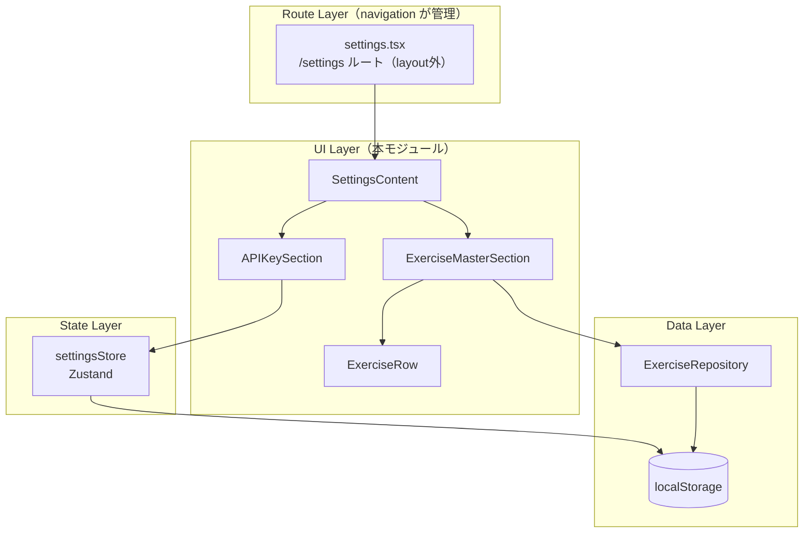

# 設定画面

**関連 Spec:** [index_spec.md](index_spec.md)
**関連 PRD:** [index.md](../../requirement/settings/index.md)

---

# 1. 実装ステータス

**ステータス:** 🟢 実装済み

| モジュール/機能 | ステータス | 備考 |
|-------------|--------|------|
| SettingsContent | 🟢 実装済み | 設定画面コンテンツ統合コンポーネント |
| APIKeySection | 🟢 実装済み | APIキー管理セクションUI（空文字入力時は deleteApiKey に分岐） |
| ExerciseMasterSection | 🟢 実装済み | 種目マスター管理セクションUI（検索・追加・編集・削除のインライン編集対応） |
| settingsStore | 🟢 実装済み | api-key モジュールで実装済み（空文字 setApiKey は内部で deleteApiKey と同等に扱う） |
| ExerciseRow | 🟢 実装済み | 種目一覧の1行コンポーネント（編集・削除ボタン） |
| SectionCard | 🟢 実装済み | FRAME5 セクションカードスタイルのラッパー（shadcn Card ベース） |

---

# 2. 設計目標

- **コンテンツ専念**: 設定画面のルーティング・レイアウト（Xボタン、BottomNav非表示）は navigation が実装済み。本モジュールはコンテンツ部分のみに集中する
- **ドメイン委譲**: APIキーと種目マスターのビジネスロジックは各専用モジュール（settingsStore, ExerciseRepository）に委譲し、UI統合のみ担当
- **design-system.html 準拠**: FRAME5 のデザインリファレンスに忠実なスタイリング
- **Privacy-by-Design**: APIキーは localStorage のみに保存（B-001）
- **TypeScript strict mode**: 全コンポーネントで型安全性を確保（T-001）

---

# 3. 技術スタック

| 領域 | 採用技術 | 選定理由 |
|------|--------|--------|
| 言語 | TypeScript（.tsx） | T-001準拠 |
| UIフレームワーク | React | CONSTITUTION 技術スタック |
| スタイリング | Tailwind CSS ^4 | design-system.html 準拠 |
| アイコン | @phosphor-icons/react | PhGear, PhEye, PhEyeSlash, PhPencilSimple, PhPlus, PhTrash 等 |
| 状態管理 | Zustand ^5 | settingsStore（APIキー永続化） |
| データ永続化 | localStorage | B-001: Privacy-by-Design |

---

# 4. アーキテクチャ

## 4.1. システム構成図



## 4.2. モジュール分割

### UI Layer

| モジュール名 | 責務 | 依存関係 | 配置場所 |
|-----------|------|---------|--------|
| SettingsContent | 設定画面コンテンツ統合。タイトル + APIKeySection + ExerciseMasterSection | なし（子コンポーネントを配置） | `src/components/settings/SettingsContent.tsx` |
| APIKeySection | APIキー入力・マスク切替・ステータス・削除のUI | settingsStore, SectionCard | `src/components/settings/APIKeySection.tsx` |
| ExerciseMasterSection | 種目検索・一覧・追加・編集・削除のUI | ExerciseRepository, SectionCard, ExerciseRow | `src/components/settings/ExerciseMasterSection.tsx` |
| ExerciseRow | 種目一覧の1行。名前 + 編集ボタン + 削除ボタン | なし（props） | `src/components/settings/ExerciseRow.tsx` |
| SectionCard | FRAME5 のセクションカードスタイル（`bg-white rounded-2xl p-4 shadow-sm border`）を適用する薄いラッパー。shadcn `<Card>` をベース | shadcn Card | `src/components/settings/SectionCard.tsx` |

### State Layer

| モジュール名 | 責務 | 依存関係 | 配置場所 |
|-----------|------|---------|--------|
| settingsStore | APIキーの保存・削除・取得。`hasApiKey` フラグ。Zustand + localStorage 直接操作 | なし | `src/stores/settingsStore.ts` |

> **Note**: settingsStore は navigation の GearIcon からも参照される（`hasApiKey` でバッジ表示判定）。

### Data Layer（外部モジュール）

| モジュール名 | 責務 | 提供元 | 配置場所 |
|-----------|------|--------|--------|
| ExerciseRepository | 種目CRUDの永続化 | exercise-master モジュール | `src/lib/exerciseRepository.ts` |

### 既存モジュールの変更

| モジュール名 | 変更内容 | 配置場所 |
|-----------|---------|--------|
| SettingsPage (navigation) | SettingsContent を children / 内部コンポーネントとして配置 | `src/pages/SettingsPage.tsx` |

---

# 5. データモデル

```typescript
// settingsStore の状態
// localStorage キー: 'gymini:api-key'

type SettingsState = {
  apiKey: string          // APIキー文字列（空文字 = 未設定）
  hasApiKey: boolean      // apiKey !== '' の派生値
}

type SettingsActions = {
  setApiKey: (key: string) => void    // localStorage に保存
  deleteApiKey: () => void            // localStorage から削除
  loadApiKey: () => void              // localStorage から読み込み（初期化時）
}
```

---

# 6. インターフェース定義

```typescript
// -------------------------------------------------------
// settingsStore (src/stores/settingsStore.ts)
// -------------------------------------------------------
// ※ settingsStore の詳細仕様は api-key モジュールを参照:
//   .sdd/specification/api-key/index_design.md §6
//
// 要点:
//   - setApiKey(key): 通常は保存。空文字列が渡された場合は内部で deleteApiKey と同等（状態リセット + localStorage.removeItem）
//   - deleteApiKey(): localStorage 削除 + ストア状態リセット（明示的削除用の API）
//   - loadApiKey(): アプリ起動時にルートレイアウトで呼び出し（__root.tsx）

const STORAGE_KEY = 'gymini:api-key'

const useSettingsStore = create<SettingsState & SettingsActions>()((set) => ({
  apiKey: '',
  hasApiKey: false,

  setApiKey: (key: string) => {
    if (key === '') {
      throw new Error(
        '空文字列は setApiKey に渡せません。削除には deleteApiKey() を使用してください。',
      )
    }
    try {
      localStorage.setItem(STORAGE_KEY, key)
    } catch {
      // T-002: localStorage 書き込み失敗時も状態は更新する
    }
    set({ apiKey: key, hasApiKey: true })
  },

  deleteApiKey: () => {
    try {
      localStorage.removeItem(STORAGE_KEY)
    } catch {
      // T-002: エラー時も状態をリセット
    }
    set({ apiKey: '', hasApiKey: false })
  },

  loadApiKey: () => {
    try {
      const key = localStorage.getItem(STORAGE_KEY) ?? ''
      set({ apiKey: key, hasApiKey: key !== '' })
    } catch {
      // T-002: localStorage 読み取り失敗時はデフォルト
      set({ apiKey: '', hasApiKey: false })
    }
  },
}))

// -------------------------------------------------------
// SettingsContent (src/components/settings/SettingsContent.tsx)
// -------------------------------------------------------

// Props: なし（内部で各セクションを配置）
// レイアウト: px-4 pt-20 pb-8 space-y-6
// タイトル: "設定" text-2xl font-outfit font-bold

// -------------------------------------------------------
// APIKeySection (src/components/settings/APIKeySection.tsx)
// -------------------------------------------------------

// コンテナ: <SectionCard>（FRAME5 のセクションカードスタイルを内包）
// セクションラベル: "Gemini API" text-sm font-outfit font-bold text-zinc-500 mb-3
//
// 入力フィールド:
//   type: password (default) / text (visible)
//   bg-zinc-100 rounded-xl px-4 h-12 text-sm font-inter
//   右端に目アイコン（PhEye / PhEyeSlash）ボタン
//
// onChange ハンドラの挙動:
//   - localValue（useState）で入力値を即時反映し、UIブロッキングを防止
//   - 300ms debounce（useRef + setTimeout）で settingsStore.setApiKey(value) を呼ぶ
//   - unmount 時に pending timer を cleanup（副作用漏れ防止）
//   - 空文字列も setApiKey に渡して良い（store 側で削除扱いされるため UI 側の分岐は不要）
//
// 保存ステータスインジケータ:
//   type SaveStatus = 'idle' | 'saving' | 'saved'
//   - 入力中: 「保存中…」を表示（aria-live="polite" でスクリーンリーダー通知）
//   - debounce 完了（300ms 後）: 「保存済み」を表示
//   - 1500ms 後: 非表示（idle）に戻る
//   - min-h-[1em] で高さ固定し、表示切替時のレイアウトシフトを防止
//
// ステータス行:
//   接続済み: 🟢 text-emerald-600 text-sm
//   未設定: text-zinc-400 text-sm
//   右端に削除ボタン（PhTrash, text-red-500）。hasApiKey が true の時のみ表示
//
// タップターゲット: 全ボタン min-h-[44px] min-w-[44px]

// -------------------------------------------------------
// ExerciseMasterSection (src/components/settings/ExerciseMasterSection.tsx)
// -------------------------------------------------------

// コンテナ: <SectionCard>
// セクションラベル: "種目マスター" text-sm font-outfit font-bold text-zinc-500 mb-3
//
// 検索フィールド:
//   PhMagnifyingGlass アイコン + input
//   bg-zinc-100 rounded-xl pl-10 pr-4 h-12 text-sm font-inter
//   placeholder: "種目を検索..."
//
// 種目一覧:
//   通常行は <ExerciseRow>（名前 + 編集 PhPencilSimple + 削除 PhTrash）
//   編集中の行はインラインフォーム（下記）に差し替わる
//   区切り: border-b border-zinc-100
//
// 追加ボタン（初期状態）:
//   PhPlus + "種目を追加" text-sm text-zinc-500
//   h-12 flex items-center gap-2
//
// インライン追加/編集フォーム:
//   - 追加: 「種目を追加」タップで、同じ場所に入力フィールド + PhCheck + PhX を展開
//   - 編集: ExerciseRow の編集ボタンで、対象行を同じ入力 + PhCheck + PhX に差し替え
//   - 入力: bg-zinc-100 rounded-xl px-3 h-10 text-sm font-inter, autoFocus
//   - PhCheck（text-emerald-600）: 確定 → exerciseRepository.create/update → 一覧再読込
//   - PhX（text-zinc-500）: キャンセル → フォーム閉じる
//   - 空文字確定はキャンセル扱い
//   - 重複名エラーの inline 表示:
//     isDuplicateNameError() で "Duplicate name:" prefix を判定
//     addError / editError state で管理。role="alert" aria-live="polite" で通知
//     エラー文言: 「この種目名は既に登録されています」（DUPLICATE_ERROR_MESSAGE 定数）
//     入力変更時にエラーをクリア。キャンセル時もクリア
//     aria-invalid + aria-describedby で入力フィールドとエラーを紐付け
//
// 削除:
//   ExerciseRow の削除ボタン → exerciseRepository.remove(id) → 一覧再読込
//
// タップターゲット: 全ボタン min-h-[44px] min-w-[44px]
```

---

# 7. 非機能要件実現方針

| 要件 | 実現方針 |
|------|--------|
| セキュリティ（NFR-001）: APIキーの保護 | settingsStore が localStorage のみで永続化。外部通信なし。`type="password"` でデフォルトマスク。300ms debounce で途中入力状態の意図しない保存を抑制 |
| 操作性（NFR-002）: 検索のリアルタイム更新 | `useExercises` hook 経由で Zustand store の種目一覧を取得。search() は `useMemo` でメモ化。他タブ変更は `storage` event で自動同期 |
| アクセシビリティ（T-003）: フォーカスリング | 全 raw `<button>` に `focus-ring` ユーティリティ（`focus-visible:ring-2 ring-gym-black ring-offset-2`）を適用。キーボード操作時のみ表示 |

---

# 8. テスト戦略

| テストレベル | 対象 | カバレッジ目標 | 対応FR |
|-----------|------|------------|--------|
| ユニットテスト | settingsStore（setApiKey, deleteApiKey, loadApiKey, hasApiKey 派生） | 全操作 | FR-004, FR-006 |
| コンポーネントテスト | APIKeySection（入力、マスク切替、削除、ステータス表示） | 主要インタラクション | FR-003, FR-004, FR-005, FR-006 |
| コンポーネントテスト | ExerciseMasterSection（検索、一覧表示、追加、編集、削除） | 主要インタラクション | FR-007, FR-008, FR-009 |
| コンポーネントテスト | ExerciseRow（表示、編集ボタンクリック、削除ボタンクリック） | 基本表示 | FR-007 |
| コンポーネントテスト | SectionCard（FRAME5 クラスの適用、className マージ） | スタイル適用 | FR-003, FR-007 |
| 統合テスト | SettingsContent（APIKeySection + ExerciseMasterSection の統合表示） | 画面統合 | FR-003, FR-007 |
| E2Eテスト | 歯車アイコン → 設定画面 → APIキー入力 → 種目追加 → Xボタンで戻る | 全体フロー | FR-001〜FR-009 |

---

# 9. 設計判断

## 9.1. 決定事項

| 決定事項 | 選択肢 | 決定内容 | 理由 |
|---------|--------|--------|------|
| settingsStore のアーキテクチャ | Zustand persist vs 直接 localStorage | 直接 localStorage 操作 | APIキーは単純な文字列1つであり persist ミドルウェアはオーバースペック。`setItem` / `getItem` / `removeItem` で十分 |
| APIキーの保存タイミング | onChange 即保存 vs 保存ボタン | onChange 即保存 | 入力フィールドの変更時に自動保存。ユーザーが保存ボタンを探す手間を省く。削除は明示的ボタン |
| 設定画面の構造 | 単一コンポーネント vs セクション分割 | セクション分割（APIKeySection + ExerciseMasterSection） | ドメインごとに独立。テスタビリティ向上。将来のセクション追加が容易 |
| 種目検索のデバウンス | あり vs なし | なし | localStorage からの読み取りは十分高速。デバウンスは不要な複雑さ |
| APIキー接続テスト | 設定時に実行 vs スキップ | スキップ（Phase 3 で実装） | Gemini API への接続テストは AIチャット機能のスコープ。設定画面は保存のみ |
| 種目編集UI | インライン編集 vs モーダル | インライン編集 | 種目名の変更だけなのでモーダルは不要。行内の入力フィールドで直接編集。確定は PhCheck、キャンセルは PhX ボタン |
| 空文字 setApiKey の扱い | throw vs 内部で delete 相当 | **内部で delete 相当**（v1.2 で変更）| UI 層・将来の消費者（AI chat 等）が `setApiKey(userInput)` を直接渡しても例外にならないよう契約を単純化。明示的削除には引き続き `deleteApiKey()` を推奨 |
| セクションカードの共通化 | 各セクションでクラス直書き vs 共通コンポーネント | 共通 `<SectionCard>` | FRAME5 のカードスタイルが 2 箇所以上で使われるため、shadcn `<Card>` をラップして一元化。将来のセクション追加にも対応 |
| APIキー保存の debounce | 即時保存 vs debounce | **UI 側 300ms debounce**（v1.3 で変更）| store の純粋性を維持しつつ、連続入力時の localStorage 書き込みを抑制。`useRef` + `setTimeout` で実装。保存中/保存済みインジケータで状態をフィードバック |
| 重複種目名のエラー表示 | サイレント無視 vs inline error | **inline error**（v1.3 で変更）| `role="alert"` + `aria-live="polite"` で視覚・スクリーンリーダー両方に通知。将来の toast 基盤導入時に差し替え可能な state ベース設計 |
| 種目データの取得方法 | `useState` + `refresh()` vs Hook 層 | **`useExercises` hook 経由**（v1.3 で変更）| 同タブ内の複数コンシューマ（ExerciseMasterSection / ExerciseSearchField）間で状態を同期。Zustand store を単一キャッシュ層とし、mutation を全 subscriber に自動伝播 |

## 9.2. 未解決の課題

*未解決の課題なし（実装開始可能）*

---

# 10. 変更履歴

## v1.3 (2026-04-18) — レビュー残タスク反映

- APIKeySection の onChange を 300ms debounce 化（UI 側 `useRef` + `setTimeout`）
- 保存ステータスインジケータ（「保存中…」/「保存済み」）の仕様を §6 に追記
- ExerciseMasterSection の重複種目名 inline error パターンを §6 に追記
- 種目データ取得を `useExercises` hook 経由に変更（`useState` + `refresh()` 撤去）
- §7 非機能要件を更新: debounce / Zustand hook / focus-ring 追記
- §9.1 決定事項に debounce / inline error / hook 層採用を追加

## v1.2 (2026-04-12) — レビュー反映（契約修正）

- `settingsStore.setApiKey` の契約を変更: 空文字列は throw せず内部で削除扱いに
- APIKeySection の handleChange を `setApiKey(value)` 単発呼び出しに簡素化
- §9.1 決定事項の「空文字 setApiKey の扱い」行を v1.2 方針に更新

## v1.1 (2026-04-12) — 実装反映

- `settingsStore.setApiKey` の挙動を実装（api-key 設計）に追随: 空文字列は throw
- APIKeySection の onChange 挙動を明記（空文字入力時は `deleteApiKey()` に分岐）
- ExerciseMasterSection のインライン追加/編集フォームの UI 仕様を追記
- `SectionCard` をモジュールに追加（FRAME5 カードスタイルの共通コンポーネント）
- 9.1 決定事項に「空文字 setApiKey の扱い」「セクションカードの共通化」を追加

## v1.0 (2026-04-11) — 初版

- 設定画面のコンテンツ設計（APIKeySection + ExerciseMasterSection）
- settingsStore（APIキー管理）の設計
- navigation モジュールとの責務分離を明確化
