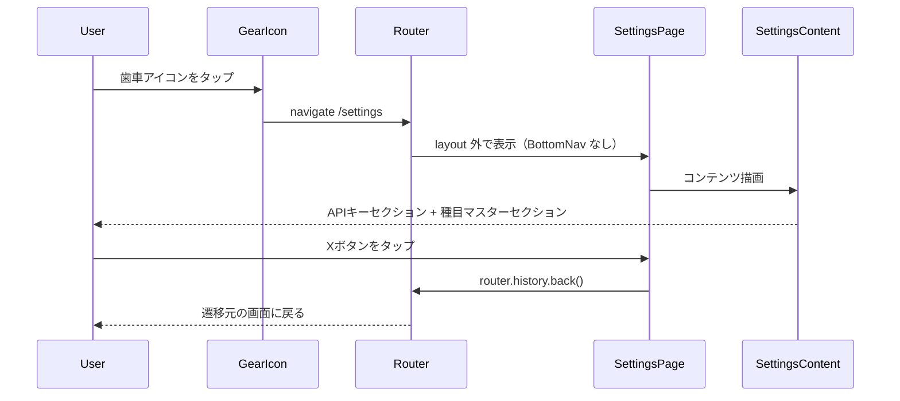
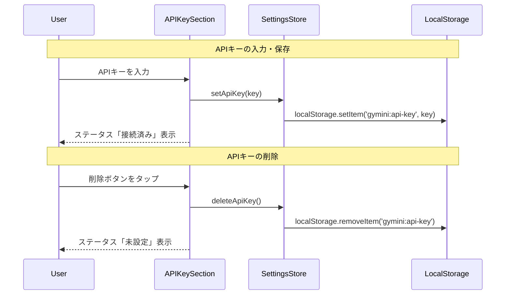
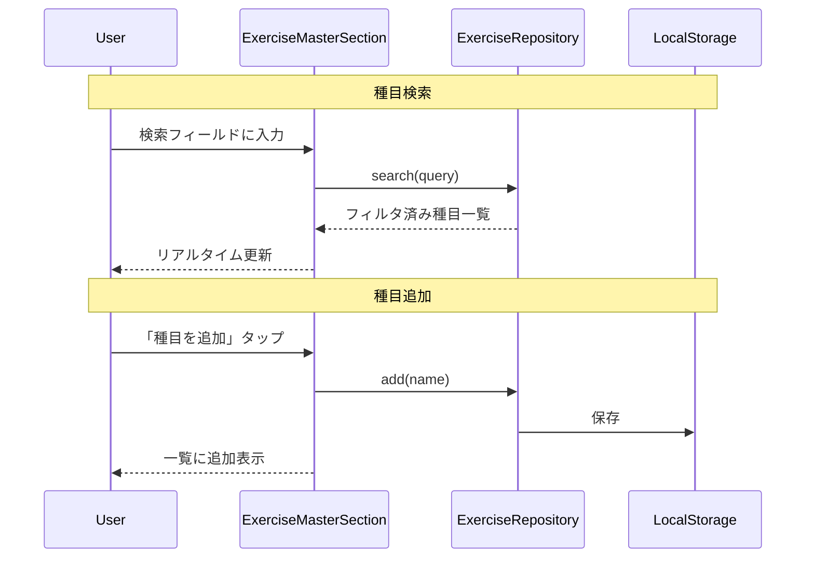

# 設定画面

**関連 Design Doc:** [index_design.md](index_design.md)

**関連 PRD:** [index.md](../../requirement/settings/index.md)

---

# 1. 背景

gymini は歯車アイコンから全画面（FRAME1〜4）でアクセス可能な設定画面（FRAME5）を持つ。設定画面は APIキー管理（Phase 2）と種目マスター管理（Phase 1〜2）の2つのセクションを統合する単一画面であり、BottomNav を非表示にして専用レイアウトで表示される。

設定画面が独立して必要な理由:

- APIキー（Gemini API）と種目マスターという異なるドメインの設定を、ユーザーにとって自然な1画面に統合する
- 歯車アイコンの赤バッジ（APIキー未設定）による導線で、初回セットアップを促す
- BottomNav の layout route 外に配置することで、設定作業に集中できるUIを提供する

# 2. 概要

設定画面は以下の責務を持つ:

- **画面レイアウト**: Xボタン（右上固定）+ スクロール可能なコンテンツ領域で構成
- **APIキーセクション**: Gemini APIキーの入力・保存・表示切替・削除・接続ステータスの管理
- **種目マスターセクション**: 登録済み種目の一覧表示・検索・手動追加・編集・削除
- **戻りナビゲーション**: Xボタンまたはブラウザバックで遷移元に戻る（navigation 機能が実装済み）

設計原則:

- **統合画面**: APIキーと種目マスターの2セクションを1画面に統合。個別画面への遷移は不要
- **ドメイン委譲**: 各セクションの内部ロジック（APIキー管理、種目CRUD）は専用モジュール（api-key, exercise-master）に委譲し、設定画面はレイアウトと統合のみ担当
- **Privacy-by-Design**: APIキーは localStorage にのみ保存。外部送信しない（B-001）

# 3. 要求定義

## 3.1. 機能要件 (Functional Requirements)

| ID | 要件 | 優先度 | PRD参照 | 検証方法 |
|----|------|--------|---------|---------|
| FR-001 | 設定画面を /settings ルートで表示する（layout route 外、BottomNav 非表示） | 必須 | FR_021 | Test |
| FR-002 | Xボタンで遷移元の画面に戻る。直接アクセス時は /training にフォールバック | 必須 | FR_023 | Test |
| FR-003 | APIキー設定セクションを表示する（入力フィールド + マスク切替 + 接続ステータス + 削除） | 必須 | FR_024, FR_008, FR_009 | Test |
| FR-004 | APIキーを localStorage に保存・削除できる | 必須 | FR_008 | Test |
| FR-005 | APIキーの表示/非表示をトグルできる（パスワードマスク） | 必須 | FR_009 | Test |
| FR-006 | APIキー未設定時に接続ステータスを「未設定」と表示する | 必須 | FR_010 | Test |
| FR-007 | 種目マスター管理セクションを表示する（検索 + 一覧 + 追加 + 編集） | 必須 | FR_025, FR_007 | Test |
| FR-008 | 種目をリアルタイム検索で絞り込みできる | 必須 | FR_007 | Test |
| FR-009 | 種目の手動追加・編集・削除ができる | 必須 | FR_007 | Test |

> **Note (FR-001, FR-002)**: /settings ルートと戻りナビゲーションは navigation 機能（SettingsPage コンポーネント）で実装済み。本 spec はそのページ内のコンテンツ（APIキーセクション + 種目マスターセクション）を定義する。詳細は [navigation_spec.md](../navigation_spec.md) を参照。

> **Note (FR-003〜FR-006)**: APIキーの永続化ロジックは api-key モジュールが提供する。本 spec はUI統合のみを定義。

> **Note (FR-007〜FR-009)**: 種目CRUDロジックは exercise-master モジュールが提供する。本 spec はUI統合のみを定義。

## 3.2. 非機能要件 (Non-Functional Requirements)

| ID | カテゴリ | 要件 | 目標値 | 検証方法 |
|----|--------|------|--------|---------|
| NFR-001 | セキュリティ | APIキーが localStorage 以外に送信されないこと | ネットワークタブで外部通信なし（Gemini API 以外） | Test |
| NFR-002 | 操作性 | 種目検索のフィルタリングが入力に追従すること | キーストロークごとにリアルタイム更新 | Inspection |

# 4. API

設定画面が外部（他モジュール・UIレイヤー）に公開するインターフェース。

| モジュール | インターフェース | メンバー | 概要 |
|---------|--------------|--------|------|
| settings | SettingsContent | (component) | 設定画面のコンテンツ部分。APIキーセクション + 種目マスターセクションを統合 |
| settings | APIKeySection | (component) | APIキー管理セクション。settingsStore を使用 |
| settings | ExerciseMasterSection | (component) | 種目マスター管理セクション。exerciseRepository を使用 |
| settings | settingsStore | hasApiKey, apiKey, setApiKey, deleteApiKey | APIキーの永続化（`src/stores/settingsStore.ts`）。navigation GearIcon からも参照（B-001: localStorage のみ） |
| exercise-master (外部) | ExerciseRepository | list, add, update, remove, search | 種目CRUDの永続化。設定画面から参照 |

## 4.1. 型定義

```typescript
// APIキーの接続ステータス
type APIKeyStatus = 'connected' | 'not-set'

// 種目マスターの1エントリ
type Exercise = {
  id: string
  name: string
}
```

# 5. 用語集

| 用語 | 説明 |
|------|------|
| 設定画面 | FRAME5。歯車アイコンから遷移し、Xボタンで戻る専用画面。BottomNav 非表示 |
| APIキーセクション | 設定画面上部。Gemini APIキーの入力・保存・表示切替・削除・接続ステータスを管理 |
| 種目マスターセクション | 設定画面下部。登録済み種目の検索・一覧表示・追加・編集・削除を管理 |
| BYOK | Bring Your Own Key。ユーザーが自身の Gemini APIキーを持ち込むモデル（DC_002） |
| パスワードマスク | APIキーを `●●●●●●●●` で非表示にする表示モード。目アイコンで切替 |

# 6. 使用例

```tsx
// SettingsContent - 設定画面のコンテンツ
// navigation の SettingsPage 内で使用される
function SettingsContent() {
  return (
    <div className="px-4 pt-20 pb-8 space-y-6">
      <h1 className="text-2xl font-outfit font-bold">設定</h1>
      <APIKeySection />
      <ExerciseMasterSection />
    </div>
  )
}

// APIKeySection - APIキー管理セクション
function APIKeySection() {
  const { apiKey, hasApiKey, setApiKey, deleteApiKey } = useSettingsStore()
  const [visible, setVisible] = useState(false)

  return (
    <section>
      <h2>Gemini API</h2>
      <input
        type={visible ? 'text' : 'password'}
        value={apiKey}
        onChange={(e) => setApiKey(e.target.value)}
      />
      <button onClick={() => setVisible(!visible)}>
        {visible ? <PhEyeSlash /> : <PhEye />}
      </button>
      <StatusBadge status={hasApiKey ? 'connected' : 'not-set'} />
      {hasApiKey && <button onClick={deleteApiKey}>削除</button>}
    </section>
  )
}

// ExerciseMasterSection - 種目マスター管理セクション
function ExerciseMasterSection() {
  const [query, setQuery] = useState('')
  const exercises = useExerciseList(query)

  return (
    <section>
      <h2>種目マスター</h2>
      <input placeholder="種目を検索..." value={query} onChange={...} />
      {exercises.map(ex => (
        <ExerciseRow key={ex.id} exercise={ex} />
      ))}
      <AddExerciseButton />
    </section>
  )
}
```

# 7. 振る舞い図

## 7.1. 設定画面アクセスフロー



## 7.2. APIキー管理フロー



## 7.3. 種目マスター管理フロー



# 8. 制約事項

- 設定画面（/settings）は navigation の layout route 外に配置される。BottomNav / GearIcon は非表示
- 戻りナビゲーション（Xボタン / ブラウザバック）は navigation モジュールの SettingsPage が実装済み
- APIキーは localStorage にのみ保存する。外部サーバーに送信しない（B-001）
- APIキーのバリデーション（Gemini API への接続テスト）はスコープ外。Phase 3（AIチャット）で実装。`APIKeyStatus` に `'error'` 状態を追加するのも Phase 3 スコープ
- 種目マスターデータは localStorage に保存する（B-001, A-002）
- 設定画面のコンテンツは SettingsPage の children または内部コンポーネントとして配置する
- TypeScript strict mode を遵守する（T-001）
- 全タップターゲットは最低 44px x 44px を確保する（T-003）

---

## PRD整合性確認

| PRD要求ID | 要件 | Spec対応箇所 |
|----------|------|------------|
| FR_021 | 歯車アイコンから設定画面へ遷移 | FR-001（navigation 実装済み） |
| FR_022 | APIキー未設定時に赤バッジ表示 | navigation GearIcon が `settingsStore.hasApiKey` を参照して表示。本モジュールは `hasApiKey` の公開のみ担当 |
| FR_023 | 閉じるボタンで遷移元に戻る | FR-002（navigation 実装済み） |
| FR_024 | APIキー設定セクション表示 | FR-003, FR-004, FR-005, FR-006 |
| FR_025 | 種目マスター管理セクション表示 | FR-007, FR-008, FR-009 |
| FR_008 | APIキーの入力・保存・削除 | FR-004 |
| FR_009 | APIキーの表示/非表示トグル | FR-005 |
| FR_010 | APIキー未設定時の警告表示 | FR-006 + navigation GearIcon 赤バッジ |
| FR_007 | 種目の一覧表示・手動追加・削除 | FR-007, FR-008, FR-009 |
