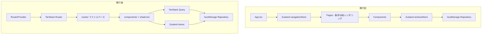

# 技術スタック拡張移行

**関連 PRD:** [index.md](../requirement/index.md)
**関連 CONSTITUTION:** [CONSTITUTION.md](../CONSTITUTION.md) v3.0.0

---

# 1. 実装ステータス

**ステータス:** 🔴 未実装

## 1.1. 実装進捗

| モジュール/機能 | ステータス | 備考 |
|:---------|:---------|:-----|
| TanStack Router 導入 | 🔴 | Zustand routing → ファイルベースルーティング移行 |
| shadcn/ui 導入 | 🔴 | UIコンポーネントライブラリ追加 |
| TanStack Query 導入 | 🔴 | データフェッチ/キャッシュ層追加 |
| Zod 導入 | 🔴 | バリデーション/型推論追加 |
| vite-plugin-pwa 導入 | 🔴 | PWA対応（Phase 2以降で実装） |

---

# 2. 設計目標

1. **AI Agent が書くコードの品質向上**: 型安全なルーティング・バリデーションにより、コンパイル時にエラーを検出する
2. **既存機能の維持**: 移行中もワークアウト記録・エクササイズマスター機能が壊れない
3. **段階的移行**: 一括リプレースではなく、ライブラリ単位で段階的に導入する
4. **A-002 準拠**: 完全クライアントサイド完結を維持。SSR/SSG フレームワークは導入しない

---

# 3. 技術スタック

| 領域 | 採用技術 | 選定理由 |
|:-----|:---------|:---------|
| ルーティング | TanStack Router ^1 | 型安全なファイルベースルーティング。path params / search params / loader data まで型推論。レイアウトネスト対応。TanStack Start（SSR）は不要 — Vite SPA で十分（A-002） |
| UIコンポーネント | shadcn/ui + Radix UI | コピー&ペーストモデルで所有権がプロジェクト側にある。Tailwind CSS との統合が前提。ブラックボックスにならない |
| データフェッチ/キャッシュ | TanStack Query ^5 | localStorage/IndexedDB からの非同期データ取得のキャッシュ・再検証。AI チャットのストリーミング管理にも有用 |
| バリデーション | Zod ^3 | ランタイムバリデーション + TypeScript 型推論の統合。AI API レスポンスのパースに必須 |
| PWA | vite-plugin-pwa | Vite との統合が最も自然。manifest + Service Worker の自動生成。TanStack Start を使わないことで相性問題を回避 |

### 不採用とした技術

| 技術 | 不採用理由 |
|:-----|:-----------|
| TanStack Start | SSR/SSG フレームワーク。クライアント完結アプリに不要な Server/Client 境界を持ち込む。Vinxi/Nitro ビルドパイプラインが新たなブラックボックスになる。AI Agent の学習データとの乖離リスクも高い（A-002違反） |
| Dexie.js (IndexedDB) | 現時点では localStorage で容量・機能ともに十分。全データアクセスが非同期化されるコスト（既存コード書き換え・テスト複雑化）に見合わない。チャット履歴が肥大化した場合に再検討（B-001: localStorage 限定を維持） |
| React Hook Form | 現在のフォーム（SetRowInput 等）が単純で、Zod 単体で十分。フォームが複雑化した場合に再検討 |
| React Router | TanStack Router の方が型安全性が高い。path params の型推論、loader の型安全など |

---

# 4. アーキテクチャ

## 4.1. 移行前後の構成比較



## 4.2. ルーティング構成

```
src/routes/
├── __root.tsx            # ルートレイアウト（BottomNav + 共通UI）
├── index.tsx             # / → トレーニング画面
├── history.tsx           # /history → 履歴画面
├── chat.tsx              # /chat → AIチャット画面（Phase 3）
└── settings/
    ├── route.tsx          # /settings レイアウト
    ├── index.tsx          # /settings/ → 設定トップ
    └── exercises.tsx      # /settings/exercises → 種目管理
```

**ハッシュルーティング**: GitHub Pages では `createHashHistory` を使用。ブラウザの History API だと 404 になるため。

## 4.3. モジュール分割

| モジュール名 | 責務 | 依存関係 | 配置場所 |
|:---------|:-----|:---------|:---------|
| routes | ページルート定義・レイアウト | components, stores, hooks, lib | `src/routes/` |
| components/ui | shadcn/ui ベースコンポーネント | schemas | `src/components/ui/` |
| components | アプリ固有UIコンポーネント | ui, stores, hooks, lib, schemas | `src/components/` |
| stores | Zustand ストア（セッション状態） | lib, types, schemas | `src/stores/` |
| hooks | カスタムフック（TanStack Query ラッパー等） | stores, lib, schemas | `src/hooks/` |
| lib | Repository層（localStorage CRUD） | types, schemas | `src/lib/` |
| schemas | Zod スキーマ（バリデーション + 型生成） | なし | `src/schemas/` |
| types | 純粋な TypeScript 型定義 | なし | `src/types/` |

---

# 5. データモデル

既存のデータモデルは変更なし。Zod スキーマとして再定義する。

```typescript
// src/schemas/workout.ts
import { z } from 'zod'

export const workoutSetSchema = z.object({
  weight: z.number().nonnegative(),
  reps: z.number().int().positive(),
  memo: z.string().default(''),
})

export const workoutExerciseSchema = z.object({
  exerciseId: z.string().uuid(),
  exerciseName: z.string().min(1),
  sets: z.array(workoutSetSchema),
})

export const workoutRecordSchema = z.object({
  id: z.string().uuid(),
  date: z.string().regex(/^\d{4}-\d{2}-\d{2}$/),
  exercises: z.array(workoutExerciseSchema),
  memo: z.string().default(''),
})

// 型は Zod スキーマから推論
export type WorkoutSet = z.infer<typeof workoutSetSchema>
export type WorkoutExercise = z.infer<typeof workoutExerciseSchema>
export type WorkoutRecord = z.infer<typeof workoutRecordSchema>
```

---

# 6. インターフェース定義

## TanStack Query + Repository パターン

```typescript
// src/hooks/useWorkouts.ts
import { useQuery, useMutation, useQueryClient } from '@tanstack/react-query'
import { workoutRepository } from '../lib/workoutRepository'

export function useWorkouts() {
  return useQuery({
    queryKey: ['workouts'],
    queryFn: () => workoutRepository.list(),
  })
}

export function useSaveWorkout() {
  const queryClient = useQueryClient()
  return useMutation({
    mutationFn: workoutRepository.create,
    onSuccess: () => queryClient.invalidateQueries({ queryKey: ['workouts'] }),
  })
}
```

---

# 7. 非機能要件実現方針

| 要件 | 実現方針 |
|:-----|:---------|
| オフライン閲覧（PWA） | vite-plugin-pwa で Service Worker 生成。localStorage データはオフラインでも利用可能 |
| 型安全性 | TanStack Router の型推論 + Zod スキーマからの型生成で二重チェック |
| パフォーマンス | TanStack Query のキャッシュにより不要な localStorage 読み取りを削減 |
| テスタビリティ | Repository パターン維持。TanStack Query は queryClient モックで容易にテスト可能 |

---

# 8. テスト戦略

| テストレベル | 対象 | カバレッジ目標 |
|:---------|:-----|:------------|
| ユニット | Zod スキーマ、Repository、Store | ≥ 80% |
| 統合 | TanStack Query hooks、ルートコンポーネント | ≥ 60% |
| E2E | ページ遷移、ワークアウト記録フロー | 主要フロー全件 |

**移行中のテスト方針**: 各ライブラリ導入ごとに既存テストが通ることを確認してから次へ進む。

---

# 9. 設計判断

## 9.1. 決定事項

| 決定事項 | 選択肢 | 決定内容 | 理由 |
|:---------|:-------|:---------|:-----|
| SSR フレームワーク | TanStack Start vs Vite SPA | Vite SPA | A-002（Client-Only）。SSR/SSG は GitHub Pages + localStorage アプリに不要。ブラックボックス層の追加を回避 |
| ルーティング方式 | Hash History vs Browser History | Hash History | GitHub Pages は SPA の History API フォールバックに難あり。Hash History が安定 |
| データ永続化 | IndexedDB (Dexie) vs localStorage | localStorage 維持 | B-001準拠。現時点でデータ量は 5MB 上限に対して十分小さい。チャット履歴肥大化時に再検討 |
| UIコンポーネント | shadcn/ui vs Headless UI vs 自作 | shadcn/ui | コードがプロジェクト内にコピーされるためブラックボックスにならない。AI Agent が修正しやすい |
| Zod 型と既存型の共存 | 一括移行 vs 段階的移行 | 段階的移行 | 新規スキーマは `schemas/` に Zod で定義。既存 `types/` は動作に問題がなければ順次移行 |
| TanStack Query 導入タイミング | Router と同時 vs 後から | 後から | Router 移行を先に安定させてから Query を追加。一度に複数の大きな変更を入れない |

## 9.2. 移行順序

| Phase | 作業内容 | 依存 | リスク |
|:------|:---------|:-----|:-------|
| 1 | shadcn/ui + Radix UI 導入、`components/ui/` セットアップ | なし | 低：既存UIと共存可能 |
| 2 | Zod 導入、`schemas/` に新規スキーマ定義 | なし | 低：既存コードに影響なし |
| 3 | TanStack Router 導入、ルート定義移行、Zustand navigationStore 廃止 | Phase 1 | 中：全ページのルーティングが変わる |
| 4 | TanStack Query 導入、Repository → Query hooks 移行 | Phase 2, 3 | 低：Repository 層は維持したまま上にQuery層を追加 |
| 5 | vite-plugin-pwa 導入 | Phase 3 | 低：ビルド設定追加のみ |
| 6 | 既存コンポーネントの shadcn/ui 移行（段階的） | Phase 1 | 低：コンポーネント単位で置き換え |

---

# 10. 変更履歴

## v1.0 (2026-04-08)

**変更内容:**

- 初版作成：技術スタック拡張の設計判断を記録
- CONSTITUTION.md v3.0.0 に基づく技術選定の根拠を文書化
- 移行順序と段階的導入計画を策定
