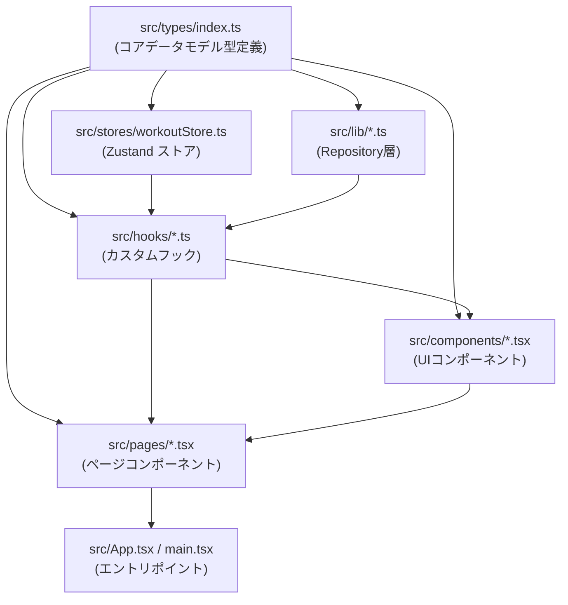

# TypeScript移行

**関連 Spec:** [typescript-migration_spec.md](typescript-migration_spec.md)
**関連 PRD:** なし（CONSTITUTION.md T-001 準拠作業）

---

# 1. 実装ステータス

**ステータス:** 🟢 実装完了

## 1.1. 実装進捗

| モジュール/作業              | ステータス | 備考                        |
|------------------------|-------|---------------------------|
| `typescript` パッケージ追加   | 🟢    | devDependencies に追加       |
| `tsconfig.json` 作成     | 🟢    | strict mode 有効             |
| `src/types/index.ts` 作成 | 🟢    | コアデータモデル型定義               |
| `src/stores/` .ts 変換   | 🟢    | workoutStore.js → .ts      |
| `src/lib/` .ts 変換      | 🟢    | repository 系               |
| `src/hooks/` .ts 変換    | 🟢    | useWorkoutSession / List   |
| `src/components/` .tsx 変換 | 🟢 | ExerciseSection, SetRowInput, WorkoutCard |
| `src/pages/` .tsx 変換   | 🟢    | WorkoutFormPage, WorkoutListPage |
| `src/App.tsx` / `main.tsx` 変換 | 🟢 | エントリポイント              |
| `src/test/setup.ts` 変換 | 🟢    | テストセットアップ                 |
| `vite.config.ts` 変換    | 🟢    | ビルド設定                     |
| TypeScript コンパイル 0 errors | 🟢 | `tsc --noEmit` で確認        |
| 既存テスト全通過              | 🟢    | Vitest + Playwright        |

---

# 2. 設計目標

1. CONSTITUTION.md T-001（TypeScript strict mode、`any` 禁止）への完全準拠
2. コアデータモデルを `src/types/index.ts` に集約し、型定義の単一ソースを確立する
3. 既存の振る舞いを変更せず、型注釈の付与のみで移行を完了する
4. 移行後も Vitest テスト（≥80%カバレッジ）・Playwright E2Eテスト（全16件）が通過する

---

# 3. 技術スタック

| 領域          | 採用技術                         | 選定理由                                        |
|-------------|------------------------------|--------------------------------------------|
| 言語          | TypeScript 5.x（`"strict": true`） | CONSTITUTION.md T-001 必須。`@types/react` は既に導入済み |
| コンパイラオプション  | `"moduleResolution": "bundler"` | Vite 8 に最適化された解決方式。ESM・Node モジュール双方に対応 |
| JSX設定       | `"jsx": "react-jsx"`         | React 19 の新JSXトランスフォームに対応（`import React` 不要） |
| 型チェック実行     | `tsc --noEmit`               | Vite はトランスパイルのみ行うため、型チェックは tsc が担う        |

---

# 4. アーキテクチャ

## 4.1. システム構成図



## 4.2. モジュール分割

| ファイル                         | 変換後                       | 主な型付け作業                                      |
|------------------------------|---------------------------|---------------------------------------------|
| `src/types/index.ts`         | 新規作成                      | Exercise, WorkoutSet, WorkoutExercise, WorkoutRecord, PendingSet, WorkoutInput |
| `src/stores/workoutStore.js` | `.ts`                     | WorkoutState, WorkoutActions インターフェース定義     |
| `src/lib/exerciseRepository.js` | `.ts`                  | 引数・戻り値に `Exercise[]` を付与                   |
| `src/lib/workoutRepository.js` | `.ts`                   | 引数・戻り値に `WorkoutRecord[]` を付与              |
| `src/hooks/useWorkoutSession.js` | `.ts`                 | 戻り値型は推論に委任。`startEditSession(workout)` を追加公開 |
| `src/hooks/useWorkoutList.js` | `.ts`                    | フック戻り値の型定義                                  |
| `src/components/ExerciseSection.jsx` | `.tsx`          | ExerciseSectionProps 定義                    |
| `src/components/SetRowInput.jsx` | `.tsx`                | SetRowInputProps 定義                        |
| `src/components/WorkoutCard.jsx` | `.tsx`                | WorkoutCardProps 定義                        |
| `src/pages/WorkoutFormPage.jsx` | `.tsx`                 | WorkoutFormPageProps 定義                   |
| `src/pages/WorkoutListPage.jsx` | `.tsx`                 | props なし（型注釈軽微）                            |
| `src/App.jsx`                | `.tsx`                    | props なし                                   |
| `src/main.jsx`               | `.tsx`                    | `document.getElementById` の null チェック     |
| `src/test/setup.js`          | `.ts`                     | `@testing-library/jest-dom` の型参照          |
| `vite.config.js`             | `.ts`                     | defineConfig の型付け。tsconfig の `include` から除外（Vite8/Vitest3 の型競合回避） |
| `src/vite-env.d.ts`          | 新規作成                      | CSS インポートの型宣言（`/// <reference types="vite/client" />`） |

---

# 5. データモデル

```typescript
// src/types/index.ts

export interface Exercise {
  id: string
  name: string
}

export interface PendingSet {
  weight: number  // SetRowInput.handlePendingChange で Number() 変換済み
  reps: number
  memo: string    // セット別メモ（emptyPendingSet で '' 初期化）
}

export interface WorkoutSet {
  weight: number
  reps: number
  memo: string    // confirmSet_internal で pendingSet をスプレッドするため含まれる
  editing?: boolean
}

export interface WorkoutExercise {
  exerciseId: string
  exerciseName: string
  sets: WorkoutSet[]
  pendingSet: PendingSet
}

export interface WorkoutRecord {
  id: string
  date: string           // "YYYY-MM-DD" 形式
  exercises: WorkoutExercise[]
  memo: string
}

/** リポジトリ層への書き込み入力型。memo は省略可能（省略時は '' 扱い） */
export interface WorkoutInput {
  date: string
  exercises: WorkoutExercise[]
  memo?: string
}
```

---

# 6. インターフェース定義

```typescript
// Zustand ストア型
// Zustand 5 での型付けパターン: create<WorkoutStore>()((set, get) => ({ ... }))
// カリー化構文（二重括弧）が TypeScript の型推論に必要

interface WorkoutState {
  workouts: WorkoutRecord[]
  draftDate: string
  draftExercises: WorkoutExercise[]
  draftMemo: string
  draftWorkoutId: string | null  // 編集対象 WorkoutRecord の id。新規作成時は null
}

interface WorkoutActions {
  loadWorkouts: () => void
  startSession: (date: string, editTarget?: WorkoutRecord) => void
  addExercise: (exercise: Pick<WorkoutExercise, 'exerciseId' | 'exerciseName'>) => void
  addSet: (exerciseIndex: number, pendingSet: PendingSet) => void
  updateSet: (exerciseIndex: number, setIndex: number, updatedSet: WorkoutSet) => void
  removeSet: (exerciseIndex: number, setIndex: number) => void
  /** Zustand 内部用。pendingSet 値を更新し、次の confirmSet_internal で確定する */
  updatePendingSet_internal: (exerciseIndex: number, pendingSet: PendingSet) => void
  /** Zustand 内部用。pendingSet を sets に移して次の pendingSet を初期化する */
  confirmSet_internal: (exerciseIndex: number) => void
  setDraftMemo: (memo: string) => void
  saveSession: () => void
  cancelSession: () => void
  deleteWorkout: (id: string) => void
  updateWorkout: (id: string, input: WorkoutInput) => void
}

type WorkoutStore = WorkoutState & WorkoutActions

// コンポーネント Props 型
interface ExerciseSectionProps {
  exercise: WorkoutExercise
  exerciseIndex: number
  onAddSet: (exerciseIndex: number, pendingSet: PendingSet) => void
  onUpdateSet: (exerciseIndex: number, setIndex: number, updatedSet: WorkoutSet) => void
  onPendingSetChange: (exerciseIndex: number, pendingSet: PendingSet) => void
  autoFocus?: boolean
}

interface WorkoutCardProps {
  workout: WorkoutRecord
  onDelete: (id: string) => void
  onEdit?: (workout: WorkoutRecord) => void  // optional: 未指定時は編集ボタン非表示
}

interface WorkoutFormPageProps {
  onSave: () => void
  onCancel: () => void
  editWorkout?: WorkoutRecord | null
}
```

---

# 7. 非機能要件実現方針

| 要件                     | 実現方針                                                                          |
|------------------------|-------------------------------------------------------------------------------|
| TypeScript コンパイルエラー 0  | `tsc --noEmit` を CI（`npm run typecheck`）に組み込む                                |
| `any` 型禁止              | `"noImplicitAny": true`（strict mode に含まれる）。ESLint の `@typescript-eslint/no-explicit-any` ルールで補強 |
| null チェック              | `"strictNullChecks": true`（strict mode に含まれる）                                |
| 既存テスト通過                | 移行は型注釈付与のみ。ロジック変更なしで既存テストが通過することを確認                                         |

---

# 8. テスト戦略

| テストレベル    | 対象                           | 確認方法                     |
|-----------|------------------------------|--------------------------|
| 型チェック     | 全 `.ts` / `.tsx` ファイル        | `tsc --noEmit`           |
| ユニットテスト   | ストア・リポジトリ・フック・コンポーネント        | `vitest run --coverage`  |
| E2E テスト   | ワークアウト記録・編集・削除フロー（16件）       | `npx playwright test`    |

---

# 9. 設計判断

## 9.1. 決定事項

| 決定事項              | 選択肢                                      | 決定内容                        | 理由                                     |
|-------------------|------------------------------------------|-----------------------------|----------------------------------------|
| 型定義の配置            | ① 各ファイル内に定義 / ② `src/types/` に集約        | ② `src/types/index.ts` に集約  | 重複を避け、ストア・リポジトリ・コンポーネント間で一貫した型を共有するため |
| `React.FC` の使用    | ① `React.FC<Props>` / ② props 型を引数で受ける   | ② props 型を引数で直接受ける         | `children` の implicit 型問題・戻り値型の制約を避けるため |
| moduleResolution  | ① `node16` / ② `bundler`                 | ② `bundler`                 | Vite 8 の推奨設定。ビルドツールがモジュール解決を担うため      |
| 移行順序              | ① 全ファイル一括 / ② 依存関係の末端から順番に             | ① 一括変換                      | 型の一貫性を保ちやすく、中間状態でのビルドエラーを最小化できるため    |
| `eslint-plugin-react-hooks` | ① そのまま使用 / ② `@typescript-eslint` 追加 | ② `@typescript-eslint` 追加推奨 | TypeScript 固有のルール（no-explicit-any等）を有効化するため |
| Zustand ストア型付け方式  | ① `StoreApi<WorkoutStore>` / ② `create<WorkoutStore>()()` カリー化 | ② `create<WorkoutStore>()()` | Zustand 5 推奨のカリー化構文。型安全なまま `set`/`get` を使えるため |
| `PendingSet` の weight/reps 型 | ① `string`（フォーム入力値） / ② `number`（Number() 変換後） | ② `number` | `SetRowInput.handlePendingChange` が `Number()` 変換してからストアに渡すため |
| `localStorage` JSON.parse 型付け | ① `unknown` + 型ガード / ② `as WorkoutRecord[]` + try-catch | ② `as WorkoutRecord[]` + try-catch | `workoutRepository.js` に try-catch 実装済み。T-002 準拠でキャストで十分 |
| `vite.config.ts` の tsconfig include | ① `include` に含める / ② `include` から除外 | ② 除外 | Vite8/Vitest3 の型定義が競合し、含めるとコンパイルエラーが発生するため |
| CSS インポートの型宣言 | ① 個別定義 / ② `vite-env.d.ts` 追加 | ② `vite-env.d.ts` 追加 | `/// <reference types="vite/client" />` 一行で Vite 提供の全クライアント型（CSS モジュール等）をカバーできるため |

## 9.2. 未解決の課題

*未解決の課題なし（実装開始可能）*

---

# 10. 変更履歴

## v1.2 (2026-03-29)

**変更内容:**

- `updateWorkout` 引数型を `Partial<WorkoutRecord>` → `WorkoutInput` に修正（実装と一致）
- Section 5 データモデルに `WorkoutInput` 型定義を追加
- `WorkoutCardProps.onEdit` を必須 → 任意（`?`）に修正（実装と一致）
- Section 4.2 に `vite-env.d.ts` を追記。`vite.config.ts` に tsconfig `include` 除外の注記を追記
- Section 9.1 に `vite.config.ts` tsconfig 除外・`vite-env.d.ts` の設計判断を追記
- `useWorkoutSession` の型付け説明を修正（`UseWorkoutSessionReturn` → 推論委任、`startEditSession` を追記）
- Section 4.2 モジュール表の `src/types/index.ts` に `WorkoutInput` を追記

## v1.1 (2026-03-29)

**変更内容:**

- `impl-status: "blocked"` → `"not-implemented"` に変更（未解決課題を全て解決）
- `PendingSet` 型を `string` → `number` に修正（SetRowInput で Number() 変換済みのため）
- `PendingSet` に `memo: string` フィールドを追加（実装コードに存在するため）
- `WorkoutSet` に `memo: string` フィールドを追加（confirmSet_internal でスプレッドされるため）
- `WorkoutState` に `draftWorkoutId: string | null` を追加（漏れていた state）
- `WorkoutActions` に `loadWorkouts`, `confirmSet_internal`, `updateWorkout` を追加（漏れていたアクション）
- Zustand 型付けパターンを `create<WorkoutStore>()()` カリー化構文として確定

## v1.0 (2026-03-29)

**変更内容:**

- 初版作成（TypeScript 移行の設計記録）

**移行ガイド（ファイル変換例）:**

```typescript
// ❌ 旧コード（JavaScript）
export default function WorkoutCard({ workout, onDelete, onEdit }) {
  return <div>{workout.exercises[0]?.exerciseName}</div>
}

// ✅ 新コード（TypeScript）
interface WorkoutCardProps {
  workout: WorkoutRecord
  onDelete: (id: string) => void
  onEdit: (workout: WorkoutRecord) => void
}

export default function WorkoutCard({ workout, onDelete, onEdit }: WorkoutCardProps) {
  return <div>{workout.exercises[0]?.exerciseName}</div>
}
```

```typescript
// ❌ 旧コード（JSON.parse 無型）
const stored = localStorage.getItem('gymini:workouts')
const workouts = stored ? JSON.parse(stored) : []

// ✅ 新コード（型キャスト + エラーハンドリング）
function loadWorkouts(): WorkoutRecord[] {
  try {
    const stored = localStorage.getItem('gymini:workouts')
    return stored ? (JSON.parse(stored) as WorkoutRecord[]) : []
  } catch {
    return []
  }
}
```
