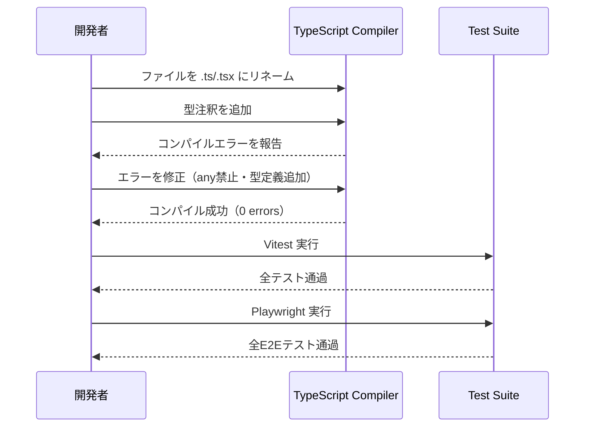

# TypeScript移行

**関連 Design Doc:** [typescript-migration_design.md](typescript-migration_design.md)
**関連 PRD:** なし（CONSTITUTION.md T-001 準拠作業）

---

# 1. 背景

gymini の現在のソースコードは全て JavaScript（`.js` / `.jsx`）で記述されている。
CONSTITUTION.md **T-001: TypeScript Strict Mode** は `plain JavaScript` を明示的に禁止し、
TypeScript strict mode の適用を非交渉原則として定めている。
この矛盾を解消し、原則への準拠を達成するために TypeScript への移行が必要である。

---

# 2. 概要

`src/` 配下の全 `.js` / `.jsx` ファイルを `.ts` / `.tsx` に変換し、
TypeScript strict mode（`"strict": true`）を有効化する。
移行後はビルドエラー・型エラーがゼロであり、既存のユニットテストおよびE2Eテストが全て通過する状態を達成する。

**主要な設計原則:**

- 既存の振る舞いは変更しない（型注釈の付与のみ）
- `any` 型の使用を禁止し、明示的な型定義で代替する
- コアデータモデルの型定義を `src/types/` に集約し、プロジェクト全体で共有する

---

# 3. 要求定義

## 3.1. 機能要件 (Functional Requirements)

| ID     | 要件                                                                   | 優先度 | 根拠                          |
|--------|----------------------------------------------------------------------|-----|-----------------------------|
| FR-001 | `src/**/*.js` を `.ts` に、`src/**/*.jsx` を `.tsx` にリネームする             | 必須  | T-001 準拠                    |
| FR-002 | `tsconfig.json` を `"strict": true` で作成する                           | 必須  | T-001 準拠                    |
| FR-003 | `any` 型をコードベース内で使用しない                                               | 必須  | T-001 準拠                    |
| FR-004 | コアデータモデル（Exercise / WorkoutSet / WorkoutRecord）の型定義を確立する            | 必須  | T-001・T-002 準拠              |
| FR-005 | コンポーネントの props を型定義する（React.FC は使わず Props 型を引数で受ける）              | 必須  | T-001 準拠                    |
| FR-006 | Zustand ストアの state / actions を型定義する                                 | 必須  | T-001 準拠                    |
| FR-007 | カスタムフックの引数・戻り値を型定義する                                               | 必須  | T-001 準拠                    |
| FR-008 | 移行後も既存の Vitest ユニットテストが全て通過する                                      | 必須  | D-001 Test-First 維持         |
| FR-009 | 移行後も既存の Playwright E2E テストが全て通過する                                   | 必須  | E2E 必須化（CONSTITUTION v1.1.0） |
| FR-010 | `vite.config.js` を `vite.config.ts` に変換する                           | 必須  | T-001 準拠（設定ファイルも対象）         |
| FR-011 | `src/test/setup.js` を `src/test/setup.ts` に変換する                     | 必須  | T-001 準拠                    |

## 3.2. 非機能要件 (Non-Functional Requirements)

| ID      | カテゴリ | 要件                             | 目標値          |
|---------|------|--------------------------------|--------------|
| NFR-001 | 型安全性 | TypeScript コンパイルエラーがない         | 0 errors     |
| NFR-002 | テスト  | 移行前後でテストカバレッジを維持する（移行開始前に `vitest run --coverage` を実行し基準値を記録する） | ≥ 80%（UIは60%） |
| NFR-003 | ビルド  | `npm run build` が成功する          | Exit code 0  |
| NFR-004 | 保守性  | 型定義が `src/types/` に集約され再利用可能である | -            |

---

# 4. API

公開される型定義の一覧（`src/types/` で定義）。

| pkg       | ファイル名          | 型名               | 概要                          |
|-----------|----------------|------------------|-----------------------------|
| `types`   | `index.ts`     | `Exercise`       | 種目マスターデータの型                 |
| `types`   | `index.ts`     | `WorkoutSet`     | 1セット（重量・回数・編集状態）の型          |
| `types`   | `index.ts`     | `WorkoutExercise`| 1種目分の記録（種目ID・名前・セット一覧）の型    |
| `types`   | `index.ts`     | `WorkoutRecord`  | 1回のワークアウト全体（日付・種目一覧・メモ）の型   |
| `types`   | `index.ts`     | `PendingSet`     | 入力中（未確定）セットの型               |

## 4.1. 型定義

```typescript
// src/types/index.ts

export interface Exercise {
  id: string
  name: string
}

export interface WorkoutSet {
  weight: number
  reps: number
  memo: string       // confirmSet_internal で pendingSet をスプレッドするため含まれる
  editing?: boolean
}

export interface PendingSet {
  weight: number     // SetRowInput.handlePendingChange で Number() 変換済み
  reps: number
  memo: string       // セット別メモ（emptyPendingSet で '' 初期化）
}

/**
 * 1種目分の記録。
 * pendingSet は入力中の未確定セット。保存済み WorkoutRecord にも含まれるが、
 * 保存時は cancelSession により draftExercises ごとクリアされる。
 */
export interface WorkoutExercise {
  exerciseId: string
  exerciseName: string
  sets: WorkoutSet[]
  pendingSet: PendingSet
}

export interface WorkoutRecord {
  id: string
  date: string
  exercises: WorkoutExercise[]
  memo: string
}
```

---

# 5. 用語集

| 用語          | 説明                                                      |
|-------------|---------------------------------------------------------|
| strict mode | TypeScript の `"strict": true` オプション群（nullチェック・型推論強化等） |
| `any` 型     | TypeScript で型チェックを無効化する特殊型。本プロジェクトでは使用禁止             |
| `.tsx`      | JSX を含む TypeScript ファイルの拡張子                            |
| props 型     | React コンポーネントが受け取る引数の型定義                               |

---

# 6. 使用例

```typescript
// コンポーネント props の型定義例
interface WorkoutCardProps {
  workout: WorkoutRecord
  onDelete: (id: string) => void
  onEdit: (workout: WorkoutRecord) => void
}

export default function WorkoutCard({ workout, onDelete, onEdit }: WorkoutCardProps) {
  // ...
}
```

```typescript
// Zustand ストア型定義例
interface WorkoutState {
  workouts: WorkoutRecord[]
  draftDate: string
  draftExercises: WorkoutExercise[]
  draftMemo: string
}

interface WorkoutActions {
  startSession: (date: string, editTarget?: WorkoutRecord) => void
  saveSession: () => void
  // ...
}

type WorkoutStore = WorkoutState & WorkoutActions
```

---

# 7. 振る舞い図



---

# 8. 制約事項

- **振る舞いの変更禁止**: 型注釈の付与のみ行い、既存ロジックを変更しない
- **`any` 型禁止**: `// @ts-ignore` によるエラー回避も禁止（T-001）。ESLint の `@typescript-eslint/no-explicit-any` ルールを有効化して自動検証する
- **`React.FC` 禁止**: 型推論の問題から `React.FC` は使わず、props 型を引数で直接受ける
- **`typescript` パッケージが必要**: 現状未インストールのため追加が必要
