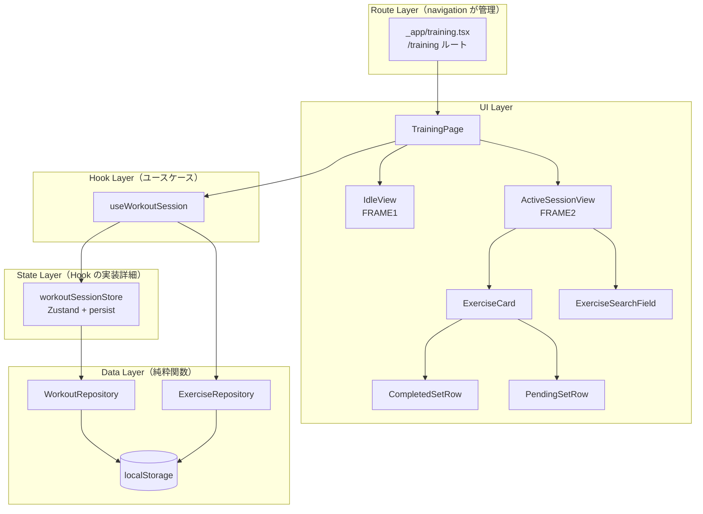

# ワークアウト記録管理

**関連 Spec:** [index_spec.md](index_spec.md)
**関連 PRD:** [index.md](../../requirement/workout/index.md)

---

# 1. 実装ステータス

**ステータス:** 🟢 実装済み

| モジュール/機能 | ステータス | 備考 |
|-------------|--------|------|
| WorkoutRepository | 🟢 実装済み | Data Layer: localStorage CRUD（Zod検証付き） |
| workoutSessionStore (Zustand + persist) | 🟢 実装済み | State Layer: セッション下書き・カード状態。persist でセッション永続化 |
| useWorkoutSession | 🟢 実装済み | Hook Layer: セッション記録ユースケース + elapsedSeconds |
| TrainingPage | 🟢 実装済み | UI Layer: isActive で IdleView/ActiveSessionView 切替 |
| IdleView (FRAME1) | 🟢 実装済み | UI Layer: セッション未開始画面 |
| ActiveSessionView (FRAME2) | 🟢 実装済み | UI Layer: セッション記録画面 |
| ExerciseCard | 🟢 実装済み | UI Layer: 種目カード（3状態）+ 三点メニュー（並べ替え・削除） |
| CompletedSetRow | 🟢 実装済み | UI Layer: 完了済みセット行 |
| PendingSetRow | 🟢 実装済み | UI Layer: 入力中セット行 |
| ExerciseSearchField | 🟢 実装済み | UI Layer: 種目検索・追加フィールド |

---

# 2. 設計目標

- **セッションライフサイクル中心**: FRAME1（Idle）→ FRAME2（Active）→ 保存 → FRAME1 のフローを中心とした設計。FRAME1/FRAME2 は `/training` ルート内の状態切替（navigation 機能がルーティングを管理）
- **セット記録のスムーズさ**: チェックで完了→自動追加→前セット値自動入力の連続フロー（FR-028, FR-006）
- **種目カードの状態管理**: 3状態（collapsed/idle/recording）の明確な遷移によるUI制御（FR-030）
- **セッション永続化**: Zustand persist で下書き状態を自動永続化し、ページ遷移・リロード後も復元可能（navigation FR-006）。「終了」タップ時に WorkoutRepository.save で正式保存
- **オフライン動作**: サーバー不要でブラウザ単体で完結（A-002）
- **Phase 3への拡張性**: AIが `WorkoutRepository` のAPIを利用できるよう、ストア外からも呼び出せる純粋関数として設計

---

# 3. 技術スタック

| 領域 | 採用技術 | 選定理由 |
|------|--------|--------|
| UIフレームワーク | React (TSX) | T-001: TypeScript Strict Mode |
| UIコンポーネント | shadcn/ui + Radix UI | A-001: Library-First。一貫したデザインシステム |
| スタイリング | Tailwind CSS ^4 | T-003: Mobile-First UI。ユーティリティクラスで迅速なモバイルUI構築 |
| ルーティング | TanStack Router ^1 | ナビゲーション機能が管理。FRAME1/FRAME2 は `/training` ルート内の状態切替 |
| アイコン | @phosphor-icons/react | design-system.html が Phosphor Icons を使用（A-001） |
| 状態管理 | Zustand ^5 | セッション下書き状態の管理。hooks 経由のみ公開 |
| データ永続化 | localStorage (JSON) | B-001: Privacy-by-Design。A-002: Client-Only Architecture |
| バリデーション | Zod ^4 | localStorage 読み取り時のデータ検証（T-002: No Runtime Errors） |
| 日付処理 | ネイティブ Date API | YYYY-MM-DD 形式と ISO 8601 datetime のみ扱うため十分 |

## 3.1. UI デザインシステム

UIコンポーネントのスタイルは PRD のデザインリファレンス（`.sdd/design-system.html`）に従う。

### カラーパレット

| 用途 | 値 | Tailwind クラス |
|:---|:---|:---|
| Primary（ボタン背景） | `#000000` | `bg-black` |
| Accent（終了ボタン・タイマー） | accent色 | `text-accent` |
| Secondary（背景・入力フィールド） | `#F4F4F5` | `bg-zinc-100` |
| Destructive | `#EF4444` | `bg-red-500` |
| テキスト primary | `#000000` | `text-black` |
| テキスト muted | `#71717A` | `text-zinc-500` |
| テキスト placeholder / SetNumber | `#A1A1AA` | `text-zinc-400` |
| 完了済みセット背景 | `#FAFAFA` | `bg-zinc-50` |
| ボーダー | `#E4E4E7` | `border-zinc-200` |

### タイポグラフィ

| フォント | 用途 |
|:---|:---|
| `Outfit` | 見出し・ボタン・ラベル・種目名（font-weight 600/700/800） |
| `Inter` | ボディ・メタ情報・入力値（font-weight 500） |

---

# 4. アーキテクチャ

## 4.1. システム構成図



UIは Hook Layer だけを知る。State Layer・Data Layer は hooks の実装詳細であり、UI から直接参照しない。

> **ルーティング**: `/training` ルートは navigation 機能（`src/routes/_app/training.tsx`）が管理する。FRAME1/FRAME2 の切替は `TrainingPage` コンポーネント内で `useWorkoutSession().isActive` により行い、URL は変わらない。セッションタイマーと「終了」ボタンは navigation の `GearIcon` コンポーネントが props 経由で表示する（[navigation_design.md](../navigation_design.md) 参照）。

## 4.2. モジュール分割

### Data Layer

| モジュール名 | 責務 | 依存関係 | 配置場所 |
|-----------|------|---------|--------|
| WorkoutRepository | localStorage のCRUD操作。Reactを知らない純粋関数 | workoutSchema (Zod) | `src/lib/workoutRepository.ts` |
| ExerciseRepository | 種目データの読み取り。（exercise-master モジュール提供） | なし | `src/lib/exerciseRepository.ts` |

### Schema Layer

| モジュール名 | 責務 | 依存関係 | 配置場所 |
|-----------|------|---------|--------|
| workoutSchema | Workout/WorkoutExercise/WorkoutSet の Zod スキーマ定義 | dateStringSchema, isoDateTimeSchema (date.ts) | `src/schemas/workout.ts` |

### State Layer（Hook の実装詳細）

| モジュール名 | 責務 | 依存関係 | 配置場所 |
|-----------|------|---------|--------|
| workoutSessionStore | セッション下書き・カード状態・タイマーの状態保持（Zustand + persist）。UI から直接使用しない | WorkoutRepository | `src/stores/workoutSessionStore.ts` |

> **persist 設定**: Zustand `persist` ミドルウェアで `draftExercises`, `startedAt`, `isActive` を `gymini:workout-session` キーで localStorage に永続化する。`partialize` で永続化対象を限定し、`onRehydrateStorage` でエラーハンドリング（T-002）。ページ遷移やリロード時のセッションデータ復元を実現する（navigation spec FR-006, NFR-002）。

### Hook Layer（ユースケース）

| モジュール名 | 責務 | 依存関係 | 配置場所 |
|-----------|------|---------|--------|
| useWorkoutSession | セッション記録の全ユースケース。下書き管理・カード状態・タイマー・保存・種目検索を束ねる | workoutSessionStore, ExerciseRepository | `src/hooks/useWorkoutSession.ts` |

### UI Layer

| モジュール名 | 責務 | 依存関係 | 配置場所 |
|-----------|------|---------|--------|
| TrainingPage | `/training` ルートのページコンポーネント。`isActive` で IdleView / ActiveSessionView を切替 | useWorkoutSession | `src/pages/TrainingPage.tsx` |
| IdleView | FRAME1: セッション未開始画面。挨拶 + 「トレーニングを始める」ボタン | なし（props: `onStartTraining`） | `src/components/IdleView.tsx` |
| ActiveSessionView | FRAME2: セッション記録画面。種目カード一覧 + 種目追加フィールド | useWorkoutSession | `src/components/workout/ActiveSessionView.tsx` |
| ExerciseCard | 種目カード（3状態: collapsed/idle/recording） | なし（props） | `src/components/workout/ExerciseCard.tsx` |
| CompletedSetRow | 完了済みセット行（ゴミ箱 + 値表示 + 鉛筆） | なし（props） | `src/components/workout/CompletedSetRow.tsx` |
| PendingSetRow | 入力中セット行（セット番号 + 重量/回数入力 + チェックボタン） | なし（props） | `src/components/workout/PendingSetRow.tsx` |
| ExerciseSearchField | 種目検索・追加フィールド | なし（props） | `src/components/workout/ExerciseSearchField.tsx` |

> **Note**: セッションタイマー（pill型）と「終了」ボタンはナビゲーション機能の `GearIcon` コンポーネントが表示する。`GearIcon` は `showEndButton`, `elapsedTime`, `onEndSession` props を受け取り、FRAME2 時に header area に配置する（[navigation_design.md](../navigation_design.md) 参照）。本モジュールでは `useWorkoutSession` の `elapsedSeconds` と `endSession` を提供する側の責務を持つ。

---

# 5. データモデル

```typescript
// localStorage キー
const STORAGE_KEY = 'gymini:workouts'

// -------------------------------------------------------
// 日付・日時スキーマ（src/schemas/date.ts）
// dateStringSchema / DateString / toDateString / todayDateString は
// history モジュールが定義元（canonical）。本モジュールは import して使用する。
// -------------------------------------------------------
import { dateStringSchema, type DateString } from './date'  // history が定義元

// ISODateTimeString: ISO 8601 datetime の branded type（本モジュールで追加定義）
export const isoDateTimeSchema = z.string().datetime()
export type ISODateTimeString = string & { readonly __brand: 'ISODateTimeString' }

export function toISODateTimeString(value: string): ISODateTimeString {
  isoDateTimeSchema.parse(value)
  return value as ISODateTimeString
}

export function nowISODateTimeString(): ISODateTimeString {
  return new Date().toISOString() as ISODateTimeString
}

// -------------------------------------------------------
// ワークアウト Zod スキーマ（src/schemas/workout.ts）
// -------------------------------------------------------

const workoutSetSchema = z.object({
  weight: z.number().nonnegative(),
  reps: z.number().int().nonnegative(),
})

const workoutExerciseSchema = z.object({
  exerciseId: z.string(),
  exerciseName: z.string(),
  sets: z.array(workoutSetSchema),
})

const workoutSchema = z.object({
  id: z.string(),
  date: dateStringSchema,
  exercises: z.array(workoutExerciseSchema),
  startedAt: isoDateTimeSchema,
  endedAt: isoDateTimeSchema,
  createdAt: isoDateTimeSchema,
  updatedAt: isoDateTimeSchema,
})

// 保存形式: JSON配列
// [
//   {
//     id: "uuid-v4",
//     date: "2026-03-08",
//     exercises: [
//       {
//         exerciseId: "bench-press",
//         exerciseName: "ベンチプレス",
//         sets: [
//           { weight: 60, reps: 10 },
//           { weight: 65, reps: 8 }
//         ]
//       }
//     ],
//     startedAt: "2026-03-08T10:00:00.000Z",
//     endedAt: "2026-03-08T10:45:00.000Z",
//     createdAt: "2026-03-08T10:45:00.000Z",
//     updatedAt: "2026-03-08T10:45:00.000Z"
//   }
// ]
```

---

# 6. インターフェース定義

```typescript
// -------------------------------------------------------
// WorkoutRepository (src/lib/workoutRepository.ts)
// 純粋関数群。localStorage を直接読み書きする。
// -------------------------------------------------------

// [internal] getAll は listByDateDesc/listByDate の内部ヘルパー。公開APIではない。
function getAll(): Workout[] {
  // localStorage から全ワークアウトを返す。
  // Zod でパース、失敗時は [] にフォールバック（T-002）
}

function getById(id: string): Workout | undefined {
  // IDでワークアウトを取得する
}

function listByDateDesc(): Workout[] {
  // 日付降順でソートして返す。ワークアウトが存在しない場合は []
}

function listByDate(date: DateString): Workout[] {
  // 指定日のワークアウトを返す。該当なしの場合は []
}

type WorkoutInput = Omit<Workout, 'id' | 'createdAt' | 'updatedAt'>

function save(input: WorkoutInput): Workout {
  // id, createdAt, updatedAt を付与して保存（FR-001, FR-031）
}

function remove(id: string): void {
  // 指定IDを削除（`delete` はJS予約語のため `remove` を使用）
}

// -------------------------------------------------------
// workoutSessionStore (src/stores/workoutSessionStore.ts)
// Hook の実装詳細。UI から直接 import しない。
// Zustand + persist ミドルウェアでセッションデータを永続化。
// -------------------------------------------------------

type WorkoutSessionState = {
  // State
  isActive: boolean                       // セッション中かどうか
  startedAt: ISODateTimeString | null     // セッション開始時刻
  date: DateString | null                 // セッション対象日付（startSession で設定、endSession でリセット）
  draftExercises: DraftExercise[] // セッション中の種目・セット

  // Actions（spec WorkoutSession API に対応）
  startSession: (date?: DateString) => void
  // startSession: isActive = true, startedAt = nowISODateTimeString(), date = date ?? todayDateString(), draftExercises = []

  endSession: () => void
  // endSession: draftExercises → WorkoutInput に変換 → WorkoutRepository.save
  // 完了後 isActive = false, startedAt = null, date = null, draftExercises = [] にリセット

  addExercise: (exercise: { exerciseId: string; exerciseName: string }) => void
  // 種目カードを recording 状態で追加。pendingSet を { weight: 0, reps: 0 } で初期化。
  // 現在 recording 中の他種目があれば pendingSet を消去し idle に降格（FR-005, FR-028, FR-030）

  activateExercise: (exerciseIndex: number) => void
  // idle 種目の「+」ボタン: pendingSet を初期化し cardState → recording。
  // 現在 recording 中の他種目があれば pendingSet を消去し idle に降格（FR-028, FR-030）

  deleteExercise: (exerciseIndex: number) => void
  // 三点メニュー「削除」: draftExercises から指定インデックスの種目を除去（FR-030）

  reorderExercise: (exerciseIndex: number, direction: 'up' | 'down') => void
  // 三点メニュー「上へ移動」/「下へ移動」: 指定インデックスの種目を隣と入れ替え（FR-030）
  // 先頭種目の 'up' / 末尾種目の 'down' は無操作

  completeSet: (exerciseIndex: number, set: WorkoutSet) => void
  // チェックボタン: pendingSet → sets[] に追加、次の pendingSet を前セット値で初期化（FR-028, FR-006）

  editCompletedSet: (exerciseIndex: number, setIndex: number) => void
  // 鉛筆: sets[setIndex] を pendingSet に移動、cardState → recording（FR-029）

  deleteCompletedSet: (exerciseIndex: number, setIndex: number) => void
  // ゴミ箱: sets[setIndex] を削除（FR-029）

  updatePendingSet: (exerciseIndex: number, pendingSet: Partial<WorkoutSet>) => void
  // 入力中セット行の重量・回数変更をリアルタイムに反映（PendingSetRow の onChange）

  toggleExerciseCard: (exerciseIndex: number) => void
  // カードヘッダータップ: collapsed ↔ 元の状態 を切り替え（FR-030）
}

// persist 設定
// const useWorkoutSessionStore = create<WorkoutSessionState>()(
//   persist(
//     (set, get) => ({ ... }),
//     {
//       name: 'gymini:workout-session',
//       partialize: (state) => ({
//         isActive: state.isActive,
//         startedAt: state.startedAt,
//         draftExercises: state.draftExercises,
//       }),
//       onRehydrateStorage: () => (_state, error) => {
//         if (error) {
//           console.warn('[gymini] workoutSessionStore rehydration failed, using defaults', error)
//         }
//       },
//     }
//   )
// )

// DraftExercise: セッション記録中の1種目（未保存）
type DraftExercise = {
  exerciseId: string
  exerciseName: string
  sets: WorkoutSet[]              // 完了済みセット
  pendingSet: WorkoutSet | null   // 入力中セット。null = 入力行なし
  cardState: ExerciseCardState    // 3状態（FR-030）
}

// -------------------------------------------------------
// useWorkoutSession (src/hooks/useWorkoutSession.ts)
// セッション記録のユースケース。UI はこれだけ知ればよい。
// -------------------------------------------------------

function useWorkoutSession() {
  // return: {
  //   // State
  //   isActive: boolean,
  //   startedAt: ISODateTimeString | null,
  //   draftExercises: DraftExercise[],
  //   elapsedSeconds: number,              // spec の getElapsedTime(): number を React hooks パターンでリアクティブ state として実現（FR-032）
  //
  //   // Session lifecycle（FR-001, FR-031）
  //   startSession: () => void,
  //   endSession: () => void,
  //
  //   // Exercise management（FR-005, FR-028, FR-030）
  //   addExercise: (exercise: { exerciseId: string; exerciseName: string }) => void,  // recording状態で追加。他のrecordingはidleに降格
  //   activateExercise: (exerciseIndex: number) => void,  // idle種目の「+」ボタン。他のrecordingはidleに降格
  //   deleteExercise: (exerciseIndex: number) => void,    // 三点メニュー「削除」
  //   reorderExercise: (exerciseIndex: number, direction: 'up' | 'down') => void,  // 三点メニュー「並べ替え」
  //   searchExercises: (query: string) => Exercise[],  // ExerciseRepository を内部で呼ぶ
  //   createExercise: (name: string) => Exercise,       // ExerciseRepository を内部で呼ぶ
  //
  //   // Set management（FR-028, FR-006, FR-029）
  //   completeSet: (exerciseIndex: number, set: WorkoutSet) => void,
  //   editCompletedSet: (exerciseIndex: number, setIndex: number) => void,
  //   deleteCompletedSet: (exerciseIndex: number, setIndex: number) => void,
  //   updatePendingSet: (exerciseIndex: number, pendingSet: Partial<WorkoutSet>) => void,  // 入力中セット行のリアルタイム更新
  //
  //   // Card state（FR-030）
  //   toggleExerciseCard: (exerciseIndex: number) => void,
  // }
}
```

---

# 7. 非機能要件実現方針

| 要件 | 実現方針 |
|------|--------|
| データ整合性（NFR-001） | localStorage への書き込みは `try/catch` でラップ。読み取り時は Zod パースで検証し、失敗時は空配列にフォールバック（T-002） |
| セッション永続化（navigation FR-006, NFR-002） | Zustand `persist` ミドルウェアで `isActive`, `startedAt`, `draftExercises` を `gymini:workout-session` キーで自動永続化。`onRehydrateStorage` でエラーハンドリング（T-002） |

### セット完了→自動追加の実現方針（FR-028, FR-006）

`ExerciseCard` 内の `PendingSetRow` でチェックボタンタップ時の挙動：

```
1. pendingSet の値（重量・回数）を completeSet に渡す
2. store が pendingSet → sets[] に追加
3. 次の pendingSet を直前の確定セットの { weight, reps } でコピー初期化
4. PendingSetRow が再レンダリングされ、前セット値が入力欄に表示される
```

### 種目カード状態遷移の実現方針（FR-030）

`DraftExercise.cardState` を Zustand store で管理し、以下のルールで遷移する。**recording は同時に1種目のみ**（排他制御）：

| トリガー | 遷移元 | 遷移先 | アクション | 排他制御 |
|:--------|:-------|:-------|:---------|:---------|
| 種目追加 | - | `recording` | `addExercise`（pendingSet自動作成） | 他のrecording → idle |
| 「+」ボタン | `idle` | `recording` | `activateExercise`（pendingSet初期化） | 他のrecording → idle |
| チェック | `recording` | `recording` | `completeSet`（次の pendingSet を設定） | - |
| 別種目がrecordingに | `recording` | `idle` | 自動降格（pendingSet消去） | - |
| ヘッダータップ | `idle`/`recording` | `collapsed` | `toggleExerciseCard` | - |
| ヘッダータップ | `collapsed` | `idle` | `toggleExerciseCard` | - |
| 三点メニュー「削除」 | 任意 | -（リストから除去） | `deleteExercise` | - |
| 三点メニュー「上へ/下へ」 | 任意 | 任意（順序変更） | `reorderExercise` | - |

### セッションタイマーの実現方針（FR-032）

`useWorkoutSession` 内で `startedAt` を基に `elapsedSeconds` を毎秒更新する：

```typescript
// useWorkoutSession 内
const [elapsedSeconds, setElapsedSeconds] = useState(0)

useEffect(() => {
  if (!startedAt) return
  const interval = setInterval(() => {
    setElapsedSeconds(Math.floor((Date.now() - new Date(startedAt).getTime()) / 1000))
  }, 1000)
  return () => clearInterval(interval)
}, [startedAt])
```

`elapsedSeconds` は `useWorkoutSession` が返す。表示は navigation の `GearIcon` コンポーネントが `elapsedTime` prop（`"HH:MM:SS"` 形式）として受け取り、header area にタイマーpillとして表示する。フォーマット変換は `_app.tsx` の AppLayout（または TrainingPage）で行う。

---

# 8. テスト戦略

| テストレベル | 対象 | カバレッジ目標 | 対応FR |
|-----------|------|------------|--------|
| ユニットテスト | WorkoutRepository（save, remove, getById, listByDateDesc, listByDate） | 全関数 | FR-001 |
| ユニットテスト | workoutSchema（Zod パースの正常系・異常系） | 全パターン | T-002 |
| ユニットテスト | useWorkoutSession（startSession, endSession, addExercise, completeSet, editCompletedSet, deleteCompletedSet, addFirstSet, toggleExerciseCard） | 全アクション | FR-001〜FR-032 |
| コンポーネントテスト | PendingSetRow（チェック→完了、前セット値表示） | 主要インタラクション | FR-028, FR-006 |
| コンポーネントテスト | CompletedSetRow（ゴミ箱→削除、鉛筆→編集戻し） | 主要インタラクション | FR-029 |
| コンポーネントテスト | ExerciseCard（3状態遷移、collapsed/idle/recording切替） | 主要インタラクション | FR-030 |
| 統合テスト | ActiveSessionView（複数種目セッション→終了→保存） | FR-005 完全フロー | FR-005 |
| 統合テスト | workoutSessionStore persist（リロード後のセッション復元） | セッション永続化 | navigation FR-006, NFR-002 |
| E2Eテスト | TrainingPage: FRAME1 → FRAME2 → セット記録 → 終了 → FRAME1 | セッションライフサイクル全体 | FR-001, FR-031 |

---

# 9. 設計判断

## 9.1. 決定事項

| 決定事項 | 選択肢 | 決定内容 | 理由 |
|---------|--------|--------|------|
| 永続化方法 | localStorage vs IndexedDB | localStorage | DC_003準拠。ワークアウトデータは数百件程度の想定でlocalStorageで十分。実装コストが低い |
| 状態管理 | Zustand vs useState vs Context | Zustand | FRAME1/FRAME2 をまたぐセッション状態の共有が必要。useState では prop drilling が発生する |
| IDの生成 | crypto.randomUUID() | crypto.randomUUID() | モダンブラウザで標準サポート。外部依存ゼロ |
| exerciseNameのスナップショット保存 | IDのみ保存 vs 名前も保存 | 両方保存 | 種目名変更後も記録の表示が崩れない。AIが参照する際も名前があると有利 |
| 日付形式 | Date オブジェクト vs 文字列 | 文字列（YYYY-MM-DD） | localStorage にそのまま保存可能。ソート・比較が文字列比較で可能 |
| 削除済み種目の表示 | exerciseId 存在確認 vs exerciseName フォールバック | フォールバック表示（存在確認なし） | 種目マスターが削除されても記録の表示が壊れない（spec 制約事項参照） |
| 記録中の下書き管理 | 都度保存 vs persist + 終了時に正式保存 | persist で自動永続化 + 終了時に WorkoutRepository.save | Zustand persist でセッション中の下書き（draftExercises）を自動永続化し、リロード後も復元可能にする。「終了」タップ時に WorkoutRepository.save で正式なワークアウトとして保存（FR-031）。persist は下書き専用キー `gymini:workout-session` を使用 |
| 自動入力の対象フィールド | 重量・回数 | 重量・回数のみ | 重量・回数は同じセットを繰り返すケースが多い（FR-006） |
| レイヤー構成 | Repository を UI から直接呼ぶ vs Hook Layer を挟む | Hook Layer（usecase hooks）を挟む | UI が Zustand・Repository を直接知ると、状態管理ライブラリ変更時の影響範囲が広い。hooks を境界にすることで UI は「何ができるか」だけ知ればよい |
| Zustand store の公開範囲 | UI から直接 useStore() vs hooks 経由のみ | hooks 経由のみ | store は hooks から利用される実装詳細。直接公開するとユースケースの境界が曖昧になる |
| カード状態の管理場所 | コンポーネントローカル state vs Zustand store | Zustand store | 折りたたみ状態はセッション全体で管理が必要。ローカル state だとリレンダリング時にリセットされる |
| カード状態モデル | 4状態（collapsed/expanded-empty/recording/all-completed） vs 3状態（collapsed/idle/recording） | 3状態 | expanded-emptyとall-completedはUI上「+」ボタン表示で同一。3状態に簡素化することでロジックが単純になる |
| recording の排他制御 | 複数種目同時recording vs 1種目のみ | 1種目のみ | 同時に複数の入力行があるとフォームが散乱する。1種目に集中させることで画面がスッキリし入力ミスを防ぐ |
| 最初のセット入力行 | 「+」ボタンで手動追加 vs 種目追加時に自動作成 | 自動作成 + フォーカス | 種目追加→「+」タップの2ステップを1ステップに削減。2セット目以降はチェック後に自動追加されるので、最初のセットも自動が一貫性ある |
| タイマーの更新方式 | setInterval vs requestAnimationFrame | setInterval（1秒間隔） | 秒単位の表示で十分。requestAnimationFrame はオーバースペック |
| FRAME1/FRAME2 の画面遷移 | 別ルート vs 状態切替 | `/training` 内の状態切替 | FRAME1/FRAME2 は同一ルート内で `isActive` による切替。ルーティングは navigation 機能が管理（[navigation_design.md](../navigation_design.md)）。URL が変わらないため、セッション中の誤ナビゲーションを防止 |
| セッションタイマー・終了ボタンの配置 | ページ内 vs header area | header area（GearIcon） | navigation の GearIcon が `showEndButton`, `elapsedTime`, `onEndSession` props で表示。design-system.html 準拠。全画面共通の header area に統一 |
| セッションデータ永続化 | 都度保存 vs persist | Zustand persist | ページ遷移・リロード時のセッション復元。navigation spec FR-006, NFR-002 準拠。`partialize` で `isActive`, `startedAt`, `draftExercises` のみ永続化 |
| localStorage 読み取り検証 | 型アサーション vs Zod パース | Zod パース | T-002: No Runtime Errors。不正データによるクラッシュを防止 |
| 日付・日時の型表現 | 素の `string` vs Zod branded type | Zod branded type（`DateString`, `ISODateTimeString`） | history モジュールと同じパターン。素の `string` では任意の文字列が型チェックを通過する。branded type は境界でパースし内部は型安全に流通でき、Zod 活用方針に合致。`src/schemas/date.ts` で history と共有 |
| Zustand persist と React イベント | store action を onClick に直接渡す vs ラップ | `() => startSession()` でラップ | React の onClick ハンドラから store action を直接渡すと、SyntheticEvent が optional パラメータ（`date?`）として渡され、persist middleware がシリアライズ時に循環参照エラーを起こす。アロー関数でラップして引数を遮断する |
| ExerciseCard の exerciseIndex | props で渡す vs クロージャで束縛 | クロージャで束縛（props から除外） | ExerciseCard は内部で exerciseIndex を使用しない。ActiveSessionView で `onActivate={() => activateExercise(i)}` のようにクロージャで束縛して渡すことで、コンポーネントの props をシンプルに保つ |

## 9.2. 未解決の課題

> **注意**: このセクションに内容がある場合は `impl-status: "blocked"` にセットし、解決するまで実装を開始しないこと（D-002）。

*現時点で未解決の課題はありません。*
