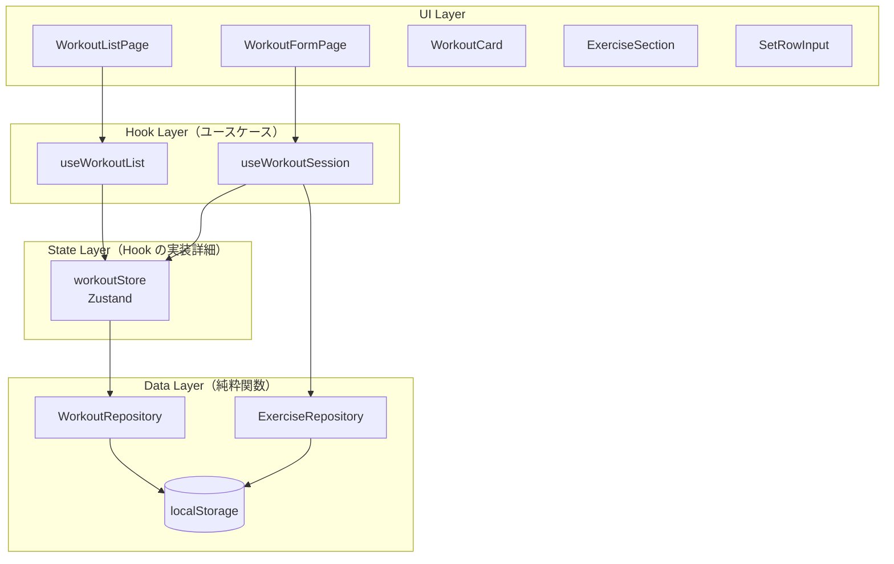

# ワークアウト記録管理

**関連 Spec:** [index_spec.md](index_spec.md)
**関連 PRD:** [index.md](../../requirement/workout/index.md)

---

# 1. 実装ステータス

**ステータス:** 🔴 未実装

| モジュール/機能 | ステータス | 備考 |
|-------------|--------|------|
| WorkoutRepository | 🔴 未実装 | Data Layer: localStorage CRUD |
| workoutStore (Zustand) | 🔴 未実装 | State Layer: Hook の実装詳細 |
| useWorkoutList | 🔴 未実装 | Hook Layer: 一覧ユースケース |
| useWorkoutSession | 🔴 未実装 | Hook Layer: 記録セッションユースケース |
| WorkoutListPage | 🔴 未実装 | UI Layer: 一覧画面 |
| WorkoutFormPage | 🔴 未実装 | UI Layer: セッション形式の記録フォーム |
| ExerciseSection | 🔴 未実装 | UI Layer: 1種目セクション |
| SetRowInput | 🔴 未実装 | UI Layer: セット入力（自動入力・自動フォーカス） |
| WorkoutCard | 🔴 未実装 | UI Layer: 一覧表示カード |

---

# 2. 設計目標

- **シンプルなCRUD**: 余分な抽象化なく、localStorage を直接操作するシンプルな実装
- **即時反映**: 保存後に一覧が即座に更新される
- **セッション形式の記録UX**: 記録中は複数種目を連続して追加できる。保存前はメモリ内の下書き状態を保持し、最後にまとめて保存する
- **入力ストレスの最小化**: 2セット目以降は前セットの値を自動入力。種目選択後は重量フィールドに自動フォーカス
- **オフライン動作**: サーバー不要でブラウザ単体で完結
- **Phase 3への拡張性**: AIが `WorkoutRepository` のAPIを利用できるよう、ストア外からも呼び出せる純粋な関数として設計

---

# 3. 技術スタック

| 領域 | 採用技術 | 選定理由 |
|------|--------|--------|
| UIフレームワーク | React (JSX) | DC_001: プロジェクト制約 |
| 状態管理 | Zustand | 軽量・シンプル。React Context より低コスト。TypeScript不使用でも利用可能 |
| データ永続化 | localStorage (JSON) | DC_003: ブラウザローカル保存。IndexedDBより実装がシンプルで依存ゼロ |
| スタイリング | Tailwind CSS | DC_004: スマホファースト。ユーティリティクラスで迅速なモバイルUI構築 |
| 日付処理 | ネイティブ Date API | 外部ライブラリ不使用。YYYY-MM-DD形式のみ扱うため十分 |

---

# 4. アーキテクチャ

## 4.1. システム構成図



UIは Hook Layer だけを知る。State Layer・Data Layer は hooks の実装詳細であり、UI から直接参照しない。

## 4.2. モジュール分割

### Data Layer

| モジュール名 | 責務 | 依存関係 | 配置場所 |
|-----------|------|---------|--------|
| WorkoutRepository | localStorage のCRUD操作。Reactを知らない純粋関数 | なし | `src/lib/workoutRepository.js` |
| ExerciseRepository | 種目データの読み取り。Reactを知らない純粋関数 | なし | `src/lib/exerciseRepository.js` |

### State Layer（Hook の実装詳細）

| モジュール名 | 責務 | 依存関係 | 配置場所 |
|-----------|------|---------|--------|
| workoutStore | 一覧・セッション下書きの状態保持（Zustand）。UI から直接使用しない | WorkoutRepository | `src/stores/workoutStore.js` |

### Hook Layer（ユースケース）

| モジュール名 | 責務 | 依存関係 | 配置場所 |
|-----------|------|---------|--------|
| useWorkoutList | 一覧表示・削除のユースケース。workoutStore をラップして UI に公開 | workoutStore | `src/hooks/useWorkoutList.js` |
| useWorkoutSession | セッション記録のユースケース。下書き管理・保存・種目検索を束ねる | workoutStore, ExerciseRepository | `src/hooks/useWorkoutSession.js` |

### UI Layer

| モジュール名 | 責務 | 依存関係 | 配置場所 |
|-----------|------|---------|--------|
| WorkoutListPage | ワークアウト一覧の表示・削除 | useWorkoutList | `src/pages/WorkoutListPage.jsx` |
| WorkoutFormPage | セッション形式の記録フォーム | useWorkoutSession | `src/pages/WorkoutFormPage.jsx` |
| ExerciseSection | 1種目のセクション（種目名 + セット一覧 + 入力行） | なし（props） | `src/components/ExerciseSection.jsx` |
| SetRowInput | セット入力行（自動入力・自動フォーカス） | なし（props） | `src/components/SetRowInput.jsx` |
| WorkoutCard | 1ワークアウトの表示カード | なし（props） | `src/components/WorkoutCard.jsx` |

---

# 5. データモデル

```javascript
// localStorage キー
const STORAGE_KEY = 'gymini:workouts'

// 保存形式: JSON配列
// [
//   {
//     id: "uuid-v4",
//     date: "2026-03-08",
//     exercises: [
//       {
//         exerciseId: "bench-press",
//         exerciseName: "ベンチプレス",
//         sets: [
//           { weight: 60, reps: 10, memo: "" },
//           { weight: 65, reps: 8, memo: "少しきつかった" }
//         ]
//       }
//     ],
//     memo: "調子良かった",
//     createdAt: "2026-03-08T10:00:00.000Z",
//     updatedAt: "2026-03-08T10:00:00.000Z"
//   }
// ]
```

---

# 6. インターフェース定義

```javascript
// WorkoutRepository (src/lib/workoutRepository.js)
// 純粋関数群。localStorage を直接読み書きする。

// [internal] getAll は listByDateDesc/listByDate の内部ヘルパー。公開APIではない。
function getAll() {
  // localStorage から全ワークアウトを返す。失敗時・空の場合は []
  // return: Workout[]
}

function getById(id) {
  // IDでワークアウトを取得する
  // return: Workout | undefined
}

function listByDateDesc() {
  // 日付降順でソートして返す。ワークアウトが存在しない場合は []
  // return: Workout[]
}

function listByDate(date) {
  // 指定日 (YYYY-MM-DD) のワークアウトを返す。該当なしの場合は []
  // return: Workout[]
}

// WorkoutInput: Omit<Workout, 'id' | 'createdAt' | 'updatedAt'>
// = { date: string, exercises: WorkoutExercise[], memo?: string }

function create(input) {
  // id, createdAt, updatedAt を付与して保存
  // return: Workout
}

function update(id, input) {
  // 既存レコードを更新。updatedAt を更新
  // return: Workout | null
}

function remove(id) {
  // 指定IDを削除（`delete` はJS予約語のため `remove` を使用 - spec FR-001参照）
  // return: void
}

// -------------------------------------------------------
// workoutStore (src/stores/workoutStore.js)
// Hook の実装詳細。UI から直接 import しない。
// -------------------------------------------------------

const workoutStore = {
  // State
  workouts: [],              // Workout[] - 一覧表示用
  draftDate: '',             // string - セッション中の日付
  draftExercises: [],        // DraftExercise[] - セッション中の種目・セット
  draftMemo: '',             // string - ワークアウト全体のメモ
  draftWorkoutId: null,      // string | null - 編集中の既存ワークアウトID。新規作成時は null

  // Actions
  loadWorkouts: () => void,
  deleteWorkout: (id) => void,
  startSession: (date, existingWorkout) => void,
  // startSession:
  //   date: 新規作成時は今日の日付。既存ワークアウト編集時はその日付。
  //   existingWorkout (optional): 編集対象の Workout。
  //     指定時は draftWorkoutId = existingWorkout.id、
  //              draftExercises = existingWorkout.exercises をコピー、
  //              draftMemo = existingWorkout.memo にセット。
  //     省略時は draftWorkoutId = null（新規作成モード）
  addExercise: (exercise) => void,
  addSet: (exerciseIndex, set) => void,
  removeSet: (exerciseIndex, setIndex) => void,
  setDraftMemo: (memo) => void,
  saveSession: () => void,
  // saveSession:
  //   draftWorkoutId が null なら WorkoutRepository.create(input) を呼ぶ（新規作成）
  //   draftWorkoutId が文字列なら WorkoutRepository.update(draftWorkoutId, input) を呼ぶ（更新）
  //   完了後、draftWorkoutId を null に戻し、workouts を再読み込みする
  cancelSession: () => void,
  updateWorkout: (id, input) => void,
}

// DraftExercise: セッション記録中の1種目（未保存）
// {
//   exerciseId: string,
//   exerciseName: string,
//   sets: WorkoutSet[],     // 確定済みセット
//   pendingSet: WorkoutSet, // 現在入力中のセット（前セットから自動入力）
// }

// -------------------------------------------------------
// useWorkoutList (src/hooks/useWorkoutList.js)
// 一覧表示・削除のユースケース。UI はこれだけ知ればよい。
// -------------------------------------------------------

function useWorkoutList() {
  // return:
  // {
  //   workouts: Workout[],          // 日付降順
  //   deleteWorkout: (id) => void,
  // }
}

// -------------------------------------------------------
// useWorkoutSession (src/hooks/useWorkoutSession.js)
// セッション記録のユースケース。UI はこれだけ知ればよい。
// -------------------------------------------------------

function useWorkoutSession() {
  // return:
  // {
  //   draftDate: string,
  //   draftExercises: DraftExercise[],
  //   draftMemo: string,
  //   startSession: (date?: string) => void,           // date省略時は今日。新規作成モード
  //   startEditSession: (workout: Workout) => void,    // 既存ワークアウトを編集モードで開始
  //   addExercise: (exercise) => void,
  //   addSet: (exerciseIndex, set) => void,
  //   removeSet: (exerciseIndex, setIndex) => void,
  //   setDraftMemo: (memo) => void,
  //   saveSession: () => void,    // 新規作成 or 更新を自動判別（store の draftWorkoutId を参照）
  //   cancelSession: () => void,
  //   searchExercises: (query) => Exercise[],  // ExerciseRepository を内部で呼ぶ
  // }
}
```

---

# 7. 非機能要件実現方針

| 要件 | 実現方針 |
|------|--------|
| 操作性（NFR-001）: 画面遷移2ステップ以内 | 一覧→フォーム→保存の2画面遷移。日付はデフォルト今日。種目選択後は自動フォーカス（FR-007）でタップ数削減 |
| データ整合性（NFR-002）: 損失・破損防止 | localStorage への書き込みは `try/catch` でラップ。読み取り失敗時は空配列にフォールバック |

### 自動入力の実現方針（FR-006）

`ExerciseSection` 内の `SetRowInput` は `pendingSet` として現在入力中のセットを管理する。「セット追加」ボタンタップ時の挙動：

```
1. pendingSet を確定済みセット（sets[]）に追加
2. 次の pendingSet を直前の確定セットの { weight, reps } でコピー初期化（memo は空）
3. 重量フィールドにフォーカスを設定（FR-007 と同じ仕組み）
```

### 自動フォーカスの実現方針（FR-007）

種目選択後と「セット追加」後、`useEffect` + `ref.current.focus()` で重量入力フィールドにフォーカスを移す。モバイルでキーボードが自動表示されることで、追加入力をスムーズに行える。

---

# 8. テスト戦略

| テストレベル | 対象 | カバレッジ目標 |
|-----------|------|------------|
| ユニットテスト | WorkoutRepository（各CRUD関数） | 全関数 |
| ユニットテスト | useWorkoutList（一覧取得・削除） | 全アクション |
| ユニットテスト | useWorkoutSession（startSession, addExercise, addSet, saveSession） | 全アクション |
| コンポーネントテスト | SetRowInput（自動入力・自動フォーカス） | FR-006, FR-007 |
| コンポーネントテスト | ExerciseSection（セット追加フロー） | 主要インタラクション |
| 統合テスト | WorkoutFormPage（hooks をモック → 複数種目セッション → 保存） | FR-005 完全フロー |

---

# 9. 設計判断

## 9.1. 決定事項

| 決定事項 | 選択肢 | 決定内容 | 理由 |
|---------|--------|--------|------|
| 永続化方法 | localStorage vs IndexedDB | localStorage | DC_003準拠。ワークアウトデータは数百件程度の想定でlocalStorageで十分。実装コストが低い |
| 状態管理 | Zustand vs useState vs Context | Zustand | 複数コンポーネント間でのワークアウト一覧共有が必要。useStateでは prop drilling が発生する |
| IDの生成 | crypto.randomUUID() | crypto.randomUUID() | モダンブラウザで標準サポート。外部依存ゼロ |
| exerciseNameのスナップショット保存 | IDのみ保存 vs 名前も保存 | 両方保存 | 種目名変更後も記録の表示が崩れない。AIが参照する際も名前があると有利 |
| 日付形式 | Date オブジェクト vs 文字列 | 文字列（YYYY-MM-DD） | localStorage にそのまま保存可能。ソート・比較が文字列比較で可能 |
| 削除済み種目の表示 | exerciseId 存在確認 vs exerciseName フォールバック | フォールバック表示（存在確認なし） | 種目マスターが削除されても記録の表示が壊れないよう、WorkoutCard は exerciseName を優先表示する。存在確認は行わない（spec 制約事項参照） |
| 記録中の下書き管理 | 都度保存 vs セッション終了時に一括保存 | セッション終了時に一括保存 | 種目追加のたびに保存すると不完全なデータが残る。記録中はメモリ内の `draftExercises` に保持し、「保存」タップ時にのみ localStorage に書き込む |
| 自動入力の対象フィールド | 重量・回数・メモ全て vs 重量・回数のみ | 重量・回数のみ（メモは空） | メモは毎回固有のコメントになることが多いため引き継がない。重量・回数は同じセットを繰り返すケースが多い |
| 自動フォーカスのタイミング | 種目選択後のみ vs セット追加後も | 両方 | 種目選択後とセット追加後の両方で重量フィールドにフォーカスすることで、キーボードが維持され連続入力がスムーズになる |
| レイヤー構成 | Repository を UI から直接呼ぶ vs Hook Layer を挟む | Hook Layer（usecase hooks）を挟む | UI が Zustand・Repository を直接知ると、状態管理ライブラリ変更時の影響範囲が広い。hooks を境界にすることで UI は「何ができるか」だけ知ればよく、テスト時も hooks をモックするだけで UI テストが書ける |
| Zustand store の公開範囲 | UI から直接 useStore() vs hooks 経由のみ | hooks 経由のみ | store は複数の hooks から利用される実装詳細。直接公開するとユースケースの境界が曖昧になる |

## 9.2. 未解決の課題

| 課題 | 影響度 | 対応方針 |
|------|--------|--------|
| localStorage の容量制限（5MB程度） | 低（当面問題なし） | Phase 2以降で必要なら IndexedDB 移行を検討 |
| 同一端末・複数タブでの同期 | 低 | `storage` イベントで他タブ変更を検知する対応は将来検討 |
