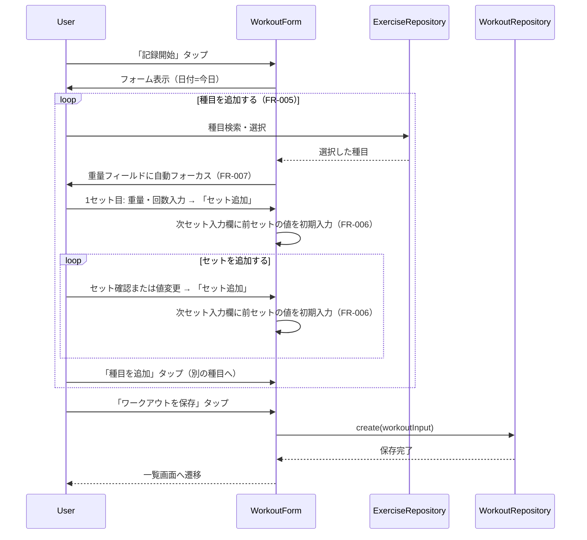
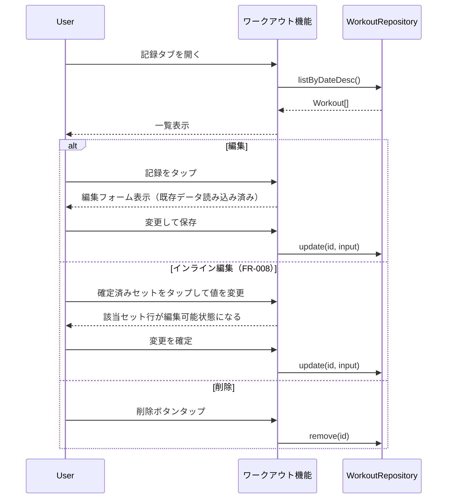

# ワークアウト記録管理

**関連 Design Doc:** [index_design.md](index_design.md)
**関連 PRD:** [index.md](../../requirement/workout/index.md)

---

# 1. 背景

gyminiのPhase 1中核機能。ユーザーが日々のトレーニング内容（種目・セット・重量・回数）を記録・管理する基盤となる。この記録はPhase 3のAIコーチング機能がコンテキストとして参照するため、データ構造の正確性が重要。

# 2. 概要

ワークアウト記録機能は以下の責務を持つ：

- **記録の作成・編集・削除**: 日付に紐づいたワークアウトのライフサイクル管理
- **セット管理**: 1ワークアウト内での複数種目・複数セットのデータ管理
- **一覧表示**: 過去の記録を日付降順で閲覧
- **メモ**: ワークアウト全体への補足情報の記録

種目選択UI（検索・自動登録）は種目マスター機能（[exercise-master](../../requirement/exercise-master/index.md)）が担当し、このモジュールは種目マスターのインターフェースを利用する。

# 3. 要求定義

## 3.1. 機能要件

| ID | 要件 | 優先度 | PRD参照 |
|----|------|--------|---------|
| FR-001 | ワークアウトの追加・編集・削除ができる | 必須 | FR_001 |
| FR-002 | ワークアウト一覧を日付降順で表示する | 必須 | FR_002 |
| FR-003 | セット単位で重量(kg)・回数・メモを管理する | 必須 | FR_003 |
| FR-004 | ワークアウト全体のメモを記録できる | 任意 | FR_004 |
| FR-005 | 1回のセッション内で複数の種目を連続して追加・記録できる | 必須 | FR_005 |
| FR-006 | 2セット目以降は直前のセットの重量・回数を初期値として自動入力する | 必須 | FR_003 |
| FR-007 | 種目選択後、最初のセット入力フィールドに自動フォーカスを移す | 推奨 | FR_003 |
| FR-008 | 確定済みセットの重量・回数・メモをインラインで編集できる | 推奨 | FR_003 |

## 3.2. 非機能要件

| ID | カテゴリ | 要件 | 目標値 |
|----|--------|------|--------|
| NFR-001 | 操作性 | ワークアウト一覧画面からフォーム遷移・保存完了までの画面遷移タップ数を最小化する | 画面遷移は2ステップ以内（一覧→フォーム→保存）。入力フィールドへのタップは除く |
| NFR-002 | データ整合性 | ワークアウトデータが損失・破損しないこと | ローカル永続化 |

# 4. API

ワークアウト機能が外部（他モジュール・UIレイヤー）に公開するインターフェース。

| モジュール | インターフェース | メンバー | 概要 |
|---------|--------------|--------|------|
| workout | WorkoutRepository | create(data) | 新規ワークアウトを保存する |
| workout | WorkoutRepository | update(id, data) | 既存ワークアウトを更新する（インライン編集後の保存を含む）（FR-008） |
| workout | WorkoutRepository | remove(id) | ワークアウトを削除する（`delete` はJS予約語のため `remove` を使用） |
| workout | WorkoutRepository | getById(id) | IDでワークアウトを取得する |
| workout | WorkoutRepository | listByDateDesc() | 日付降順で全ワークアウトを取得する |
| workout | WorkoutRepository | listByDate(date) | 指定日のワークアウトを取得する（カレンダー・AI用） |

## 4.1. 型定義

```typescript
// ワークアウト（1回のトレーニングセッション）
type Workout = {
  id: string
  date: string          // ISO 8601 date: "YYYY-MM-DD"
  exercises: WorkoutExercise[]
  memo?: string
  createdAt: string     // ISO 8601 datetime
  updatedAt: string
}

// ワークアウト内の1種目エントリ
type WorkoutExercise = {
  exerciseId: string    // 種目マスターのID
  exerciseName: string  // 表示名（スナップショット）
  sets: WorkoutSet[]
}

// 1セット
type WorkoutSet = {
  weight: number        // 重量 (kg)
  reps: number          // 回数
  memo?: string
}

// 作成・更新時の入力型
type WorkoutInput = Omit<Workout, 'id' | 'createdAt' | 'updatedAt'>

// セッション記録中の1種目（未保存の下書き状態）
// FR-005〜FR-008 のセッション形式UXを実現する中間状態。
// 実装詳細（Hook Layer）に属するが、外部から参照される概念として定義する。
type DraftExercise = {
  exerciseId: string
  exerciseName: string
  sets: WorkoutSet[]      // 確定済みセット
  pendingSet: WorkoutSet  // 現在入力中のセット（前セットから重量・回数を自動入力）
}
```

# 5. 用語集

| 用語 | 説明 |
|------|------|
| ワークアウト | 1回のトレーニングセッション。日付に紐づき、複数種目・セットを含む |
| セット | 1種目の1回の実施単位。重量・回数・メモで構成される |
| WorkoutExercise | ワークアウト内の1種目エントリ。種目IDと種目名のスナップショットを保持する |

# 6. 使用例

```
# セッション形式でのワークアウト記録フロー（FR-005, FR-006, FR-007）

[記録開始]
1. ユーザーが「記録」タブから「記録開始」ボタンをタップ
2. 日付（デフォルト: 今日）が入力済みのフォームが表示される

[種目1: ベンチプレス]
3. 種目検索フィールドに「ベンチ」と入力 → 候補表示
4. 「ベンチプレス」を選択
   → 自動フォーカスが重量入力フィールドに移る（FR-007）
5. 1セット目: 重量=60kg, 回数=10 を入力 → 「セット追加」
6. 2セット目: 重量=60, 回数=10 が初期入力済み（FR-006）→ 回数を8に変更 → 「セット追加」
7. 3セット目: 重量=60, 回数=8 が初期入力済み（FR-006）→ そのまま「セット追加」

[種目2: スクワット]
8. 「種目を追加」ボタンをタップ
9. 「スクワット」を選択 → 自動フォーカスが重量フィールドに移る（FR-007）
10. 1セット目: 重量=80kg, 回数=5 を入力 → 「セット追加」
... (繰り返し)

[保存]
11. 「ワークアウトを保存」ボタンをタップ
    → WorkoutRepository.create(workoutInput) が呼ばれ、全種目・全セットが一括保存される

# AIが記録を参照する場合
const workouts = await WorkoutRepository.listByDate("2026-03-08")
const recentWorkouts = await WorkoutRepository.listByDateDesc()
// → AIコーチング機能（Phase 3）がこのAPIを利用する
```

> **制約（REQ_008）**: AIが `WorkoutRepository.create` / `update` / `remove` を呼び出す前には、ユーザー確認が必要である。確認フローはAIチャット仕様（[ai-chat](../../requirement/ai-chat/index.md)）で定義する。

# 7. 振る舞い図

## セッション形式のワークアウト記録フロー（FR-005, FR-006, FR-007）



## ワークアウト一覧・編集・削除



# 8. 制約事項

- 種目選択はExerciseRepositoryモジュールのインターフェースに依存する（直接種目データを持たない）
- `exerciseName` はワークアウト保存時の種目名スナップショットを保持する（後から種目名が変わっても記録は影響を受けない）
- `exerciseId` が種目マスターに存在しない場合（種目が削除された場合）、WorkoutExercise の表示は `exerciseName` にフォールバックする。存在確認は行わない。
- ワークアウトデータはブラウザにローカル永続化される（技術選択の詳細は [index_design.md](index_design.md) を参照）
- 同一日付に複数のワークアウトを登録可能

---

## PRD整合性確認

| PRD要求ID | 要件 | Spec対応箇所 |
|----------|------|------------|
| FR_001 | ワークアウトの追加・編集・削除 | FR-001, WorkoutRepository.create/update/remove |
| FR_002 | ワークアウト一覧を日付降順で表示 | FR-002, WorkoutRepository.listByDateDesc() |
| FR_003 | セット単位で重量kg・回数・メモを管理 | FR-003, WorkoutSet型定義 |
| FR_004 | ワークアウト全体のメモを記録 | FR-004, Workout.memo |
| FR_005 | 1回のセッション内で複数の種目を連続して追加・記録 | FR-005, Section 6 使用例（セッションフロー） |
| FR_006 | 2セット目以降は前セットの重量・回数を自動入力 | FR-006, Section 6 使用例（2セット目以降） |
| FR_007 | 種目選択後に最初のセット入力フィールドへ自動フォーカス | FR-007, Section 6 使用例（自動フォーカス） |
| FR_008 | 確定済みセットのインライン編集 | FR-008, WorkoutRepository.update(id, data), Section 7 振る舞い図（インライン編集） |

> **Note**: CONSTITUTION.md が存在しないため原則準拠チェックはスキップしました。`/sdd-init` で作成を推奨します。
