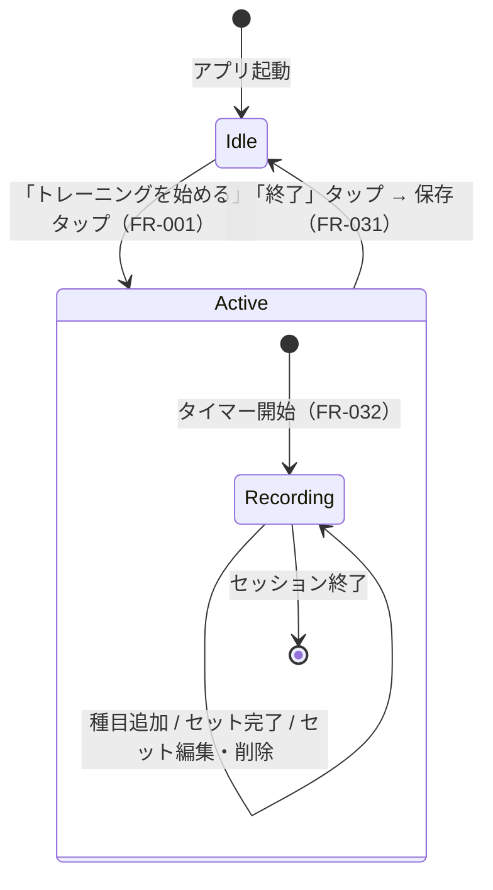
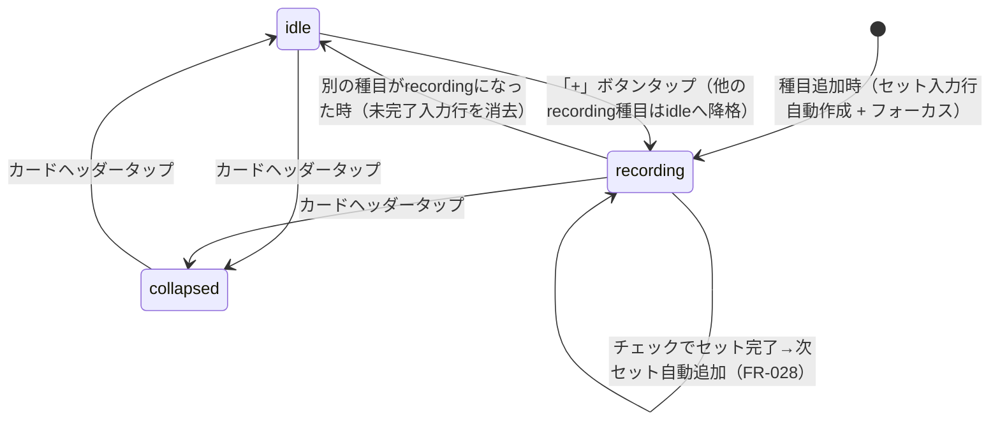
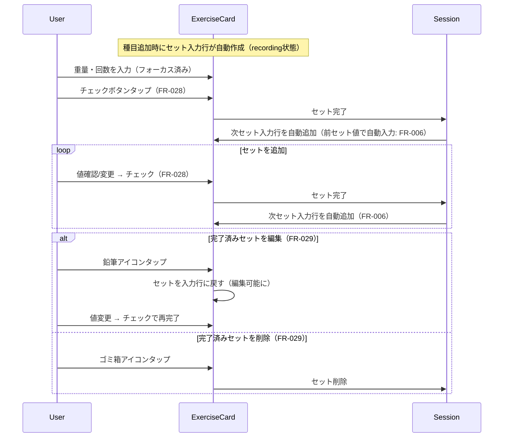
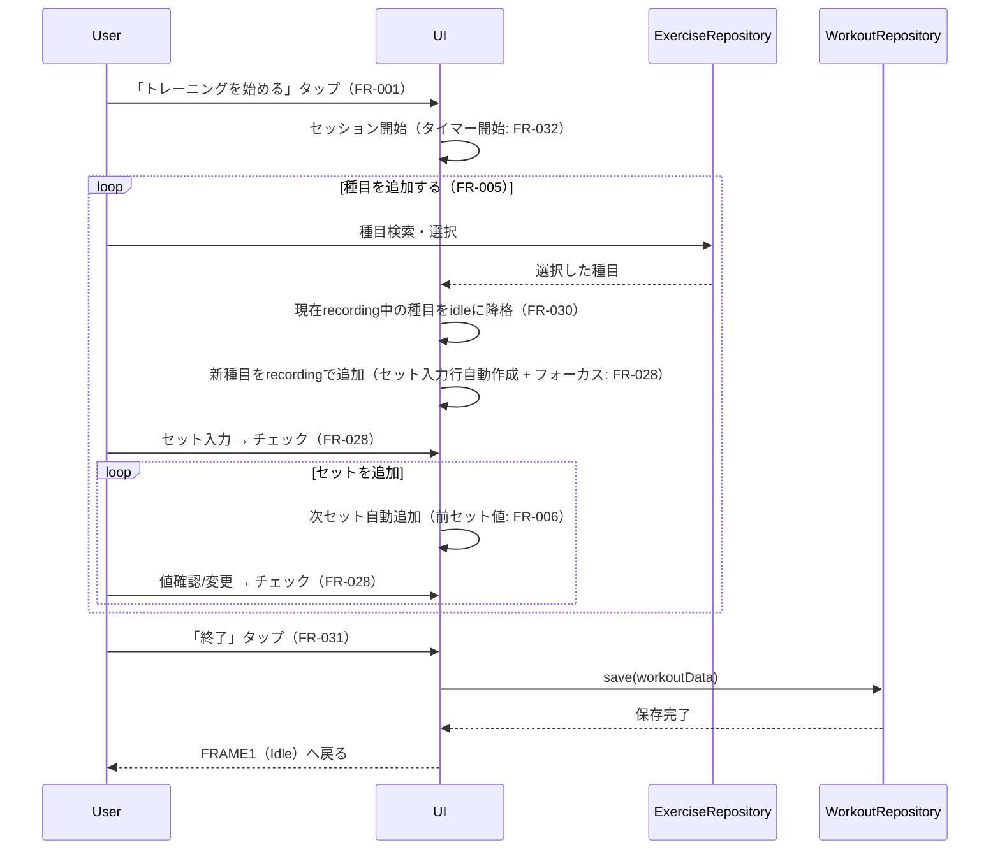

# ワークアウト記録管理

**関連 Design Doc:** [index_design.md](index_design.md)
**関連 PRD:** [index.md](../../requirement/workout/index.md)

---

# 1. 背景

gyminiのPhase 1中核機能。ユーザーが日々のトレーニング内容（種目・セット・重量・回数）を記録・管理する基盤となる。セッション開始→セット記録→終了・保存のフローで運用し、記録データはPhase 3のAIコーチング機能がコンテキストとして参照するため、データ構造の正確性が重要。

# 2. 概要

ワークアウト記録機能は**セッションライフサイクル**を中心に設計される：

- **セッション開始**: アイドル状態（FRAME1）から記録モード（FRAME2）へ遷移
- **種目追加・セット記録**: セッション内で複数種目を追加し、セット単位で重量(kg)と回数を記録
- **セット完了と自動追加**: チェックでセットを完了し、次のセット入力行を自動追加（前セット値で自動入力）
- **完了済みセットの操作**: 完了済みセットの削除・編集
- **種目カードの状態管理**: 3つの状態（折りたたみ・idle・記録中）による種目単位のUI制御。記録中は同時に1種目のみ
- **セッションタイマー**: 経過時間のリアルタイム表示
- **セッション終了・保存**: 終了ボタンでデータを永続化し、アイドル状態に戻る

種目選択UI（検索・自動登録）は種目マスター機能（[exercise-master](../../requirement/exercise-master/index.md)）が担当し、このモジュールは種目マスターのインターフェースを利用する。

# 3. 要求定義

## 3.1. 機能要件

| ID | 要件 | 優先度 | PRD参照 | 検証方法 |
|----|------|--------|---------|---------|
| FR-001 | セッションの開始・終了・保存ができる | 必須 | FR_001 | テスト |
| FR-003 | セット単位で重量(kg)と回数を管理する | 必須 | FR_003 | テスト |
| FR-005 | 1セッション内で複数の種目を連続して追加・記録できる | 必須 | FR_005 | テスト |
| FR-006 | セット完了時に自動追加される次セット入力行に、直前セットの重量と回数を初期値として自動入力する | 必須 | FR_006 | テスト |
| FR-028 | 種目追加時にセット入力行を自動作成しフォーカス。チェックでセット完了→次セット自動追加。別の種目追加時は現在の記録中種目の未完了入力行を消去しidleに降格 | 必須 | FR_028 | テスト |
| FR-029 | 完了済みセットの削除（ゴミ箱アイコン）・編集（鉛筆アイコンで入力行に戻す）操作ができる | 必須 | FR_029 | テスト |
| FR-030 | 種目カードが3状態（collapsed・idle・recording）を持つ。recordingは同時に1種目のみ | 必須 | FR_030 | テスト |
| FR-031 | 終了ボタンでセッションを保存して終了し、アイドル状態に戻る | 必須 | FR_031 | テスト |
| FR-032 | セッション経過時間をリアルタイム表示する | 推奨 | FR_032 | テスト |

## 3.2. 非機能要件

| ID | カテゴリ | 要件 | 目標値 |
|----|--------|------|--------|
| NFR-001 | データ整合性 | ワークアウトデータが損失・破損しないこと | セッション終了後、再起動しても全セット・種目が復元されること |

# 4. API

ワークアウト機能が外部（他モジュール・UIレイヤー）に公開するインターフェース。

## 4.1. WorkoutRepository（永続化層）

他モジュール（履歴・AI等）からも参照される永続化インターフェース。

| モジュール | インターフェース | メンバー | 概要 |
|---------|--------------|--------|------|
| workout | WorkoutRepository | save(data) | セッション終了時にワークアウトを保存する（FR-001, FR-031） |
| workout | WorkoutRepository | remove(id) | ワークアウトを削除する（`delete` はJS予約語のため `remove` を使用） |
| workout | WorkoutRepository | getById(id) | IDでワークアウトを取得する |
| workout | WorkoutRepository | listByDateDesc() | 日付降順で全ワークアウトを取得する（履歴機能・AI用） |
| workout | WorkoutRepository | listByDate(date: DateString) | 指定日のワークアウトを取得する（カレンダー・AI用） |

## 4.2. WorkoutSession（セッション管理）

セッションライフサイクルと記録操作を管理するインターフェース。

| モジュール | インターフェース | メンバー | 概要 |
|---------|--------------|--------|------|
| workout | WorkoutSession | startSession() | セッションを開始し、タイマーを開始する（FR-001, FR-032） |
| workout | WorkoutSession | endSession() | セッションを保存して終了し、アイドル状態に戻る（FR-001, FR-031） |
| workout | WorkoutSession | addExercise(exercise) | セッションに種目を追加する。セット入力行を自動作成しフォーカス。現在recording中の他種目はidleに降格（FR-005, FR-028） |
| workout | WorkoutSession | activateExercise(exerciseIndex) | idle種目の「+」ボタンで記録中に切替。現在recording中の他種目はidleに降格（FR-028, FR-030） |
| workout | WorkoutSession | completeSet(exerciseIndex, set) | セットを完了し、次セット入力行を自動追加する（FR-028, FR-006） |
| workout | WorkoutSession | editCompletedSet(exerciseIndex, setIndex) | 完了済みセットを入力行に戻して編集可能にする（FR-029） |
| workout | WorkoutSession | deleteCompletedSet(exerciseIndex, setIndex) | 完了済みセットを削除する（FR-029） |
| workout | WorkoutSession | toggleExerciseCard(exerciseIndex) | 種目カードの折りたたみ/展開を切り替える（FR-030） |
| workout | WorkoutSession | getElapsedTime(): number | セッション経過秒数を取得する。表示フォーマット（HH:MM:SS）は呼び出し側の責務（FR-032） |

## 4.3. 型定義

```typescript
// 日付・日時の branded type（src/schemas/date.ts で定義）
// 境界（localStorage読み出し・ユーザー入力）で Zod パースし、内部は型安全に流通させる。
// history モジュールと共有。
type DateString = string & { readonly __brand: 'DateString' }               // "YYYY-MM-DD"
type ISODateTimeString = string & { readonly __brand: 'ISODateTimeString' } // ISO 8601 datetime

// ワークアウト（1回のトレーニングセッション・保存済み）
type Workout = {
  id: string
  date: DateString              // "YYYY-MM-DD"
  exercises: WorkoutExercise[]
  startedAt: ISODateTimeString  // セッション開始時刻
  endedAt: ISODateTimeString    // セッション終了時刻
  createdAt: ISODateTimeString
  updatedAt: ISODateTimeString
}

// ワークアウト内の1種目エントリ
type WorkoutExercise = {
  exerciseId: string    // 種目マスターのID
  exerciseName: string  // 表示名（スナップショット）
  sets: WorkoutSet[]
}

// 1セット
type WorkoutSet = {
  weight: number        // 重量 (kg)
  reps: number          // 回数
}

// セッション記録中の1種目（未保存の下書き状態）
// FR-005〜FR-006, FR-028〜FR-030 のセッション形式UXを実現する中間状態。
type DraftExercise = {
  exerciseId: string
  exerciseName: string
  sets: WorkoutSet[]              // 完了済みセット
  pendingSet: WorkoutSet | null   // 現在入力中のセット（前セットから重量・回数を自動入力）。null = 入力行なし
  cardState: ExerciseCardState    // 種目カードの状態（FR-030）
}

// 種目カードの3状態（FR-030）
// recording は同時に1種目のみ。別の種目が recording になると自動で idle に降格する。
type ExerciseCardState =
  | 'collapsed'  // 折りたたみ: セット一覧非表示、セット数サマリー表示
  | 'idle'       // 待機: 完了済みセット（あれば）+ 「+」ボタン。入力行なし
  | 'recording'  // 記録中: 完了済みセット + 入力中セット行。同時に1種目のみ
```

# 5. 用語集

| 用語 | 説明 |
|------|------|
| セッション | ワークアウトの開始から終了・保存までの一連の記録操作。FRAME1→FRAME2→FRAME1のライフサイクル |
| ワークアウト | 1回のトレーニングセッションの保存済みデータ。日付に紐づき、複数種目・セットを含む |
| セット | 1種目の1回の実施単位。重量(kg)・回数で構成される |
| 完了済みセット | チェックにより確定されたセット。削除・編集が可能（FR-029） |
| 入力中セット（pendingSet） | 現在入力中の未確定セット。直前セットの値で自動入力される（FR-006） |
| WorkoutExercise | ワークアウト内の1種目エントリ。種目IDと種目名のスナップショットを保持する |
| 種目カード | セッション中に各種目を表示するUIの単位。3つの状態を持つ（FR-030）。recording は同時に1種目のみ |

# 6. 使用例

```
# セッション形式でのワークアウト記録フロー

[セッション開始（FR-001）]
1. ユーザーがFRAME1で「トレーニングを始める」ボタンをタップ
2. FRAME2（Active Workout）へ遷移
3. セッションタイマーが開始（FR-032）

[種目1: ベンチプレス（FR-005, FR-028）]
4. 画面下部の「種目を追加...」検索フィールドからベンチプレスを選択
5. 種目カードがrecording状態で追加。セット入力行が自動作成され、重量フィールドにフォーカス（FR-028）
6. 1セット目: 重量=60kg, 回数=10 を入力 → チェックボタンをタップ（FR-028）
   → セットが完了状態に変わる
   → 次のセット入力行が自動追加される（重量=60, 回数=10 が自動入力: FR-006）
7. 2セット目: 回数を8に変更 → チェック（FR-028）
   → 次のセット入力行（重量=60, 回数=8）が自動追加（FR-006）
8. 3セット目: そのままチェック（FR-028）

[完了済みセットの操作（FR-029）]
9. 1セット目の鉛筆アイコンをタップ → セットが入力行に戻り編集可能に
10. 重量を65kgに変更 → チェックで再完了
11. ※ ゴミ箱アイコンをタップすると完了済みセットを削除

[種目2: スクワット（FR-005, FR-028）]
12. 「種目を追加...」からスクワットを選択
13. → ベンチプレスの未完了入力行が消去され idle に降格（「+」ボタン表示）
14. → スクワットがrecording状態で追加。セット入力行が自動作成されフォーカス
15. 同様にセットを記録

[前の種目に戻る（FR-030）]
16. ベンチプレスの「+」ボタンをタップ → ベンチプレスがrecordingに、スクワットがidleに降格
17. 種目1のカードを折りたたみ可能（FR-030）

[セッション終了（FR-001, FR-031）]
18. 右上の「終了」ボタンをタップ
19. セッションデータが保存される（WorkoutRepository.save）
20. FRAME1（Idle）に戻る
```

> **制約（B-002準拠 / REQ_008 — [index.md](../../requirement/index.md) で定義）**: AIが `WorkoutRepository.save` / `remove` を呼び出す前には、ユーザー確認が必要である。確認フローはAIチャット仕様（[ai-chat](../../requirement/ai-chat/index.md)）で定義する。

```
# 他モジュールがワークアウト記録を参照する場合
const workouts = await WorkoutRepository.listByDate("2026-03-08")
const recentWorkouts = await WorkoutRepository.listByDateDesc()
// → 履歴機能（Phase 1）やAIコーチング機能（Phase 3）がこのAPIを利用する
```

# 7. 振る舞い図

## セッションライフサイクル（FR-001, FR-031, FR-032）



## 種目カード状態遷移（FR-030）



## セット記録フロー（FR-028, FR-006, FR-029）



## セッション全体フロー（FR-001, FR-005, FR-028, FR-031）



# 8. 制約事項

- 種目選択はExerciseRepositoryモジュールのインターフェースに依存する（直接種目データを持たない）
- `exerciseName` はワークアウト保存時の種目名スナップショットを保持する（後から種目名が変わっても記録は影響を受けない）
- `exerciseId` が種目マスターに存在しない場合（種目が削除された場合）、WorkoutExercise の表示は `exerciseName` にフォールバックする。存在確認は行わない
- ワークアウトデータはブラウザにローカル永続化される（技術選択の詳細は [index_design.md](index_design.md) を参照）
- 同一日付に複数のワークアウトを登録可能
- メモ機能（ワークアウト全体・セット単位）はスコープ外（PRDセクション5）

---

## PRD整合性確認

| PRD要求ID | 要件 | Spec対応箇所 |
|----------|------|------------|
| FR_001 | セッションの開始・終了・保存 | FR-001, WorkoutSession.startSession/endSession, Section 7 stateDiagram |
| FR_003 | セット単位で重量kgと回数を管理 | FR-003, WorkoutSet型定義 |
| FR_005 | 1セッション内で複数の種目を連続して追加・記録 | FR-005, WorkoutSession.addExercise, Section 6 使用例 |
| FR_006 | セット完了時に次セットへ前セットの重量・回数を自動入力 | FR-006, DraftExercise.pendingSet, Section 6 使用例 |
| FR_028 | 種目追加時にセット入力行自動作成。チェックで完了→次セット自動追加。別種目追加時にidle降格 | FR-028, WorkoutSession.addExercise/activateExercise/completeSet, Section 7 セット記録フロー |
| FR_029 | 完了済みセットの削除・編集操作 | FR-029, WorkoutSession.editCompletedSet/deleteCompletedSet, Section 7 セット記録フロー |
| FR_030 | 種目カードの3状態（collapsed・idle・recording）。recordingは同時に1種目のみ | FR-030, ExerciseCardState型定義, DraftExercise.cardState, Section 7 種目カード状態遷移 |
| FR_031 | 終了ボタンでセッションを保存して終了 | FR-031, WorkoutSession.endSession, Section 7 セッション全体フロー |
| FR_032 | セッション経過時間をリアルタイム表示 | FR-032, WorkoutSession.getElapsedTime, Workout.startedAt/endedAt |

## CONSTITUTION.md 原則準拠確認

| 原則ID | 原則 | 準拠状況 |
|--------|------|---------|
| B-001 | Privacy-by-Design | ✅ データはローカル永続化のみ（制約事項に明記） |
| B-002 | AI安全操作の確認優先 | ✅ REQ_008制約を Section 6 で明記。AIのsave/removeにはユーザー確認必須 |
| A-002 | Client-Only Architecture | ✅ 外部通信なし、ローカル完結 |
| T-003 | Mobile-First UI | ✅ PRDのUI仕様（タップターゲットサイズ等）に準拠。UIスペック詳細はPRDで定義済み |
