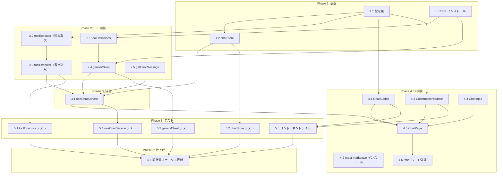

# AIチャット × Function Calling タスク分解

## 前提条件

本タスクは以下のモジュールが実装済みであることを前提とする：

- `settingsStore`（APIキー管理: [task-api-key](../api-key/tasks.md)）
- `WorkoutRepository`（ワークアウト記録: [task-workout](../workout/tasks.md)）
- `ExerciseRepository`（種目マスター: [task-exercise-master](../exercise-master/tasks.md)）
- `workoutSessionStore`（ワークアウトセッション: [task-workout](../workout/tasks.md)）
- ナビゲーション・ルーティング基盤（[task-navigation](../navigation/tasks.md)）

## タスク一覧

### Phase 1: 基盤

| # | タスク | 説明 | 完了条件 | 依存 |
|:---|:---|:---|:---|:---|
| 1.1 | 型定義の作成 | `src/types/chat.ts` を作成し、`ChatMessage`, `ToolCallResult`, `PendingAction`, `PendingActionStatus`, `SaveWorkoutData`, `AddExerciseData`, `AddExerciseToSessionData`, `SummaryPeriod`, `WorkoutSummary`, `ExerciseBreakdown` 型を定義する。PendingAction.data は判別共用体（actionType でディスクリミネート）を使用する | TypeScript コンパイルが通る。全型がエクスポートされている。`any` 型を使用していない（T-001） | - |
| 1.2 | chatStore 作成 | `src/stores/chatStore.ts` を作成し、`ChatState` / `ChatActions` 型と Zustand ストアを実装する。`addMessage`, `setLoading`, `setError`, `updatePendingAction`, `clearMessages` アクションを実装する。persist は使用しない（B-001） | 初期状態 `{ messages: [], isLoading: false, error: null }` を返す。全アクションが正しく状態を更新する | 1.1 |
| 1.3 | @google/generative-ai のインストール | `npm install @google/generative-ai` を実行し、Gemini SDK を依存関係に追加する | `package.json` の `dependencies` に `@google/generative-ai` が追加されている | - |

### Phase 2: コア実装

| # | タスク | 説明 | 完了条件 | 依存 |
|:---|:---|:---|:---|:---|
| 2.1 | toolDefinitions 実装 | `src/lib/toolDefinitions.ts` を作成し、8つのツール定義（`getRecentWorkouts`, `getWorkoutsByExercise`, `getWorkoutsByDate`, `getWorkoutSummary`, `getExercises`, `saveWorkout`, `addExercise`, `addExerciseToSession`）を Gemini API の `FunctionDeclaration` 形式で定義する | 全8ツールの定義がエクスポートされている。各ツールに `name`, `description`, `parameters` が含まれ、`required` フィールドが Design Doc Section 6 と一致する | 1.3 |
| 2.2 | toolExecutor 実装（読み取りツール） | `src/lib/toolExecutor.ts` を作成し、`executeReadTool`, `isWriteTool` 関数を実装する。読み取りツール5種（`getRecentWorkouts`, `getWorkoutsByExercise`, `getWorkoutsByDate`, `getWorkoutSummary`, `getExercises`）のディスパッチを switch-case で実装する。各ツールは `WorkoutRepository` / `ExerciseRepository` の既存メソッドを呼び出す | `executeReadTool('getRecentWorkouts', { count: 5 })` がワークアウトデータを返す。`isWriteTool('saveWorkout')` が `true` を返す。`isWriteTool('getRecentWorkouts')` が `false` を返す | 1.1 |
| 2.3 | toolExecutor 実装（書き込みツール） | `executeWriteTool` 関数を実装する。`saveWorkout`（種目ID解決: `ExerciseRepository.search` で完全一致検索、未登録時は `EXERCISE_NOT_FOUND` エラー）、`addExercise`（`ExerciseRepository.create`）、`addExerciseToSession`（`workoutSessionStore.isActive` チェック、未開始時は `SESSION_NOT_ACTIVE` エラー）を実装する | `saveWorkout` 実行時に種目名が完全一致すれば成功、一致なしなら `{ success: false, error: 'EXERCISE_NOT_FOUND', data: { missingExercises: [...] } }` を返す。`addExerciseToSession` はセッション未開始時に `{ success: false, error: 'SESSION_NOT_ACTIVE' }` を返す | 1.1, 2.2 |
| 2.4 | geminiClient 実装 | `src/lib/geminiClient.ts` を作成し、`createGeminiClient` 関数を実装する。モデルは `gemini-flash-latest` 固定。`sendMessage`（チャット履歴 + ツール定義を送信）と `sendFunctionResult`（ツール結果を返送）を実装する。`AbortSignal` による応答停止に対応する。チャット履歴は直近50件に制限する（`MAX_HISTORY_MESSAGES = 50`, NFR-005）。システムプロンプトを内部に定義する | `sendMessage` が `GeminiChatResponse`（text or functionCalls）を返す。AbortSignal で中断できる。履歴が50件に制限されて送信される | 1.3, 2.1 |
| 2.5 | getErrorMessage 実装 | `src/lib/geminiClient.ts` 内に `getErrorMessage` 関数を実装する。認証エラー（`API_KEY_INVALID` / `401`）、レート制限（`429` / `RATE_LIMIT`）、ネットワークエラー（`fetch` / `network`）を判別し、日本語のエラーメッセージを返す | 各エラーパターンに対して適切な日本語メッセージを返す。未知のエラーには「予期しないエラーが発生しました」を返す | - |

### Phase 3: 統合

| # | タスク | 説明 | 完了条件 | 依存 |
|:---|:---|:---|:---|:---|
| 3.1 | useChatService フック実装 | `src/hooks/useChatService.ts` を作成し、`sendMessage`, `stopResponse`, `approve`, `reject`, `clearMessages` を実装する。`sendMessage` では: (1) APIキーチェック、(2) ユーザーメッセージ追加、(3) AbortController 作成、(4) Gemini API 呼び出し（直近50件の履歴で送信）、(5) Function Call の読み取り/書き込み分岐、(6) エラーハンドリング（AbortError は無視）を行う。`stopResponse` では AbortController.abort() + isLoading=false + 部分応答の破棄を行う。`approve` では PendingAction の承認 → executeWriteTool → 結果メッセージ追加を行う | `sendMessage` 呼び出しでチャットメッセージが追加される。APIキー未設定時はエラーメッセージが設定される。読み取りツールは自律実行される。書き込みツールは PendingAction として確認待ちになる。`stopResponse` で応答が停止し即座に新メッセージ送信可能になる | 1.2, 2.3, 2.4, 2.5 |

### Phase 4: UI実装

| # | タスク | 説明 | 完了条件 | 依存 |
|:---|:---|:---|:---|:---|
| 4.1 | ChatBubble コンポーネント | `src/components/chat/ChatBubble.tsx` を作成する。`role` が `user` なら右寄せ黒背景白文字（`rounded-[18px] rounded-br-[4px]`, max-width 75%）、`assistant` なら左寄せ白背景（`rounded-[18px] rounded-bl-[4px]`, max-width 88%）で表示する。assistant メッセージは `react-markdown` + `remark-gfm` でマークダウンレンダリングする | user/assistant 両方のバブルが PRD のUIスペック通りに表示される。マークダウン（見出し・リスト・テーブル等）が正しくレンダリングされる | 1.1 |
| 4.2 | react-markdown のインストール | `npm install react-markdown remark-gfm` を実行する | `package.json` の `dependencies` に `react-markdown` と `remark-gfm` が追加されている | - |
| 4.3 | ConfirmationBubble コンポーネント | `src/components/chat/ConfirmationBubble.tsx` を作成する。PendingAction の description をバブル内に表示し、「実行する」「キャンセル」ボタンをインラインで配置する。ボタン高さは `h-11`（44px, T-003）。キャンセル: `bg-zinc-100 text-black font-semibold rounded-xl`、実行: `bg-black text-white font-bold rounded-xl` + アイコン。`flex gap-2` で横並び、各 `flex-1`。`status` が `approved` / `rejected` の場合はボタンを非活性化する | インラインボタンが表示される。タップターゲットが44px以上。承認/拒否後にボタンが非活性化される | 1.1 |
| 4.4 | ChatInput コンポーネント | `src/components/chat/ChatInput.tsx` を作成する。丸角テキスト入力 + 送信ボタン。BottomNav の上に固定（`bottom: 96px`）。`isLoading` 時は停止ボタンを表示する。Enter キーで送信、Shift+Enter で改行 | メッセージ入力・送信ができる。ローディング中は停止ボタンが表示される | - |
| 4.5 | ChatPage コンポーネント | `src/pages/ChatPage.tsx` を作成する。メッセージ一覧（`ChatBubble` / `ConfirmationBubble`）+ `ChatInput` を組み合わせる。`useChatService` を使用してチャット機能を接続する。新しいメッセージが追加されたらスクロールを最下部に移動する。APIキー未設定時のエラーメッセージ表示に対応する | チャット画面が表示される。メッセージ送信→AI応答→表示の一連のフローが動作する。書き込み操作の確認UIが表示される | 3.1, 4.1, 4.3, 4.4 |
| 4.6 | /chat ルート登録 | ナビゲーション設定に `/chat` ルートを追加し、`ChatPage` を表示する | `/chat` にアクセスすると ChatPage が表示される | 4.5 |

### Phase 5: テスト

| # | タスク | 説明 | 完了条件 | 依存 |
|:---|:---|:---|:---|:---|
| 5.1 | toolExecutor ユニットテスト | `src/lib/__tests__/toolExecutor.test.ts` を作成する。全読み取りツール5種のディスパッチ、全書き込みツール3種のディスパッチ、`isWriteTool` の判定、`saveWorkout` の種目ID解決（一致あり/なし）、`addExerciseToSession` のセッション状態チェック（アクティブ/非アクティブ）をテストする。WorkoutRepository / ExerciseRepository / workoutSessionStore は `vi.mock` でモック | 全テストが pass。Design Doc Section 8 の toolExecutor テスト仕様を網羅（FR-003〜FR-010） | 2.3 |
| 5.2 | chatStore ユニットテスト | `src/stores/__tests__/chatStore.test.ts` を作成する。`addMessage`, `updatePendingAction`, `clearMessages`, `setLoading`, `setError` のテスト | 全テストが pass。Design Doc Section 8 の chatStore テスト仕様を網羅（FR-001） | 1.2 |
| 5.3 | geminiClient ユニットテスト | `src/lib/__tests__/geminiClient.test.ts` を作成する。正常応答（テキスト）、Function Call 応答、エラーケース（認証・レート制限・ネットワーク）、AbortSignal による中断、履歴50件制限をテストする。`@google/generative-ai` は `vi.mock` でモック | 全テストが pass。Design Doc Section 8 の geminiClient テスト仕様を網羅（FR-001, NFR-003, NFR-005） | 2.4 |
| 5.4 | useChatService 統合テスト | `src/hooks/__tests__/useChatService.test.ts` を作成する。(1) メッセージ送信→AI応答→メッセージ追加、(2) 読み取りツールの自律実行フロー、(3) 書き込みツールの確認→approve→実行→結果、(4) 書き込みツールの確認→reject→キャンセル、(5) APIキー未設定時のエラー、(6) stopResponse による応答中断をテストする | 全テストが pass。Design Doc Section 8 の統合テスト仕様を網羅（FR-001, FR-002, FR-007, FR-009, FR-010, FR-011, NFR-004） | 3.1 |
| 5.5 | ChatBubble / ConfirmationBubble コンポーネントテスト | `src/components/chat/__tests__/ChatBubble.test.tsx` と `ConfirmationBubble.test.tsx` を作成する。user/assistant バブルの表示、マークダウンレンダリング、確認ボタンの approve/reject 動作をテストする | 全テストが pass。Design Doc Section 8 のコンポーネントテスト仕様を網羅（FR-001, FR-011） | 4.1, 4.3 |

### Phase 6: 仕上げ

| # | タスク | 説明 | 完了条件 | 依存 |
|:---|:---|:---|:---|:---|
| 6.1 | 設計書ステータス更新 | `index_design.md` の `impl-status` を `"implemented"` に、Section 1 の実装ステータス表の全モジュールを実装済みに更新する | front matter と Section 1 の実装ステータスが最新の状態を反映している | 5.1, 5.2, 5.3, 5.4, 5.5 |

## 依存関係図



## 実装の注意事項

- **前提モジュールの確認**: Phase 2 以降のタスクは `WorkoutRepository`, `ExerciseRepository`, `settingsStore`, `workoutSessionStore` が実装済みであることが前提。未実装の場合は先に該当タスクを完了すること
- **Privacy-by-Design（B-001）**: chatStore に Zustand の `persist` ミドルウェアを使用しないこと。チャットデータは localStorage に保存しない
- **AI安全操作（B-002）**: 書き込み操作は必ず PendingAction 経由で確認する。確認なしの書き込みパスを作らないこと
- **タップターゲット（T-003）**: ConfirmationBubble のボタンは `h-11`（44px）を使用。PRD の `h-9` 指定は T-003 違反のため修正済み
- **並行実装可能なタスク**: Phase 1 の 1.1/1.3、Phase 2 の 2.1/2.2/2.5、Phase 4 の 4.1/4.2/4.3/4.4 は並行実装可能

## 参照ドキュメント

- 抽象仕様書: [index_spec.md](../../specification/ai-chat/index_spec.md)
- 技術設計書: [index_design.md](../../specification/ai-chat/index_design.md)
- PRD: [index.md](../../requirement/ai-chat/index.md)

## 要求カバレッジ

| 要求ID | 要件 | 対応タスク |
|:---|:---|:---|
| FR-001 | Gemini APIを用いたチャット会話 | 2.4, 3.1, 4.5, 5.3, 5.4 |
| FR-002 | AIが会話の文脈からツールを自律的に呼び出す | 2.1, 3.1, 5.4 |
| FR-003 | 最新n件のワークアウト取得ツール | 2.2, 5.1 |
| FR-004 | 種目名で部分一致絞り込みツール | 2.2, 5.1 |
| FR-005 | 日付指定でワークアウト取得ツール | 2.2, 5.1 |
| FR-006 | ワークアウト集計ツール | 2.2, 5.1 |
| FR-007 | ワークアウト保存ツール（確認必須） | 2.3, 3.1, 5.1, 5.4 |
| FR-008 | 種目一覧取得ツール | 2.2, 5.1 |
| FR-009 | 種目追加ツール（確認必須） | 2.3, 3.1, 5.1, 5.4 |
| FR-010 | セッションへの種目追加ツール（確認必須） | 2.3, 3.1, 5.1, 5.4 |
| FR-011 | インラインUIでのユーザー確認 | 3.1, 4.3, 5.4, 5.5 |
| NFR-001 | チャット内容のセキュリティ | 1.2（persist なし） |
| NFR-002 | APIキーのセキュリティ | 2.4 |
| NFR-003 | Gemini APIエラー耐性 | 2.5, 3.1, 5.3 |
| NFR-004 | APIキー未設定時のエラー表示 | 3.1, 5.4 |
| NFR-005 | チャット履歴50件制限 | 2.4, 5.3 |

## 推奨する手動検証

- [ ] タスクの粒度が適切か（1タスク = 数時間〜1日程度）を確認
- [ ] 依存関係図が論理的に正しいか確認
- [ ] 要求カバレッジ表で漏れがないことを確認
- [ ] Phase 分類が適切か確認

## 検証コマンド

```bash
# 関連する設計書との整合性を確認
/check-spec ai-chat

# 仕様の不明点がないか確認
/clarify ai-chat
```
