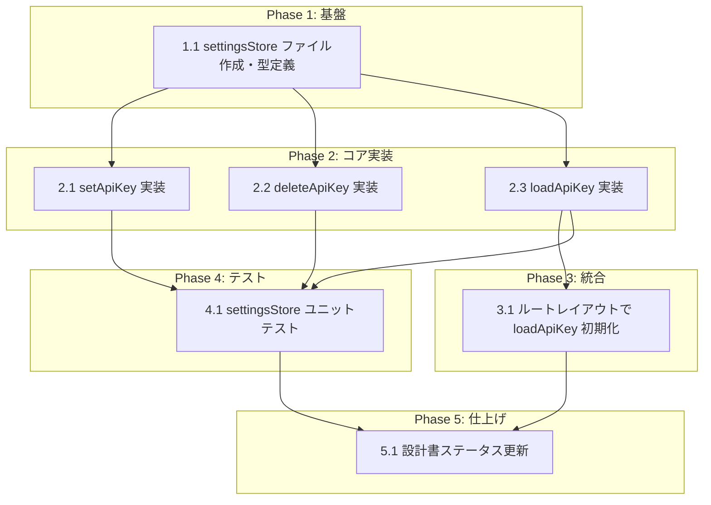

# APIキー管理 タスク分解

## タスク一覧

### Phase 1: 基盤

| # | タスク | 説明 | 完了条件 | 依存 |
|:---|:---|:---|:---|:---|
| 1.1 | settingsStore ファイル作成・型定義 | `src/stores/settingsStore.ts` を作成し、`SettingsState` / `SettingsActions` 型と `STORAGE_KEY` 定数を定義する。Zustand `create()` の骨格を実装（メソッドは空の初期実装） | TypeScript コンパイルが通る。`useSettingsStore` がエクスポートされ、初期状態 `{ apiKey: '', hasApiKey: false }` を返す | - |

### Phase 2: コア実装

| # | タスク | 説明 | 完了条件 | 依存 |
|:---|:---|:---|:---|:---|
| 2.1 | setApiKey 実装 | `setApiKey(key)` で localStorage に書き込み、ストア状態を `{ apiKey: key, hasApiKey: key !== '' }` に更新する。try-catch で localStorage エラーを保護 | `setApiKey("AIzaSy...")` 呼び出し後に `apiKey === "AIzaSy..."` かつ `hasApiKey === true`。localStorage に `'gymini:api-key'` キーで値が保存される | 1.1 |
| 2.2 | deleteApiKey 実装 | `deleteApiKey()` で localStorage からキーを削除し、ストア状態を `{ apiKey: '', hasApiKey: false }` にリセットする。try-catch で保護 | `deleteApiKey()` 呼び出し後に `apiKey === ''` かつ `hasApiKey === false`。localStorage から `'gymini:api-key'` が削除される | 1.1 |
| 2.3 | loadApiKey 実装 | `loadApiKey()` で localStorage から `'gymini:api-key'` を読み込み、ストア状態に反映する。キー不在時は空文字列にフォールバック。try-catch で保護 | キー存在時: `apiKey` に値がセットされ `hasApiKey === true`。キー不在時: `apiKey === ''` かつ `hasApiKey === false` | 1.1 |

### Phase 3: 統合

| # | タスク | 説明 | 完了条件 | 依存 |
|:---|:---|:---|:---|:---|
| 3.1 | ルートレイアウトで loadApiKey 初期化 | `src/routes/__root.tsx`（既存ファイル）に `useEffect` で `loadApiKey()` を呼び出す処理を追加する | アプリ起動時に localStorage の既存キーがストアに読み込まれる。`useSettingsStore.getState().apiKey` が localStorage の値と一致する | 2.3 |

### Phase 4: テスト

| # | タスク | 説明 | 完了条件 | 依存 |
|:---|:---|:---|:---|:---|
| 4.1 | settingsStore ユニットテスト | `setApiKey` / `deleteApiKey` / `loadApiKey` / `hasApiKey` のユニットテストを作成。正常系・localStorage エラー時のフォールバック・空文字列ケースを網羅。localStorage は `vi.spyOn(Storage.prototype, ...)` でモック | 全テストが pass。設計書 Section 8 のテスト戦略に記載された全ケースをカバー（FR-001〜FR-004, FR-006, NFR-002） | 2.1, 2.2, 2.3 |

### Phase 5: 仕上げ

| # | タスク | 説明 | 完了条件 | 依存 |
|:---|:---|:---|:---|:---|
| 5.1 | 設計書ステータス更新 | `index_design.md` の `impl-status` を `"implemented"` に、実装ステータス表のモジュールを全て実装済みに更新する | front matter と Section 1 の実装ステータスが最新の状態を反映している | 3.1, 4.1 |

## 依存関係図



## 実装の注意事項

- localStorage 操作は全て try-catch で保護すること（T-002: No Runtime Errors）
- Zustand persist ミドルウェアは使用しない（設計判断 9.1: localStorage 直接操作）
- `setApiKey('')` は呼び出し禁止。削除には必ず `deleteApiKey()` を使用すること（spec ISSUE-2 修正済み）
- 保存形式はプレーンテキスト（JSON ではない）
- `src/stores/` ディレクトリが存在しない場合は新規作成が必要

## 要求カバレッジ

| 要求ID | 要件内容 | 対応タスク |
|:---|:---|:---|
| FR-001 | APIキーを localStorage に保存できる | 2.1, 4.1 |
| FR-002 | 保存済みのAPIキーを localStorage から読み込める | 2.3, 4.1 |
| FR-003 | 保存済みのAPIキーを localStorage から削除できる | 2.2, 4.1 |
| FR-004 | APIキーの設定状態を派生値として公開する | 1.1, 4.1 |
| FR-005 | APIキーの表示/非表示切替を可能にする | N/A（UIレイヤーに委譲。本モジュールは生値を提供） |
| FR-006 | アプリ起動時に localStorage から自動読み込みする | 2.3, 3.1, 4.1 |
| NFR-001 | APIキーが localStorage 以外に送信されないこと | 2.1, 2.2, 2.3（設計上外部通信パスなし） |
| NFR-002 | localStorage アクセス失敗時にランタイムエラーが発生しないこと | 2.1, 2.2, 2.3, 4.1 |

> **FR-005 について**: 表示/非表示の切替はUIレイヤーのローカルステートで管理する（spec Note (FR-005)）。本モジュールはAPIキーの生値（`apiKey`）を提供するのみであり、タスクとしてはカバー済み（1.1 で `apiKey` を公開）。

## 参照ドキュメント

- PRD: [index.md](../../requirement/api-key/index.md)
- 抽象仕様書: [index_spec.md](../../specification/api-key/index_spec.md)
- 技術設計書: [index_design.md](../../specification/api-key/index_design.md)

## 推奨する手動検証

- [ ] タスクの粒度が適切か（1タスク = 数時間〜1日程度）を確認
- [ ] 依存関係図が論理的に正しいか確認
- [ ] 要求カバレッジ表で漏れがないことを確認
- [ ] Phase 分類が適切か確認

## 検証コマンド

```bash
# 関連する設計書との整合性を確認
/check-spec api-key

# 仕様の不明点がないか確認
/clarify api-key

# チェックリストを生成して品質基準を明確化
/checklist api-key
```
