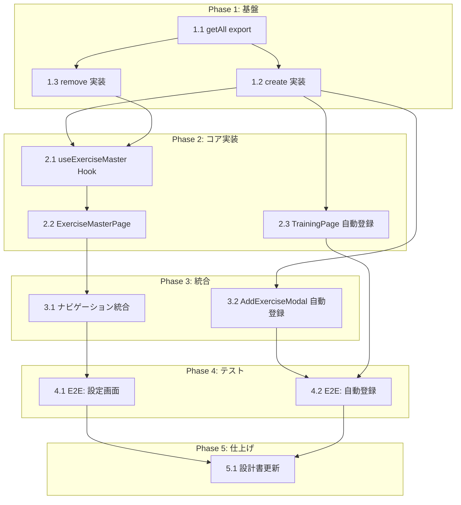

# 種目マスター管理 タスク分解

## メタ情報

| 項目 | 内容 |
|:---|:---|
| 機能名 | 種目マスター管理 |
| 設計書 | `.sdd/specification/exercise-master/index_design.md` |
| 仕様書 | `.sdd/specification/exercise-master/index_spec.md` |
| PRD | `.sdd/requirement/exercise-master/index.md` |
| 作成日 | 2026-03-29 |

## タスク一覧

### Phase 1: 基盤

| # | タスク | 説明 | 完了条件 | 依存 |
|:---|:---|:---|:---|:---|
| 1.1 | ExerciseRepository に `getAll` を export | 既存の内部関数 `getAll()` に `export` を追加する。ロジック変更なし | `export function getAll()` が `exerciseRepository.ts` に存在し、テストで全件取得・空データのケースが通ること | - |
| 1.2 | ExerciseRepository に `create` を実装 | `create(name: string): Exercise` を追加。`crypto.randomUUID()` で ID 生成、重複名チェック付き | テスト: 正常登録で `{ id, name }` が返る、重複名で Error がスローされる、保存後に `getAll()` で取得できる | 1.1 |
| 1.3 | ExerciseRepository に `remove` を実装 | `remove(id: string): void` を追加。存在しない ID は何もしない | テスト: 正常削除で `getAll()` から消える、存在しない ID でエラーにならない | 1.1 |

### Phase 2: コア実装

| # | タスク | 説明 | 完了条件 | 依存 |
|:---|:---|:---|:---|:---|
| 2.1 | useExerciseMaster Hook を実装 | `src/hooks/useExerciseMaster.ts` を新規作成。`useState` で種目一覧を管理し、`addExercise`・`removeExercise`・`error` を公開する | テスト: 初期ロードで全種目が取得される、`addExercise` 後にリストが更新される、`removeExercise` 後にリストが更新される、重複名で `error` がセットされる | 1.2, 1.3 |
| 2.2 | ExerciseMasterPage を実装 | `src/pages/ExerciseMasterPage.tsx` を新規作成。種目一覧表示・追加フォーム・削除ボタンを含む設定画面 | コンポーネントテスト: 一覧が表示される、追加操作でリストが更新される、削除操作でリストから消える、重複名でエラーが表示される | 2.1 |
| 2.3 | TrainingPage に自動登録フローを追加 | 検索結果が空のとき「"XX" を新しい種目として追加」選択肢を表示し、選択で `create()` → 種目セットする | 統合テスト: 検索→候補なし→「新規追加」選択→種目が登録されワークアウトエントリにセットされる | 1.2 |

### Phase 3: 統合

| # | タスク | 説明 | 完了条件 | 依存 |
|:---|:---|:---|:---|:---|
| 3.1 | ExerciseMasterPage をナビゲーションに統合 | App.tsx のルーティングに ExerciseMasterPage を追加し、BottomNav または IdleView の「設定」からアクセス可能にする | ExerciseMasterPage に画面遷移でき、種目管理操作が全て動作すること | 2.2 |
| 3.2 | AddExerciseModal に自動登録フローを追加 | 既存の `AddExerciseModal.tsx` に検索結果なし時の「新規追加」選択肢を追加する（TrainingPage と同様の FR-006 対応） | AddExerciseModal で検索→候補なし→「新規追加」選択→種目が登録されセッションに追加されること | 1.2 |

### Phase 4: テスト

| # | タスク | 説明 | 完了条件 | 依存 |
|:---|:---|:---|:---|:---|
| 4.1 | E2E テスト: 設定画面の種目管理 | Playwright E2E テスト。種目一覧表示→手動追加→追加された種目が表示→手動削除→消えることを検証 | `npx playwright test` で exercise-master 関連テストが全て通ること | 3.1 |
| 4.2 | E2E テスト: 自動登録フロー | Playwright E2E テスト。ワークアウト記録画面で未登録の種目名を検索→「新規追加」→種目がセットされ記録に含まれることを検証 | `npx playwright test` で auto-register 関連テストが全て通ること | 3.2 |

### Phase 5: 仕上げ

| # | タスク | 説明 | 完了条件 | 依存 |
|:---|:---|:---|:---|:---|
| 5.1 | 設計書の実装ステータスを更新 | `index_design.md` の `impl-status` を `"implemented"` に、各モジュールのステータスを 🟢 に更新する | 全モジュールが 🟢 になり、`impl-status: "implemented"` であること | 4.1, 4.2 |

## 依存関係図



## 実装の注意事項

- **D-001 (Test-First)**: 各タスクでテストを先に書いてから実装すること。Phase 1〜2 のユニットテストは各タスク内で TDD サイクルを回す
- **T-001 (TypeScript Strict Mode)**: 全ファイルは `.ts`/`.tsx` で作成。`any` 型禁止。型は `src/types/index.ts` の `Exercise` を使用
- **T-002 (No Runtime Errors)**: `localStorage` アクセスと `JSON.parse()` は `try-catch` でラップし、失敗時は `[]` を返す（既存パターンに従う）
- **T-003 (Mobile-First UI)**: ExerciseMasterPage のタップターゲットは最低 44px。UIデザインシステムは `workout/index_design.md` Section 3.1 を参照
- **既存コンポーネント**: `AddExerciseModal.tsx` が既に存在する。Task 3.2 ではこれを拡張して FR-006 対応を追加する
- **ナビゲーション**: 現在 `Route` 型は `'training' | 'history'` のみ。Task 3.1 で ExerciseMasterPage へのルートを追加する際に `src/types/index.ts` の `Route` 型も拡張が必要

## 参照ドキュメント

- 抽象仕様書: `.sdd/specification/exercise-master/index_spec.md`
- 技術設計書: `.sdd/specification/exercise-master/index_design.md`
- PRD: `.sdd/requirement/exercise-master/index.md`

## 要求カバレッジ

| 要求ID | 要件 | 対応タスク |
|:---|:---|:---|
| FR-005 | テキスト入力で部分一致検索し候補をドロップダウン表示 | 1.1（getAll export）※ search は実装済み |
| FR-006 | 一致しない文字列を新しい種目として自動登録 | 1.2, 2.3, 3.2, 4.2 |
| FR-007 | 設定画面で種目の一覧表示・手動追加・削除 | 1.1, 1.2, 1.3, 2.1, 2.2, 3.1, 4.1 |
| NFR-001 | 種目名は一意であること | 1.2（create の重複チェック）, 2.1（error ハンドリング） |
| NFR-002 | 検索結果が体感遅延なく表示 | ※ 既存 search 実装で対応済み（インメモリフィルター） |

## 推奨する手動検証

- [ ] タスクの粒度が適切か（1タスク = 数時間〜1日程度）を確認
- [ ] 依存関係図が論理的に正しいか確認
- [ ] 要求カバレッジ表で漏れがないことを確認
- [ ] Phase 分類が適切か確認

## 検証コマンド

```bash
# 関連する設計書との整合性を確認
/check-spec exercise-master

# 仕様の不明点がないか確認
/clarify exercise-master

# チェックリストを生成して品質基準を明確化
/checklist exercise-master
```
