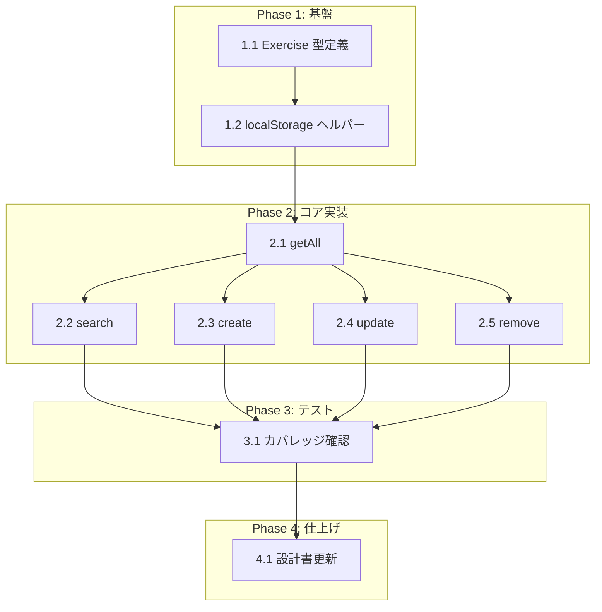

# 種目マスター管理 タスク分解

## メタ情報

| 項目 | 内容 |
|:---|:---|
| 機能名 | 種目マスター管理 |
| 設計書 | `.sdd/specification/exercise-master/index_design.md` |
| 仕様書 | `.sdd/specification/exercise-master/index_spec.md` |
| PRD | `.sdd/requirement/exercise-master/index.md` |
| 作成日 | 2026-03-29 |
| 更新日 | 2026-04-11 |

## タスク一覧

### Phase 1: 基盤

| # | タスク | 説明 | 完了条件 | 依存 |
|:---|:---|:---|:---|:---|
| 1.1 | Exercise 型定義 | `src/types/index.ts` に `Exercise` 型（`{ id: string; name: string }`）を定義する。既に存在する場合はスキップ | `Exercise` 型が `src/types/index.ts` に export されていること | - |
| 1.2 | ExerciseRepository ファイル作成と localStorage ヘルパー | `src/lib/exerciseRepository.ts` を作成。localStorage の読み書きヘルパー（`STORAGE_KEY = 'gymini:exercises'`、`load()` / `save()` 内部関数）を実装。`JSON.parse` は try-catch で囲み、失敗時は空配列を返す（T-002） | ヘルパー関数のテスト: 正常な JSON 配列の読み込み、不正 JSON でのフォールバック（空配列）、空の localStorage での空配列返却 | 1.1 |

### Phase 2: コア実装

| # | タスク | 説明 | 完了条件 | 依存 |
|:---|:---|:---|:---|:---|
| 2.1 | `getAll()` を実装 | `export function getAll(): Exercise[]` を実装。localStorage から全種目を配列順で返す | テスト: 空データで `[]`、複数件登録済みで全件取得、localStorage 破損時に `[]` | 1.2 |
| 2.2 | `search(query)` を実装 | `export function search(query: string): Exercise[]` を実装。部分一致検索（case-insensitive）。query が空文字列または空白のみ（trim 後に空文字列）の場合は全件返す | テスト: 部分一致で候補が返る、大文字小文字を区別しない、空クエリで全件、空白のみクエリで全件、一致なしで空配列 | 2.1 |
| 2.3 | `create(name)` を実装 | `export function create(name: string): Exercise` を実装。`crypto.randomUUID()` で ID 生成。空文字列/空白のみの name はエラー。既存種目名と重複（case-sensitive）でエラー | テスト: 正常登録で `{ id, name }` が返る、`getAll()` で取得できる、空名前で `Error("Exercise name is empty")`、重複名で `Error("Duplicate name: ...")` | 2.1 |
| 2.4 | `update(id, name)` を実装 | `export function update(id: string, name: string): Exercise` を実装。空文字列/空白のみの name はエラー。他種目との名前重複（case-sensitive）でエラー。存在しない ID でエラー | テスト: 正常変更で更新後の Exercise が返る、空名前でエラー、重複名でエラー、存在しない ID で `Error("Exercise not found: ...")` | 2.1 |
| 2.5 | `remove(id)` を実装 | `export function remove(id: string): void` を実装。存在しない ID は何もしない（冪等） | テスト: 正常削除で `getAll()` から消える、存在しない ID でエラーにならない | 2.1 |

### Phase 3: テスト

| # | タスク | 説明 | 完了条件 | 依存 |
|:---|:---|:---|:---|:---|
| 3.1 | ユニットテスト網羅性確認 | 全関数のエッジケースを網羅するテストが揃っていることを確認。カバレッジ >= 80%（D-001） | `vitest --coverage` で ExerciseRepository のカバレッジが 80% 以上 | 2.2, 2.3, 2.4, 2.5 |

### Phase 4: 仕上げ

| # | タスク | 説明 | 完了条件 | 依存 |
|:---|:---|:---|:---|:---|
| 4.1 | 設計書の実装ステータスを更新 | `index_design.md` の `impl-status` を `"implemented"` に変更。各関数のステータスを更新 | 全関数のステータスが実装済みに更新されていること | 3.1 |

## 依存関係図



## 実装の注意事項

- **スコープ限定**: 本タスクは ExerciseRepository（Data Layer）のみ。UI は settings モジュール・workout モジュールが各自実装する
- **D-001 (Test-First)**: 各タスクでテストを先に書いてから実装すること
- **T-001 (TypeScript Strict Mode)**: 全ファイルは `.ts` で作成。`any` 型禁止
- **T-002 (No Runtime Errors)**: `localStorage` アクセスと `JSON.parse()` は `try-catch` でラップし、失敗時は `[]` を返す
- **一意性の非対称**: `create()`/`update()` の重複チェックは case-sensitive、`search()` は case-insensitive（設計判断に明記済み）
- **name の trim**: `create()`/`update()` で name を trim してから保存するかどうかは設計書に明示なし。空白バリデーションは trim 後の空文字列チェックで実施する

## 参照ドキュメント

- 抽象仕様書: [index_spec.md](../../specification/exercise-master/index_spec.md)
- 技術設計書: [index_design.md](../../specification/exercise-master/index_design.md)
- PRD: [index.md](../../requirement/exercise-master/index.md)

## 要求カバレッジ

| 要求ID | 要件 | 対応タスク |
|:---|:---|:---|
| FR-005 | テキスト入力で部分一致検索し候補をドロップダウン表示 | 2.2（search 実装） |
| FR-006 | 一致しない文字列を新しい種目として自動登録 | 2.3（create 実装）※ UI 側の自動登録フローは workout モジュールのタスクで対応 |
| FR-007 | 設定画面で種目の一覧表示・手動追加・編集・削除 | 2.1（getAll）, 2.3（create）, 2.4（update）, 2.5（remove）※ UI は settings モジュールのタスクで対応 |
| NFR-001 | 種目名は一意であること（case-sensitive） | 2.3（create の重複チェック）, 2.4（update の重複チェック） |
| NFR-002 | 検索結果が体感遅延なく表示（100ms 以内） | 2.2（インメモリ Array.filter で実現） |

## 推奨する手動検証

- [ ] タスクの粒度が適切か（1タスク = 数時間〜1日程度）を確認
- [ ] 依存関係図が論理的に正しいか確認
- [ ] 要求カバレッジ表で漏れがないことを確認
- [ ] Phase 分類が適切か確認

## 検証コマンド

```bash
# 関連する設計書との整合性を確認
/check-spec exercise-master

# 仕様の不明点がないか確認
/clarify exercise-master

# チェックリストを生成して品質基準を明確化
/checklist exercise-master
```
