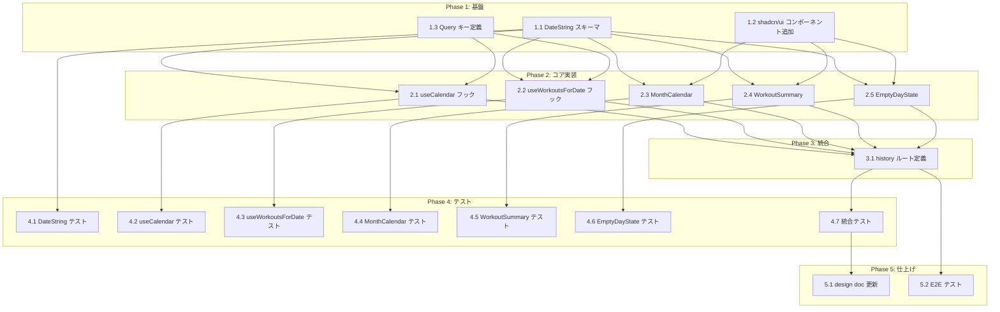

# 履歴画面 タスク分解

## メタ情報

| 項目 | 内容 |
|:---|:---|
| 機能名 | 履歴画面 |
| 技術設計書 | `.sdd/specification/history/index_design.md` |
| 作成日 | 2026-04-09 |

## 前提条件

以下のモジュールが実装済みであること（他機能で実装）:

| モジュール | 配置場所 | 必要なインターフェース |
|:---|:---|:---|
| workoutRepository | `src/lib/workoutRepository.ts` | `listByDateDesc()`, `listByDate(date)` |
| ルートレイアウト | `src/routes/__root.tsx` | 履歴タブへのナビゲーションリンク |

未実装の場合、Phase 2 のフック実装時にモック/スタブで代替し、統合テスト（4.6）で実モジュールと接続する。

## タスク一覧

### Phase 1: 基盤

| # | タスク | 説明 | 完了条件 | 依存 |
|:---|:---|:---|:---|:---|
| 1.1 | DateString スキーマ定義 | `src/schemas/date.ts` に Zod branded type（DateString）、`dateStringSchema`、`toDateString()`、`todayDateString()` を実装 | 1. `dateStringSchema` が "YYYY-MM-DD" 形式のみ受理する 2. `toDateString()` が無効な文字列で ZodError をスローする 3. `todayDateString()` が今日の日付を返す 4. TypeScript strict mode でコンパイルが通る | - |
| 1.2 | shadcn/ui コンポーネント追加 | `npx shadcn@latest add calendar button card` で必要なコンポーネントをプロジェクトに追加 | 1. `@/components/ui/calendar` が import 可能 2. `@/components/ui/button` が import 可能 3. `@/components/ui/card` が import 可能 4. react-day-picker が依存に含まれる | - |
| 1.3 | TanStack Query キー定義 | `src/lib/queryKeys.ts` にワークアウト関連のクエリキーファクトリを定義（`workoutDates(year, month)`, `workoutsForDate(date)`） | 1. queryKeys.workoutDates が `['workoutDates', year, month]` を返す 2. queryKeys.workoutsForDate が `['workoutsForDate', date]` を返す 3. 型安全な `as const` アサーション付き | - |

### Phase 2: コア実装

| # | タスク | 説明 | 完了条件 | 依存 |
|:---|:---|:---|:---|:---|
| 2.1 | useCalendar フック | `src/hooks/useCalendar.ts` を実装。TanStack Router search params から `displayMonth`・`selectedDate` を取得し、`goToPrevMonth`/`goToNextMonth`/`selectDate` で search params を更新。TanStack Query で `daysWithWorkouts`（表示月のワークアウト記録がある日の Set）を取得 | 1. displayMonth のデフォルトが今月である 2. goToPrevMonth/goToNextMonth で search params の month が更新される 3. 月遷移時に selectedDate がリセットされる 4. selectDate で search params の date が更新される 5. daysWithWorkouts が表示月の記録日を Set\<DateString\> で返す 6. staleTime: 0 でフォーカス復帰時に再取得される | 1.1, 1.3 |
| 2.2 | useWorkoutsForDate フック | `src/hooks/useWorkoutsForDate.ts` を実装。TanStack Query で `workoutRepository.listByDate(date)` をラップ。date が null の場合は `enabled: false` で空配列を返す | 1. date 指定時に workoutRepository.listByDate を呼び出す 2. date が null の場合クエリが無効化され空配列を返す 3. 同じ date の再呼び出し時にキャッシュが使われる | 1.1, 1.3 |
| 2.3 | MonthCalendar コンポーネント | `src/components/MonthCalendar.tsx` を実装。shadcn/ui Calendar をラップし、`modifiers` で hasWorkout 日を指定、`components` prop でカスタム day レンダリング（赤ドットマーカー・今日強調・選択リング・記録なし薄色・前月/次月薄色） | 1. 月表示カレンダーグリッド（7列: 日〜土）が表示される 2. 記録あり日に赤ドットマーカー（`bg-accent`）が表示される 3. 今日の日付が `bg-black text-white rounded-full` で強調される 4. 選択中の日付に `ring-2 ring-black` が表示される 5. 記録なし当月日が `text-zinc-400` で表示される 6. 前月/次月の日が `text-zinc-200` で表示される 7. セルの視覚サイズが 36px（`w-9 h-9`） 8. onPrevMonth/onNextMonth/onSelectDate コールバックが動作する | 1.1, 1.2 |
| 2.4 | WorkoutSummary コンポーネント | `src/components/WorkoutSummary.tsx` を実装。shadcn/ui Card でラップし、種目名（太字）+ セット一覧（`SET1: 100kg × 10回` 形式）を表示。同日複数ワークアウトはセクション分割 | 1. 日付ヘッダー（「10月20日の記録」形式）が表示される 2. 種目名が太字で表示される 3. 各セットが「SET{n}: {weight}kg × {reps}回」形式で表示される 4. 複数ワークアウトがセクション分割されて縦に並ぶ 5. 削除済み種目の exerciseName がそのまま表示される | 1.1, 1.2 |
| 2.5 | EmptyDayState コンポーネント | `src/components/EmptyDayState.tsx` を実装。「記録なし」テキスト + shadcn/ui Button の追加ボタン。onAddWorkout コールバックで日付を渡す | 1. 「記録なし」テキストが表示される 2. 「追加」ボタンが表示される 3. ボタンタップで onAddWorkout(date) が呼び出される 4. 追加ボタンのタップターゲットが 44px 以上（`min-h-[44px] min-w-[44px]`） | 1.1, 1.2 |

### Phase 3: 統合

| # | タスク | 説明 | 完了条件 | 依存 |
|:---|:---|:---|:---|:---|
| 3.1 | history ルート定義 | `src/routes/history.tsx` を実装。`validateSearch` で Zod スキーマによる search params バリデーション。useCalendar + useWorkoutsForDate を組み合わせ、MonthCalendar・WorkoutSummary・EmptyDayState を条件レンダリング | 1. `/history` ルートでカレンダーが表示される 2. `/history?month=2026-04&date=2026-04-09` で該当月・日が選択状態になる 3. 記録あり日タップでサマリーが表示される 4. 記録なし日タップで空状態UIが表示される 5. 空状態の「追加」ボタンで `/` に遷移し startDate が渡される 6. 未来日付もタップ可能で空状態UIが表示される | 2.1, 2.2, 2.3, 2.4, 2.5 |

### Phase 4: テスト

| # | タスク | 説明 | 完了条件 | 依存 |
|:---|:---|:---|:---|:---|
| 4.1 | DateString ユニットテスト | `src/schemas/date.test.ts` を作成。dateStringSchema・toDateString・todayDateString の全分岐をテスト | 1. 有効な日付文字列が受理される 2. 無効な形式が拒否される（空文字、"2026/04/09"、"not-a-date"） 3. todayDateString が YYYY-MM-DD 形式を返す | 1.1 |
| 4.2 | useCalendar ユニットテスト | useCalendar の全アクションをテスト。renderHook + TanStack Router/Query のテストラッパーを使用 | 1. デフォルト displayMonth が今月 2. goToPrevMonth/goToNextMonth の動作 3. 月遷移時の selectedDate リセット 4. selectDate の動作 5. daysWithWorkouts の取得とキャッシュ動作 | 2.1 |
| 4.3 | useWorkoutsForDate ユニットテスト | date = null / 記録あり / 記録なし の3分岐をテスト | 1. null で空配列を返す 2. 記録あり日で WorkoutRecord[] を返す 3. 記録なし日で空配列を返す | 2.2 |
| 4.4 | MonthCalendar コンポーネントテスト | カレンダー表示、月遷移、日付選択、5状態（default/hasWorkout/today/todayWithWorkout/selected）の表示をテスト | 1. 7列のグリッドが表示される（FR-001） 2. シェブロンで月遷移する（FR-002） 3. 記録あり日に赤ドットが表示される（FR-003） 4. 記録なし日が薄色表示（FR-004） 5. 今日が黒塗り強調（FR-009） 6. 今日+記録ありで赤ドット併表示（FR-010） | 2.3 |
| 4.5 | WorkoutSummary コンポーネントテスト | 種目・セット表示、複数ワークアウトのセクション分割をテスト | 1. 種目名とセット一覧が正しく表示される（FR-005） 2. 複数ワークアウトがセクション分割される（FR-006） | 2.4 |
| 4.6 | EmptyDayState コンポーネントテスト | 空状態テキストと追加ボタンのコールバックをテスト | 1. 「記録なし」テキストが表示される（FR-007） 2. 追加ボタンタップで onAddWorkout が呼ばれる（FR-008） | 2.5 |
| 4.7 | history ルート統合テスト | ルート全体の結合テスト。カレンダー＋サマリー連携、search params の状態保持をテスト | 1. カレンダーとサマリーが連携動作する 2. search params が正しく更新される 3. 未来日付の空状態が表示される（FR-011） 4. タブ切替後に状態が保持される | 3.1 |

### Phase 5: 仕上げ

| # | タスク | 説明 | 完了条件 | 依存 |
|:---|:---|:---|:---|:---|
| 5.1 | design doc 実装ステータス更新 | `index_design.md` の実装ステータステーブルを各モジュール完了に応じて更新 | 1. 全モジュールのステータスが 🟢 実装済みに更新されている 2. updated 日付が更新されている | 4.7 |
| 5.2 | E2E テスト | Playwright で履歴画面の主要ユーザーフローをテスト（月遷移 → 日付選択 → サマリー表示 → 空状態 → 追加ボタン遷移） | 1. 月遷移フローが動作する 2. 記録あり日のサマリー表示フローが動作する 3. 空状態からの追加フローが動作する | 3.1 |

## 依存関係図



## 実装の注意事項

- **workoutRepository が未実装の場合**: Phase 2 のフック実装時はインターフェースのみ定義してモックで開発を進める。`listByDateDesc()` と `listByDate(date)` の戻り値型（`WorkoutRecord[]`）が確定していれば問題ない
- **shadcn/ui Calendar のカスタマイズ**: `components` prop で Day コンポーネントを差し替える際、react-day-picker の `DayProps` 型を正しく継承すること。`modifiers` と `modifiersClassNames` を活用してスタイリングの複雑性を抑える
- **search params の型安全性**: `validateSearch` に Zod スキーマを渡すことで TanStack Router が自動的に型推論する。`Route.useSearch()` の戻り値型は手動定義不要
- **TanStack Query の staleTime**: `daysWithWorkouts` は `staleTime: 0` で画面復帰時に自動再取得されるが、`workoutsForDate` はデフォルト staleTime で良い（選択日の切替はユーザー操作による明示的なもの）
- **日曜始まり**: react-day-picker のデフォルトは日曜始まり（`weekStartsOn: 0`）。PRD の仕様（日〜土）と一致するためデフォルトのまま使用

## 参照ドキュメント

- PRD: [index.md](../../requirement/history/index.md)
- 抽象仕様書: [index_spec.md](../../specification/history/index_spec.md)
- 技術設計書: [index_design.md](../../specification/history/index_design.md)

## 要求カバレッジ

| 要求ID | 要件内容 | 対応タスク |
|:---|:---|:---|
| FR-001 | 月表示カレンダーグリッド（7列: 日〜土）を表示する | 2.3, 4.4 |
| FR-002 | 左右のシェブロンボタンで前月・次月に遷移できる | 2.1, 2.3, 4.2, 4.4 |
| FR-003 | ワークアウト記録がある日に赤ドットマーカーを表示する | 2.3, 4.4 |
| FR-004 | 記録がある日の日付テキストを強調し、記録がない日は控えめに表示する | 2.3, 4.4 |
| FR-005 | 日付タップでリングハイライトの選択状態にし、サマリーを表示する | 2.3, 2.4, 3.1, 4.4, 4.5 |
| FR-006 | サマリーは種目名とセット一覧を表示。複数ワークアウトはセクション分割 | 2.4, 4.5 |
| FR-007 | 記録がない日に空状態UI（「記録なし」テキスト + 追加ボタン）を表示する | 2.5, 4.6 |
| FR-008 | 空状態の「追加」ボタンでFRAME2へ遷移し、選択日付でセッション開始 | 2.5, 3.1, 4.6 |
| FR-009 | 今日の日付セルを塗りつぶし背景で強調表示する | 2.3, 4.4 |
| FR-010 | 今日にトレーニング記録がある場合、強調表示と赤ドットを併せて表示する | 2.3, 4.4 |
| FR-011 | 未来の日付もタップ可能とし、記録なしの場合は空状態UIを表示する | 2.3, 3.1, 4.7 |
| NFR-001 | カレンダーの月遷移が瞬時に行われること | 2.1, 4.2 |
| NFR-002 | 日付タップからサマリー表示まで100ms以内 | 2.2, 4.3 |
| NFR-003 | タップターゲットが44px相当 | 2.3, 2.5, 4.4, 4.6 |

## 推奨する手動検証

- [ ] タスクの粒度が適切か（1タスク = 数時間〜1日程度）を確認
- [ ] 依存関係図が論理的に正しいか確認
- [ ] 要求カバレッジ表で漏れがないことを確認
- [ ] Phase 分類が適切か確認

## 検証コマンド

```bash
# 関連する設計書との整合性を確認
/check-spec history

# 仕様の不明点がないか確認
/clarify history

# チェックリストを生成して品質基準を明確化
/checklist history
```
