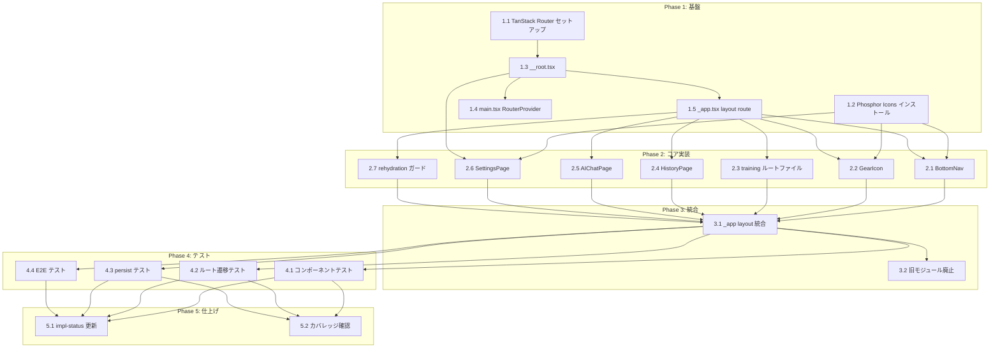

# ページナビゲーション タスク分解

## メタ情報

| 項目 | 内容 |
|:----|:----|
| 機能名 | ページナビゲーション |
| 設計書 | `.sdd/specification/navigation_design.md` |
| 抽象仕様書 | `.sdd/specification/navigation_spec.md` |
| PRD | `.sdd/requirement/navigation.md` |
| 更新日 | 2026-04-11 |
| 設計バージョン | v3.0（TanStack Router hash history 採用） |

---

## タスク一覧

### Phase 1: 基盤

| # | タスク | 説明 | 完了条件 | 依存 |
|:--|:------|:-----|:--------|:----|
| 1.1 | TanStack Router セットアップ | `@tanstack/react-router` と `@tanstack/router-plugin`（devDep）をインストール。`vite.config.ts` に `tanstackRouter({ target: 'react', autoCodeSplitting: true })` プラグインと `base: '/gymini/'`（GitHub Pages 対応）を追加する | `npm run build` が通ること。`routeTree.gen.ts` が自動生成されること | - |
| 1.2 | @phosphor-icons/react インストール | `@phosphor-icons/react` をインストールし、`lucide-react` を削除する。design-system.html が Phosphor Icons を使用しているため（A-001） | パッケージが正しくインストールされ、`npm run build` が通ること | - |
| 1.3 | ルートファイル基盤の作成 | `src/routes/__root.tsx` を作成。`createRootRoute` で `min-h-screen bg-zinc-50` の div + `Outlet` を返す。`beforeLoad` で `/` → `/training` にリダイレクト。`notFoundComponent` で未知ルートを `/training` にサイレントリダイレクト（FR-013） | `src/routes/__root.tsx` が存在し、TypeScript strict mode でコンパイルエラーがないこと。未知ルートで `/training` にリダイレクトされること | 1.1 |
| 1.4 | main.tsx の RouterProvider 化 | `src/main.tsx` を作成（または更新）。`createHashHistory()` で hash history を作成し、`createRouter({ routeTree, history: hashHistory, basepath: '/gymini' })` でルーターを作成。`RouterProvider` でラップする。`Register` 型を `declare module` で拡張する | アプリが起動し `/#/training` にリダイレクトされること | 1.3 |
| 1.5 | pathless layout route の作成 | `src/routes/_app.tsx` を作成。`createFileRoute('/_app')` で `GearIcon` + `Outlet` + `BottomNav` を配置する AppLayout を定義する（コンポーネントは 2.x で実装するため、プレースホルダーで可） | layout route が認識され、`/_app` 配下のルートで AppLayout が適用されること | 1.3 |

### Phase 2: コア実装

| # | タスク | 説明 | 完了条件 | 依存 |
|:--|:------|:-----|:--------|:----|
| 2.1 | BottomNav コンポーネント | `src/components/BottomNav.tsx` を作成。TanStack Router の `Link` で 2タブ（トレ: `/training`, 履歴: `/history`）+ AI専用pill型ボタン（`/ai`）を実装。`activeProps` / `inactiveProps` でアクティブ状態を制御。Phosphor Icons（`PhBarbell`, `PhClockCounterClockwise`, `PhRobot`）を使用。Tailwind: `fixed bottom-0 w-full h-24 bg-white/80 backdrop-blur-xl` | BottomNav コンポーネントテスト（3タブ表示、アクティブ状態切り替え、AIボタンのpill型スタイル）が通ること。タップターゲット 44px 以上（T-003） | 1.2, 1.5 |
| 2.2 | GearIcon コンポーネント | `src/components/GearIcon.tsx` を作成。TanStack Router の `Link to="/settings"` で歯車アイコンを実装。`settingsStore` から `hasApiKey` を取得し、未設定時に赤バッジを表示。GearIcon は gear+badge のみの責務。FRAME2 の追加要素（終了ボタン・タイマーpill）は GearIcon のスコープ外（TrainingPage が自前でレンダリング）。Tailwind: `absolute top-12 right-4 z-30` | GearIcon テスト（表示、バッジ表示/非表示）が通ること。タップターゲット 44px 以上（T-003） | 1.2, 1.5 |
| 2.3 | training ルートファイル | `src/routes/_app/training.tsx` を作成。`createFileRoute('/_app/training')` で TrainingPage をルート登録する。TrainingPage コンポーネントの実装は workout タスクが担当 | ルートファイルが routeTree.gen.ts に認識され、`/#/training` でアクセス可能なこと | 1.5 |
| 2.4 | HistoryPage（プレースホルダー） | `src/pages/HistoryPage.tsx` を作成。プレースホルダー表示。`src/routes/_app/history.tsx` で `createFileRoute('/_app/history')` としてルート登録 | HistoryPage がレンダリングエラーなく表示されること（FR-003） | 1.5 |
| 2.5 | AIChatPage（プレースホルダー） | `src/pages/AIChatPage.tsx` を作成。プレースホルダー表示。`src/routes/_app/ai.tsx` で `createFileRoute('/_app/ai')` としてルート登録 | AIChatPage がレンダリングエラーなく表示されること。BottomNavのAIボタンから遷移可能（FR-004） | 1.5 |
| 2.6 | SettingsPage | `src/pages/SettingsPage.tsx` を作成。`useRouter` + `useCanGoBack` で X ボタンの戻りナビゲーションを実装。`canGoBack` なら `router.history.back()`、なければ `/training` にフォールバック。`src/routes/settings.tsx`（layout 外）で `createFileRoute('/settings')` としてルート登録 | SettingsPage テスト（Xボタンで戻る、直接アクセス時 /training フォールバック）が通ること（FR-005）。layout 外のため BottomNav/GearIcon が非表示であること（FR-008） | 1.2, 1.3 |
| 2.7 | rehydration ガード | Zustand persist の rehydration 完了まで、ページコンテンツを非表示にする `useHydrated()` パターンを実装する。`_app.tsx` の AppLayout または `__root.tsx` レベルで rehydration pending 中は skeleton / ブランク表示にし、FRAME1→FRAME2 のフリッカーを防止する（NFR-004） | rehydration 完了前にページコンテンツが表示されないこと。アクティブセッションの復元後に FRAME2 が直接表示されフリッカーがないこと | 1.5 |

### Phase 3: 統合

| # | タスク | 説明 | 完了条件 | 依存 |
|:--|:------|:-----|:--------|:----|
| 3.1 | _app layout にコンポーネント統合 | `src/routes/_app.tsx` のプレースホルダーを実際の `GearIcon` + `BottomNav` コンポーネントに置換。`main` タグに `flex-1 pb-24` を適用。rehydration ガード（2.7）を統合 | FRAME1〜4 で BottomNav + GearIcon が表示され、FRAME5 で非表示になること（FR-007, FR-008, FR-009）。rehydration 中はコンテンツが非表示であること（NFR-004） | 2.1, 2.2, 2.3, 2.4, 2.5, 2.6, 2.7 |
| 3.2 | 旧モジュール廃止 | `src/stores/navigationStore.ts`, `src/hooks/useNavigation.ts`, `src/types/index.ts` の Route/NavRoute 型を削除（存在する場合）。参照コードがないことを確認 | `npm run build` が通ること。削除後に TypeScript コンパイルエラーがないこと | 3.1 |

### Phase 4: テスト

| # | タスク | 説明 | 完了条件 | 依存 |
|:--|:------|:-----|:--------|:----|
| 4.1 | コンポーネントテスト | BottomNav（Link アクティブ状態、タブ切り替え、AIボタン）、GearIcon（バッジ表示/非表示）、TrainingPage（Idle/Active 切り替え）のコンポーネントテストを作成 | テストが全て通ること（FR-001, FR-002, FR-007, FR-009, FR-010） | 3.1 |
| 4.2 | 統合テスト: ルート遷移 | `/#/training` → `/#/history` → `/#/ai` → `/#/settings` → back の遷移テスト。layout route の BottomNav 表示/非表示を検証。未知ルートの /training リダイレクトを検証（FR-013） | 統合テストが通ること（FR-004, FR-005, FR-008, FR-012, FR-013） | 3.1 |
| 4.3 | 統合テスト: セッション永続化 | ページ遷移後のセッションデータ維持を検証。workoutSessionStore の persist は workout タスクで実装済みの前提。rehydration ガードのフリッカー防止を検証（NFR-004） | テストが通ること（NFR-002, NFR-004） | 3.1 |
| 4.4 | Playwright E2E テスト | ナビゲーション全体フロー: (1) /#/training 表示 → タブ遷移 → AI ボタン遷移 (2) 歯車アイコン → /#/settings → Xボタンで戻り (3) セッション中のページ遷移でデータ維持 (4) ブラウザバックボタンで /settings から戻れること (5) 未知ルートで /training にリダイレクト | `npx playwright test` が通ること（D-001, FR-005, FR-013） | 3.1 |

### Phase 5: 仕上げ

| # | タスク | 説明 | 完了条件 | 依存 |
|:--|:------|:-----|:--------|:----|
| 5.1 | navigation_design.md の impl-status 更新 | `navigation_design.md` の `impl-status` を `"not-implemented"` → `"implemented"` に更新。実装進捗テーブルを全て 🟢 に更新する | `impl-status: "implemented"` に更新されていること | 4.1, 4.2, 4.3, 4.4 |
| 5.2 | カバレッジ確認 | `npm run test:coverage` を実行し、全体カバレッジ ≥ 80%（UI コンポーネントは 60%）を確認する | カバレッジ基準を満たすこと（D-001） | 4.1, 4.2, 4.3 |

---

## 依存関係図



---

## 実装の注意事項

- **A-001**: ルーティングは TanStack Router ファイルベースのみ。自作ルーティング（navigationStore 等）は禁止
- **A-002**: TanStack Start（SSR/SSG）は使用しない。完全クライアントサイドアーキテクチャ
- **T-001**: 全ファイルを TypeScript strict mode で記述。ルートパスの型は routeTree.gen.ts から自動推論
- **T-002**: `workoutStore` の persist で `onRehydrateStorage` を必ず実装し、localStorage エラーをキャッチ
- **T-003**: 全インタラクティブ要素のタップターゲットは `min-h-[44px] min-w-[44px]` 以上
- **B-001**: `persist` の `partialize` でドラフト状態のみ永続化。外部送信なし
- **アイコン**: `@phosphor-icons/react` を使用（design-system.html 準拠）。`lucide-react` は廃止
- **layout route**: FRAME1〜4 は `_app/` 配下、FRAME5（settings）は layout 外。手動条件分岐禁止
- **hash history**: `createHashHistory()` + `basepath: '/gymini'` で GitHub Pages 対応。URL は `/#/training` 形式
- **デフォルトルート**: `/` → `/training` にリダイレクト（`__root.tsx` の `beforeLoad`）
- **未知ルート**: `__root.tsx` の `notFoundComponent` で `/training` にサイレントリダイレクト（FR-013）
- **GearIcon**: gear + APIキーバッジのみ。FRAME2 の終了ボタン・タイマーpill は TrainingPage が absolute 配置で自前レンダリング
- **rehydration**: `useHydrated()` パターンで persist 完了まで skeleton / ブランク表示。フリッカー防止（NFR-004）
- **各ページの中身**: HistoryPage, AIChatPage, SettingsPage の中身はスコープ外（別specで定義）。プレースホルダーで実装

---

## 参照ドキュメント

- 抽象仕様書: [navigation_spec.md](../../specification/navigation_spec.md)
- 技術設計書: [navigation_design.md](../../specification/navigation_design.md)
- PRD: [navigation.md](../../requirement/navigation.md)

---

## 要求カバレッジ

| 要求 ID | 要件 | 対応タスク |
|:--------|:----|:----------|
| FR-001 | トレーニングページ: セッション非アクティブ時に Idle 画面表示 | 2.3（ルートファイル）, workout タスク |
| FR-002 | トレーニングページ: セッションアクティブ時に Active 画面表示 | 2.3（ルートファイル）, workout タスク |
| FR-003 | 履歴ページをルートとして用意 | 2.4 |
| FR-004 | AIチャットページをルートとして用意し BottomNav AI ボタンから常時アクセス可能 | 2.5, 2.1 |
| FR-005 | 設定ページを歯車アイコンから遷移可能、X ボタンまたはブラウザバックで戻る | 2.6 |
| FR-006 | セッションデータをページ遷移・リロード間で永続化 | 4.3, workout タスク（persist 実装） |
| FR-007 | BottomNav で Training / History タブと AI ボタンを常に表示（FRAME1〜4） | 2.1, 3.1 |
| FR-008 | BottomNav は FRAME5（設定）では非表示 | 2.6, 3.1 |
| FR-009 | 歯車アイコンを FRAME1〜4 の右上に固定表示 | 2.2, 3.1 |
| FR-010 | 歯車アイコンに APIキー未設定時の赤バッジ表示 | 2.2 |
| FR-011 | FRAME2 では歯車アイコン右隣に「終了」ボタン、下にタイマーpill（TrainingPage が自前レンダリング） | workout タスク（TrainingPage 実装） |
| FR-012 | 4 つの論理ルートを hash history モードでクライアントサイドで切り替え | 1.1, 1.3, 1.4, 1.5 |
| FR-013 | 未知のルートにアクセスした場合、/training にサイレントリダイレクト | 1.3 |
| NFR-001 | ルーティング遷移 16ms 以内 | 1.1（TanStack Router SPA + autoCodeSplitting） |
| NFR-002 | セッションデータのリロード後復元 | 4.3, workout タスク |
| NFR-003 | BottomNav レイアウトが全画面で一貫 | 2.1, 3.1 |
| NFR-004 | rehydration 完了前にフリッカーなし | 2.7, 3.1, 4.3 |

---

## 推奨する手動検証

- [ ] タスクの粒度が適切か（1タスク = 数時間〜1日程度）を確認
- [ ] 依存関係図が論理的に正しいか確認
- [ ] 要求カバレッジ表で漏れがないことを確認
- [ ] Phase 分類が適切か確認

## 検証コマンド

```bash
# 関連する設計書との整合性を確認
/check-spec navigation

# 仕様の不明点がないか確認
/clarify navigation

# チェックリストを生成して品質基準を明確化
/checklist navigation
```
