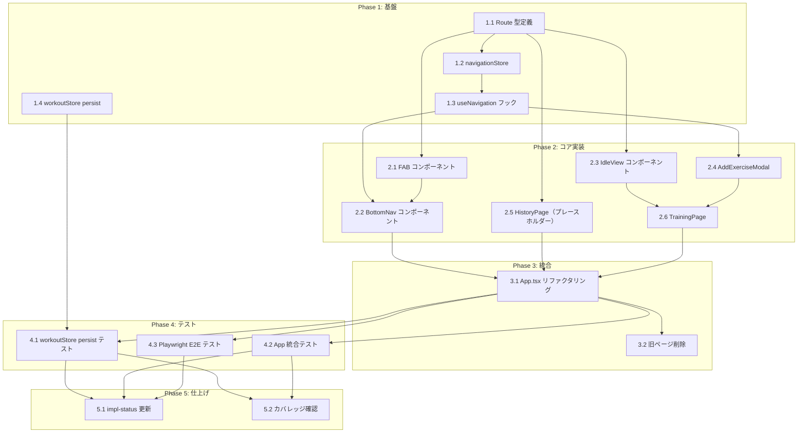

# ページナビゲーション タスク分解

## メタ情報

| 項目 | 内容 |
|:----|:----|
| 機能名 | ページナビゲーション |
| 設計書 | `.sdd/specification/navigation_design.md` |
| 作成日 | 2026-03-29 |

---

## タスク一覧

### Phase 1: 基盤

| # | タスク | 説明 | 完了条件 | 依存 |
|:--|:------|:-----|:--------|:----|
| 1.1 | 型定義の追加 | `src/types/index.ts` に `Route` 型（`'training' \| 'history'`）を追加する | `Route` 型がエクスポートされ、TypeScript strict mode でコンパイルエラーがないこと | - |
| 1.2 | navigationStore の作成 | `src/stores/navigationStore.ts` を新規作成。`currentRoute: Route` と `navigate(route: Route)` を持つ Zustand ストアを実装する | ストアのユニットテスト（navigate・currentRoute）が全て通ること | 1.1 |
| 1.3 | useNavigation フックの作成 | `src/hooks/useNavigation.ts` を新規作成。navigationStore をラップして `{ currentRoute, navigate }` を返すフックを実装する | フックのユニットテストが全て通ること | 1.2 |
| 1.4 | workoutStore への persist 追加 | `src/stores/workoutStore.ts` に Zustand `persist` ミドルウェアを追加。`draftDate`, `draftExercises`, `draftMemo`, `draftWorkoutId` のみを `gymini:workout-session` キーで localStorage へ永続化。`onRehydrateStorage` でエラーハンドリングも実装する | persist 追加後も既存の workoutStore テストが全て通ること。localStorage モックでリロード後のデータ復元が確認できること | - |

### Phase 2: コア実装

| # | タスク | 説明 | 完了条件 | 依存 |
|:--|:------|:-----|:--------|:----|
| 2.1 | FAB コンポーネントの作成 | `src/components/FAB.tsx` を新規作成。`visible: boolean` と `onClick: () => void` を props として受け取る。`visible=false` 時は `opacity-0 pointer-events-none` で DOM に存在させ FAB 領域のスペースを確保する。タップターゲットは `min-h-[44px] min-w-[44px]` 以上 | FAB コンポーネントテスト（表示/非表示切り替え、クリック）が通ること。`visible=false` でも DOM 要素が存在しサイズが維持されること（NFR-003） | 1.1 |
| 2.2 | BottomNav コンポーネントの作成 | `src/components/BottomNav.tsx` を新規作成。`useNavigation` と `useWorkoutSession` を内部で使用。静的2タブ（Training / History）を左寄せ配置し、右端に FAB 領域を確保。タブは lucide-react の `Dumbbell` / `Calendar` アイコンを使用。アクティブタブをハイライト表示する | BottomNav コンポーネントテスト（タブ切り替え・アクティブ状態ハイライト・FAB 表示切り替え）が通ること | 1.3, 2.1 |
| 2.3 | IdleView コンポーネントの作成 | `src/components/IdleView.tsx` を新規作成。挨拶メッセージ・「トレーニングを開始」ボタン・設定アイコンを表示。`onStartTraining` と `onOpenSettings` を props として受け取る。各インタラクティブ要素のタップターゲットは `min-h-[44px] min-w-[44px]` 以上 | IdleView コンポーネントテスト（ボタン表示・クリック）が通ること | 1.1 |
| 2.4 | AddExerciseModal コンポーネントの作成 | `src/components/AddExerciseModal.tsx` を新規作成。`open: boolean` と `onClose: () => void` を props として受け取る。内部で `useWorkoutSession` を使用して種目検索・追加を行う。既存の種目追加ロジック（WorkoutFormPage から移植）を利用 | AddExerciseModal コンポーネントテスト（開閉・種目追加）が通ること | 1.3 |
| 2.5 | HistoryPage の作成（プレースホルダー） | `src/pages/HistoryPage.tsx` を新規作成。「Coming Soon」等のプレースホルダーを表示する空ページ。後の履歴 spec/design で中身が定義される | HistoryPage がレンダリングエラーなく表示されること。`WorkoutListPage` からの置換として機能すること | 1.1 |
| 2.6 | TrainingPage の作成 | `src/pages/TrainingPage.tsx` を新規作成。`useWorkoutSession` を内部で使用し、`isActive` が `false` のとき `IdleView`、`true` のとき `ActiveSessionView`（WorkoutFormPage の内容を移植）を表示する | TrainingPage コンポーネントテスト（待機/アクティブ切り替え）が通ること（FR-001, FR-002） | 2.3, 2.4 |

### Phase 3: 統合

| # | タスク | 説明 | 完了条件 | 依存 |
|:--|:------|:-----|:--------|:----|
| 3.1 | App.tsx のリファクタリング | `src/App.tsx` の `useState` ベースのルーティングを `useNavigation` に移行。`WorkoutListPage` / `WorkoutFormPage` の条件分岐を削除し、`TrainingPage` / `HistoryPage` の切り替えと `BottomNav` を統合する | `npm run build` が型エラーなしで通ること。アプリが起動し Training / History タブ間の遷移ができること | 2.2, 2.5, 2.6 |
| 3.2 | 旧ページの削除 | `src/pages/WorkoutListPage.tsx` と `src/pages/WorkoutFormPage.tsx` を削除。これらを参照しているコードがないことを確認する | `npm run build` が通ること。削除後に TypeScript コンパイルエラーがないこと | 3.1 |

### Phase 4: テスト

| # | タスク | 説明 | 完了条件 | 依存 |
|:--|:------|:-----|:--------|:----|
| 4.1 | workoutStore persist 統合テスト | `src/stores/workoutStore.test.ts` に persist の統合テストを追加。localStorage モックを使用し、セッションデータがリロード後も復元されること（NFR-002）と、localStorage 不可時のフォールバック（T-002）を検証する | テストが全て通り、カバレッジが 80% 以上であること | 3.1 |
| 4.2 | App 統合テスト | ページ遷移（Training ↔ History）とセッション永続化のシナリオを統合テストで検証する（FR-004, FR-008） | 統合テストが通ること | 3.1 |
| 4.3 | Playwright E2E テスト | `tests/navigation.spec.ts`（または既存テストファイル）にナビゲーション全体フローの E2E テストを追加。①待機画面→トレーニング開始→FAB 表示、②History タブ遷移→Training タブ戻りでセッション維持、③セッション終了→FAB 非表示、を検証する | `npx playwright test` が通ること | 3.1 |

### Phase 5: 仕上げ

| # | タスク | 説明 | 完了条件 | 依存 |
|:--|:------|:-----|:--------|:----|
| 5.1 | navigation_design.md の impl-status 更新 | 実装完了後に `navigation_design.md` の `impl-status` を `"not-implemented"` → `"implemented"` に更新し、実装進捗テーブルを全て 🟢 に更新する | `impl-status: "implemented"` に更新されていること | 4.1, 4.2, 4.3 |
| 5.2 | カバレッジ確認 | `npm run test:coverage` を実行し、全体カバレッジ ≥ 80%（UI コンポーネントは 60%）を確認する | カバレッジ基準を満たすこと（D-001） | 4.1, 4.2 |

---

## 依存関係図

---

## 実装の注意事項

- **T-001**: 全ファイルを TypeScript strict mode で記述。`any` 型は使用しない
- **T-002**: `workoutStore` の persist で `onRehydrateStorage` を必ず実装し、localStorage エラーをキャッチする
- **T-003**: 全インタラクティブ要素のタップターゲットは `min-h-[44px] min-w-[44px]` 以上を確保する
- **B-001**: `persist` の `partialize` でドラフト状態のみを永続化し、外部送信は一切しない
- **A-001**: アイコンは `lucide-react` を使用（SVG自作は著作権リスクあり）
- **FAB 非表示**: `null` で条件レンダリングせず、`opacity-0 pointer-events-none` で DOM に残してレイアウトシフトを防ぐ（NFR-003）
- **BottomNav → FAB の依存**: FAB の `visible` プロップは BottomNav が `useWorkoutSession.isActive` を取得して渡す。FAB 自身は WorkoutSession を参照しない
- **旧ページの扱い**: Phase 3 完了まで旧ページ（WorkoutListPage / WorkoutFormPage）は削除しない。段階的移行で安全に置換する

---

## 参照ドキュメント

- 抽象仕様書: `.sdd/specification/navigation_spec.md`
- 技術設計書: `.sdd/specification/navigation_design.md`
- PRD: `.sdd/requirement/navigation.md`

---

## 要求カバレッジ

| 要求 ID | 要件 | 対応タスク |
|:--------|:----|:----------|
| FR-001 | トレーニングページ: セッション非アクティブ時の待機画面表示 | 2.3, 2.6 |
| FR-002 | トレーニングページ: セッションアクティブ時のセッション管理画面表示 | 2.6 |
| FR-003 | 履歴ページをルートとして用意 | 2.5, 3.1 |
| FR-004 | セッションデータのページ遷移・リロード間永続化 | 1.4, 4.1 |
| FR-005 | ボトムナビで Training / History タブを常に固定表示 | 2.2 |
| FR-006 | FAB領域のボトムナビ右側への常時確保・セッション中のみFAB表示 | 2.1, 2.2 |
| FR-007 | FABタップで種目追加モーダルを開く | 2.4, 2.2 |
| FR-008 | 2論理ルート間のクライアントサイド切り替え | 1.2, 1.3, 3.1 |
| NFR-001 | ページ切り替え 16ms 以内 | 1.2, 1.3（状態ベースルーティングにより自動達成） |
| NFR-002 | セッションデータのリロード後復元 | 1.4, 4.1 |
| NFR-003 | FAB 表示/非表示でのレイアウトシフト防止 | 2.1 |
