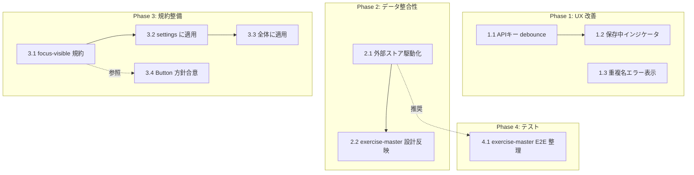

# 設定画面レビュー指摘の残タスク

## 背景

PR #29 (`refactor/settings-frame5-alignment`) で独立レビューの Critical 群 8 件を反映したが、**Warning / Info 群 6 件**は別スコープとして切り出した。本ドキュメントはそれらを独立タスクに分解し、優先度と依存関係を整理する。

参照:
- 技術設計書: [index_design.md](../../specification/settings/index_design.md)
- 抽象仕様書: [index_spec.md](../../specification/settings/index_spec.md)
- API キー設計: [api-key/index_design.md](../../specification/api-key/index_design.md)

## タスク一覧

### Phase 1: UX 改善（settings 内で完結）

| # | タスク | 説明 | 完了条件 | 依存 |
|:---|:------|:-----|:--------|:----|
| 1.1 | APIキー onChange 保存を debounce 化 | APIKeySection で 1 文字ごとの localStorage 書き込みを 300ms debounce。途中状態が残らないようにする。`useRef` + `setTimeout` or `use-debounce` ライブラリで実装 | 連続入力時に `setItem` が最後の状態でのみ呼ばれることをテストで確認。既存 E2E `APIキーを入力すると onChange で localStorage に保存され「接続済み」になる` が pass | - |
| 1.2 | 保存中インジケータの表示（任意） | debounce 化で「入力後すぐには保存されない」状態が生まれるため、入力フィールド近傍に小さな「保存中…」または「保存済み」のステータスを出す | ステータス表示のユニットテスト。目視でインジケータの切り替わりを確認 | 1.1 |
| 1.3 | 重複種目名の inline エラー表示 | ExerciseMasterSection の追加・編集で `exerciseRepository.create/update` が throw した時に `aria-live="polite"` の inline error を出す。フォーム下部に「この種目名は既に登録されています」を表示、キャンセル/再入力で消える | 重複名テストでエラーが表示されること。スクリーンリーダーで読み上げられること | - |

### Phase 2: データ整合性（exercise-master と協調）

| # | タスク | 説明 | 完了条件 | 依存 |
|:---|:------|:-----|:--------|:----|
| 2.1 | ExerciseMasterSection を外部ストア駆動に | `useState<Exercise[]>(() => exerciseRepository.getAll())` を `useSyncExternalStore` + `storage` イベント、もしくは新規 `useExerciseStore` (Zustand) に置き換える。他タブでの変更を即座に反映 | 他タブで種目追加→現タブに自動反映のテスト（統合 or E2E）。`useState` + `refresh()` 呼び出しの撤去 | - |
| 2.2 | exercise-master 設計書の更新 | 2.1 で選択した実装方針（useSyncExternalStore vs Zustand）を `.sdd/specification/exercise-master/index_design.md` に反映 | 設計書に反映箇所を追記。`check-spec` が pass | 2.1 |

### Phase 3: プロジェクト規約整備（横断）

| # | タスク | 説明 | 完了条件 | 依存 |
|:---|:------|:-----|:--------|:----|
| 3.1 | `focus-visible:ring` ユーティリティの規約策定 | raw `<button>` 全体に適用する `focus-visible:ring-2 focus-visible:ring-gym-black focus-visible:ring-offset-2` 等の共通クラスを決定。`src/index.css` にカスタムユーティリティとして追加するか検討 | 規約文書を `.sdd/CONSTITUTION.md` または CLAUDE.md に追記。サンプルコード記載 | - |
| 3.2 | settings 配下の raw button に focus-visible を適用 | 3.1 の規約に従い APIKeySection / ExerciseRow / ExerciseMasterSection の全 `<button>` に適用 | キーボードフォーカスで可視リングが表示されることを目視確認。既存テストが pass | 3.1 |
| 3.3 | プロジェクト全体の raw button に focus-visible を適用 | BottomNav / MonthCalendar / IdleView / EmptyDayState / WorkoutSummary などの残り全ボタン | 同上。別 PR に分割してもよい | 3.2 |
| 3.4 | shadcn `<Button>` 採用方針の合意 | `src/components/ui/button.tsx` の variant (`default | destructive | ghost | icon`) / size の使い分け規約を文書化。`EmptyDayState` 以外への段階的移行計画 | 方針書を PR or RFC 形式で作成 | 3.1 |

### Phase 4: テスト整備

| # | タスク | 説明 | 完了条件 | 依存 |
|:---|:------|:-----|:--------|:----|
| 4.1 | `exercise-master.spec.ts` の `.fixme()` 整理 | 6 件の `test.fixme()` を現 UI の aria-label に合わせて有効化、または `settings.spec.ts` に責務を委譲して削除 | 全 `.fixme()` が解消。`npx playwright test e2e/exercise-master.spec.ts` が pass | 2.1（望ましい） |

## 依存関係図



## 実装上の注意事項

- **Phase 1.1 debounce**: 既存の `settingsStore.setApiKey` は同期呼び出し前提。debounce を store 側に入れるか UI 側に入れるかで設計判断が必要。UI 側推奨（store の純粋性維持）
- **Phase 1.3 エラー表示**: プロジェクトに toast 基盤がないため、ひとまず inline error で実装。将来 toast 導入時は差し替え可能にする
- **Phase 2.1 外部ストア化**: `useSyncExternalStore` はゼロ依存だが localStorage の storage event は同タブ内では発火しない。Zustand + 手動 publish の方が同タブ内変更にも対応可能
- **Phase 3.1 focus-visible**: Tailwind v4 の `@theme` 拡張で新トークン追加する場合は `src/index.css` を編集
- **Phase 3.3/3.4 横断適用**: 1 PR だと diff 過大。機能単位（navigation / training / history / settings）で分割推奨
- **Phase 4.1 E2E 整理**: 現在 6 個ある `.fixme()` は古い UI 前提（`種目名を入力...` placeholder 等）。現実装に追従させるか、`settings.spec.ts` が同等フローを検証しているため削除するかの判断が必要

## 優先度・推奨対応順

| 優先 | 理由 |
|:---:|:---|
| **1.1** | Phase 3 AI チャットで APIキー取得前に debounce 済み状態を前提にしたい。小さく自己完結 |
| **1.3** | 重複エラーが黙殺される現行は混乱を招く。UX 改善が最も体感できる |
| **4.1** | 現状 `.fixme()` が混入しており、将来の E2E 整備の障害。小さく解消可能 |
| 2.1 / 2.2 | Phase 3 で AI チャットが種目一覧参照を行う設計なら前提条件。exercise-master 側と同時検討 |
| 3.1 → 3.2 → 3.3 / 3.4 | アクセシビリティ整備は重要だが横断影響大。プロジェクト合意形成から |

## 参照ドキュメント

- 抽象仕様書: [index_spec.md](../../specification/settings/index_spec.md)
- 技術設計書: [index_design.md](../../specification/settings/index_design.md)
- API キー設計: [api-key/index_design.md](../../specification/api-key/index_design.md)
- exercise-master 設計: [exercise-master/index_design.md](../../specification/exercise-master/index_design.md)
- レビュー元 PR: [#27](https://github.com/SakumaTakuya/gymini/pull/27)、対応 PR: [#29](https://github.com/SakumaTakuya/gymini/pull/29)

## 要求カバレッジ

本タスクは既存 FR/NFR を**追加で満たす**（品質向上）ものであり、新規 FR は導入しない。以下は既存要件の強化対応:

| 要求 ID | 要件 | 対応タスク | 強化内容 |
|:--------|:----|:----------|:--------|
| NFR-001 | APIキーが localStorage 以外に送信されない | 1.1 | debounce により途中保存を抑制し、意図しないキーの localStorage 混入を減らす |
| FR-009 | 種目の手動追加・編集・削除 | 1.3 | 重複時のエラー可視化でユーザー体験改善 |
| NFR-002 | 種目検索のリアルタイム更新 | 2.1 | 他タブ変更も含め一貫性を向上 |
| T-003（CONSTITUTION）| 44px タップターゲット | 3.1-3.3 | focus-visible 追加で A11y 強化 |

**カバレッジ**: 既存要件の強化のみ、新規 FR 追加なし

## 推奨する手動検証

- [ ] 各タスクの粒度が 1 日以内で完了可能か確認
- [ ] Phase 分類が適切か確認
- [ ] 優先度の判断が妥当か確認
- [ ] 3.1 / 3.4 のようなプロジェクト合意が必要なタスクの進め方を relevant stakeholder に確認

## 検証コマンド

```bash
# 関連する設計書との整合性確認
/check-spec settings

# 各タスク完了時
/run-checklist settings
```
